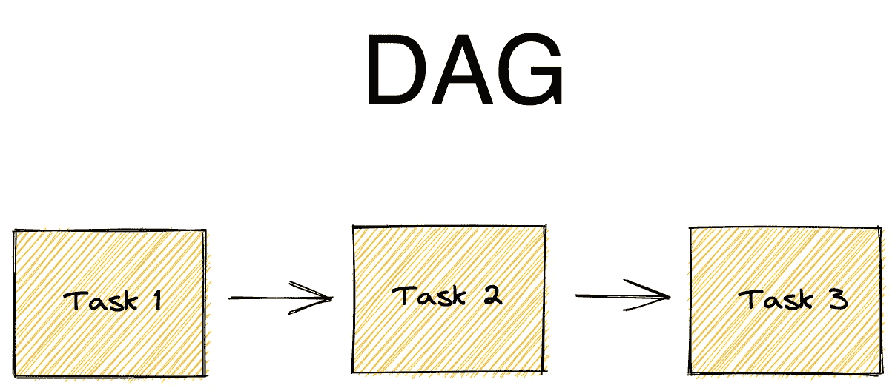

# 揭开气流 DAG 脚本的神秘面纱

> 原文：<https://towardsdatascience.com/de-mystifying-an-airflow-dag-script-ff4f267edf34?source=collection_archive---------21----------------------->

## 了解如何阅读气流 DAG 脚本


[去飞溅](https://unsplash.com/photos/v0PWN7Z38ag)

我第一次看到 Dag 脚本时，除了它主要是用 python 和一点 jinja 语言编写的，我发现脚本的流程很难理解。

> **DAG** 表示有向无环图

当然，这可能是由于 dag 脚本的复杂性或可读性问题，但我也认为即使有一个简单的 dag 脚本和可读的代码，它仍然会有点混乱。在我的工作中，我正在训练寻找模式和我发现的模式，这有助于我更容易地浏览 dag 脚本。

> **Airflow** 是一个以编程方式创作、调度和监控工作流的平台。虽然 Airflow 可以实现任何语言的程序，但实际的工作流是用 Python 编写的。点击了解更多关于气流[的信息。](https://airflow.apache.org/)

## 典型的 dag 脚本由五个数据块组成，它们是

*   库导入块
*   DAG 参数块
*   DAG 定义块
*   任务定义块
*   任务流水线块

1.  **库导入块**是 dag 所需的所有库被导入的地方。

典型的**导入块**如下所示

```
# import the libraries #to set datesfrom datetime import timedelta, datetime# The DAG object; we'll need this to instantiate a DAGfrom airflow import DAG# Operators; we need this to write tasks!from airflow.operators.bash_operator import BashOperator
```

**2。DAG 参数**类似于 DAG 的设置，与`start_date`、`email`设置等的键值对一起存储在字典中。

一个典型的**参数块**看起来像这样

```
#defining DAG arguments# You can override them on a per-task basis during operator initializationdefault_args = {'owner': 'Wild One','start_date': datetime(2021,12,25),'email': ['xyz@somemail.com'],'retries': 1,'retry_delay': timedelta(minutes=5),}
```

*请暂时忽略传递的每个参数/自变量的含义，因为它不在本帖的* *范围之内。*

**3。****DAG 定义块**涉及实例化在**导入块**中导入的 DAG 类，并传递诸如实际 DAG 名称或`dag_id`、在 **DAG 参数**块中设置的`default_args`等参数。

典型的 **DAG 定义**如下所示

```
# defining the DAGdag = DAG('my-first-dag',default_args=default_args,description='My first DAG',schedule_interval=timedelta(days=1),)
```

**4** 。当然每个 *DAG* 至少有一个*任务*。这就是**任务定义**块的用武之地。

> DAGS 由运算符表示的任务组成。

**任务定义**包括实例化所需的操作符，以运行选择和传递参数的任务，如任务名称或`task_id`以及其他特定于所实例化的操作符类型的参数。

*这些操作符应该已经在* ***导入块*** *中导入了。*

典型的**任务定义**如下所示

```
# define the tasks# define the first taskstart_task = BashOperator(task_id='start',bash_command='echo "Hello world"',dag=dag,)# define the second taskend_task = BashOperator(task_id='end',bash_command='echo "Goodbye"',dag=dag,)
```

**5。**最后，**任务流水线**模块，帮助我们组织任务的顺序，即定义任务依赖性。它由一个**位移位运算符/符号**表示，看起来像这样: **< <** 或 **> >。对我来说，它们看起来或多或少有点像数学中的两个大于 25 的符号或小于 27 的符号，或者 bash 中的重定向运算符。在气流中，这些符号代表上游或下游运动。**

*   上游(`>>`)是指之前的
*   **下游(`<<`)是指之后的**

****典型的**任务流水线**如下所示****

```
**# task pipelinestart_task >> end_task**
```

****所以如果你看到一个**任务管道**有`task1 >> task2`，这意味着*任务 1* 应该在*任务 2* 之前运行。但是，如果是这样:`task1 << task2`，表示*任务 1* 应该在*任务 2 之后运行。*****

********

****由作者使用 [Excalidraw](https://excalidraw.com/) 创建****

****上图是一个简单的 dag 图形视图，方框表示任务，箭头表示依赖关系。****

****一个简单的 DAG 脚本可能类似于下面的代码****

*****注意注释以识别区块*****

****由作者使用[深度笔记](https://deepnote.com/referral?token=095f134f)创建****

## ****结论****

****现在您知道了如何解释典型 dag 脚本的流程，请注意，根据工作流的复杂性，它可能会变得复杂。请随意查看[这里的](https://airflow.apache.org/docs/apache-airflow/stable/tutorial.html)以获取关于可用任务操作符、其众多参数可能性、每个参数的含义等信息。****