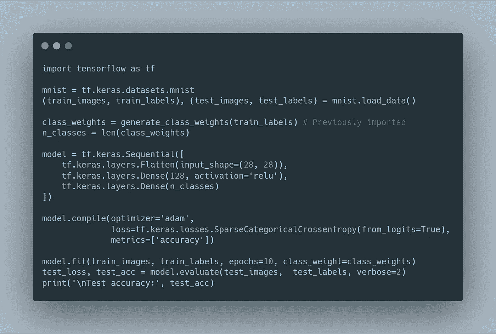
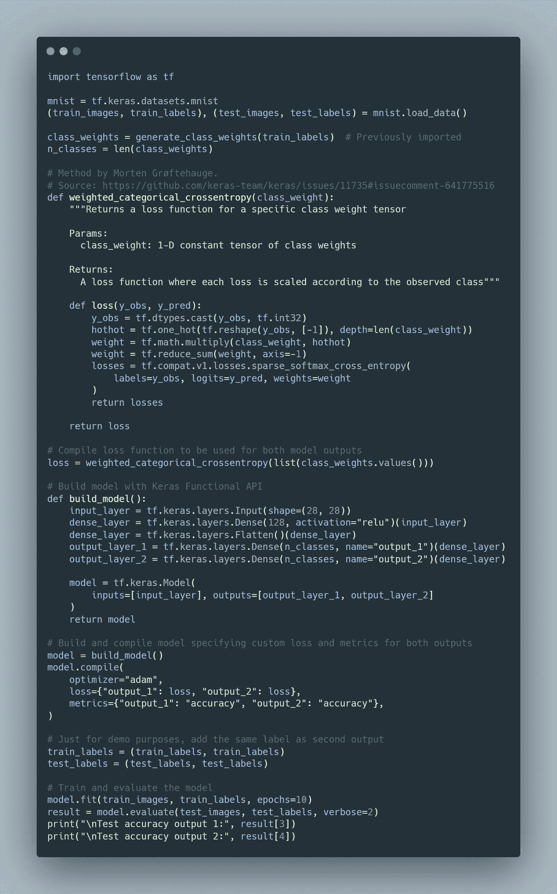

# 处理 TensorFlow 中的不平衡数据:类权重

> 原文：<https://towardsdatascience.com/dealing-with-imbalanced-data-in-tensorflow-class-weights-60f876911f99?source=collection_archive---------2----------------------->

## 在训练机器学习模型时，类不平衡是一个常见的挑战。以下是通过生成类权重以及如何在单输出和多输出模型中使用类权重的可能解决方案。

由 [Unsplash](https://unsplash.com?utm_source=medium&utm_medium=referral) 上的 [Loic Leray](https://unsplash.com/@loicleray?utm_source=medium&utm_medium=referral) 拍摄的照片

在为真实世界的应用程序开发模型时，经常会遇到类不平衡的问题。当与一个类相关联的实例明显多于与另一个类相关联的实例时，就会出现这种情况。

例如，在一个*信用风险建模*项目中，当查看历史数据中的贷款状态时，大部分被授予的贷款可能已经全额支付。如果使用易受类别不平衡影响的模型，违约贷款在训练过程中可能没有太大的相关性，因为当模型关注多数类别时，总体损失继续减少。

> 为了使模型更加关注贷款违约的示例，可以使用类权重，以便当未充分代表的类的实例被错误分类时，预测误差更大。

除了使用类别权重，还有其他方法来解决类别不平衡，例如*过采样和欠采样*、*两阶段训练*，或者使用更多的*代表性损失*。然而，本文将重点关注在训练您的机器学习模型时如何计算和使用*类权重*，因为这是解决不平衡的一种非常简单有效的方法。

首先，我将向您介绍从数据集生成类权重的方法，然后介绍如何在单输出和多输出模型中使用它们。

## 生成类别权重

在二元分类中，类权重可以仅通过计算正类和负类的频率来表示，然后对其求逆，使得当乘以类损失时，代表性不足的类具有比多数类高得多的误差。

在多类或多标签问题中，需要计算每个类的频率。为此，Python 库 [scikit-learn](https://scikit-learn.org/stable/index.html) 提供了方法 [compute_class_weight](https://scikit-learn.org/stable/modules/generated/sklearn.utils.class_weight.compute_class_weight.html) ，该方法接收完整的类数组和唯一的类标签集作为输入。如果参数 *class_weight* 为 None，则类权重将是统一的，另一方面，如果给定值‘balanced ’,则输出类权重将遵循以下公式:

> n _ samples/(n _ classes * NP . bin count(y))

不幸的是，scikit-learn 方法不支持单热编码数据，也不支持多标签类。因此，我开发了另一个实用程序来生成多类和多标签问题的类权重，也允许一次性编码的数据，如下面的代码片段所示。

方法来避免 sci kit-learn compute _ class _ weight 方法的限制，并允许使用 Python 生成给定的一组多类或多标签标注的类权重，还支持 one-hot-encoded 格式。

该方法的输出将是一个格式为*{ class _ label:class _ weight }*的字典，这是与 TensorFlow 一起使用所需的格式。

## 在具有 TensorFlow Keras 的单输出模型中使用类别权重

在包含单个输出的简单模型中，Tensorflow 在 model.fit()中提供了一个名为 *class_weight* 的参数，允许直接指定每个目标类的权重。因此，它就像提供前面介绍的 *generate_class_weights* 方法的输出一样简单。

下面的代码片段提供了如何使用 *class_weight* 参数在 MNIST 手写数字数据集上训练 TensorFlow Keras 模型的示例。

在具有 TensorFlow Keras 的单一输出模型中使用类权重的示例。

## 在具有张量流 Keras 的多输出模型中使用类权重

在包含不止一个输出层的稍微复杂一点的模型的情况下，不幸的是您不能使用 *class_weight* 方法(尚不支持)。但是不要担心，因为我将为您提供一个解决方法，其中考虑了类权重的自定义损失。

在提供的示例中，Keras Functional API 用于构建多输出模型(只需提供两次相同的标签作为输入)，对于两个输出，*加权* *分类交叉熵* *损失被用作最常见的损失之一，由 Morten grftehauge 在 [Keras 问题](https://github.com/keras-team/keras/issues/11735)中提出。*

在具有 TensorFlow Keras 的多输出模型中使用类权重的示例。

> 在多输出模型中使用类权重和处理类不平衡的关键思想是将权重集成到定制的损失函数中。

## 结论

在本文中，介绍了现实世界数据集中的**类不平衡**的问题，并深入解释了对这一挑战的常见解决方案**使用类权重**使模型更多地关注代表性不足的类。

为了使用这种解决方案，首先给出了一种在给定一组多类或多标签格式的类的情况下生成类权重的方法。接下来是关于如何在使用 TensorFlow 对不平衡数据集进行训练时使用这些类权重的两种方法，这两种方法都是在**单输出和多输出模型**的情况下。

如果你想发现更多像这样的帖子，你可以在下面找到我:

*   [GitHub](https://github.com/angeligareta)
*   [领英](https://www.linkedin.com/in/angeligareta/)
*   [个人网站](https://angeligareta.com/)