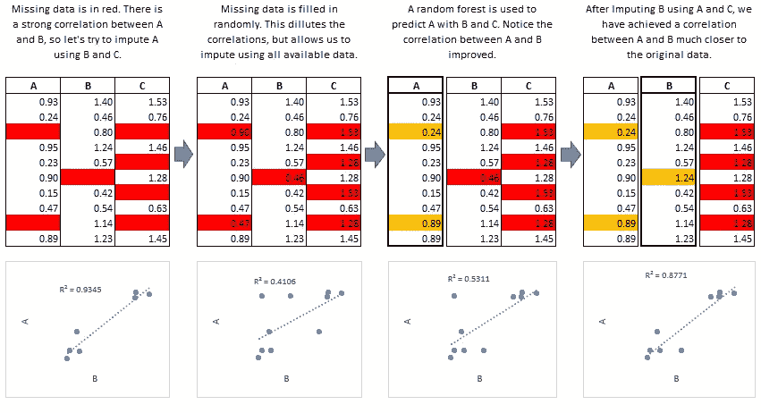
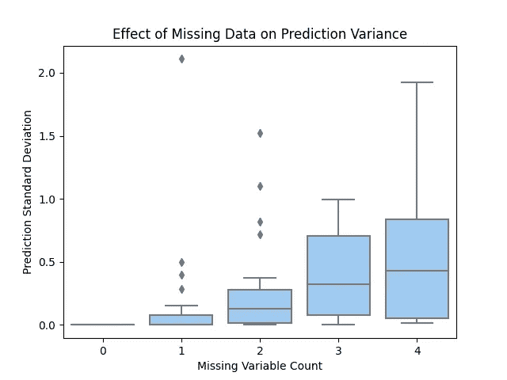

# 在生产环境中处理泄漏、丢失的数据

> 原文：<https://towardsdatascience.com/dealing-with-leaky-missing-data-in-a-production-environment-d48304ad3b6b?source=collection_archive---------23----------------------->

## [行业笔记](https://towardsdatascience.com/tagged/notes-from-industry)


由[埃琳娜·莫日维洛](https://unsplash.com/@miracleday?utm_source=medium&utm_medium=referral)在 [Unsplash](https://unsplash.com?utm_source=medium&utm_medium=referral) 上拍摄的照片

作为一名顾问，我并不总能控制我收到的数据。和一个客户来来回回只能让你到此为止。在某一点上，你需要使用你所拥有的数据。这意味着我要处理大量杂乱的数据，并且非常熟悉各种不同的数据泄露。

数据泄漏可能非常隐蔽，尤其是如果您对数据收集过程没有太多的洞察力。通常，当数据点出现以下情况时，就会发生数据泄漏:

1.  只是有时收集
2.  不是以标准方式收集的
3.  重写
4.  在不同时间收集的

我很早就意识到，我需要一种有原则的方式来处理这些情况。无论我想出了什么，它都必须对训练数据和新的未来数据起作用，因为我的客户需要对新数据的每日预测。

我想到的第一个想法是把有问题的变量扔掉。对于一些客户来说，这意味着抛出一大堆信号。我知道我可以做得更好。我需要一种方法来使用数据集中存在的信息密度，但要消除漏洞。

我选定的是一种经常被忽视的统计方法，许多数据科学家从未听说过——通过链式方程进行多重插补。

# 数据

让我们用[乳腺癌威斯康星数据集](https://scikit-learn.org/stable/datasets/toy_dataset.html#breast-cancer-wisconsin-diagnostic-dataset)来看一个数据泄露的经典例子。在我们的场景中，我们为一个医学成像实验室工作。我们的任务是提出一个可以预测肿瘤是否是恶性的模型。然而，我们从多个医生那里获得数据，他们进行不同的测试，提供不同的数据。有时，如果发现肿瘤是恶性的，会进行第二系列测试，并收集更多数据。有时候，他们不是。这导致我们的一些领域在非恶性肿瘤的更高浓度中具有缺失值。乱七八糟。

```
import numpy as np
random_state = np.random.RandomState(seed=0)
from sklearn.datasets import load_breast_cancer
from sklearn.model_selection import train_test_split

# Load data and split into training and new, "unseen" data.
X, y = load_breast_cancer(return_X_y=True, as_frame=True)
X.drop([c for c in X.columns if "error" in c], axis=1, inplace=True)
X_train, X_new, y_train, y_new = train_test_split(
    X, y, test_size=100, stratify=y, random_state=0
)

# train data has missing values correlated with
# the target (tumor malignancy)
X_train = X_train.copy()
for c in X_train.columns:
    ampute_ind = random_state.choice(
        X_train.index,
        size=100,
        p=(2-y_train) / (2-y_train).sum()
    )
    X_train.loc[ampute_ind, c] = np.NaN

# New data does not have missing values correlated
# with the target
X_new = X_new.copy()
for c in X_train.columns:
    ampute_ind = random_state.choice(
        X_new.index,
        size=10
    )
    X_new.loc[ampute_ind, c] = np.NaN

# Check out the distribution of missing values
# grouped by the target
X_train.isnull().groupby(y_train).mean().transpose()
```

我们缺失的区域与肿瘤是否是恶性的高度相关。从表面上看，这似乎是一件好事。这应该有助于我们对肿瘤进行分类。然而，这些数据正遭受相当严重的**数据泄露**。只有当我们真正确定了肿瘤是否是恶性的时，才进行更多的测试。因此，我们的训练数据与我们将要预测的新数据具有根本不同的行为。

如果我们现在对这些数据运行我们的模型，模型会不公平地将缺失值的样本归类为非恶性的情况比它应该出现的情况多得多。我们有一个难题——我们的数据集中有很高的信息密度，有很多有效数据。我们需要一种方法来消除这种泄漏，同时尽可能保留所有信息。

# 均值/中值插补的问题

处理缺失数据的常见方法是简单地用平均值或其他值估算每个点。**这通常不是修复数据泄露的好方法。**任何能够对非线性关系进行建模的预测模型都会采用这种模式，而不需要的信息仍然会泄漏出来。如果我们用每个变量的平均值估算`X_train`，然后运行我们的模型，我们会发现我们的模型不公平地将具有平均值估算值的变量归类为非恶性变量。我们也不会过得更好。


有人用均值插补修复数据泄漏的真实视频

# 多重插补

多重插补是一种迭代方法，用于将每个变量建模为数据集中其他变量的函数。



[https://github.com/AnotherSamWilson/miceforest](https://github.com/AnotherSamWilson/miceforest)

这个算法的细节超出了本文的范围，但是如果你想知道更多，Stef Van Buuren 写了一本很棒的免费在线书籍，你可以在这里找到。这里，我们用一个包`[miceforest](https://github.com/AnotherSamWilson/miceforest)`来估算缺失值，这个包使用`lightgbm` 作为链接函数:

```
import miceforest as mf
kernel = mf.ImputationKernel(
    data=X_train,
    datasets=5,
    save_all_iterations=True,
    random_state=random_state
)
kernel.mice(2, verbose=True)
```

我们刚刚做的是训练 200 个随机森林([# variables]x[# datasets]x[# iterations])，并以迭代的方式使用这些随机森林的预测来填充我们数据集的缺失值。我们创建了多个数据集，因为我们通常不能 100%确定我们的插补值，所以我们多次运行该过程以获得不确定性度量。

一般来说，鼠标是一个昂贵的过程。然而，我们可以使用一个技巧来大大减少新数据的插补时间，并使这种方法在生产中可行。`miceforest`跟踪为每个变量训练的模型——我们可以简单地使用它们来估算我们遇到的任何新数据。这大大减少了插补时间。

# 构建分类器

既然我们已经有了完整的数据集并消除了数据泄漏，我们需要训练我们的模型。由于我们创建了 5 个估算数据集，问题立即变成了“我们应该使用哪个数据集来训练我们的模型？”

答案是“看情况”。如果您有足够的计算资源，并且希望尽可能健壮，理想情况下，您可以在每个估算的训练数据集上训练一个模型。一般来说，您构建的插补数据集越多，您对插补如何影响预测方差的理解就越好。

然而，为了简单起见，这里我们只在第一个数据集上训练 1 个模型，并使用该模型从生产中的 5 个不同估算数据集获得预测。

```
import lightgbm as lgb
dtrain = lgb.Dataset(
    data=kernel.complete_data(0),
    label=y_train
)
lgb_model = lgb.train(
    params={"objective": 'binary',"seed": 1, "verbosity": -1},
    train_set=dtrain,
    verbose_eval=False
)
```

好吧，我们已经很接近了。我们消除了数据泄漏，保持了数据集中的信息密度，并运行了一个可以预测肿瘤是否为恶性的模型。剩下的唯一一件事就是构建我们管道的推理部分。

# 给新数据打分

每天，医生会提交他们的测试结果，我们需要返回一个预测。在对新数据进行评分之前，我们需要估算缺失值。我们的训练数据集没有缺失值，我们的新数据也不应该缺失值。幸运的是，`miceforest` 保存了它在运行`mice`时创建的模型，并且可以估算我们的新数据，而不必重新训练模型:

```
# Get missing data imputations
new_data_imputed = kernel.impute_new_data(X_new)

# Get predictions for each dataset
predictions = np.array([
    lgb_model.predict(
        new_data_imputed.complete_data(i),
        raw_score=True
    )
    for i in range(kernel.dataset_count())
]).transpose()
```

我们的预测数组包含我们对新数据中每个样本的 5 个预测。如果你真的观察这个数组，你会发现这些预测通常非常接近。我们的数据集具有非常高的**信息密度**，这使得我们既可以估算我们的变量，又可以高度准确地模拟我们的目标。然而，我们仍然可以看到缺失数据的负面影响:

```
import pandas as pd
sample_var = predictions.var(1)
sample_missing_value_count = X_new.isnull().sum(1).values

missing_metrics = pd.DataFrame({
    'sample_stdev': (sample_var ** 0.5).round(3),
    "missing_value_count": np.minimum(sample_missing_value_count,4)
})missing_metrics.groupby("missing_value_count").agg({
    "sample_stdev": ["mean", "count"]
})
```

缺失变量越多的样本，其预测的方差越大。发生这种情况有两个原因:

1.  我们用更少的真实数据进行推断
2.  每个数据集中的数据有更多不同的机会



作者上传

最后，我们需要决定如何实际返回一个预测。这个完全看情况。对每个样本进行不确定性测量非常有用。我们可能希望返回每个样本的平均值以及第 25 和第 75 个百分位数。我们可能希望只返回中间值。

# 结论

我们已经展示了如何使用链式方程(MICE)的多重插补来消除数据泄漏。我们还展示了如何将这种方法扩展到生产环境，并用于获得预测结果的不确定性度量。