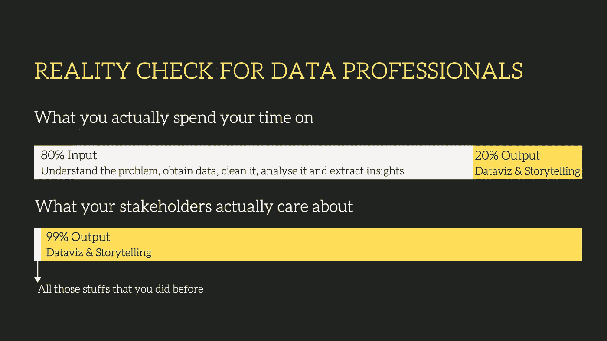
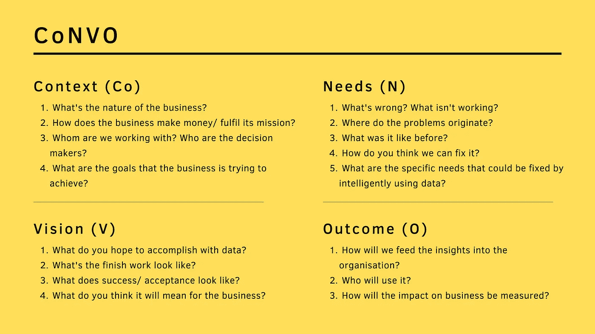

# 亲爱的数据专家们，请永远不要满足于不产生影响

> 原文：<https://towardsdatascience.com/dear-data-professionals-please-never-settle-for-less-than-making-an-impact-b5ee94a63b73?source=collection_archive---------39----------------------->

## 如何发现值得解决的问题，为数据项目定义有意义的范围，以使人们关心的方式传达见解，并交付真正的商业价值

作者照片

亲爱的数据专家们:

你做了不可思议的事。您已经分析了数据集的每个角落，应用了性能最佳的预测模型，设计了您能想到的最吸引人的图表和图形。然而，听完你发现的见解后，你的项目发起人摇了摇头。“但那不是我想要的。给我一些有用的东西，让我的团队可以采取行动。不要告诉我我已经知道的事情。”

一旦对自己的能力如此自信，你就会被让自己失望的麻木的负罪感所困扰，更糟糕的是，你让你的项目发起人失望了。他下次见到你时还会在乎吗？你会被一个他可以依靠的人取代吗？

在你认输之前，要知道这一点——爬起来再试一次永远都不晚。但这一次，你可能需要的不仅仅是数据清理、数学建模或数据可视化的技能。如果你从来不想满足于不产生影响，这里有三个非技术性的问题(包括答案),它们不仅会让你现在受益，还会让你受益多年。

# 为什么重要？

斯蒂芬·菲利普斯-Hostreviews.co.uk 在 [Unsplash](https://unsplash.com/s/photos/data?utm_source=unsplash&utm_medium=referral&utm_content=creditCopyText) 上的照片

这里有一个我们在处理数据时应该记住的难以忽视的事实。我们的公司、我们的客户和我们的业务合作伙伴并不太关心我们如何将数据导入管道，我们应用什么转换技术，我们选择什么模型，以及我们的图表看起来有多漂亮。他们主要关注一件事:“为什么重要？”

**说到生意，通常只有两件事很重要:时间和金钱。**在时间和金钱有限的情况下，谁愿意将宝贵的资源浪费在解决毫无意义的问题上呢？没人！因此**在关注数据、统计或软件之前，让我们好好了解一下我们的项目如何为我们服务的组织增加收入、削减成本或节省时间**，好吗？如果问题无法与这些目标明确联系起来，我认为是时候重新开始或者优先考虑其他计划了。

但是我们怎么知道我们不知道什么呢？好吧，如果下面的问题来自我们的项目团队、项目发起人、业务用户甚至我们自己，把它们当作一个线索，我们需要留出更多的空间和时间来理解为什么解决这个特定的问题比其他问题更重要。

*   我们这样做是为了什么？
*   我们要帮助谁？
*   为什么这对我们很重要？我们为什么需要它？
*   哦，但这对我们的底线有什么影响呢？

# 我们的工作范围是什么？

如果你发现了一个需要用数据解决的有意义且重要的问题，那么恭喜你！现在是实际的项目规划。就像任何项目一样，数据项目需要有一个范围，以定义为什么需要该项目，预期将提供什么好处，以及完成后的成功情况。我们可以从写下范围中获得两个好处，并且随着项目的进展继续重写它。

1.  当我们把自己的想法用语言表达出来时，我们可以更批判性地、更深入地思考手头的项目和问题。这让我们更深入地了解了我们的合作伙伴、工作的形式以及实现预期结果的过程。
2.  写下范围有助于我们**将关于项目的不连贯想法重新整理成一个精心构建的有组织的故事。**通过这种方式，我们可以轻松地看到全局，并自信地将我们的想法传达给所有相关人员，从而让利益相关方达成一致，并获得更多支持。

你们中的一些人可能会问，“当我没有太多的信息开始时，我怎么写范围呢？”嗯，**如果你想得到答案，你必须提出问题**。这听起来很简单，但是说实话，探索现有问题的答案并不容易。然而，我们必须做我们必须做的事情，即深入挖掘并获取有价值的信息，以帮助我们解决困难的业务问题并更好地利用数据。

我也不得不承认，我没有完美的答案来帮助你轻松度过这个过程。但是，为了指导您提出什么问题来定义数据项目的范围，我提供了一张图片，展示了《用数据思考》一书的作者 Max Shron 提出的“CoNVO”结构。此外，我还根据自己的经验添加了一些有用的试探性问题。希望这些能对你有用。

作者照片

如果你想知道一个数据项目的 CoNVO 范围可能是什么样子，这里有一个我写的例子。

***【上下文】*** 这家主要制造商为餐厅厨房、食品制造商和经销商提供蛋黄酱、沙司、调料和定制产品。它通过以商业数量销售和交付产品来赚钱。寻求建议的人是首席财务官。

***【需求】*** 该制造商不知道如何在客户和产品层面定义有竞争力的定价。客户经理仅凭直觉和个人经验进行报价和与客户谈判定价。设定更好的定价以提高利润和客户谈判的正确方法是什么？

***【愿景】*** 项目完成后，首席财务官将收到一份报告，概述为什么所选的一组标准是确定竞争性定价的理想标准，并附有支持示例；假设情景规划模型，将标准与建议的价格目标和对盈利能力的预测影响联系起来。

***【结果】*** 如果首席财务官签署其调查结果，所选标准和模型将被纳入整个组织的销售流程。客户经理将利用模型生成的价格目标和对产品和服务的定量洞察来创建报价并与客户谈判。六个月后将进行一项后续研究，以验证新定价解决方案对提高组织收入和利润的影响。

# 我们怎么谈生意？

[活动创建者](https://unsplash.com/@campaign_creators?utm_source=unsplash&utm_medium=referral&utm_content=creditCopyText)在 [Unsplash](https://unsplash.com/s/photos/presentation?utm_source=unsplash&utm_medium=referral&utm_content=creditCopyText) 上的照片

假设我们已经完成了所有的艰苦工作，争论了所有的数据集，并提取了可能成就或毁灭业务的见解，我们如何与我们的业务利益相关者交谈？嗯，我必须警告你，事情可能会变得有点复杂。但这是最后一搏，所以让我们坚持下去。

1914 年，在编码和计算机出现之前，威拉德·布林顿在他的书《呈现事实的图解方法》 中描述了一个熟悉的问题:“一次又一次地，委员会或董事会中一些无知或专横的成员会打乱一个了解事实的人经过深思熟虑的计划，仅仅是因为掌握事实的人不能充分准备好呈现他的事实以克服反对……**正如大教堂是其基础一样，对数据的事实的有效呈现也是如此**”

快进到 2021 年，商业和技术之间的差距仍然存在了一个多世纪。**业务利益相关者抱怨他们在数据分析上投入了多少资金，却没有提供他们想要的指导，而数据专业人士则抱怨决策者误解了他们费力的分析，或者不合理地期望他们凭空变魔术。**一定有更好的方法让大家开心吧？我认为更好的沟通方式在于两个简单的原则。

## 同理心是王道

想象一下，一个不会说法语，只会做方便面的人，如果让他按照用法语写的菜谱做羊角面包，他会有什么感受？同样的逻辑也适用于此。**如果结果没有用他们的语言进行交流，或者没有与他们不关心的话题联系起来，业务利益相关者如何看到切实的结果？在这种情况下，多一点同情心会大有帮助。这意味着在与利益相关者谈论业务之前，尝试回答以下问题。**

*   利益相关者有什么共同点和不同点？
*   考虑到关键决策者先前的信念、假设以及个人兴趣，他们关心什么？他们对这些见解会有什么反应？
*   你的核心信息是什么？
*   你需要他们知道/思考/感受或行动什么？
*   我如何将我的工作语言翻译成我的利益相关者的语言？

## 剥=点+证据+解释+链接

我们如何传达重要的见解，让人们信服？削皮法(借用自论文写作)在这里指导我们。当向业务利益相关者展示数据见解时，**了解如何基于剥离方法构建我们的论点，这赋予我们特殊的说服力，最终帮助我们的利益相关者理解复杂的想法，并对我们的结果更有信心。**

这里是你如何将你的洞察力包装成一个有说服力的论点的方法。

*   **观点:**一种可以被合理怀疑，但我们相信我们可以证明的观点
*   证据:一个数据可视化，一个地图，一个模型，帮助我们将原始数据转化为发现，并为这一点提供一个案例
*   **解释:**说明为什么商业利益相关者应该相信我们提供的证据，我们使用了什么方法，以及我们如何合理地验证所有假设和免责声明
*   **链接:**一份清晰的陈述，详细说明为什么我们的发现对利益相关者至关重要，我们的见解如何产生潜在的商业影响，以及他们应该采取什么行动

哦，等等！但是这些论点从何而来？像数据项目中的其他事情一样，这是一个迭代过程。在开始时，我们可能有一些证据不足的观点，或者我们可能以没有任何结论性观点或与业务价值的联系的大量证据而告终。不要烦恼。验证你的论点的一个好方法是让别人倾听并质疑你的论点。如果可能的话，我强烈建议与你的利益相关者进行一次辩论。**这样做，你自己对主题的理解会通过微调论点而增加，而你的利益相关者会更了解你在做什么。谁知道呢？他们可能会好心地提供额外的领域知识，为你指明正确的方向。**

# 准备好前进了吗？

1962 年，约翰·肯尼迪总统说，“我们选择在这十年登上月球并做其他事情，不是因为它们容易，而是因为它们困难；因为这个目标将有助于组织和衡量我们最大的能量和技能，因为这个挑战是我们愿意接受的，是我们不愿意推迟的，是我们想要赢得的，也是其他人想要赢得的。”

2021 年，鉴于从数据中获取有意义和有用的见解的需求越来越大，让我们问问自己，“作为一名数据专业人士，我们愿意接受什么样的挑战？”**为了成为神奇的独角兽，在创造长期业务影响的同时，我们愿意付出多大的努力？**

*原载于 2021 年 1 月 9 日 http://thedigitalskye.com***。**