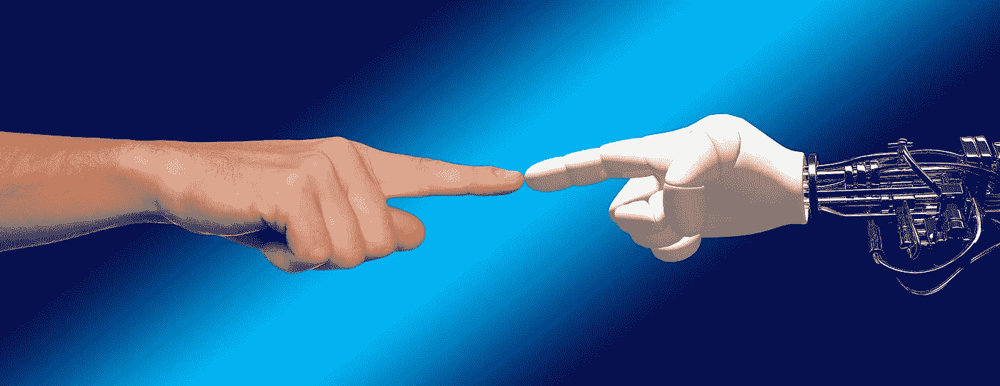

# 亲爱的数据科学家们，我爱你们。真诚的，Web 3.0

> 原文：<https://towardsdatascience.com/dear-data-scientists-i-love-you-sincerely-web-3-0-55049273905a?source=collection_archive---------6----------------------->

## 数据科学家对网络未来的审视

图片由[皮克斯拜](https://pixabay.com/?utm_source=link-attribution&utm_medium=referral&utm_campaign=image&utm_content=1571852)的 Gerd Altmann 提供

听说过[蒂姆·伯纳斯·李](https://en.wikipedia.org/wiki/Tim_Berners-Lee)吗？当然，你有。毕竟，他发明了互联网。

关于蒂姆，你可能还会知道，他发明了互联网 3.0，也就是 Web 3.0，也就是语义网，也就是空间网。下面是蒂姆爵士对互联网未来的看法:

> “我对网络有一个梦想，在这个梦想中，计算机能够分析网络上的所有数据——人和计算机之间的内容、链接和交易。应该使这成为可能的“语义网”尚未出现，但当它出现时，贸易、官僚主义和我们日常生活的日常机制将由机器与机器对话来处理。人们吹捧了很久的‘智能代理’终将实现。”

# **但是 Web 3.0 到底是什么？**

术语的多样性只说明了 Web 3.0 在今天所处的青春期。事实上，许多思想领袖仍在清晰地理解 Web 3.0 的内涵。

有些人将其定义为

> “…一个用来描述万维网未来的术语”

而[其他](https://www.expert.ai/blog/web-3-0/)提供了更具体的标准，如语义、AI、3D 和普遍性。

[其他的](https://www2.deloitte.com/us/en/insights/topics/digital-transformation/web-3-0-technologies-in-business.html)仍然提供更加狭窄的定义，更加专注于当前的商业模式可能能够利用空间技术的这种未来状态的方式(我将在下面更详细地探究其中的一些定义)。

无论你如何称呼它，无论你如何定义它，都有一些重要的努力正在进行中，以开始实现蒂姆对万维网未来的预言，这对数据科学家来说有一些重要的意义。

我深入深渊，开始了解 Web 3.0 及其对我所热爱的职业的潜在影响。回头看我的是一线机会。一封来自未来的情书，渴望实现，乞求我们铺垫。

# **我的理解…目前来说**

抛开所有的戏剧性不谈，我对 Web 3.0 的理解仍在不断发展，因为我了解并看到新产品带着 Web 3.0 营销标签进入这个领域。

我第一次注意到这个概念是在阅读了几篇由[蒂姆·丹宁](https://medium.com/u/b6d641be1066?source=post_page-----55049273905a--------------------------------)写的关于 Web 3.0 内容创作的文章之后，就像这里的这篇(嘿，看，另一个聪明的蒂姆😊).

Tim 还写了当今 Web 3.0 最突出的用例之一，加密货币。加密货币是 Web 3.0 潜力的很好例子，因为它们是一种去中心化和完全透明的价值交换手段。

密码消除了中央银行或政府控制货币流动的需要。这让我们重新理解 Web 3.0 到底意味着什么。

# 至少有两种定义

在我看来，有两种不同的定义正在形成。一个定义是对互联网技术未来状态的理想主义愿景。这一理想与伯纳斯-李的愿景最为契合。

第二是更直接地应用现有技术，这些技术尚未成为企业向消费者传递价值的标准。

让我们先解决后者，因为我认为这不是数据科学家最有价值的地方。

德勤(Deloitte)等几个著名的咨询集团正在推动 Web 3.0 与空间网络同义的说法。本质上，空间网络是一种未来状态，企业可以将客户数据连接到物联网设备，客户居住的地理位置可以将体验带入三维空间。认为 Pokémon Go 越来越成为常态。

向现有企业出售服务的咨询公司更喜欢这个定义，这是有道理的。这可以通过今天的技术实现，也符合现有的商业模式，即企业继续囤积用户数据以实现货币化。

在这种情况下，区块链仍然有用，企业与物联网提供商合作，建立连接这些设备的区块链服务，但企业仍然利用其集中的数据来混合和提供由内部衍生的见解调节的用户体验。

正是这种由超级用户驱动的沉浸式体验，让一些人把亚马逊和 Salesforce 这样的现有公司贴上了 Web 3.0 公司的标签，但事实并非如此。

这也不是伯纳斯-李设想的理想。Web 3.0 的理想状态要微妙得多，需要对现有的 Web 基础设施、在其上运行的应用程序以及传统的商业模式进行重大改变。

理想状态包括像区块链这样的分散式数据存储，用户控制自己的信息，并向想要使用这些数据的企业提供访问令牌。区块链的加密和分布式技术确保了安全性和数据隐私。但为了成为 Web 3.0，它必须对所有用户数据无处不在。

由于数据现在以分布式方式存储在整个互联网上，因此可以通过开发语言模型来更全面地理解用户需求，因为查询与用户交互密切相关。

换句话说，用户可以允许人工智能解决方案访问他们的数据，以丰富和进一步个性化他们的体验。在这种情况下，人工智能可以访问用户认为相关的数据，而不是从公司持有的中央存储库中获得的数据。

在这个理想化的未来状态中，数据科学家可能会有巨大的机会。

# **用 Web 3.0 为数据科学家牵线搭桥**

你看，Web 3.0 完全是以用户为中心，用户数据分布在支持区块链的存储技术中。应用程序分布在这些相同的区块链平台上，因此用户可以选择允许这些应用程序(或他们所谓的 dApps)访问他们的数据，从而创建更丰富、更相关的体验。用户不再需要向企业请求数据，因为数据已经被他们控制并存储在区块链上。

正如这种新的用户级数据所有权有利于蒂姆·丹宁这样的内容创作者一样，它也可能有利于数据科学家。例如，一个未来的数据科学家联盟可以与用户合作 ***购买*** 访问过去归公司所有的数据，以利用这些数据建立模型，实现新的体验。数据可以跨 dApps 和设备混合，因为数据都存储在区块链上，并连接到用户，而不是独立的公司，因此解决方案可以专门为用户量身定制。

反过来，这些人工智能解决方案可以作为 dApps 回售给可能从使用它们中受益的用户。这样，数据生成者(用户)和数据“理解者”(数据科学家)都从这种关系中获得了金钱上的好处。

但是，这种未来是否太遥远而无法实现呢？

我正在跟踪的一家公司是海洋协议公司，它正在向数据科学家的 Web 3.0 迈进。澄清一下，我和这家公司没有任何关系。我只是发现数据科学家对他们的平台感兴趣。

Ocean Protocol 为企业和数据科学家等数据聚合者提供了市场，他们可以在一个分散的框架内一起买卖数据资产。

此外，Ocean Protocol 使私营企业能够在市场上出售他们的数据资产，而不必在防火墙之外共享数据。海洋协议采用了“计算到数据”的编排，允许人工智能模型在私有数据上训练。

想象一下，能够使用来自多个主要医院网络的数据来训练疾病模型，而无需访问数据本身，只需访问元数据。

在这个新的数据协议中，数据科学家的另一个令人兴奋的机会是购买数据，将其与其他数据混合，用机器学习模型增强它，并以增强的形式将 ***卖回*** 。

# **关于海洋协议等平台的最后一个想法**

归根结底，数据科学家个人作为内容/模型/数据创造者在全球经济中发挥更大作用的潜力，他们在海洋协议等市场中的个人努力可以得到补偿。

这也意味着 AI 开发本身可能会变得分散。

因此，在这个新的分布式和用户拥有的数据框架中，人工智能的下一个重大进步可能更类似于元人工智能。也就是说，可以消费和组织其他人工智能模型的人工智能就像大脑一样，是围绕不同功能区域的互联网络组织的。

将这种类比推得更远一点，数据科学家成为互联网架构的新神经元，将这些神经元组织成功能区(功能等同的人工智能模型组)，将它们与其他功能区连接起来以协调它们，并帮助我们解决更复杂的问题。

# **我的理解……明天**

就像我说的，我还在学习。我确信我错过了一些东西，甚至可能误解了这个新空间的一些东西。对我来说，写作就是理解，所以我现在与你分享我的理解，理解到明天它可能不是我的理解。

Web 3.0 仍然非常新，许多变化肯定会到来。我将继续关注和参与这一新框架。尝试 Web 3.0 可能帮助实现的数据科学的潜在价值。

比如参与学习更多关于数据科学的知识？[加入我](https://www.facebook.com/groups/thinkdatascience)。