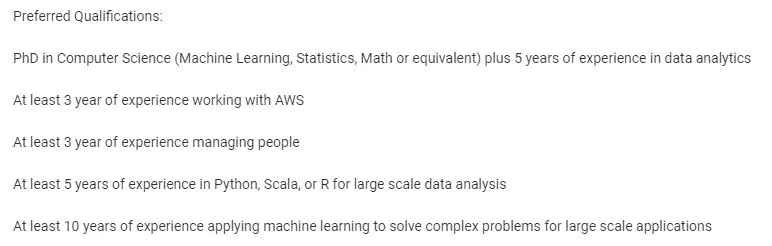
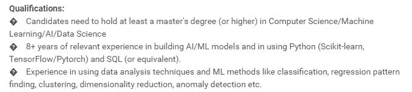
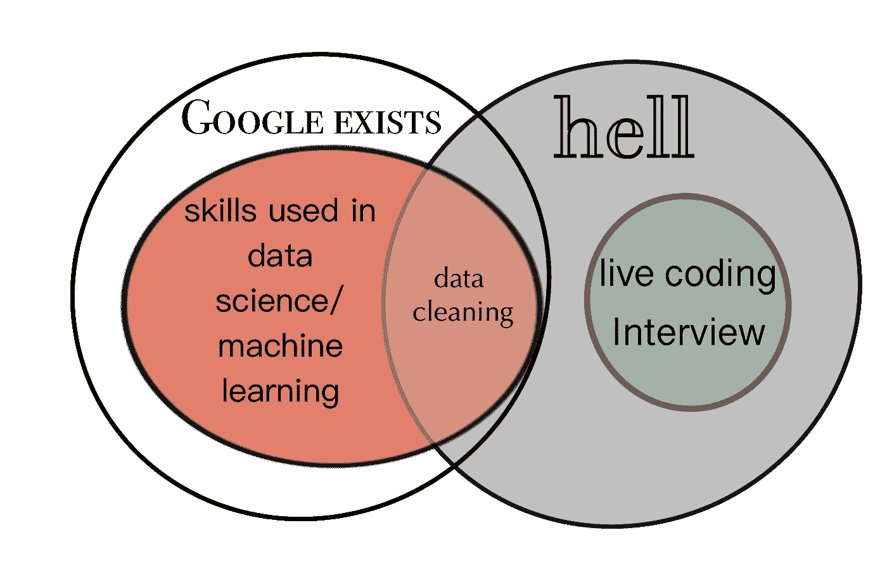

# 亲爱的招聘经理

> 原文：<https://towardsdatascience.com/dear-hiring-manager-d15129362d68?source=collection_archive---------31----------------------->

## 如何避免招聘过程中最常见的绊脚石

## 和杰里米·希尔一起写的

拥有十多年经验的技术招聘人员

作者图片

招聘人员是一名信息经纪人。他们将希望填补职位空缺的公司与能够填补职位空缺的人联系起来。业内最优秀的招聘人员会花时间去了解招聘经理和潜在雇员，并通过网络将他们联系在一起。公司依靠**招聘经理**引进*人才*和*建立运转良好的团队*。这是多方需求和期望的微妙平衡。这是在这个过程中遇到的三个最常见的绊脚石。

# 1.寻找完美的匹配

作者图片

事实上，你可能找不到一个和你在同一个行业，有着相同背景和长期工作经历的人。更重要的是，完美的匹配*可能并不是最终最好的*。

## 1A。未能认识到软技能的重要性

对于*非常*技术性的职位，选择一个几乎拥有你所寻找的所有硬技能的候选人是一个**容易的陷阱**。

但是有时候软技能对于一个人是否能胜任那个角色同样重要。特别是，

*   项目管理能力
*   讲故事的技巧
*   解决问题的创造力

一个客户雇佣了一个完全符合他们要求的人。这个人检查了每一个技术箱:他们曾为一个大的竞争对手工作过，有技术背景和经验。问题？8 个月过去了，他一笔生意也没做成。

原来，老公司的名气是他完成以前销售的全部因素，当他转到新的小公司时，他不再有这种优势。这家小公司确实需要一个知道如何颠覆行业并找到创新方法将技术推向市场的人。

然后他们雇佣了一个有机械工程背景和创造力历史的人，但是他们必须学习机器人学、地下工业和地下工程的所有知识。她最终非常成功，带来了数千万美元的销售额，并在那家公司呆了五年。

## 经验法则

在以下情况下，您应该面试此人:

*   他们拥有 **100%** 的*硬*技能却只有 **50%** 的*软*技能
*   他们拥有*软*技能的 **100%** ，却只有**硬*技能的*50%**

如果你思想开放一点，调整你的期望，你可能会对你发现的珠宝感到惊讶。

## 1B。需要多年的技术经验，而这些经验并不存在

看看这个招聘启事:

2021 年 3 月 18 日发布的 Capital One Bank 数据科学总监职位的招聘信息

除了语法错误之外，上一个广告中突出的是什么:

*   机器学习为了解决大规模应用的大数据在 10 年前是不存在的。

2021 年 4 月 6 日发布的英特尔首席数据科学家职位招聘信息

这则广告的突出之处是:

*   [TensorFlow](https://en.wikipedia.org/wiki/TensorFlow) 发布于 2015 年 11 月 19 日，大约是这个工作发布前的 5 年零 5 个月。
*   [PyTorch](https://en.wikipedia.org/wiki/PyTorch) 发布于 2015 年 9 月，大约是这个职位发布前的 5 年零 7 个月。

招聘人员通常要求拥有 8-10 年数据科学经验的数据科学家，但*数据科学在不久前还不是一个东西*。

## 1C。面试的现场编码部分

作者图片

以下文字改编自 [*丹尼尔·卡内曼的思维快慢*](https://en.wikipedia.org/wiki/Thinking,_Fast_and_Slow) *:*

想象你正被五个陌生人注视着检查你。*评判*你。

现在快速地，

一个球棒和球的价格是 1.10 美元。球棒比球贵一美元。这个球多少钱？

卡尼曼解释说，如果你回答了 10 美分，你凭直觉回答了这个问题，而哈佛、普林斯顿和麻省理工学院 50%的学生都回答错了。研究表明，在*的压力下，我们做出**直觉**的决定，而不是**深思熟虑**的决定([于，2016](https://www.ncbi.nlm.nih.gov/pmc/articles/PMC5146206/) )。有趣的是，如果你在参加现场 python 编码考试之前告诉自己你很棒，你应该在考试中表现得更好( [Creswell 等人，2013](https://www.ncbi.nlm.nih.gov/pmc/articles/PMC3641050/) )。*

*在那天你与他们交谈的 45 分钟内，表现良好的人在压力下做出了慎重的决定。*

*这项技能对于以下情况尤为重要:*

*   *赛车手*
*   *水肺潜水员*
*   *宇航员*

*在现场编码测试中表现不佳的人，当他们能够放松下来并适当地思考时，可能会做出更慎重的决定。除非你想淘汰大量有分析头脑的人，否则你可能会考虑寻找良好的解决问题能力的证据。如果你要招聘一名数据科学家，试着在一个 24 小时带回家的项目中评估他们的表现。如果你担心作弊，研究表明，贴上荣誉代码可以大大减少这种情况。*

*还有，球 5 分钱。*

# *2.没有为角色做预算*

## *使用个人轶事代替市场数据*

***不:**我的朋友是 X 公司的招聘经理，他们刚刚雇佣了一个每年生产 15 颗软糖的人，所以这也是我将要支付的工资。*

***是的:**找到一份你想要什么样员工的简介，并根据这个人在你的市场上多年的收入记录来制定预算。招聘人员应该免费提供这些信息。*

*一家公司对一名高级数据科学家感兴趣，并找到了完美的候选人，但这位潜在雇员想要比预算多 20 颗糖豆。因为。你好。他们是数据科学家。他们知道自己的市场价值。毕竟 Glassdoor 和 LinkedIn 提供的是薪资信息。支持数据显示，3-4 份档案也表明预算太低。*

*最终，招聘经理获准提高薪酬，这花了 1.5 周的时间。第四天，候选人接受了竞争对手的另一个职位(工资更高)，非常成功，4 年后的今天仍然在那里工作。如果招聘经理在创建职位之前咨询了实时市场数据，他们就不会把首选候选人拱手让给竞争对手，而且无论如何他们都必须提高数据来雇佣下一个候选人。*

# *3.缺乏反馈*

## *不告诉招聘人员哪里出了问题*

*招聘经理通常会写下一份工作并刊登广告，期望收到大量简历，从中挑选出最合适的候选人。最终发生的情况是，招聘人员会推荐不一定适合该职位的人，而没有人最终得到他们需要的东西。*

*为什么？因为招聘人员不是软件工程师/海底潜水员/数据科学家/机器人专家/旋转发动机机械师。有时他们需要你的专业知识来帮助指导他们给你带来最好的候选人。不告诉他们在这个过程中出了什么问题，就错过了教育他们可以改进的机会。建立关系会给你带来更好的结果。*

*例如，在一个工程职位中，公司正在寻找在一个非常特殊的机制中有经验的人。招聘人员把有相似经历的人寄给他，但是一个接一个，每个候选人都被拒绝了。在一次反馈会议后，招聘人员明白了招聘经理在寻找什么，并激发了他的创造力。他去了汽车行业，找到了一个与招聘经理在申请人才库中寻找的机制完全相同的人，这两个人之前都没有考虑过。该公司聘用了他，11 年后他仍在那里，现在是一名经理，管理着自己的团队。*

# *最后*

*你有很大的责任去寻找人才来满足公司的人力资源需求。以下提示将帮助你趟过泥沼，找到珠宝。*

*   *为新员工设定现实可行的标准。愿意调整自己的期望，保持开放的心态。*
*   *以合适的成本雇佣合适的人。这对你和候选人来说都更快更容易。*
*   *与招聘人员建立关系，让他们知道如何改进他们带来的候选人。最后，每个人都满意了。*

## *招聘愉快！*

# *来源*

***资本一号**，数据科学总监招聘启事:[https://www . capitalonecareers . com/job/McLean/Director-Data-Science/1732/17587251？UTM _ campaign = Google _ jobs _ apply&UTM _ source = Google _ jobs _ apply&UTM _ medium = organic](https://www.capitalonecareers.com/job/mclean/director-data-science/1732/17587251?utm_campaign=google_jobs_apply&utm_source=google_jobs_apply&utm_medium=organic)。2021 年 3 月 24 日接入。*

***克雷斯韦尔，法学博士，达奇尔，J.M .，克莱因，W.M .，哈里斯，P.R .和莱文，J.M .，** 2013。自我肯定能提高压力下解决问题的能力。 *PloS one* ， *8* (5)，p.e62593。*

***希尔，杰里米**。个人通信，2021。*

***英特尔**，首席数据科学家职位发布:[https://Intel . wd1 . myworkday jobs . com/External/job/India-Bangalore/Lead-Data-Scientist _ Jr 0161659-1](https://intel.wd1.myworkdayjobs.com/External/job/India-Bangalore/Lead-Data-Scientist_JR0161659-1)。2021 年 4 月 8 日接入。*

*丹尼尔·卡尼曼。*思考，快与慢*。麦克米伦，2011 年。*

*基督教 B 米勒。“大多数学生到底有多不诚实？."纽约时报。2020 年 11 月 13 日。2021 年 4 月 8 日访问。[https://www . nytimes . com/2020/11/13/opinion/Sunday/online-learning-checking . html #:~:text = experimental % 20 research % 20 has % 20 repeally % 20 found，with % 20 schools % 20 that % 20 are % 20 not。&text = A % 20 几% 20 学校% 20 开始% 20 学校% 20 代码](https://www.nytimes.com/2020/11/13/opinion/sunday/online-learning-cheating.html#:~:text=Empirical%20research%20has%20repeatedly%20found,with%20schools%20that%20are%20not.&text=A%20few%20schools%20start%20the,to%20uphold%20the%20school's%20code)。*

***萨卡尔，迪潘詹**。个人通信，2021。*

***于，R** 。, 2016.压力增强决策偏差:压力诱导的深思熟虑到直觉(SIDI)模型。*压力的神经生物学*， *3* ，第 83–95 页。*