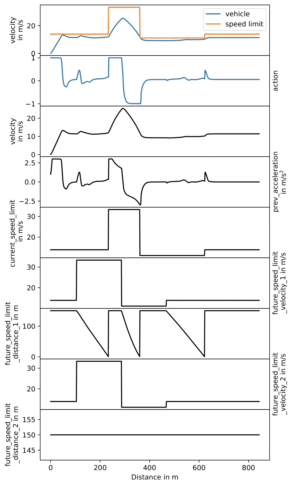
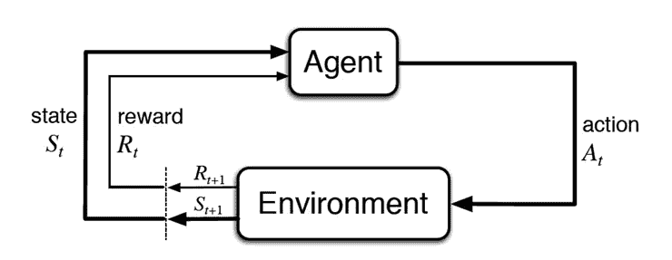
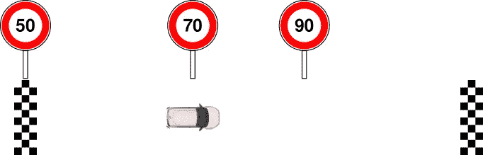
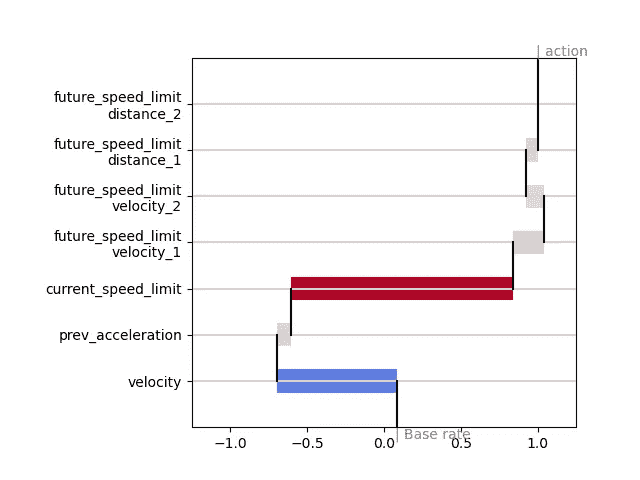
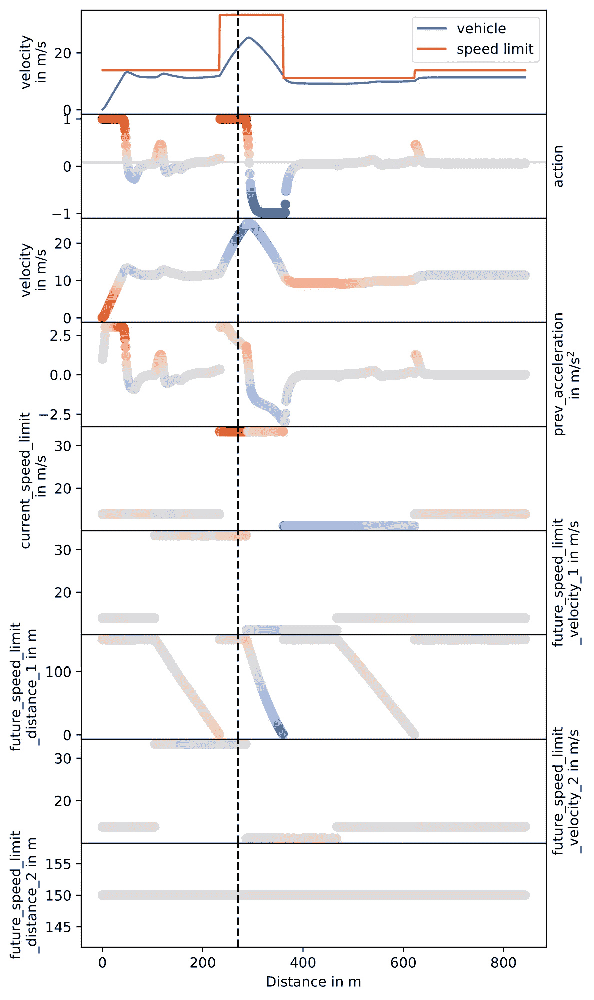

# 亲爱的强化学习代理，请解释你的行动。

> 原文：<https://towardsdatascience.com/dear-reinforcement-learning-agent-please-explain-your-actions-da6635390d4d?source=collection_archive---------15----------------------->

## 纵向控制的可解释强化学习

照片由[詹姆斯·庞德](https://unsplash.com/@jamesponddotco?utm_source=unsplash&utm_medium=referral&utm_content=creditCopyText)在 [Unsplash](https://unsplash.com/?utm_source=unsplash&utm_medium=referral&utm_content=creditCopyText) 拍摄

*下面这篇文章介绍了我与 Jan Dohmen 和 Marco Wiering 共同进行的研究。*

**TL；强化学习在许多应用中显示出实现最佳性能的前景。然而，只要学习的动作保持透明，它们在安全相关的应用中的使用是不可能的。这里提出的新的 RL-SHAP 图打开了黑箱，为强化学习决策提供了一个新的视角。**

# 情节

假设你是一名研究自动驾驶车辆的工程师。一个令人兴奋的想法，不是吗？

还有更好的。你花时间说服你老板用机器学习做纵向控制，他同意了！

你开始使用最具创新性的机器学习算法，并为车辆的纵向控制训练了一个强化学习代理。

团队已经很努力了，强化学习代理已经训练了几个小时，而且很有效。

LongiControl 环境中测试路线上的动作和输入特性。第一张图用蓝色显示车速，用橙色显示限速。在第二张图中，代理人的行动过程如下。这被限制在-1 和 1 之间的范围内。这里+1 代表最大正加速度，-1 代表最大负加速度(减速度)。下图显示了状态表示中包含的 7 个特征过程。

你激动不已，迫不及待地想向你的老板展示这个伟大的成果…

会议开始了，突然…他问你:

*“为什么代理在 270 m 距离给出全油门，那么为什么代理选择 1 的动作？”*

你说什么？

照片由[奥斯潘阿里](https://unsplash.com/@ospanali?utm_source=unsplash&utm_medium=referral&utm_content=creditCopyText)在 [Unsplash](https://unsplash.com/?utm_source=unsplash&utm_medium=referral&utm_content=creditCopyText) 上拍摄

你想想你该怎么回答。

*可能上次训练的时候损耗特别低？*

*也许代理在 99.999 %的情况下遵守了限速？*

或者你只是说人工智能是如此的聪明，以至于你不应该质疑它的决定？；)

# 或者

你倒回时间，读这篇文章，用 SHAP 来解释:

*   *当前速度限制对行动的正面影响最大(+ 1.44)*
*   *当前车速也被认为很重要，并降低了动作(- 0.78)*
*   【next 之后的速度限制对这一点上的决定几乎没有影响。

那听起来确实很有趣。但是我是如何得到这些价值的呢？我在哪里可以把它们读出来？

如果你在问自己这些问题，那么你来对地方了。喜欢读这篇文章。

PS:如果真的好奇，向下滚动到有 RL-Shap 图的部分；)

# 动机

深度强化学习(DRL)有潜力在各种实际应用中超越现有的最先进水平。然而，只要学习的策略和执行的决策难以解释，DRL 就不会找到进入安全相关应用领域的方法。

在这篇文章中，深度强化学习与 SHAP 联姻(SHapley Additive exPlanations)[1]。DRL 增加了 SHAP 值，这有助于更好地理解习得性行动选择策略。通过 OpenAI Gym LongiControl 环境[2]演示了 SHAP 方法在 DRL 的应用。

 [## 要不要用强化学习训练一辆简化的自动驾驶汽车？

### 试试我们新的远程控制环境

towardsdatascience.com](/do-you-want-to-train-a-simplified-self-driving-car-with-reinforcement-learning-be1263622e9e) 

# 介绍

如前所述，许多现实世界的应用程序面临的一大挑战是黑盒行为。经过一个学习过程后，人们可能不清楚为什么 DRL 代理人会做出某些决定。通常不清楚学习的控制是否有意义，或者在训练期间是否出了问题。只要不能理解决策是如何做出的，它就不适合用于与安全相关的应用领域。此外，深度 RL 结果的可解释性允许更快地修复错误并获得进一步的信息，例如某些状态特征的敏感性。

# 强化学习

由于大多数读者肯定熟悉强化学习的基础知识，所以我将在下面简单总结一下这些基础知识。更详细的资料，我推荐[3]和[4]。

强化学习是一种从与环境的相互作用中学习以实现既定目标的直接方法。

强化学习互动[3]

在每一个离散的时刻，代理人都面临着一个来自环境的状态，他必须选择一个动作。代理基于一个内部策略来决定它的动作，该策略将一个动作映射到每个可观察的状态。对于每一个选择的动作，代理人都会收到一个奖励和一个新的状态。

当在强化学习中使用深度神经网络来表示状态和动作以及状态、动作和 Q 值之间的关系时，我们正在讨论深度强化学习。

# 可解释性

正如[5]中所讨论的，创建可解释性的方法可以分为两大类:模型透明性和事后可解释性。

前者试图解释模型结构，而事后可解释性则用于理解模型工作的原因。虽然在深度学习中可以理解大量的计算步骤，但是不能期望从这种学习中获得模型的知识。因此，事后可解释性更令人感兴趣。

## 沙普利值

利用 Shapley 值[6]是合作博弈论的一个解概念。合作博弈理论研究游戏中的参与者如何通过形成联盟来最大化他们自己的价值。

## SHAP

SHAP 提供了一种博弈论的方法来解释机器学习模型的输出。对于特定的预测，SHAP 为每个特征分配一个重要性值。SHAP 值的总和导致模型的预测。

# **实验设置**

[遥控环境](https://github.com/dynamik1703/gym_longicontrol)已经用于实验研究。。目标是车辆在给定时间内尽可能节能地完成单车道路线。

远程控制可视化

有关该环境的更详细介绍，我可以向您推荐以下文章:

 [## 要不要用强化学习训练一辆简化的自动驾驶汽车？

### 试试我们新的远程控制环境

towardsdatascience.com](/do-you-want-to-train-a-simplified-self-driving-car-with-reinforcement-learning-be1263622e9e) 

# 方法

新提出的方法包括四个步骤。在第一步中，需要对 RL 代理进行培训。然后，可以在轨迹上测试经过训练的代理，并通过显示图表来分析产生的状态特征和动作，这些图表提供了选择动作的原因的清晰可视化。

## **DRL 代理商—培训**

DRL 代理的培训可以像您在之前的设置中所做的那样进行。尽管我们关注于演员-评论家 RL 算法，但是对于这里提出的解释方法的应用没有明确的训练要求。一旦代理达到预定的性能，就执行过程中的下一步。

**DRL 代理—测试功能**

对于测试，只对 DRL 代理的参与者网络感兴趣，它将状态特征映射到一个动作。

在确定了感兴趣的神经网络之后，为了分析参与者，出现了应该将哪些输入值用于测试的问题。理论上，随机输入值是可能的。然而，这些可能显示出 DRL 代理没有被训练的组合，因此违反了演员的模型有效性。在这里介绍的过程中，代理面临着远程控制环境中的新场景。

**SHAP 价值观**

试运行后，下一步是计算 SHAP 值。为此，解释器是从 tensorflow actor 网络和测试运行的状态序列中近似得到的。

**RL-SHAP 图**

由于很难观察单个例子，也很难识别状态-行动组合的长期影响，因此可以绘制出状态变量的整个过程。为了提高这些图形的可理解性，SHAP 值的附加信息将在适当的位置用颜色显示。

# 结果

下面以 LongiControl 环境为例解释代理学习的行为。下图显示了单个状态的 SHAP 值和代理的操作。

## **单态分析**

*   基本利率的值为 0.08。基本速率是在神经网络的输入变量未知的情况下计算的模型输出
*   特征速度的 SHAP 值-0.78 将添加到该值中
*   接下来是先前加速度的 SHAP 值，0.09 等等
*   基本速率和七个 SHAP 值的和等于 1.0，并且近似对应于代理的动作

从该示例可以得出，对于给定状态，特征当前速度限制具有最大影响，而特征未来速度限制距离 2 对结果动作具有最小影响。由此，我们可以简单地推断出，智能体完全加速主要是因为高速限制。

在分析了单个状态的动作选择过程之后，我们现在将考察一个更长的轨迹。

# **RL-SHAP 图**

下图显示了新引入的 RL-SHAP 图，以便更全面地了解决策过程。

*   作为附加信息，该特征(SHAP 值)对所选动作的影响用所用颜色突出显示
*   特征的红色表示该特征增加了值，蓝色表示该值减少了值，灰色表示该值对动作的影响很小

RL-SHAP 图。垂直虚线突出显示了上图中分析的状态

*   在第三张图中，红色可以通过前 70 米内的速度清楚地显示出来。代理强烈加速以达到接近速度限制的速度。此后，SHAP 值减小，因此该特征对动作的影响减小，这可以通过颜色从红色变为灰色来看出
*   相比之下，图 8 和图 9 大部分是灰色的。这意味着关于下一个速度限制的信息只是稍微包含在代理的决定中。因此，该功能对于代理来说似乎不太重要。
*   在第七张图中可以看到灰色、蓝色和略带红色的混合影响。在这个图表中，显示了到下一个速度限制的距离。如果新的速度限制低于当前速度限制，该功能会对车辆产生减速效果。这可以在大约 300 米距离的蓝色值范围内看到。动作的减少很大程度上是由于这个特点。

# 结论

这项工作的目标是开发一种方法来解释一个训练有素的强化学习代理人如何在特定的情况下选择它的行动。为此，计算了不同输入特征的 SHAP 值，并以新颖的 RL-SHAP 图表示法显示了每个特征对所选动作的影响。利用 DDPG·DRL 算法求解的 LongiControl 环境对提出的可解释 RL 方法进行了测试。

结果表明，RL-SHAP 表示阐明了哪些状态特征对动作有积极的、消极的或可忽略的影响。我们对测试轨迹上的代理行为的分析表明，给定一些领域知识，不同状态特征的贡献可以被逻辑地解释。因此，我们可以得出结论，SHAP 的使用及其在 RL 中的整合有助于解释代理人的决策过程。

作为未来的工作，我们希望研究能够解释高维输入空间中 DRL 代理决策过程的方法。

你可以在这里看到[Python 代码](https://github.com/dynamik1703/gym_longicontrol/blob/master/Jupyter/LongiControl_SHAP.ipynb)。享受使用它的乐趣=)

# 参考

[1] Lundberg，s .等人(2017 年)。解释模型预测的统一方法。神经信息处理系统进展 30，4765-4774 页。柯兰联合公司。

[2]多门，j .等人(2021 年)。纵向车辆控制的强化学习环境。《第 13 届代理和人工智能国际会议论文集》,第 1030-1037 页。INSTICC。

[3] R .萨顿和 a .巴尔托，[强化学习简介](http://incompleteideas.net/book/first/the-book.html) (1988)，麻省理工学院出版社

[4] T. P. Lillicrap 等，[深度强化学习的连续控制](https://arxiv.org/abs/1509.02971) (2015)，CoRR

[5]李普顿，Z. C. (2016)。模型可解释性的神话。http://arxiv.org/abs/1606.03490.

[6]沙普利，L. (1953 年)。n 人游戏的价值。对博弈论的贡献 2，28:307–317。

 [## 德国萨克森州 Roman liener-Dresden 博士|专业简介| LinkedIn

### 查看 Roman liener 博士在 LinkedIn 上的专业简介。LinkedIn 是世界上最大的商业网络，帮助…

www.linkedin.com](https://www.linkedin.com/in/dr-roman-lie%C3%9Fner-56346113b/)