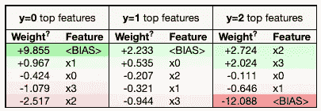
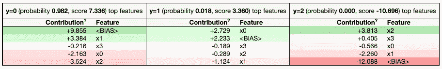
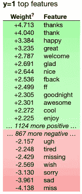
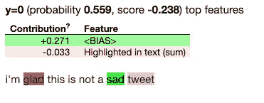

# 使用 Eli5 调试模型并解释预测

> 原文：<https://towardsdatascience.com/debug-models-and-explain-predictions-using-eli5-9f856ae74d16?source=collection_archive---------34----------------------->

## 一种简单而有创意的 ML 调试方法


作者图片

使用机器学习模型的一个重要步骤是调试。例如，当我们处理文本时，我们必须检查我们的特征中是否有任何影响预测的噪声，如不需要的符号或数字。我们必须知道什么是预测的原因，并以某种方式解释模型的输出。过去，我们谈论过[功能重要性](https://predictivehacks.com/feature-importance-in-python/)，它也可以帮助我们调试机器学习模型，但现在有一种更简单、更实用的方法来做到这一点。

[Eli5](https://eli5.readthedocs.io/en/latest/index.html) 是一个可以帮助我们调试 ML 模型并以创造性的方式解释其输出的库。我们将向您展示一些使用它解决简单分类问题、文本分类问题和使用 Keras 解决图像分类问题的示例。

# 装置

```
pip install eli5
```

# Eli5 解释虹膜预测

对于这个简单的模型，我们将使用虹膜数据集来预测虹膜的类型(Setosa、Versicolour 和 Virginica)。

```
from sklearn import datasets
from sklearn.linear_model import LogisticRegression
import pandas as pd

import eli5

iris = datasets.load_iris()
features=pd.DataFrame(iris['data'])
target=iris['target']
model=LogisticRegression(max_iter=1000)
model.fit(features,target)
```

现在我们有了一个训练好的模型，我们可以使用 Eli5 来获得特征重要性，并通过向我们显示什么特征负责模型的输出来解释预测。

首先，让我们得到每个类的特性重要性。换句话说，模型的权重。

`eli5.explain_weights(model)`


使用机器学习模型的一个重要步骤是调试。例如，当我们处理文本时，我们必须检查我们的特征中是否有任何影响预测的噪声，如不需要的符号或数字。我们必须知道什么是预测的原因，并以某种方式解释模型的输出。在过去，我们谈到了[功能重要性](https://predictivehacks.com/feature-importance-in-python/)，它也可以帮助我们调试机器学习模型，但现在有一种更简单、更实用的方法来做到这一点。

[Eli5](https://eli5.readthedocs.io/en/latest/index.html) 是一个库，可以帮助我们调试 ML 模型，并以创造性的方式解释它们的输出。我们将向您展示一些使用它解决简单分类问题、文本分类问题和使用 Keras 解决图像分类问题的示例。

# 装置

```
pip install eli5
```

# Eli5 解释虹膜预测

对于这个简单的模型，我们将使用虹膜数据集来预测虹膜的类型(Setosa、Versicolour 和 Virginica)。

```
from sklearn import datasets
from sklearn.linear_model import LogisticRegression
import pandas as pd

import eli5

iris = datasets.load_iris()
features=pd.DataFrame(iris['data'])
target=iris['target']
model=LogisticRegression(max_iter=1000)
model.fit(features,target)
```

现在我们有了一个训练好的模型，我们可以使用 Eli5 来获得特征重要性，并通过向我们显示什么特征负责模型的输出来解释预测。

首先，让我们得到每个类的特性重要性。换句话说，模型的权重。

`eli5.explain_weights(model)`



我们可以通过输入模型和一个测试输入来解释输出。

`eli5.explain_prediction(model, features.head(1))`



在这个预测中，0 类的概率最高。此外，我们可以看到每个特征和偏差的贡献。

# Eli5 解释文本分类

我们将使用一些正面和负面的推文样本，我们将训练一个逻辑回归分类器来预测一条[推文是正面还是负面。](https://predictivehacks.com/topic-modelling-with-nmf-in-python/)

```
import numpy as np
import nltk   # Python library for NLP
from nltk.corpus import twitter_samples    # sample Twitter dataset from NLTK
from collections import Counter
import eli5

nltk.download('twitter_samples')

# select the set of positive and negative tweets
all_positive_tweets = twitter_samples.strings('positive_tweets.json')
all_negative_tweets = twitter_samples.strings('negative_tweets.json')

pos=pd.DataFrame({"tweet":all_positive_tweets,'positive':[1]*len(all_positive_tweets)})
neg=pd.DataFrame({"tweet":all_negative_tweets,'positive':[0]*len(all_negative_tweets)})

data=pd.concat([pos,neg])

from sklearn.feature_extraction.text import TfidfVectorizer

# use tfidf by removing tokens that don't appear in at least 5 documents
vect = TfidfVectorizer(min_df=5,ngram_range=(1, 3), stop_words='english')

# Fit and transform
X = vect.fit_transform(data.tweet)

from sklearn.linear_model import LogisticRegression

model=LogisticRegression()

model.fit(X,data['positive'])
```

首先让我们得到重量。在这种情况下，我们还需要设置我们使用的矢量器。

```
eli5.show_weights(model, vec=vect)
```



接下来是有趣的部分。让我们得到一个输入句子中每个单词的贡献。

```
test="I'm glad this is not a sad tweet"

eli5.explain_prediction(model, test, vec=vect)
```



很有用，对吧？通过在句子中突出每个特征，它给了我们每个特征的贡献。

# Eli5 解释 Keras 图像模型

Eli5 非常强大，可以与 [Keras 图像分类模型](https://predictivehacks.com/object-detection-with-pre-trained-models-in-keras/)一起工作。我们将使用一个预先训练的模型来获取下面的图片标签，这是我的桌子。


```
from keras.applications.xception import Xception
from keras.preprocessing import image
from keras.applications.xception import preprocess_input, decode_predictions
import numpy as np
import tensorflow as tf

tf.compat.v1.disable_eager_execution()
import PIL
from PIL import Image
import requests
from io import BytesIO

# load the model
model = Xception(weights='imagenet', include_top=True)

# chose the URL image that you want
URL = "[https://instagram.fath3-3.fna.fbcdn.net/v/t51.2885-15/e35/p1080x1080/120296207_346512619886025_2547830156221124067_n.jpg?_nc_ht=instagram.fath3-3.fna.fbcdn.net&amp;_nc_cat=109&amp;_nc_ohc=eivBrVMAy4oAX8SvZlu&amp;edm=AGenrX8BAAAA&amp;ccb=7-4&amp;oh=9408a18468253ee1cf96dd93e98f132b&amp;oe=60F341EE&amp;_nc_sid=5eceaa](https://instagram.fath3-3.fna.fbcdn.net/v/t51.2885-15/e35/p1080x1080/120296207_346512619886025_2547830156221124067_n.jpg?_nc_ht=instagram.fath3-3.fna.fbcdn.net&amp;_nc_cat=109&amp;_nc_ohc=eivBrVMAy4oAX8SvZlu&amp;edm=AGenrX8BAAAA&amp;ccb=7-4&amp;oh=9408a18468253ee1cf96dd93e98f132b&amp;oe=60F341EE&amp;_nc_sid=5eceaa)"
# get the image
response = requests.get(URL)
img = Image.open(BytesIO(response.content))
# resize the image according to each model (see documentation of each model)
img = img.resize((299,299))

# convert to numpy array
x = image.img_to_array(img)
x = np.expand_dims(x, axis=0)
x = preprocess_input(x)
```

现在我们有了处理后的图像(x)和 Keras 模型，让我们检查模型预测的前 20 个标签。

```
features = model.predict(x)

# return the top 20 detected objects
label = decode_predictions(features, top=20)
label[[('n03179701', 'desk', 0.296059),
  ('n03337140', 'file', 0.12352474),
  ('n04590129', 'window_shade', 0.078198865),
  ('n03180011', 'desktop_computer', 0.06828544),
  ('n04239074', 'sliding_door', 0.02761029),
  ('n03782006', 'monitor', 0.022889987),
  ('n02791124', 'barber_chair', 0.018023033),
  ('n02791270', 'barbershop', 0.013427197),
  ('n04344873', 'studio_couch', 0.011167441),
  ('n03201208', 'dining_table', 0.009128182)]]
```

然后，我们可以检查图像的哪个部分负责每个标签。我们还需要标签的类 id，可以通过以下方式获得。

```
np.argsort(features)[0, ::-1][:10]array([526, 553, 905, 527, 799, 664, 423, 424, 831, 532])
```

让我们检查一下 id 为 526 的标签台。

```
eli5.show_prediction(model, x, targets=[905])
```


如您所见，标签书桌图像最重要的部分是实际书桌的位置。

这次我们来查一个理发店这样奇怪的标签。

```
eli5.show_prediction(model, x, targets=[424])
```


啊哈！现在我们知道我的办公椅就像理发椅。这就是模型预测理发店标签的原因。

# 总结一下

Eli5 是一个非常有用的库，可以帮助我们调试分类器并解释它们的预测。它可以处理大多数 python ML 库，也可以处理更复杂的模型，比如 Keras，或者使用文本和矢量器。

*最初发表于*[https://predictivehacks.com。](https://predictivehacks.com/debug-models-and-explain-predictions-using-eli5/)