# 像专家一样调试 Python 脚本

> 原文：<https://towardsdatascience.com/debug-python-scripts-like-a-pro-78df2f3a9b05?source=collection_archive---------7----------------------->

## 调试 Python 代码的好方法、好方法和聪明方法。


调试 Python 脚本的工具和技巧——图片来自 [Pexels](https://www.pexels.com/photo/faceless-master-choosing-screwdriver-from-toolbox-4792511/?utm_content=attributionCopyText&utm_medium=referral&utm_source=pexels) 的 [Anete Lusina](https://www.pexels.com/@anete-lusina?utm_content=attributionCopyText&utm_medium=referral&utm_source=pexels)

我花了一些时间来领会调试的思想。

我相信这是大多数代码新手的通病。对我来说，作为一个自学成才的 Python 程序员，找到问题并以最快的方式修复它们是一项挑战。

但是这些年来，我学会了几种技术来发现脚本中的错误。有些改变了，有些我停止了。在这篇文章中，我将带你了解我认为调试 Python 代码的坏的、好的和聪明的方法。

[](/poetry-to-complement-virtualenv-44088cc78fd1) [## 你不会还在用 Virtualenv 吧？

### 有一种更好的方法来管理依赖项、打包和发布 Python 项目。

towardsdatascience.com](/poetry-to-complement-virtualenv-44088cc78fd1) 

让我们从坏的开始。

# 打印报表

也许“打印”是最常用的 Python 函数。

自然，任何想知道代码中发生了什么的人都会使用 print 语句。因为这是最简单也是最普遍的选择。它似乎也适用于较小的脚本。

如果您打算测试您的代码是否到达某个点，或者检查某个特定点的变量值，请继续使用它。如果只是一次。

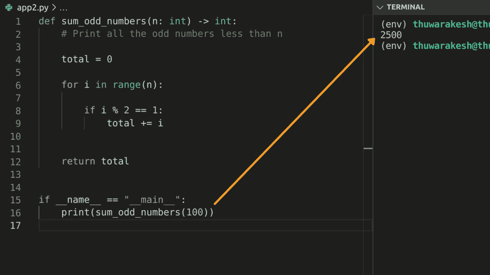

print 语句用于调试 Python 代码。—作者图片

但是随着代码变得越来越大，你就有麻烦了。打印声明将会出现在整个项目中。您很快就会忘记代码中哪个打印行对应哪个打印语句。

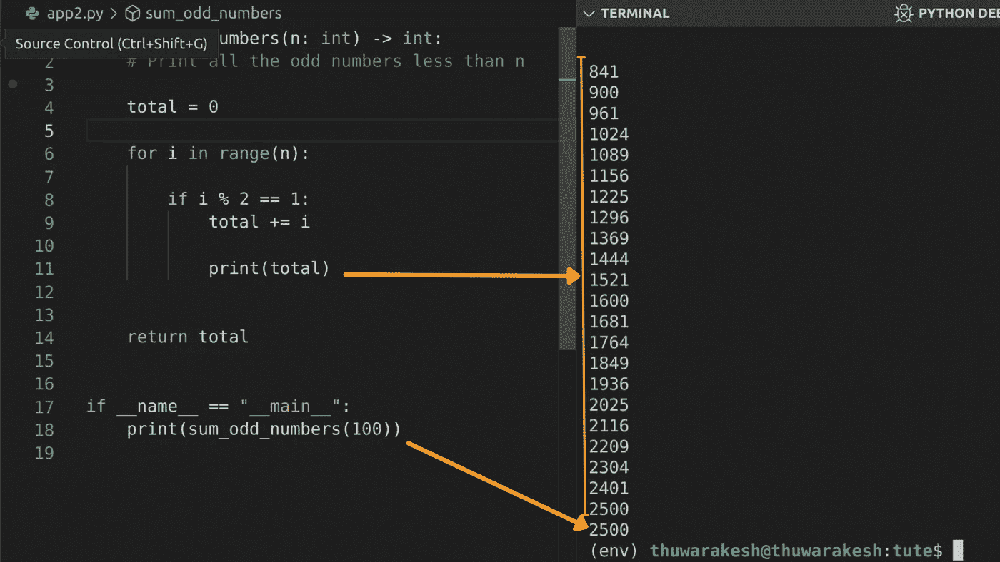

多个打印语句打乱了输出——按作者排列的图像

如果您的项目并行或异步执行代码，情况会变得更加复杂。现在使用并行执行也并不罕见。

这个问题的直接解决方案是在每个 print 语句中使用描述。

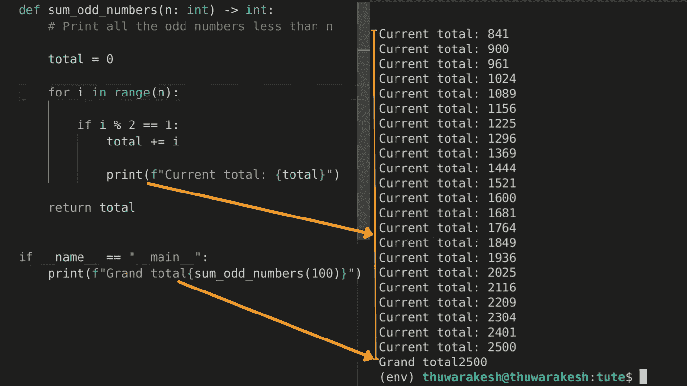

在调试中使用描述性打印语句—按作者排列的图像

但是这会吸走开发者的灵魂。有更好的方法。这是我们在列表中的以下技术。

[](/5-python-gui-frameworks-to-create-desktop-web-and-even-mobile-apps-c25f1bcfb561) [## 5 Python GUI 框架来创建桌面、Web 甚至移动应用程序。

### 你可以纯粹用 Python 来构建漂亮的应用程序。

towardsdatascience.com](/5-python-gui-frameworks-to-create-desktop-web-and-even-mobile-apps-c25f1bcfb561) 

# 冰淇淋

打印报表是一个繁琐、耗时的过程。冰淇淋让调试变得甜蜜。

Icecream 是一个 Python 包，可以让你检查脚本中不同点的变量。简而言之，它打印变量值、执行的函数，以及某些情况下的行号和文件名。

下面介绍如何使用[冰激凌](https://github.com/gruns/icecream)调试 Python 代码。

1.  使用 pip 安装冰淇淋。

```
pip install icecream
```

2.将冰淇淋导入您的脚本

```
from icecream import ic
```

3.用 ic 包装您的函数调用和语句

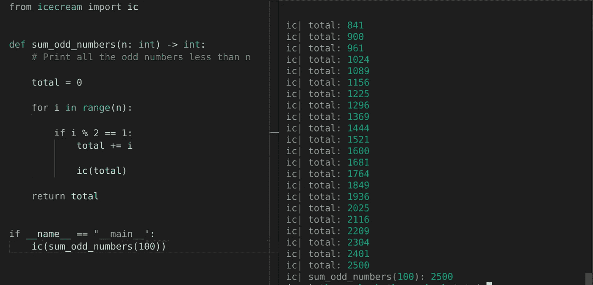

冰激凌用于调试 Python 脚本。—作者图像

冰激凌通过自动将上下文添加到开发者创建的每一个日志中，让开发者的生活变得简单。这是调试 Python 代码的好方法。

但这仍然是额外的工作。

像 PyCharm 和 VSCode 这样的现代 IDE 允许您将代码停在某一行，并在该行检查所有局部和全局变量。

这是调试的聪明方法。

# 如何在现代集成开发环境中调试 Python 代码

实时调试是在运行时使用代码的一种方式。

我们中的一些人开始在记事本应用程序中编码。后来我们换成了[记事本++ T5。然后是革命性的](https://notepad-plus-plus.org/downloads/)[崇高文本](https://www.sublimetext.com/)和 [Atom](https://atom.io/) 编辑。他们是那个时代的伟大工具。

我们中的一些人从 [PyCharm](https://www.jetbrains.com/pycharm/) 开始。我是爱上这个优秀的 IDE 的人之一。然而，我转向了 VSCode，因为它是免费的，它的社区曾经(现在仍然)飞速发展。

不出我所料，用 [VSCode](https://code.visualstudio.com/) 调试对初学者来说也是超级容易的。这就是这篇文章的其余部分。让我们把这一部分分成三个部分:用断点调试、流行框架的配置和调试数据帧。

[](/how-to-create-stunning-web-apps-for-your-data-science-projects-c7791102134e) [## 如何为您的数据科学项目创建令人惊叹的网络应用程序

### 数据科学家不必学习 HTML、CSS 和 JavaScript 来构建网页。

towardsdatascience.com](/how-to-create-stunning-web-apps-for-your-data-science-projects-c7791102134e) [](https://thuwarakesh.medium.com/how-to-create-progressive-web-apps-pwa-in-python-86ab3fb0d7cf) [## 如何用 Python 创建渐进式网络应用程序(PWA)？

### 您可以用 Python 网络框架构建可安装的网络应用程序。以下是使用姜戈创建一个的指南。

thuwarakesh.medium.com](https://thuwarakesh.medium.com/how-to-create-progressive-web-apps-pwa-in-python-86ab3fb0d7cf) 

## 在 VSCode 中使用断点调试 Python 脚本。

您可以通过三个步骤启动调试器。方法如下:

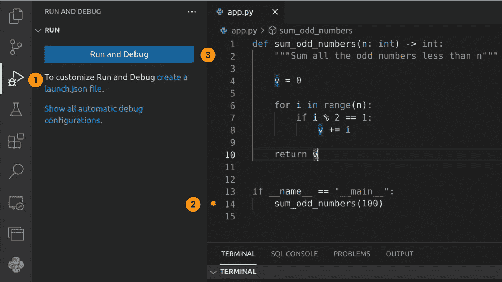

在 VSCode 中调试 Python 脚本—作者映像

1.  单击边栏上的调试器。是这个上面有臭虫的播放按钮。
2.  在代码中创建断点。您可以通过单击行号前的来完成。您创建的每个断点都会出现一个红色指示器。
3.  现在，通过单击“运行并调试”按钮并在下拉列表中选择“Python 文件”来启动调试器。

当您这样做时，VSCode 将启动一个线程来运行您的脚本，并在您有第一个断点的地方停止。屏幕将如下所示:

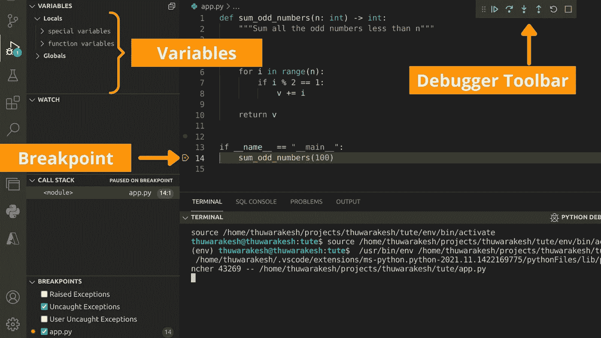

在 VSCode 的断点处进行实时调试。—图片由作者提供。

当它在您创建的断点处停止时，您现在可以看到该行被突出显示，侧栏发生了变化，并且一个新的工具栏出现在右上角(此位置在您的窗口中可能有所不同)。

工具栏是调试器的控制器。“播放”按钮将忽略当前断点，并移到下一个断点。“停止”按钮将停止调试器，而“刷新”按钮将重新启动调试器。

我发现介入按钮非常有用。它是调试器工具栏上的向下箭头键。请看看下面的录音，以了解它是如何工作的，它是多么有用。

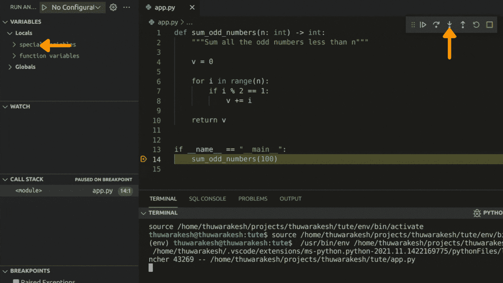

在 VSCode 调试器中逐行单步执行—图片由作者提供

我的第一个断点在第 14 行。这一行调用了一个名为“sum_odd_numbers”的函数当我点击 step in 键时，解释器移动到下一行，但停在那里。它在我调用的函数中(第 4 行。)

注意侧边栏中的变量部分。因为我们现在在函数中，所以范围改变了。在“本地”区域，我们看到 n 的值是 100。v 的值是可用的，因为解释器还没有执行第 4 行。

但是当你不断点击进入键时。你看，v 的值也在变化。当我们进入循环时，你也可以看到“I”的值。

请注意，只有当“I”的值为奇数时，我们才会到达第 8 行。当我们执行第 8 行时,“v”的值增加了“I”的值。

太好了，我们可以在脚本运行的时候一行一行地讲述所有的事情。这就是为什么实时调试是发现和修复代码问题的更好的方法。

## 配置 VSCode 以调试流行的 Python 框架。

VSCode 支持流行的框架，如 Django、Flask、FastAPI 和 Pyramid out of the box。在大多数情况下，您不必为这些框架配置任何特殊的东西。启动调试器时，您只需在下拉列表中选择框架。

> 如果这是您第一次使用 django 项目，您可以使用`pip install django`安装 django，并使用命令`Django startproject <project_name>`创建一个 Django 项目

但是在某些情况下，您必须覆盖默认值。例如，如果另一个进程阻塞了 8000 端口，Django 需要另一个进程来启动。您可以使用 launch.json 文件向调试器提供附加信息。

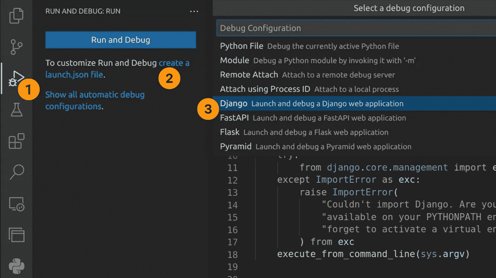

配置 VSCode 以调试 Django 应用程序。—图片由作者提供。

转到调试器窗口，选择“创建一个 launch.json 文件”选项。在下拉列表中，选择您正在使用的框架。我选择了姜戈作为这个例子。

您将看到一个新的 JSON 文件打开，带有一些熟悉的选项。

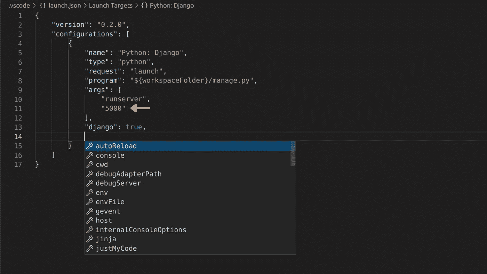

覆盖 VSCode 中的调试配置—按作者排列的图像

上述文件运行＄{ workspace folder }中的“manage.py”文件(这是您在 VSCode 中打开的项目的根目录)。此外，它接受命令行参数“runserver”。

这意味着当调试器启动时，它将要执行`python manage.py runserver`。

我通过扩展“args”列表添加了另一个参数。在第 11 行，我将 Django dev 服务器的端口配置为 5000，而不是默认的 8000。这个修改将让调试器运行`python manage.py runserver 5000`。

转到一个新行，按住 ctrl(或 command)键，看看还有哪些其他选项。如上图所示，会弹出一个选项列表。

让我们看看调试器的运行情况。

将 <proj>/urls.py 的内容替换为以下内容。</proj>

非常基本的 Django URL 配置，说明如何调试 web 请求——作者的代码片段。

并使用以下内容创建一个名为 views.py 的文件。我们运行着与 web 服务相同的奇数计数器。

非常基本的 Django 视图，说明如何调试 web 请求——作者的代码片段。

点击侧边栏中的 play 按钮启动调试器。现在，在你的网络浏览器中，如果你去[http://127 . 0 . 0 . 1:5000/sum _ odd _ numbers/10](http://127.0.0.1:5000/sum_odd_numbers/10)，浏览器会显示结果 25。尝试在 URL 中使用不同的数字而不是 10 来查看 web 服务器是如何工作的。

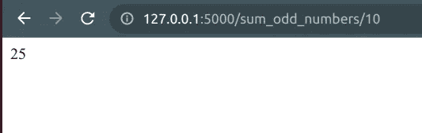

浏览器上示例 web 响应的输出—图片由作者提供。

现在，让我们在第 7 行放置一个断点，并再次访问浏览器上的 URL。这一次，浏览器一直在等待响应。但是 VSCode 在我们的断点处停止处理请求。

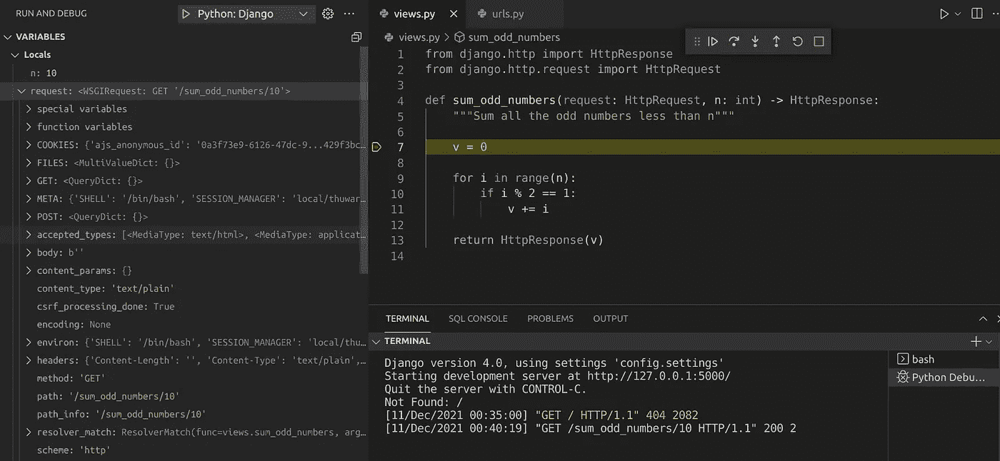

检查 VSCode 中的 Django 请求对象。—作者图片

看看你在变量面板里得到了什么。您可以访问整个请求对象，包括有关路径、请求类型的信息和浏览器 cookie 信息。

在实时调试模式下调试 web 服务器毫不费力。我们将在下一部分讨论允许我调试数据帧的最新特性之一。

## 用 VSCode 调试 pandas 数据帧

VSCode 已经在数据科学中非常有用，内置了 Jupyter 笔记本。

然而，如果一个分析项目在一个脚本上，那么调试它是很困难的。在我的日常工作中，一个非常常见的情况是处理 web 请求中的数据集。

列表、字典、甚至对象都可以相对直接地显示在变量部分。但是熊猫数据框是一个需要表格格式的复杂对象。只有这样，开发人员才能从中发现问题。

VSCode 以最好的方式解决了这个问题。您只需右键单击变量部分中的数据框对象，然后选择“在数据查看器中查看值”

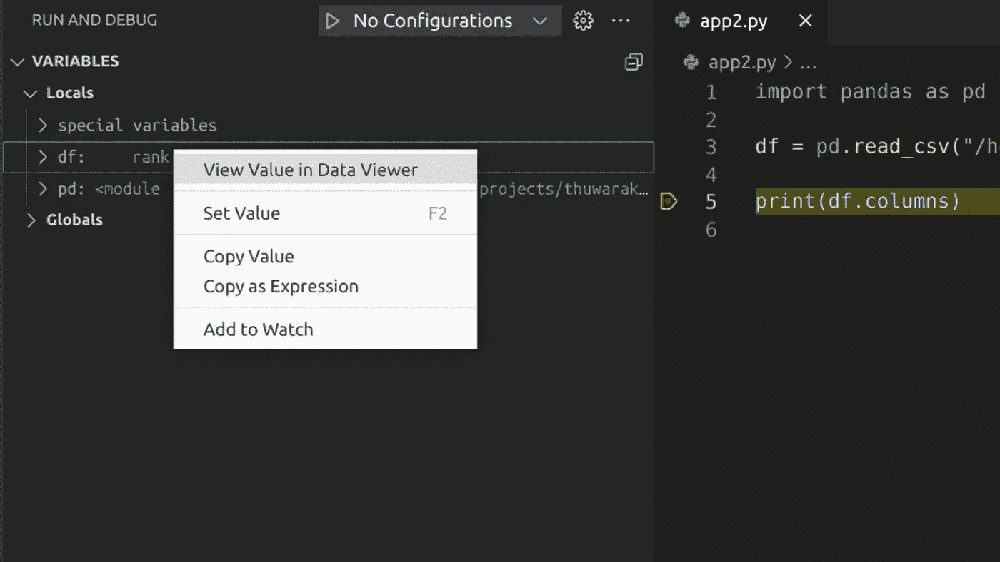

使用 VSCode 的数据查看器调试 pandas 数据框。—作者图片

在上面的截图中，我在第 5 行添加了一个断点。此时，解释器已经读取了 CSV，数据帧在存储器中。当我们在 Dat 查看器中打开它时，我们会得到以下内容。

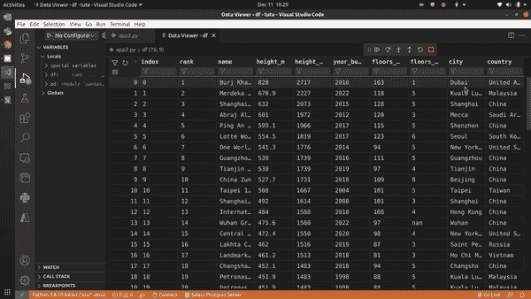

VSCode 的数据查看器正在运行—图片由作者提供

这是我们的数据框的一个支持正则表达式的可过滤表格视图。当你不在 Jupyter 笔记本上时，这个特性是调试项目的一个方便的技术。在大多数生产系统中查找和修复 bug 时都是如此。

如果您在右键菜单上没有看到数据查看器选项，您必须在 VSCode 中安装或更新 [Python 扩展。只有最近的版本才有这个功能。](https://marketplace.visualstudio.com/items?itemName=ms-python.python)

# 最后的想法

不管你有多有经验，调试都是非常具有挑战性的。

对于大多数初学者来说，打印语句是最容易做到的。但是用打印语句来查找大型生产级系统中的 bug 是不实际的。只有正确的工具和技术才能帮助减轻工作。

一个可爱的救援工具是冰淇淋。Icecream 会自动包含记录语句的上下文描述。然而，每次您想要测试不同的东西时，您都必须重新运行整个脚本。

现场调试是发现和修复软件项目中问题的最聪明的方法。大多数现代 IDE 都支持实时调试。在这篇文章中，我们介绍了 VSCode 调试器是如何工作的。

我希望这个指南有助于让你的代码没有 bug。

> 感谢阅读，朋友！在[**LinkedIn**](https://www.linkedin.com/in/thuwarakesh/)[**Twitter**](https://twitter.com/Thuwarakesh)[**Medium**](https://thuwarakesh.medium.com/)上跟我打招呼。
> 
> 还不是中等会员？请使用此链接 [**成为会员**](https://thuwarakesh.medium.com/membership) 因为，不需要你额外付费，我为你引荐赚取一小笔佣金。