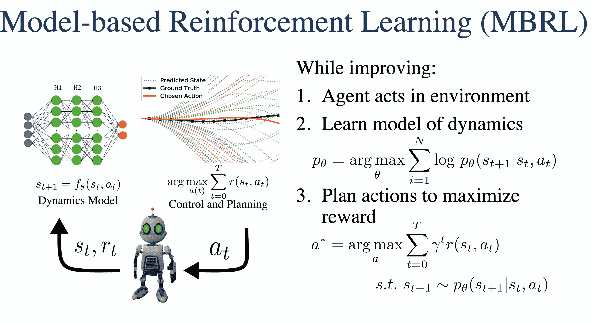
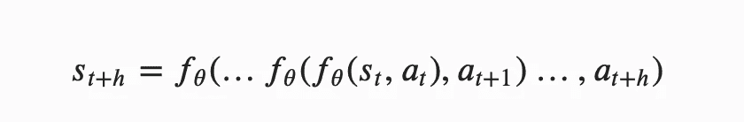
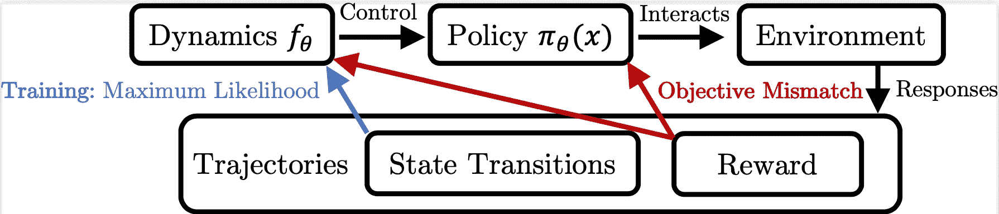
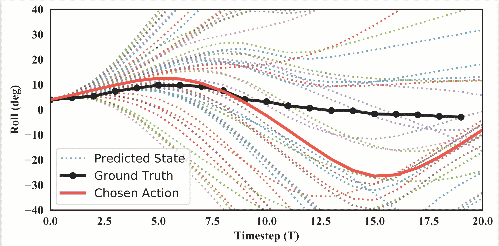
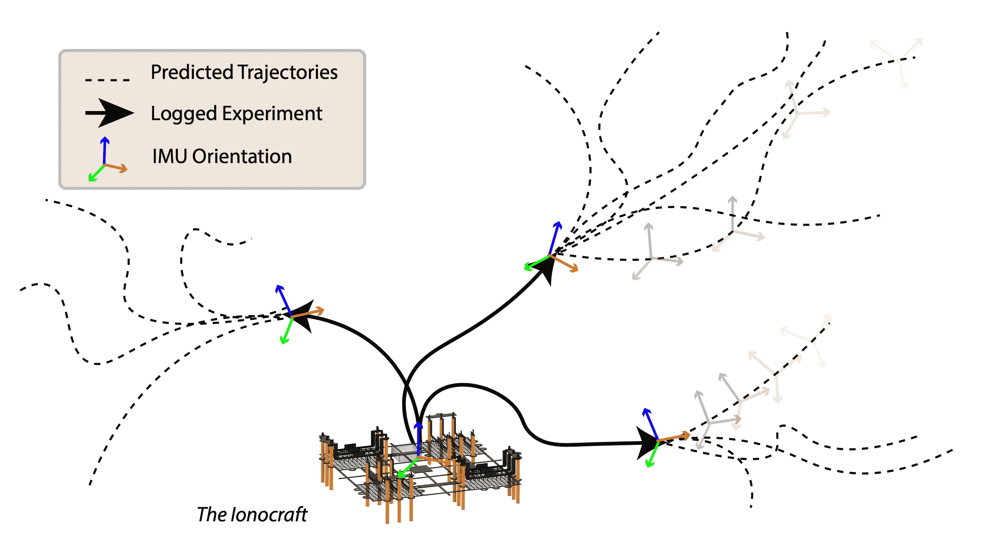
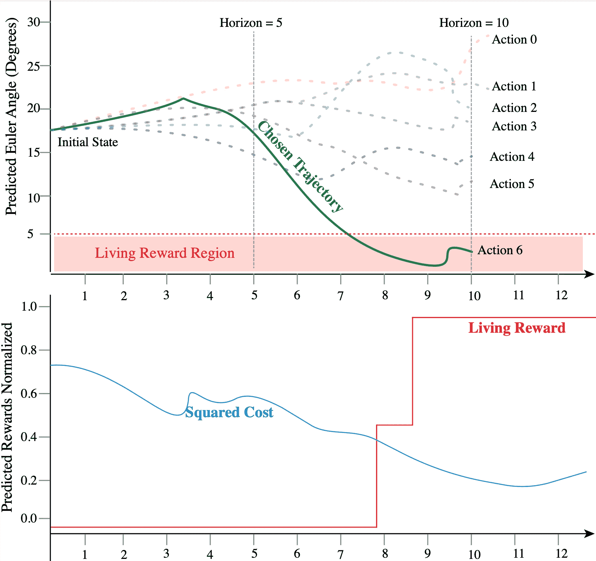
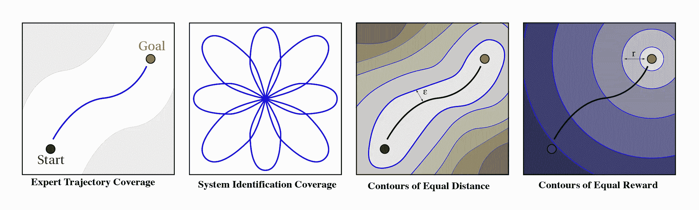
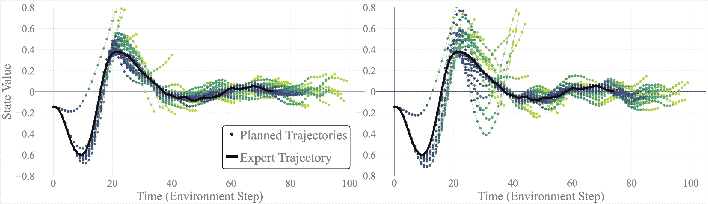

# 调试基于深度模型的强化学习系统

> 原文：<https://towardsdatascience.com/debugging-deep-model-based-reinforcement-learning-systems-66b476cb565e?source=collection_archive---------39----------------------->

## 从一个年轻领域的博士学到的经验。

我看到了一个[例子](https://andyljones.com/posts/rl-debugging.html)关于无模型 RL 的调试课程，觉得有必要为 MBRL 重复一遍。最终，MBRL 要年轻得多，也不那么普遍，所以如果我想让它继续发展，我需要在你们所有人身上投入时间。

作为例证，考虑这两个 SOTA 代码库:

*   [TD3](https://github.com/sfujim/TD3) :双延迟深度确定性政策梯度。阅读代码:😀。
*   [PETS](https://github.com/kchua/handful-of-trials) :轨迹采样的概率集成。阅读代码:🤪。

单从标题来看，听起来它们在复杂性上可能是一样的，但是对于无模型算法，修改只需要几行代码。在 MBRL，需要建立全新的工程系统(或多或少)。PETS 代码有更多可移动的部分。本帖按以下格式设置:

1.  基于模型的 RL 概述，
2.  这些系统中需要修补的核心部分，
3.  可能出现的其他考虑事项(例如，当使用机器人时)，
4.  实用提示:快速改变或运行的东西，以获得巨大的潜在改善
5.  结论。

我们去树林里！这是我在实现基于模型的 RL 算法和应用时所学到和坚持的东西的大脑日志。

要查看实用技巧列表，请向下滚动！。

## MBRL:概述

基于模型的强化学习(MBRL)是一种迭代框架，用于在部分理解的环境中解决任务。有一个代理反复尝试解决一个问题，积累状态和动作数据。有了这些数据，代理创建了一个结构化的学习工具——一个动力学模型——来推理世界。有了动力学模型，代理人通过预测未来来决定如何行动。通过这些动作，代理收集更多的数据，改进所述模型，并且有希望改进未来的动作。

模型预测控制(MPC)是 MBRL 许多(但肯定不是全部)最新进展的核心框架。MPC 可以是最优的，它是一个控制框架，用于在选择动作时使用结构化动态理解来解决优化问题。其中一个重要的组成部分是预测未来**的目标**，并以后退的方式做出决定。不过，在 MBRL，这种长期规划是平衡的，因为人们知道，随着预测范围的扩大，模型会呈指数级发散。我讨论的许多调试工具都是从控制的长期规划的角度出发的，并且可以被调整以更好地表达使用值函数和无模型控制的方法。

这篇文章旨在避开任何具体的数字问题，这些问题是某种深度学习中的研究问题，倾向于讨论系统中容易导致问题的权衡和奇怪部分(即使我们不知道为什么)！

来源，作者研究。

## 我的偏见

对于机器人技术，我当然更倾向于深度 MBRL。在未来，我看到 MBRL 和其他类型的 RL 被用于许多应用中，其中大部分将是数字的。我对 CNNs 计算机视觉/递归模型没什么经验，所以我的建议非常侧重于单步动态模型。你可以在我的[研究页面](https://www.natolambert.com/research)上看到我的出版物和更明显的偏见。

## 核心修补

任何 RL 系统主要由修补者的动机决定。基于模型的方法和它们的无模型兄弟之间的核心区别是模型的*增加*。试图在一个迭代的、数据驱动的系统[中总结一个动力学模型的所有感兴趣的属性是压倒性的](https://openreview.net/forum?id=p5uylG94S68)，并且是需要的。我认为建模问题主要是数据问题和建模问题。这两者之间的界限很快就模糊了。

## 动力学模型参数化

如何组织(和收集)数据至关重要。

*   **模型类型**:最近深度神经网络引起了人们的狂热(不可否认，这种炒作令人不寒而栗)，但还有很多其他模型可以考虑。由于对小型图形单元的投资，神经网络模型变得更容易使用(特别是当考虑在线控制时)，例如[杰特森的](https://developer.nvidia.com/buy-jetson)。
*   *线性模型*(例如状态空间系统的最小二乘法，类似于[和](https://www.sciencedirect.com/science/article/pii/S089396591300075X))适用于基本系统。这不完全是最小二乘法，但这是 Levine 教授早期的一篇论文[使用了一个线性动力学模型。](https://arxiv.org/pdf/1509.06841.pdf)
*   *高斯过程*在你不打算在线计划，有< 8 维状态-行动空间，或者喜欢结构化不确定性估计的时候是不错的。缓慢的规划来自于需要对用于预测的训练点数的立方矩阵求逆。我认为，如果 NNs 不存在，GPs 将遥遥领先的领先候选人(皮尔科使用他们)。在这种情况下，GPs 受到数据集过滤问题的严重限制，以保持快速的预测时间。尽管如此，我还是会考虑 GPs 的离线应用。此外，像[贝叶斯优化](https://en.wikipedia.org/wiki/Bayesian_optimization)这样的工具对许多 MBRL 工作来说是有用的伴侣(它本身就是 MBRL 的变体)。
*   *循环模型*听起来很棒，因为它的目标是预测长期的未来，但是……以我的经验来看，LSTMs 不太适合，因为它们也很难训练，并且往往需要比控制问题提供的更多的数据(我怀疑这种观点在未来几年可能会改变)。有两个关键的例子可以说明 LSTMs 在 MBRL 的应用，一个比另一个重要(目前)。[梦想家](https://arxiv.org/pdf/1912.01603.pdf)使用 LSTM 作为潜在空间的循环模型，与莱文教授[的合作者将搭配](https://openreview.net/forum?id=ku4sJKvnbwV)应用于类似的潜在空间。在本文中，我们试图为状态预测建立 LSTMs 基线，但我认为我们需要更多的专业知识来使它工作(如果你有这方面的技能，请联系我们！)
*   使用**增量状态**参数化:预测状态变化而非真实状态往往表现更好，对控制更有用。我怀疑它是否也适用于非常不稳定的(动态地，想想特征值)系统。它被表述为:

*   **型号能力**在大多数任务中还没有被推到极限。大多数论文使用规范值(2 个隐藏层，256 个节点，5 个系综模型)，每当我调整它时，我看到的影响很小。我的直觉是，模型容量往往比需要的要高得多，因此大多数模型训练都在与有噪声的数据进行过度拟合。

## 动力学模型监督学习

当模型的核心监督学习被打破时，如在错误中不与我们的救世主亚当收敛，在基础水平上看到许多关于这一点的教程，否则:

*   **模型初始化**可能很重要。由于其在控制中的核心用途，模型稍有偏差就会导致性能停滞在 0。如果可以的话，重复使用其他人的模型初始化(事实证明，人们通常使用[剪辑的正态分布](https://www.tensorflow.org/api_docs/python/tf/random/truncated_normal)，这还没有在 PyTorch 中出现)。
*   **怒点**:有的型号用**增量训练**，有的不用。在 PETS 的论文中，Half Cheetah 的结果是，它在每次试验后都使用与普通再训练略有不同的模型训练。在这种情况下，模型参数不会被重新初始化，而是优化器会从之前试验中使用的模型参数开始采取更多的梯度步骤。这导致了较慢的模型改变，但是从理论上来说这是不合理的。
*   实用提示:**状态-动作数据中的异常值**会破坏正常化(最小值/最大值和单位正常值取决于分布)。例如，如果你所有的状态变化都被归一化为 0，那么模型的精确度将会非常高，但是当你展开计划时，轨迹将会大相径庭。
*   需要**状态/动作预处理**(例如角度到角度的正弦和余弦):在有角度的系统中规划时，如果你期望角度环绕(例如一个一直左转的航向会从 0 到 2pi 增长到 4pi)，这里的状态需要在标记之前进行处理，使等价的角度匹配。
*   集合使得监督学习变得有些棘手。例如，我与一个重新实现 MBPO 的人进行了一次交谈，性能的差异来自于是否在训练之前选择和设置了每个集合的交叉验证指数(对所有时期都保持)或者在每个时期重新采样(工作得更好一点)。深入这个层次的监督学习问题只是表明控制器对模型有多敏感— *这些几乎不会改变模型*！

## 预测多个步骤

当通过累积小误差作为动态模型的输入来规划未来的多个步骤时，复合误差出现。复合预测通道的公式为:

*   **常见 bug** :用户在传递回模型之前没有重新规范化预测状态。在这种情况下，错误会很快爆发。如果你想可视化轨迹/使用它们进行控制(在整个轨迹都很重要的情况下)，预测通常发生在输入- >标准化输入- >标准化输出- >输出- >标准化输入…
*   上面我提到了角度的状态包装器，将它们整合到预测轨迹中可以学习状态/动作包装器的问题。通常，这是模型中的尺寸不匹配(角度变成角度的正弦和余弦)，但实现起来可能会很痛苦。

## 从建模到规划

规划通常采用有限时域模型预测控制器的一般形式:

*   预测**范围太短**:如果没有足够长的范围，你甚至无法实现某些奖励功能——当这种情况发生时，所有候选行为都等同于 0 奖励(简化为随机策略)！例如，当手臂到达某个ε气泡时，在像操纵这样的任务中，由于模型视野较短，没有一个动作序列可以到达那里。
*   预测**眼界太长**:最好的例子是 MBPO，好玩的例子是宠物。他们有一个阑尾(轻微地)扫过地平线
*   规划的范围也没有得到很好的理解(DeepMind 在这个主题上发表了一整篇[论文](https://arxiv.org/pdf/2011.04021.pdf)
*   **理论限制**:没有信号将测量的奖励与动态模型或优化器联系起来。这就是我们所说的 [*目标不匹配*](https://arxiv.org/abs/2002.04523) ，设计算法来解决这个问题可能会非常有效。
*   **酷选项**:如果使用某种概率模型，你可以在预测范围的每一步绘制模型不确定性。传统上(理论上不知道为什么)，当模型超出其训练集时，方差会发散到较大的值或崩溃到 0。这可以产生有趣的动态水平调整，但很难设计。

## 控制优化

**挂钟时间**是个大问题。对于未来的所有规划，MBRL 算法需要很长时间来运行。例如，在 Half Cheetah 上重现 PETS 实验需要在 GPU 上运行 3 天。和我一起工作的一名工程师实际上开始了实验，然后利用假期时间去等待它们。将会有渐进的进展来改进这一点，但也可能有人可以在这个 [Jax 实现](https://github.com/ikostrikov/jax-rl)的基础上进行构建，该实现应该为一些 RL 算法提供 2-4 倍的时间改进？

*   **仔细实验**:由于上述时间限制，MBRL 不是一个可以随意进行大量实验的研究地区。跟踪你正在计划的和你正在运行的。使用[九头蛇](https://hydra.cc)来管理你的实验。
*   奇怪的共识:我从大多数使用基于样本的计划的 MBRL 研究人员那里得到的印象是，控制器通过选择稍微不正确的行动来工作，随着时间的推移，这些行动最终会成为一个好的但不完美的计划。要明白，如果你放大任何随机种子，当前的算法可能会输出奇怪的动作序列。
*   **艺术**:基于样本的 MPC 平均工作意味着你想要一个非常精确的模型，具有你所拥有的最佳轨迹(专家)，而且在附近区域具有*鲁棒性*。

## 调整奖励函数

MBRL 似乎与最优控制方法联系得更紧密一些，一些论文对回报的表述稍有不同(当你不使用标准基线时，有更多的空间来调整它们)！

*   **实用趋势**:数据分布(覆盖率)与性能成正比。如果您有一个 MBRL 任务可以解决的环境，您可以通过获取更多的标记数据来提高相关任务的性能(考虑将目标状态从 0 度移动到 15 度)，但您也可以通过在数据集中包含更多的随机转换来限制峰值性能。
*   如果你怀疑你的奖励函数很奇怪，考虑先**重新参数化，再**调优。例如，一个 cartpole 任务传统上由于处于广泛的状态而获得生活奖励(每当试验没有完成时奖励是 1)，但是你可以通过增加远离原点的二次成本来改变行为，使其在控制理论意义上是最优的。
*   **标量倍数奖励吸调**:调姿态权重和轨迹权重并不容易。我希望等级 RL 能承担一些这方面的重量。
*   **二次成本上的平滑有界报酬**。例如，取一个角度的余弦是一个很好的有界函数，它在 0 附近给出一个更高的值。它比平方的负值下降得更好。

## 探测

天哪，在 MBRL，探索发生在模型和规划者之间的界面上，这使得设计变得非常棘手。我在这里写了一篇关于为什么这很奇怪的短文。最终，在 MBRL 工作了 3 年几乎全职，探索是最不明确的前进道路。

迄今为止，探索似乎是偶然发生的，将更明确的探索机制集成到规划中(优先考虑动作分布)可能会以错误的模型训练分布为代价。当然，我希望被证明是错误的，或者听到事情没有我想象的那么复杂。

来源，作者研究。

## 其他考虑

有很多不在*深度 RL* 范围内的事情会影响你的系统。这是你从试图从具身代理人的角度推进强化学习中学到的。这些实际考虑可能对你的项目产生从 0%到完全破坏应用程序的影响。当人们开始尝试将 Deep RL 产品化的时候，这些将会更加主流。

## 系统属性

有些系统真的不应该被建模。Deep RL 对系统特征值、噪声、更新速率之类的东西讨论的不够。最后，从流行的[线性估值器](https://en.wikipedia.org/wiki/Kalman_filter)中吸取教训，知道当你在没有测量的情况下进一步走向未来时，模型误差的下限增长得非常快。

## 对超参数的敏感性

我有幸参与撰写的最近一篇论文改变了我对 MBRL 算法的潜力和对使用它们的**参数**的敏感性的看法。最终，核心思想是 MBRL 的最佳参数可以基于试验次数而改变(例如，随着代理获得更多数据，模型变得更准确，因此预测范围可以更长)。这是在标准深度学习和强化学习参数敏感性之上的。

一般来说，我会说，如果你在一个支持良好的实验室，请使用自动机器学习(AutoML)库，但如果你不是，请在一个竞争较少的环境中工作(例如，你有一个真正的机器人，而不是 Mujoco)。这里可以了解更多[。](https://www.natolambert.com/papers/2021-hyperparams-mbrl)

## 机器人问题

我是一个(可能不可取的)特例，我第一次部署 MBRL 系统是在现实世界中。不要这样做，但是通过在真实世界中使用 MBRL，你肯定可以学到一些在模拟中应用的东西。

*   如果你在控制中寻找一个稳定的政策，确保你和一个随机的政策相比较。在研究[这篇论文](https://www.natolambert.com/papers/2019-low-level-mbrl)为四旋翼飞行器做姿态控制的时候，我们学到了很多关于飞行的流体动力学知识。长话短说:当四旋翼飞行器接近地面时，其推进力反弹的上升气流会产生一个小枕头，机器人将在这里有效地拥有更稳定的极点(空气既可以防止它坐在地面上，又可以使 0，0 处的俯仰-滚动不稳定极点几乎被动稳定)。
*   如果你的奖励函数很简单，纠正剥削行为是不可能的。例如，在同一篇论文中，我提出了四旋翼飞行器实现高推力是一种更稳定模式的问题(或特征)。在这种飞行模式下，它受到房间高度的限制，当微型四旋翼飞行器向地球坠落时，我抓住了它，从而挽救了进展。高风险、高乐趣的研究让我在这里起步。更深入的问题是，模型或规划者的哪一部分(本例随机抽样！)使得行为只在部分时间发生。
*   **通过计算问题排除应用**。因为 MBRL 与 MPC 的系统本质，实际上把它放到机器人身上真的很难。它归结为这样的决定:你是在船上运行 MPC 还是通过无线电/电线将状态发送到另一台计算机来计算动作。非机载运行控制器使得同步、延迟和丢失(通信，而不是 NNs)更加重要。

    目前还没有很好的围绕真实世界系统来设计数据的深度 RL 库。在四旋翼飞行器项目中，我飞行了 10 次数据，用 usb 驱动器传输，传输回来，并进行了更多的实验。如果你看看那里的学习曲线，得到它是一整天的数据收集、训练和希望。因此，你可以推断，完成那篇论文显然花了很长时间。我的一个希望是，现代开源项目开始考虑如何将他们的算法大规模用于真实的机器人，或者这可能更像是一个创业问题(产品)。
*   改变你的**控制频率**:如果你采样状态的频率降低，你的测量中的噪声对你标记的训练点的影响就会减少，这有助于你的模型的准确性。较低的频率也意味着在给定一定数量的步骤的情况下，对未来进行更长远的规划。但是，对于许多应用程序来说，提高控制频率可以让行为更快地纠正不良行为。

我称之为候选行动的“瀑布图”。关于预测奖励的颜色编码对于观察奖励空间相对于给定动作维度是否平滑可能是有趣的。这是四旋翼飞行器真实世界的姿态控制任务。来源，作者研究。

## 实用技巧

这里有一个针对这个难题各个部分的实用技巧列表。

## 动力学建模

*   将**历史**附加到模型输入(如果动态的时间常数比控制频率慢得多，动作可能需要两步才能进行。通过附加一些过去的状态和动作来增加模型的理解)。
*   **环境变量**可以作为输入传递到模型中，而不是作为输出进行预测(例如，电池电压，但它们[可能会误导](https://firebasestorage.googleapis.com/v0/b/firescript-577a2.appspot.com/o/imgs%2Fapp%2Fnatolambert%2F1uKR9oAgb2.png?alt=media&token=f21f91ea-1bc7-47af-8259-dd8be42b8efa)——在这种情况下，改变电机电压的负载会使测得的电池电荷发生很大变化，这对理解动力学没有帮助)。
*   看看你的状态空间中的**排序的一步预测**(这里的例子)。系统边缘的点看起来误差更大，但是它们不应该膨胀到无穷大。
*   可视化多个层位的许多预测种子和中值**预测误差**。预测中的坏异常值可能会对您的性能造成不相称的损害。

## 控制和规划

*   将所有的**候选轨迹**在几个维度上可视化——它们应该看起来非常多样化。
*   以不同的重新规划频率，可视化规划轨迹与地面实况。这将是一系列缓慢偏离的计划，它可以定期显示计划偏离的轨迹中最具挑战性的部分。

    观察预测轨迹(选择动作后)与最终轨迹的匹配程度是非常好的，并且有助于考虑您的优化器是否做了任何有用的事情。这里较低的重新计划频率实际上只是为了降低你的可视化的混乱程度。
*   在 **real dynamics** 上检查你的经纪人的表现[艾伯特·托马斯](https://twitter.com/albertcthomas)让我想起了这个。这暂时解决了动力学建模问题，但是很难实现。
*   不要主动设计一个**探索**机制，而是通过观察你的数据集来想象它是如何工作的。
*   写得不够的东西:**成本=-奖励**。您可以将任何成本函数更改为奖励。

## 可视化 MBRL 系统

重要的是要想象 MBRL 正在做的一些核心轴:规划，数据积累，模拟，等等。以下是我做的一些形象化图片，帮助我了解正在发生的事情。

动力学模型允许你模拟未来的许多扰动。随着我们得到更好的模型，这种梦会更有用。Ionocraft 是我的实验室里的一个新颖的机器人，我们一直在尝试学习飞行。可以说，对于这个单独的项目来说，组装有点太难了。来源，作者研究。

如上所述，不同的候选轨迹在不同的奖励函数下看起来确实不同。在这种情况下,“生活奖励”是当代理人处于目标的ε泡中时的奖励。这就像默认的弹弓奖励，但可以扩展..来源，作者研究。

基于模型的 RL 最终获得接近专家轨迹的数据，而不是覆盖整个状态空间的数据。理解该数据集在不同空间中的样子以及它与最优控制的假设相比如何是非常重要的。来源，作者研究。

## 代码示例

请尽快回来查看我正在从事的一个大型开源 MBRL 项目。除此之外，我还制作了一些重量更轻的模拟器。很多东西都是在最初的 PETS 实现上构建的，但是它在 O.G. TensorFlow 中。

*   一个好的动力学模型可以在[这里](https://github.com/natolambert/continuousprediction/blob/master/dynamics_model.py)找到。为什么有用？它被设置为处理模型公式变化(例如，真实状态与增量状态预测)、标准化等。独立于模型类型。此外，任何高级机器学习项目都需要从配置文件动态制作神经网络。
*   一个由许多库、绘图代码、环境、相关优化器和模型模拟组成的更加混乱的库，在这里是(诚实地使用，风险自负，但浏览寻找灵感可能会有用)。

## 结论

我对基于模型的方法的未来非常乐观。出于某种程度上的研究议程保护，我不会把我想做的所有事情的运行列表放在网上(我没有人来解决所有的问题！)，但我非常乐于与新人合作，并讨论这些挑战。

最终，当你放大 MBRL 难题的任何一块时，很明显每个子机制都是相对次优的。单独推动每一件作品都需要多年的研究。

我希望这些碎片开始更好地结合在一起，我们可能会得到一种共鸣，MBRL 开启了人们希望的一切:

1.  通过更好地理解数据进行归纳
2.  具有精确模型的更优控制器的可解释性
3.  由所有碎片聚集而成的表演

查看我在 MBRL 公开的所有信息的一个好方法是在我的网站上搜索。

## 研究进展

我的朋友 [Scott Fujimoto](https://scholar.google.com/citations?user=1Nk3WZoAAAAJ&hl=en) 很好地总结了基于模型的 RL 的状态:它对人类来说非常直观(我们在头脑中计划事情！)，但实际上试图实现它是相当可怕的。我希望在这方面有所进展。

在《MBRL 的轨迹》中，你应该知道一些最近的论文:

*   [皮尔科](https://icml.cc/2011/papers/323_icmlpaper.pdf) (2011):基于梯度的政策，通过一个动态模型。
*   [MPPI](https://homes.cs.washington.edu/~bboots/files/InformationTheoreticMPC.pdf) (2017):一种替代的模型预测控制(MPC)架构。
*   [PETS](https://arxiv.org/pdf/1805.12114.pdf) (2018) & [府绸](https://arxiv.org/pdf/1906.08649.pdf) (2019):基于样本的 MPC，编织轨迹在一起。
*   [梦想家](https://arxiv.org/pdf/1912.01603.pdf)(2020)&[dream erv 2](https://arxiv.org/pdf/2010.02193.pdf)(2021):视觉 MBRL 变好了！
*   [MBPO](https://arxiv.org/pdf/1906.08253.pdf) (2019):学习模型上的无模型 RL (SAC)。
*   [客观不匹配](https://arxiv.org/pdf/2002.04523.pdf) (2020):我们开始理解为什么 MBRL 是怪异的(理论上和数值测量上)。

## 建议

尽可能从其他人的实现开始工作，或者从他们的代码中分支出来。我经历过并帮助过一些 MBRL 代码的开源尝试，这些困难通常是你无法预料的。当您必须同时调试模型和计划时，这些棘手的问题变得更加复杂——帮自己一个忙，从您知道有效的那一半开始。

这是一个年轻的领域:如果你认为你正在做某件事，那就试试吧。

将模型中的计划和行动可视化(无模型做不到的事情，利用它)！因为行动计划对控制来说非常重要，所以学会用什么看起来对什么看起来长对你有很大帮助。下面是两个平均精度相同的动力学模型的例子，但其中一个有利于噪声控制(摘自我的论文)。我也认为在[开始制造的工具对 MBRL 来说很有吸引力。](https://openreview.net/forum?id=ZN3s7fN-bo)

来源，作者研究。

## 承认

感谢 Luis Pineda 在构建令人兴奋的东西时对调试 MBRL 进行了许多有益的讨论。在这里学到的很多东西是和罗伯特·卡兰德拉一起学的，还有一些是和丹尼尔·德鲁和奥姆里·丫蛋一起学的。感谢尤金·维尼斯基对我初稿的反馈。

如果你觉得有必要，我为这一个做了一个引用。

> @ article { lambert2021debugging，
> 作者= {Lambert，Nathan}，
> title = {调试基于模型的强化学习系统}，
> year = {2021}，
> how published = { URL { http://NATO Lambert . com/writing/Debugging-mbrl } }，
> }

感谢阅读！如果你有问题，请在推特上联系我。