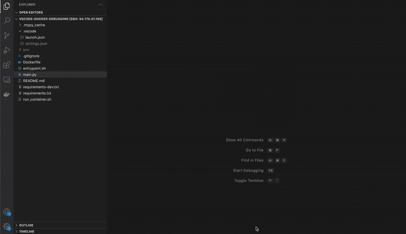

# Python 中 Dockerized ML 应用程序的调试

> 原文：<https://towardsdatascience.com/debugging-for-dockerized-ml-applications-in-python-2f7dec30573d?source=collection_archive---------19----------------------->

## 使用 VScode 和 debugpy 使调试变得轻而易举

在过去的几年里，Docker 在 ML 应用程序中变得无处不在。它可以让使用不同硬件的工程师轻松协作，并简化从个人笔记本电脑上的原型开发到生产中的计算集群的过渡。另一方面，它为工程师在开发和维护生产模型时带来了额外的复杂性。

在我的专业工作中，我发现调试是由于这种额外的复杂性而变得更加困难的事情之一。在这篇文章中，我将概述我当前使用 VSCode 和 debugpy 的设置，当应用于模型训练应用程序时，它们极大地简化了这个过程。

# 我们为什么需要这个？

调试代码时，我们希望能够尽可能准确地检查运行时的环境。任何偏离都会导致修复程序在运行时环境中不起作用。

在掌握 Docker 的同时，我的调试过程通常需要围绕我希望在本地开发环境中检查的 Python 脚本重新创建支架，然后直接调试该脚本。在包含 bash 脚本、多个入口点和使用环境变量的模型训练应用程序中，这会迅速增加大量开发开销。随着这种复杂性的增加，出现错误的可能性也增加了，从而使整个过程变得缓慢和令人沮丧。

那么我们如何避免这种情况呢？我们需要一个可以与 Docker 交互的调试系统，让我们的代码按照设计的那样运行！

# 解决方案

最终对我来说最有效的是一个调试器，它可以连接到运行模型训练应用程序的 Docker 容器，并直接检查给定 Python 脚本的环境。

这就是 [debugpy](https://github.com/microsoft/debugpy) 的用武之地！

这个包以前被称为 ptvsd，是由微软开发的，专门用于 Python 的 VSCode。它实现了您期望的所有常见调试工具，并允许连接到远程环境，比如 Docker 容器，甚至通过 SSH 连接到远程机器。

顺便说一下，debugpy 实现了调试适配器协议(DAP)，这是开发工具与调试器通信的标准化方式。

在 Docker 容器中使用 debugpy 非常简单，需要 3 个不同的步骤。在演示整个过程之前，我将依次深入其中的每一个。

1.  在 Python 中配置 debugpy
2.  配置与 Docker 容器的连接
3.  设置断点

# 在 Python 中配置 debugpy

在您要调试的脚本中，下面的代码片段应该添加在任何其他代码之前。

```
import debugpy

debugpy.listen(("0.0.0.0", 5678))
print("Waiting for client to attach...")
debugpy.wait_for_client()
```

这将设置 debugpy 在端口 5678 上监听客户端连接，并且还将暂停执行，直到客户端通过该端口连接。

# 配置与 Docker 容器的连接

现在我们已经配置了 Python 脚本，我们需要确保当它在 Docker 容器中运行时，VSCode 调试器客户端可以连接到 debugpy。

首先，当您运行 Docker 容器时，debugpy 监听的端口必须映射到一个本地端口

```
docker run \ 
   -p 5678:5678 \  # map container port to local port
   temp-container
```

其次，我们需要创建一个`launch.json`文件来配置本地 VSCode 调试客户端将如何运行。这个最小的例子告诉调试器连接到端口`5678`，当我们运行容器时，这个端口将被映射到相同编号的 Docker 端口。

```
{
   "version":"0.2.0",
   "configurations":[
      {
         "name":"Python: Docker Attach",
         "type":"python",
         "request":"attach",
         "connect":{
            "host":"localhost",
            "port":5678
         },
         "pathMappings":[
            {
               "localRoot":"${workspaceFolder}",
               "remoteRoot":"."
            }
         ]
      }
   ]
}
```

# 设置断点

当我第一次尝试这样做时，我感到很惊讶，当你在 Python 脚本的本地版本上通过 VSCode UI 设置断点时，这将对应于在你的 Docker 容器内运行的复制脚本！来自 VSCode 的纯魔法。

此外，还可以使用`debugpy.breakpoint()`通过 debugpy API 显式设置断点。这样做的另一个好处是，如果您排除了步骤(1)中提到的 debugpy 配置，这些调用将被忽略，这提供了一种临时删除调试的快速方法。

# 正在调试

你应该可以走了！下面的 GIF 展示了一个标准的调试方法

*   在用户界面中添加断点
*   重新构建并运行 Docker 容器
*   连接调试器



下面是这个例子的完整代码。调试愉快！😃

[](https://github.com/sam-watts/vscode-docker-debugging) [## GitHub-Sam-watts/vs code-docker-debugging:一个用于调试长时间运行的、dockerized…

### 用 vscode - GitHub 调试 python 中长时间运行的 dockerized 程序的模板…

github.com](https://github.com/sam-watts/vscode-docker-debugging) 

# 链接

*   debugpy Github:[https://github.com/microsoft/debugpy](https://github.com/microsoft/debugpy)
*   码头工人运行参考:[https://docs.docker.com/engine/reference/run/](https://docs.docker.com/engine/reference/run/)