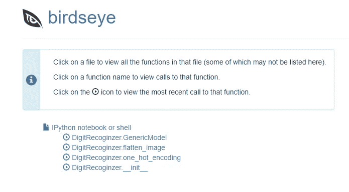
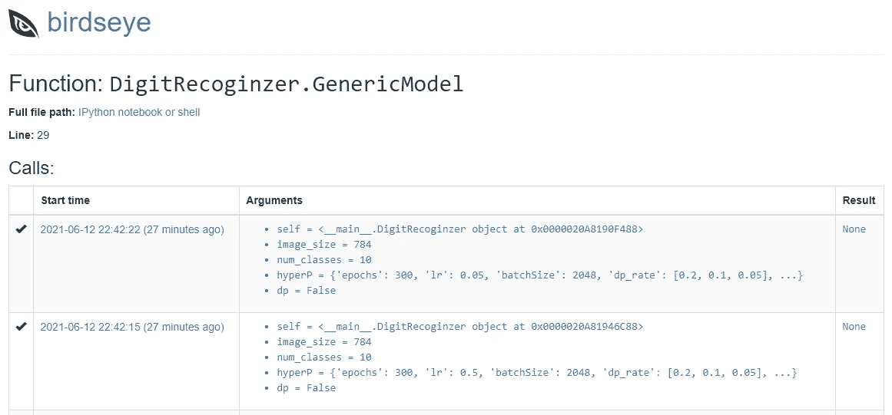

# 可视化调试 Python 代码

> 原文：<https://towardsdatascience.com/debugging-python-code-visually-912790f60b37?source=collection_archive---------26----------------------->

## 使用 Birdseye 调试 Python 代码


照片由[西格蒙德](https://unsplash.com/@sigmund?utm_source=medium&utm_medium=referral)在 [Unsplash](https://unsplash.com?utm_source=medium&utm_medium=referral) 上拍摄

您是使用 print()命令调试 python 代码或函数的程序员之一吗？如果答案是肯定的，那么你并不孤单，大多数使用 Jupyter notebook 的 python 程序员都是这样调试他们的代码的。这没有什么错，但是这不是我们调试代码的一种便捷方式。

Birdseye 是一个开源的 python 库，用于调试 python 代码。它在运行时记录特定函数中表达式的值，一旦函数被执行，您可以可视化这些值，并在出现问题时进行调试。

在本文中，我们将看到 Birdseye 如何用于 python 代码调试。

让我们开始吧…

# 安装所需的库

像任何其他 python 库一样，我们将使用 pip 安装来安装 Birdseye。下面给出的命令将执行安装。

```
pip install --user birdseye
```

# 导入所需的库

接下来，我们将导入将在本文中使用的所有必需的库。

```
from birdseye import eye
```

为了看到 Birdseye 的运行，我们需要一些带函数的 python 代码，以便我们可以调试它。你可以使用任何包含函数的代码。我在用我自己的代码创建一个使用不同功能的神经网络。要激活鸟眼，你只需要在我们想要监控的每个人前面加上“@eye”就可以了。

```
from keras.datasets import mnist
import matplotlib.pyplot as plt
import numpy as np
import keras
from keras.layers import Dense, Dropout 
from keras.models import Sequential 
from birdseye import eye
image_size = 28*28
num_classes = 10class DigitRecoginzer:
    [@eye](http://twitter.com/eye)
    def __init__(self):
        # Setup train and test splits
        (self.x_train, self.y_train), (self.x_test, self.y_test) = mnist.load_data()
        self.x_train, self.x_test = self.x_train/255, self.x_test/255
        #print("Training label shape: ", self.y_train.shape) 
        #print("Training Data Shape", self.x_train.shape)
    [@eye](http://twitter.com/eye)
    def get_data(self):
        return self.x_train, self.y_train, self.x_test, self.y_test

    # Convert to "one-hot" vectors using the to_categorical function
    [@eye](http://twitter.com/eye)
    def one_hot_encoding(self):
        #print("Data before one-hot encoding", self.y_train[:5])
        num_classes = 10
        self.y_train = keras.utils.to_categorical(self.y_train, num_classes)
        self.y_test = keras.utils.to_categorical(self.y_test, num_classes)
        #print("Data after one-hot encoding\n", self.y_train[:5])# Flatten the images
    [@eye](http://twitter.com/eye)
    def flatten_image(self):
        image_vector_size = 28*28
        self.x_train = self.x_train.reshape(self.x_train.shape[0], image_vector_size)
        self.x_test = self.x_test.reshape(self.x_test.shape[0], image_vector_size)

    [@eye](http://twitter.com/eye)
    def GenericModel (self, image_size, num_classes, hyperP, dp=False):
        try:
            self.model = Sequential()
            numHiddenLayers = hyperP["NumHiddenLayers"]
            act = hyperP[1][1]
            init = hyperP[1][2]
            self.model.add(Dense(hyperP[1][0], activation=hyperP[1][1], input_shape=(image_size,),kernel_initializer= init))#kernel_regularizer=l22
            for i in range(2, numHiddenLayers+1):
                l = hyperP[i]
                init = l[2]
                self.model.add(Dense(l[0], activation=l[1], kernel_initializer=init))   
                if(dp):
                    self.model.add(Dropout(hyperP['dp_rate'][i-2]))
            self.model.add(Dense(num_classes, activation='softmax'))opt =hyperP["opt"](hyperP["lr"])
            self.model.compile(optimizer="adam", loss='categorical_crossentropy', metrics=['accuracy'])
            self.model.summary()
        except Exception as ke:
            print ("Key is not defined", ke)
            self.model = None
    [@eye](http://twitter.com/eye)
    def train_model(self, epoch, batch_size):
        self.history = self.model.fit(self.x_train, self.y_train, batch_size=batch_size, epochs=epoch, verbose=2, validation_split=0.1)
        self.model.save('model.h5')
    [@eye](http://twitter.com/eye)    
    def get_accuracy(self):
        loss, accuracy  = self.model.evaluate(self.x_test, self.y_test, verbose=False)
        loss_train, accuracy_train = self.model.evaluate(self.x_train, self.y_train, verbose=False)
        print(f'Train loss: {loss_train:.3}', f'Train accuracy: {accuracy_train:.3}')
        print(f'Test loss: {loss:.3}',f'Test accuracy: {accuracy:.3}')
        return accuracy_train
    [@eye](http://twitter.com/eye)            
    def predict(self, img):
        result = np.around(self.model.predict(img)[0])
        max1 = max(result)
        return np.where(result == max1)[0][0] lr =[0.1, 0.01, 1, 10, 0.5, 0.05]
objs = []
for i in range(len(lr)):
    HyperParam1 = {
        #Training Level Hyper Params
        "epochs": 300,
        "lr": lr[i],
        "batchSize": 2048,
        "dp_rate": [0.2, 0.1, 0.05],
        "opt": keras.optimizers.Adam,
        #Network Level HyperParam
        "NumHiddenLayers": 2,
        1:[64, "sigmoid", keras.initializers.glorot_normal(seed=20)],
        2:[32, "relu", keras.initializers.glorot_normal(seed=20)],
    }
    objs.append(DigitRecoginzer())
    objs[i].one_hot_encoding()
    objs[i].flatten_image()
    objs[i].GenericModel(image_size, num_classes, HyperParam1, dp=False)
```

现在我们将使用下面给出的命令运行 Birdseye Flask 应用程序。

```
python -m birdseye
```



来源:作者

这是 Birdseye 应用程序的主页，在这里您可以看到所有需要监控的函数名。我们可以通过点击这些函数来仔细查看它们的内部。



来源:作者

在这里，您可以可视化开始时间、函数的参数以及结果(如果有的话)。这就是如何使用 Birdseye 进行代码调试。继续尝试不同的功能，让我知道你在回复部分的意见。

本文是与[皮尤什·英加尔](https://medium.com/u/40808d551f5a?source=post_page-----912790f60b37--------------------------------)合作完成的。

# 在你走之前

***感谢*** *的阅读！如果你想与我取得联系，请随时通过 hmix13@gmail.com 联系我或我的* [***LinkedIn 个人资料***](http://www.linkedin.com/in/himanshusharmads) *。可以查看我的*[***Github***](https://github.com/hmix13)**简介针对不同的数据科学项目和包教程。还有，随意探索* [***我的简介***](https://medium.com/@hmix13) *，阅读我写过的与数据科学相关的不同文章。**