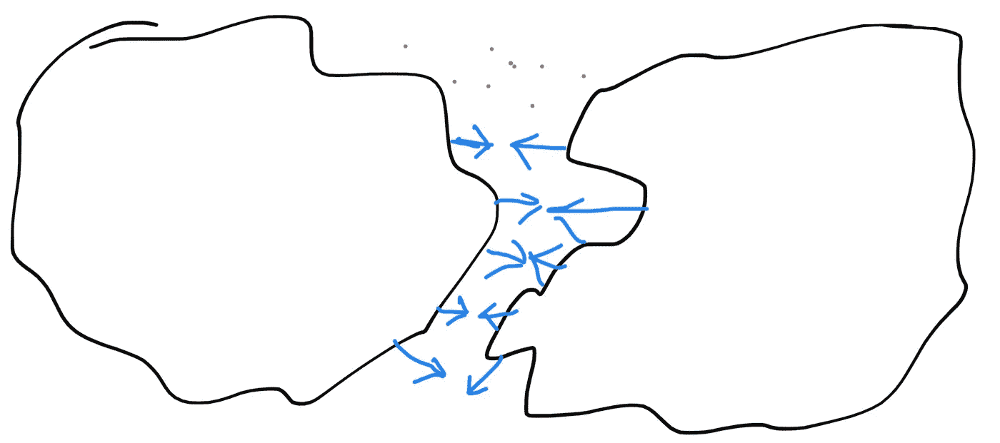
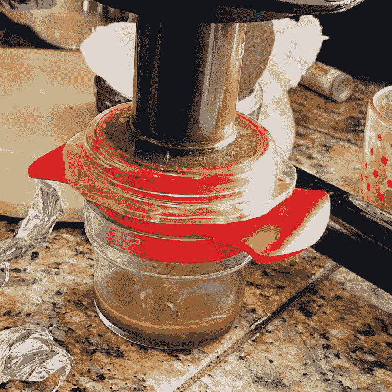

# 消除浓缩咖啡中的微粒迁移

> 原文：<https://towardsdatascience.com/debunking-fines-migration-in-espresso-989f486eef0e?source=collection_archive---------27----------------------->

## 咖啡数据科学

## 进一步的证据表明，微粒迁移并没有发生

意式浓缩咖啡中有一个理论，非常细小的颗粒(微粒)在一杯咖啡中迁移，可能会堵塞过滤器或进入杯中。但是，我不认为罚款会迁移，我想我也找到了原因。

咖啡渣的理想化场景，其中细颗粒在开放空间中迁移。所有图片由作者提供

在我之前用粉笔探索这个概念的实验中，我没有发现任何微粒迁移的证据。然而，我没有很好的解释为什么他们不迁移，但我没有观察到这种现象。

甚至在这个粉笔实验之前，我就有证据表明，基于[断奏](https://rmckeon.medium.com/story-collection-splash-page-e15025710347?source=your_stories_page-------------------------------------)浓缩咖啡镜头的存在，细微的迁移不会影响味道或过滤器。断续浓缩咖啡的底部有一层小于 400 微米的颗粒，通常是照片中一半的粉末。如果罚款曾经导致一个问题，断奏镜头应该最大化的问题，但它没有。

我的理论是，在浓缩咖啡的过程中，咖啡会膨胀，所以微粒不会迁移，因为通过咖啡球的所有路径都关闭了。此外，水通过咖啡的唯一途径是通过咖啡渣的内部。

咖啡渣膨胀并阻塞微粒

为了检验这个理论，我观察了一些咖啡渣来测量水加入到冰球中的体积，这应该表明咖啡渣膨胀了多少:

1.  从一个用过的冰球开始
2.  加了一点水
3.  混合它
4.  把它放进一个 Kompresso
5.  尽可能挤出多余的液体
6.  等待

1.帕克，2 分。加水，3。混合，4。放入 Kompresso，5。挤出多余的液体，6。等待

两天后，这个实验被霉菌打断了。困难的部分是咖啡渣没有太多的表面积来干燥。

然而，在这段时间内，有一个从 47.5 毫升到 46 毫升的体积变化，所以 3.2%的体积变化。

# 第二次测试

幸运的是，我同时运行了第二个测试。我用我的摩卡壶里用过的咖啡，把这些咖啡渣放进一个杯子里，用一个小捣棒轻轻地把它们捣成一定的形状。地面是湿的，但没有湿透。

一个星期后，它们变干了，咖啡变小了。

我拍了一些照片进行测量，我还收集了一些重量样本。然后我把咖啡捣实:

只是为了检查小气泡，我在咖啡上做了一些 WDT，并重新捣实。

这没起多大作用。所以我也试着用我的手指向下压，最后，音量降低了一点点。

# 数据分析

我用这些图像来测量体积。我应该注意到，精确的体积可能会有误差，但是这个实验实际上是为了找到一个咖啡在潮湿时膨胀的大概数字。

重量损失与体积损失不成比例，这意味着大量的水存在于颗粒内部。这并不特别令人惊讶，但确实很好验证。

# 移动式过滤器释放

我注意到，每当我在拍摄后移除 portafilter 时，冰球会在几秒钟内缩小。因此，当施加压力时，冰球会膨胀，并有适量的顶部空间，它会填充篮筐。我很好奇，如果我更好的透明过滤器/过滤篮将有助于在全压力下检查冰球。

移除移动式过滤器后立即、1 秒和 10 秒

总的来说，我们看到容量增加了大约 25% (100/80，因为 80%是从原始容量的最终减少)。湿地的密度几乎是干地的两倍。

这两个结果结合在一起，让我很难相信粉末会迁移到浓缩咖啡的底部，甚至会迁移到离它们开始的地方很远的地方。这也解释了为什么我的粉笔实验没有显示出粉笔颗粒的任何垂直运动。

如果你愿意，可以在 Twitter 和 YouTube 上关注我，我会在那里发布不同机器上的浓缩咖啡视频和浓缩咖啡相关的东西。你也可以在 [LinkedIn](https://www.linkedin.com/in/robert-mckeon-aloe-01581595?source=post_page---------------------------) 上找到我。也可以在 [Medium](https://towardsdatascience.com/@rmckeon/follow) 或者 [Patreon](https://www.patreon.com/EspressoFun) 上关注我。

# [我的进一步阅读](https://rmckeon.medium.com/story-collection-splash-page-e15025710347):

[浓缩咖啡系列文章](https://rmckeon.medium.com/a-collection-of-espresso-articles-de8a3abf9917?postPublishedType=repub)

[工作和学校故事集](https://rmckeon.medium.com/a-collection-of-work-and-school-stories-6b7ca5a58318?source=your_stories_page-------------------------------------)

[个人故事和关注点](https://rmckeon.medium.com/personal-stories-and-concerns-51bd8b3e63e6?source=your_stories_page-------------------------------------)

[乐高故事启动页面](https://rmckeon.medium.com/lego-story-splash-page-b91ba4f56bc7?source=your_stories_page-------------------------------------)

[摄影飞溅页面](https://rmckeon.medium.com/photography-splash-page-fe93297abc06?source=your_stories_page-------------------------------------)

[使用图像处理测量咖啡研磨颗粒分布](https://link.medium.com/9Az9gAfWXdb)

[改善浓缩咖啡](https://rmckeon.medium.com/improving-espresso-splash-page-576c70e64d0d?source=your_stories_page-------------------------------------)

[断奏生活方式概述](https://rmckeon.medium.com/a-summary-of-the-staccato-lifestyle-dd1dc6d4b861?source=your_stories_page-------------------------------------)

[测量咖啡磨粒分布](https://rmckeon.medium.com/measuring-coffee-grind-distribution-d37a39ffc215?source=your_stories_page-------------------------------------)

[咖啡萃取](https://rmckeon.medium.com/coffee-extraction-splash-page-3e568df003ac?source=your_stories_page-------------------------------------)

[咖啡烘焙](https://rmckeon.medium.com/coffee-roasting-splash-page-780b0c3242ea?source=your_stories_page-------------------------------------)

[咖啡豆](https://rmckeon.medium.com/coffee-beans-splash-page-e52e1993274f?source=your_stories_page-------------------------------------)

[浓缩咖啡用纸质过滤器](https://rmckeon.medium.com/paper-filters-for-espresso-splash-page-f55fc553e98?source=your_stories_page-------------------------------------)

[浓缩咖啡篮及相关话题](https://rmckeon.medium.com/espresso-baskets-and-related-topics-splash-page-ff10f690a738?source=your_stories_page-------------------------------------)

[意式咖啡观点](https://rmckeon.medium.com/espresso-opinions-splash-page-5a89856d74da?source=your_stories_page-------------------------------------)

[透明 Portafilter 实验](https://rmckeon.medium.com/transparent-portafilter-experiments-splash-page-8fd3ae3a286d?source=your_stories_page-------------------------------------)

[杠杆机维修](https://rmckeon.medium.com/lever-machine-maintenance-splash-page-72c1e3102ff?source=your_stories_page-------------------------------------)

[咖啡评论和想法](https://rmckeon.medium.com/coffee-reviews-and-thoughts-splash-page-ca6840eb04f7?source=your_stories_page-------------------------------------)

[咖啡实验](https://rmckeon.medium.com/coffee-experiments-splash-page-671a77ba4d42?source=your_stories_page-------------------------------------)