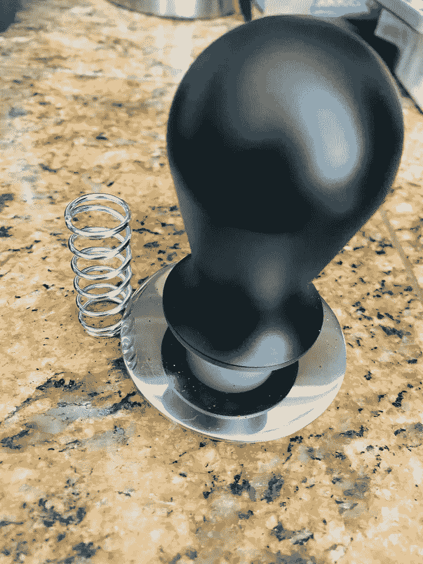
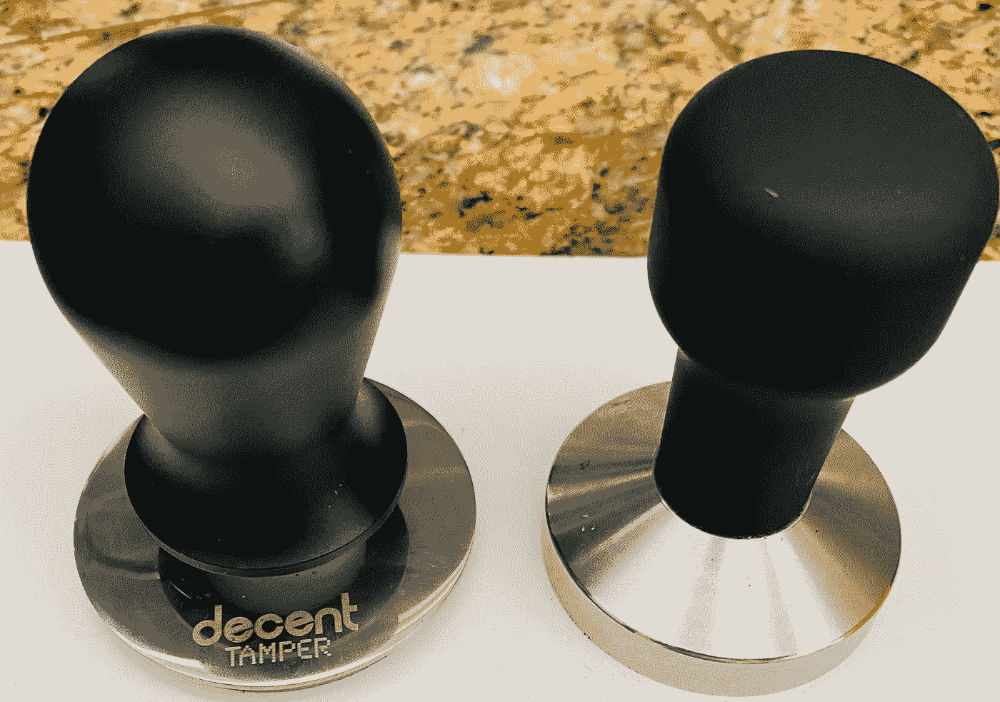
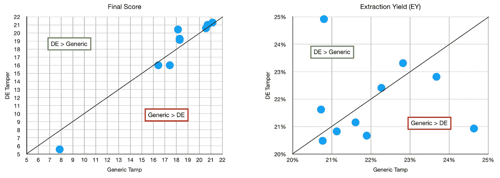
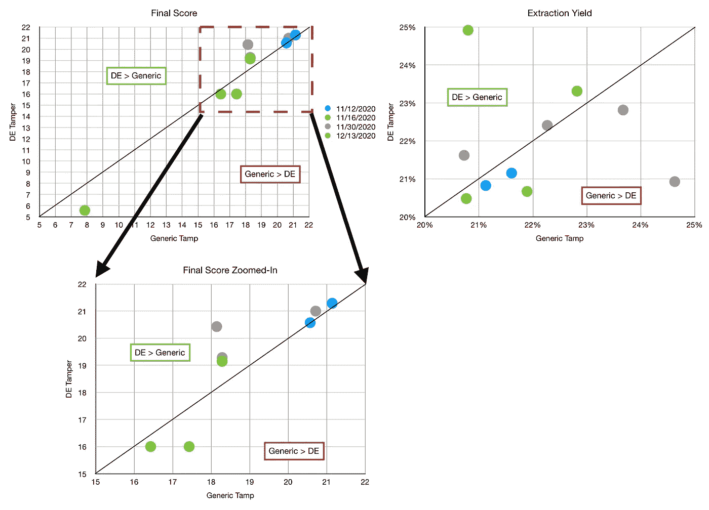
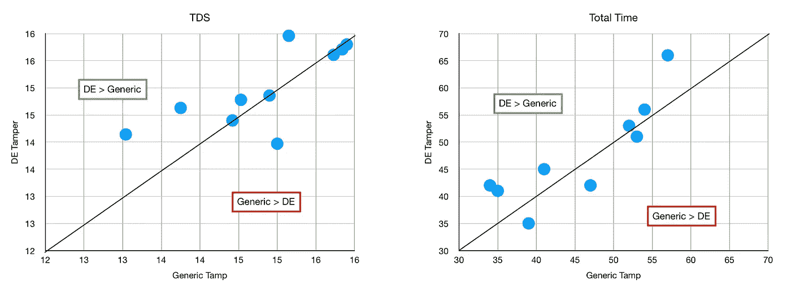
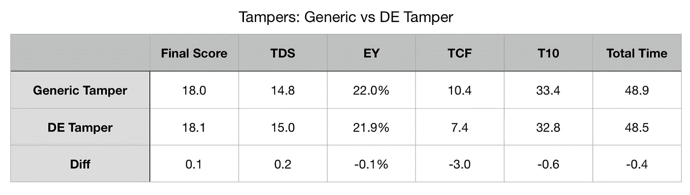

# 体面的篡改与一般的浓缩咖啡

> 原文：<https://towardsdatascience.com/decent-tamper-vs-generic-for-espresso-18a73f46b4b9?source=collection_archive---------13----------------------->

## 咖啡数据科学

## 关于捣棒的简短实验

几个月前，我买了一台像样的浓缩咖啡。我在寻找一种夯锤，它可以更深入篮筐，但仍然保持水平。这对于[断奏夯实击球](https://link.medium.com/ll6ZFg2HDeb)尤为重要，我夯实了两次，每半拍一次。所以我拿了一些数据，看看 DE tamper 和我一年前买的一款[通用](https://www.amazon.com/Coffee-Tamper-Stainless-Steel-58mm/dp/B08TCDN24T/)之间是否有可测量的差异(注意，有时网站会改变尺寸，但我说的通用是指大约 20 美元的 58 毫米 tamper)。

首先，我取出弹簧。弹簧允许一个人校准夯力(超过 20 磅)，我夯大约 1 磅或更少。所以我把弹簧拿掉了，我仍然可以用一个天平来测量压紧力。

所有图片由作者提供

然后我拍摄了一些照片，记录了一些数据，用一些指标进行了比较。

免责声明:

1.  这不是全部的结束，是全部篡改测试的表现。这是对断奏夯实击球下半部分的性能比较，以确定夯实的自动调平部分是否有所不同。
2.  我已经捣实并提取了 2000 多张照片，所以这个测试对于不熟悉浓缩咖啡或经验较少的人来说可能会有很大不同。

# 镜头性能指标

我将这些定义放在这里，因为在这一节之后，我将使用这些指标评估不同数量的纸质过滤器。

我使用了两个指标来评估镜头之间的差异:[最终得分](https://link.medium.com/uzbzVt7Db7)和[咖啡萃取](https://link.medium.com/EhlakB9Db7)。

最终得分是 7 个指标(强烈、浓郁、糖浆、甜味、酸味、苦味和余味)记分卡的平均值。当然，这些分数是主观的，但它们符合我的口味，帮助我提高了我的拍摄水平。分数有一些变化。我的目标是保持每个指标的一致性，但有时粒度很难，会影响最终得分。

使用折射仪测量总溶解固体(TDS ),该数字用于确定提取到杯中的咖啡的百分比，并结合一杯咖啡的输出重量和咖啡的输入重量，称为提取率(EY)。

# 数据分析

我在一周的时间里收集了 10 对样本。在我做分析之前，我没有注意到明显的不同。

我研究的前两个指标是味道(最终得分)和提取率(提取率，EY)。我看不出有什么不同。有差异，但它们似乎没有一个模式。这意味着结果的不同不能归因于篡改的改变。

我们可以把这些分解成我使用的不同的烘焙，因为那可能对结果有影响。然而，我还是没有发现问题。我只看到了几个异常值，这可能是由于拍摄准备或口味的微小差异，我在拍摄前吃的东西可能会影响得分。

所以，我研究了更多的指标。我看了 TDS 和总拍摄时间。同样，数据没有显示出一种模式。

我整理了一份总体总结，其中还添加了 TCF 和 T10。TCF 是盖住过滤器的时间，T10 是我的子弹杯达到 10 毫升的时间，这两个时间在这里[有更好的解释](/pre-infusion-for-espresso-visual-cues-for-better-espresso-c23b2542152e)。从这个角度来看，没有太大的不同，除了 TCF 似乎发生得更快一点。

我喜欢体面的篡改，我很高兴我买了它的能力更好的水平。这需要一些猜测，以确保我正确地水平拍摄。除了改进的工作流程之外，它似乎对一般的篡改没有什么影响。

话说回来，我做意式浓缩咖啡已经很多年了，在过去的一年里，我没有太多糟糕的 tamps。对于一个新接触浓缩咖啡或经验不足的人来说，适当的捣棒可能会提高他们的技术，让他们提取得更好。

如果你愿意，可以在 [Twitter](https://mobile.twitter.com/espressofun?source=post_page---------------------------) 和 [YouTube](https://m.youtube.com/channel/UClgcmAtBMTmVVGANjtntXTw?source=post_page---------------------------) 上关注我，我会在那里发布不同机器上的浓缩咖啡照片和浓缩咖啡相关的视频。你也可以在 [LinkedIn](https://www.linkedin.com/in/robert-mckeon-aloe-01581595?source=post_page---------------------------) 上找到我。也可以在[中](https://towardsdatascience.com/@rmckeon/follow)关注我。

# [我的进一步阅读](https://rmckeon.medium.com/story-collection-splash-page-e15025710347):

[浓缩咖啡系列文章](https://rmckeon.medium.com/a-collection-of-espresso-articles-de8a3abf9917?postPublishedType=repub)

[工作和学校故事集](https://rmckeon.medium.com/a-collection-of-work-and-school-stories-6b7ca5a58318?source=your_stories_page-------------------------------------)

[个人故事和关注点](https://rmckeon.medium.com/personal-stories-and-concerns-51bd8b3e63e6?source=your_stories_page-------------------------------------)

[乐高故事首页](https://rmckeon.medium.com/lego-story-splash-page-b91ba4f56bc7?source=your_stories_page-------------------------------------)

[摄影飞溅页面](https://rmckeon.medium.com/photography-splash-page-fe93297abc06?source=your_stories_page-------------------------------------)