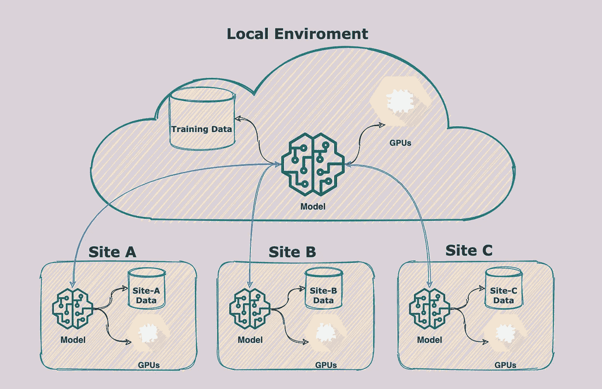

# 具有联邦学习的分散式机器学习训练

> 原文：<https://towardsdatascience.com/decentralized-machine-learning-training-with-federated-learning-c8543696c1e7?source=collection_archive---------28----------------------->

## 机器学习有两个不可避免的事实:更多的数据和更多的计算能力来训练这些数据。

梅琳娜·瓦莱在 [Unsplash](https://karimfanous.substack.com/t/experimental?utm_source=unsplash&utm_medium=referral&utm_content=creditCopyText) 上的照片

在最近的一篇[文章](/storage-compute-for-ml-8ba488b91865)中，我介绍了一个包含 ML 计算和存储的基础架构。我提出的架构中的一个主要假设是将所有的训练数据整合到一个位置(存储系统),更重要的是，这些数据很容易用于 ML 训练。如果我们需要一些数据进行训练，但由于各种原因，这些数据无法存储在我们的环境中，那么会发生什么呢？进入[联邦学习](https://en.wikipedia.org/wiki/Federated_learning)。

我在文章中概述的方法假设数据和计算都是集中的。在集中式方法中，构建和训练模型所需的所有数据都可以在与计算相同的环境中轻松获得。联合学习颠覆了这个模型。联合学习不是集中数据和计算，而是在分散的模型下运行，不需要共享数据。后者是关键。

下图说明了联合学习是如何工作的。第一步是引导一个模型，这将发生在您自己的环境中。您使用自己掌握的数据和计算资源构建了一个模型的初始版本。然后你把这个模型推广到远程站点。每个站点都有一些您希望用来训练模型的专有数据。这些数据可能有助于您的模型[一般化](https://karimfanous.substack.com/p/adventures-in-hill-climbing-with)并执行得更好。然后，您下推到这些本地站点的模型将根据每个站点的本地数据进行训练。数据不会离开网站。一旦培训完成，来自每个站点的新模型将被推回到您的环境中。这将依次产生一个新的模型，它是初始版本和从每个远程站点生成的模型的结果。

联合学习(图片来自作者)

实际上，每个站点的模型权重被发送回来，并在来自其他模型(包括引导模型)的所有权重中进行汇总(或平均)。这将产生一个新版本的模型，该模型是从您培训过的所有远程站点的组合模型中派生出来的。全部完成，无需共享数据！

联合学习在几种情况下发挥作用，也许最普遍和最有用的是大规模分布式学习和解决数据隐私问题。

考虑这样一种情况，您有一个非常流行的移动应用程序。它被全球数亿人使用。您可能希望在协作和高度分散的培训中利用您的移动应用程序的广泛采用。Google 是一个很好的例子，它在 Android 上的 [Gboard 中利用了联合学习，Android 是 Google 的键盘。当 Gboard 显示一个建议的查询时，用户的手机会在本地存储这些信息以及相关的元数据。联合学习处理设备上的历史记录，为 Gboard 查询建议模型的下一次迭代提供改进建议。存储在用户设备上的数据仍然存在，永远不会到达谷歌的服务器。然而，从用户本地获得的知识被应用到全局模型中。](https://blog.google/products/search/gboard-now-on-android/)

另一个例子来自我熟悉的领域:医疗保健。假设您正在构建一个癌症检测模型。你将需要跨越图像的大量医疗数据，比如 x 光、乳房 x 光、PET/CTs 等等。您可能还需要其他医疗数据，如病理报告和患者病历。所有这些都是高度敏感的私人数据。您将无法将这些数据移动或复制到自己的环境中。联合学习在这里会有很大的帮助。您不必将数据发送回您的母舰，而是在远程站点本地训练一个模型，并使用联合学习将学习应用到您的全球模型。

联合学习是一种特殊的技术，可以帮助机器学习构建者提高模型的性能。这样做不需要移动或合并培训数据。通过联邦学习，您可以根据远程和不可见的数据训练您的模型。

*最初发表于*[T5【https://karimfanous.substack.com】](https://karimfanous.substack.com/p/decentralized-ml-training-with-federated)*。*