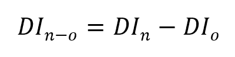
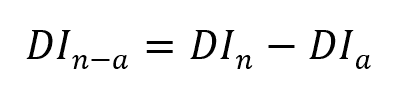
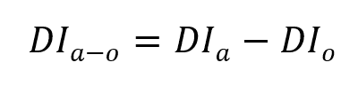
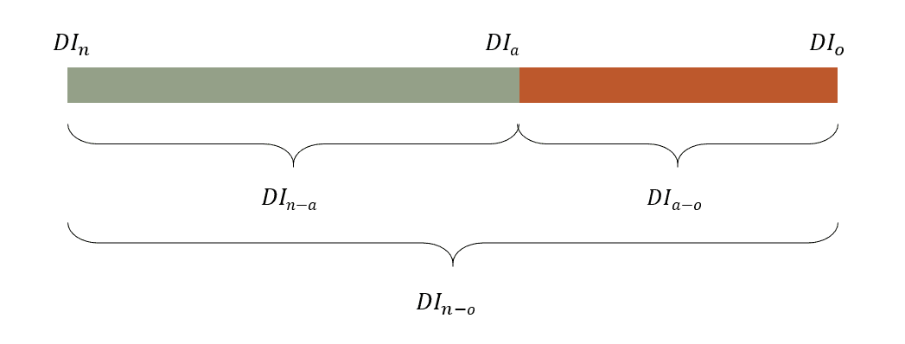

# “决策影响”:实施新一代面向业务的指标的 10 个理由

> 原文：<https://towardsdatascience.com/decision-impact-10-reasons-to-implement-the-new-generation-of-business-oriented-metrics-fcc17ea7871d?source=collection_archive---------27----------------------->

## 你有没有想过在你的公司里预测的有效附加值是多少？

照片由 Edi Libedinsky 在 Unsplash 上拍摄

公司最重要的决策都是基于某种形式的预测:招聘、开发新产品线、拓展新领域等决策。当然，预测在我们供应链的日常运作中扮演着重要的角色。

# 如何衡量绩效？

## 预测者在组织中的角色

有趣的是，预测的需求是如此重要，需要如此专业的知识，以至于催生了一个专门的职业:预测者。

从组织的角度来看，公司围绕专门的职能、专门的团队，有时甚至是整个专门的部门，创造并专门化了这种专业知识。大多数时候，这些结构由供应链部门监管。

公司中预测功能的这种组织有许多优点，特别是将该领域的专家聚集在一起，让他们可以分享他们的实践。

然而，这种任务分离造成了一个关键问题。通过将“预测”功能从“决策”功能中分离出来，许多公司在某种程度上创建了导致次优性能的筒仓。

## 预测对业务绩效的贡献很难衡量

原因如下:尽管预测在决策过程中起着关键作用，但它不是唯一的。还必须考虑其他元素，通常以约束和业务规则的形式。

> 因此，准确衡量预测对最终结果的贡献，即所作决定的绩效，往往是复杂的。

例如，当决定从供应商处购买货物时，需求预测显然非常重要，但允许的包装尺寸、最小订货量、存储有限容量等也很重要。

## 挑战在于专注于重要的事情

当然，所有的预测者都会定期评估他们预测的可靠性，为此存在许多公式。这些指标侧重于预测的内在质量，通常称为“预测准确性”指标。

这样做的时候，他们经常忽略了对基于最终预测的决策及其与业务相关性的分析。

在 [Vekia](https://www.vekia.fr/) ，我们已经观察了很长时间。可以肯定的是，我们不是第一个也不是最后一个发现这个重要极限的人。

因为我们喜欢接受挑战，我们自然会问自己:我们如何评估预测的质量，以便它导致的决策是最好的？换句话说，是什么让预测变得好呢？

# 什么样的预测是好的？

要理解什么是好的预测，有必要回到预测的目的。

在最近的 IIF ECR 网络研讨会[1]上，Paul Goodwin 提醒我们，预测不是目的，而是“为了支持决策者，使他们能够做出更好的决策”。

## 预测基础

让我们简单回顾一下预测的现状和基本原理。

以下对理想预测的定义得到了广泛认同。理想的预测是完全真实的预测。例如:*如果预测售出 996 台，并且在一天结束时，实际售出 996 台，那么这个预测是完美的！*

然而，显而易见的是，尽管做了各种努力，但未来永远无法如此确定。因此，衡量一个预测的质量，实际上就是衡量它的误差。例如:*如果预测售出 996 台设备，而在一天结束时，实际只售出 900 台设备，则该预测会产生 96 台设备的误差*

预报员的主要任务是生成最小化这种误差的预报。这种误差测量是通过十几种不同的“预测准确性”指标实现的，此外还有各公司为其特定需求开发的无数变体。

## 最好的预测是能够做出最好决定的预测

不幸的是，这种被几十年实践所强化的方法忽略了一个关键点:

> 预测的目的不是也从来不是提供有史以来最好的预测！其目的是做出最佳决策。

因此，最好的预测不是完美的预测，而是能够做出最佳决策的预测。因此，预测者的使命不应是最小化预测与现实之间的误差，而是最小化决策误差。

这里有一个例子。让我们想象一个非常简单的决策过程，取自日常生活:每天晚上，一位女士咨询天气预报，以决定第二天是否带伞。

如果我们关注预报误差，那么当预报没有预测到下雨，而且第二天确实没有下雨，那么预报就是完美的。但是，从另一方面来说，如果预报说会有 10 毫米的降雨，而结果却是 10 倍多，那么这个预报就有很大的误差。

这里测量的是内在预测误差。

但是现在让我们把注意力集中在做出的决定上。在“支持还是不支持”决策的特定上下文中，上述错误不会对所采取的决策产生任何影响。在这两种情况下，这位女士都会做出正确的选择，带走她的雨伞。因此，就其用途而言，预测是完美的。

因此，预测的质量完全取决于它的使用和它所引发的决策。

> 然而，正如我们所见，预测者只有衡量预测内在准确性的指标。没有一个考虑到它的实际用途。

这并不意味着对这些指标不感兴趣，远非如此。但我们必须认识到，从商业角度来看，它们并不是最合适的选择…

# 迈向新一代“决策影响”指标

幸运的是，完全有可能以不同的方式处理预测的质量。为此，必须引入新一代指标。这些度量被称为“决策影响”(表示为“DI”)，不再关注内在错误，而是关注所做决策的质量。

## 构建数字双胞胎

建议的指标要求创建一个计算机模型(或“数字孪生”)，该模型可以针对任何预测输入，模拟决策过程并评估最终决策的质量。

然后有必要对决策过程建模(通过表示为“DF”的决策函数)并定义决策质量的度量(通过表示为“DQE”的决策质量估计器)。

决策的质量可以通过多种方式来表达。然而，我们强烈建议将其表达为财务成本，因为这允许多种用例，稍后将讨论这些用例。

当然，过程和影响的完美模型有时很难实现，如果不是不可能的话。但是一个简化的模型通常能够有效地“近似”更复杂的现实。

## 利用 3 种预测

需要三种不同的预测来生成提议的新指标并展示其价值:

*   所谓*实际*预测，源于预测过程的到位。
*   所谓的“*天真的*预测，源于最简单的预测方法，如果预测功能在公司中不存在，自然会使用这种方法。
*   所谓“*神谕*”的预测，亦即地面实况，是后验测得并与观测结果本身相对应的。

这三种类型的预测随后被 Digital Twin 使用，以模拟相关决策及其各自的质量，称为“决策影响”。

*   由实际预测产生的决策成本用“DIa”表示，即。指数“a”对“实际”的决策影响。它衡量当前预测流程生成的决策的质量。
*   天真的预测所带来的决策成本用“DIn”表示，即。指数“n”对“天真”的决策影响。它衡量最简单的预测过程所产生的决策的质量。
*   oracle 预测所带来的决策成本用“DIo”表示，即。索引“o”对“oracle”的决策影响。它衡量的是对未来的完美认识所产生的决策质量。

DIa、DIn 和 DIo 提供关于预测环境的有价值的数据。除此之外，它们还是基本的构建模块，可以组合起来生成三个有洞察力的度量标准。

表示为“DIn-o”的第一个指标是“DIn”(基于预测的“幼稚”决策的成本)和“DIo”(基于预测的“oracle”决策的成本)之间的差异。该指标定义了完整的竞争环境，可通过预测改进来解决

(图片由作者提供)

表示为“DIn-a”的第二个指标是“DIn”(基于预测的“原始”决策的成本)和“DIa”(基于预测的“实际”决策的成本)之间的差异。因此，它衡量的是实际预测过程所带来的附加值。该指标与 FVA(预测附加值[2]，作者 Michael Gilliland)的概念相关，并通过提供附加值的美元化愿景对其进行了增强。

(图片由作者提供)

最后一个标为“DIa-o”的指标是“DIa”(“实际”基于预测的决策的成本)和“DIo”(“Oracle”基于预测的决策的成本)之间的差异。因此，它衡量的是通过改进实际预测流程仍能实现的最大价值。

(图片由作者提供)

结合起来，这些指标可以通过简单的图形表示(如堆积条形图/面积图或仪表图)进行呈现、分析和解释。

(图片由作者提供)

# 10 个令人兴奋的新观点

这一组新的“决策影响”指标打开了全新的视角。

## 有利于预测者的指标

预测者是这些指标的第一受益者。除其他外，新的见解能够:

1.  拥有明确的“北极星”指标，最终提供关于预测质量的可靠观点。事实上，需要提醒的是，传统的预测准确性指标经常相互矛盾；
2.  正确选择和配置最能支持决策的预测模型；
3.  生成价值图，以明确识别价值池；
4.  准确地知道何时停止改进预测，因为尚未收获的附加值不值得；
5.  相反，了解哪个周界将从改进的预测中受益最大；
6.  如果在给定可用资源的情况下有待改善的周界太大，则优先考虑最有影响的子周界；
7.  评估预测过程中每个因素/步骤的美元化 FVA。

## 惠及整个公司的指标

这些新指标的好处不仅限于预测者。新的见解使整个公司:

1.  由于每个利益相关者最终都容易理解的指标，简化和平滑了部门之间关于预测的沟通；
2.  以公平、不矛盾和易于理解的方式评估和分享预测过程(及其子部分:每个预测者或步骤)的交付价值。

由于这些指标不仅仅是纯粹的预测指标，同样的方法可以应用于测量输入约束变化的影响，而不是输入预测的变化。例如，这可以评估包装尺寸成本或交付频率的影响…这是一个很好的工具，可以指出需要改进的地方，等等。

# 结论

每一家公司每天都在与低效和浪费作斗争。筒仓很早就被指出是这样的，并且被认为是真实的:组织内部的裂缝。

另一方面，预测功能自然不应该像筒仓一样，因为它在公司中处于中心位置。它确实是许多部门的重要合作伙伴，是 IBF 和 S&OP 等关键业务流程的核心。

然而，在预测者的实践中，性能测量仍然与预测的用途和商业影响历史上惊人地不相关。

> 将业务带回预测实践

在此引入的“决策影响”度量家族使得将“业务”维度带回规划的核心成为可能。好处是围绕业务重新调整整个公司。

不仅如此，这些指标开辟了新的视角，并允许围绕自动化、优先化和关键业务流程改进的全新用例。

在接下来的文章中，我将更详细地介绍“决策影响”指标的操作使用。

# 参考

[1] P .古德温，[预测研究生涯的经验教训](https://www.youtube.com/watch?v=Jx-kzpNoFJs) (2021)，IIF 欧洲委员会

[2] M .吉利兰，[商业预测交易](https://www.amazon.fr/Business-Forecasting-Deal-Eliminating-Practices/dp/0470574437) (2010)

*欢迎分享、评论或联系我，我愿意就数据科学和供应链相关话题进行分享和交流。
Linkedin:*[www.linkedin.com/in/johann-robette/](https://www.linkedin.com/in/johann-robette/)
*Web:*[*www . vekia . fr*](https://www.vekia.fr/)