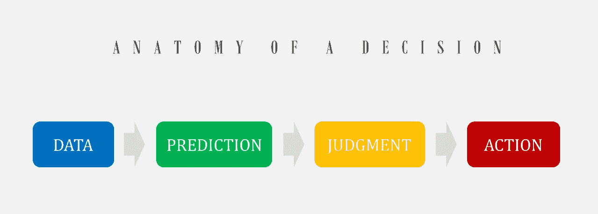

# 不确定型决策

> 原文：<https://towardsdatascience.com/decision-making-under-uncertainty-402a32300552?source=collection_archive---------10----------------------->

## 人工智能

## 人工智能决策问题中不确定性的类型。

布莱希特·丹尼尔在 [Unsplash](https://unsplash.com?utm_source=medium&utm_medium=referral) 上拍摄的照片

将人工智能(AI)应用于个人和商业决策问题取决于 AI 如何感知和处理不确定性和风险。为了理解不确定性在决策问题中的作用，让我们先快速回顾一下决策。最简单的决策分析如下图所示。

图片由作者提供。

你可以在诸如 Agrawal 等人的《预测机器》等书中找到更全面的决策分析。

<https://www.amazon.com/Prediction-Machines-Economics-Artificial-Intelligence/dp/1633695670>  

# 决策中的不确定性类型

决策问题中有 4 种主要的不确定性。

*   资料不确定
*   预测不确定性
*   判断不确定性
*   行动不确定性

# 资料不确定

我们的数据过去和将来都有不确定性。数据中的噪声是最常见的数据不确定性。例如，传感器并不完美，它们总是记录某种程度的噪声。

重要的是要知道数据的不确定性不仅限于噪音。数据源的不确定性和数据表示的内容也是数据不确定性的两个例子。假设您有一个完美的传感器，但您不确定传感器的位置(例如，在煤气管道或地下)。在这种情况下，您面临的是数据源不确定性。在另一种情况下，假设您正在为一项政治活动收集数据。您从成千上万的个人那里收集信息，但是您不确定您收集的数据在多大程度上代表了目标社区。在这种情况下，您正在处理数据表示中的不确定性。

数据不确定性在处理不同数据源(尤其是传感器)的决策应用中至关重要。自动驾驶汽车领域充满了关于数据不确定性对决策影响的例子。

# 预测不确定性

使用可用的数据，您生成一些案例并尝试预测每个案例的结果。比如你想买房。你收集当地的房地产市场数据和你的财务数据。基于这些数据，你开发了一些案例，比如在靠近市中心的地方买一栋小房子，或者在郊区买一栋大房子。在制作案例之后，是时候预测每个案例中会发生什么。如果你在郊区买房子，你有更多的房间，接触自然，更友好的社区，但你的房子升值可能不会太多。在另一种情况下，你可能有一个更小的房子，有更多的餐馆和夜生活活动，你的房子将在当前的市场上大幅升值。但是你是怎么知道这些事情的？你有多大信心，闹市区的房子会比郊区的房子升值？你有多确定你的郊区社区比你的市区选择更友好？

仔细看，你的预测中有很多不确定性，简称**“预测不确定性”**。数据不确定性可能是预测不确定性的一个来源，但并不总是如此。即使有完美的数据，一个意外的事件也会改变事件的进程，你的预测可能会出错。想象一下，那些在市中心买房子的人离他们的办公室更近，而新冠肺炎远程制造了许多这样的工作。现在，离封闭的办公室越近并不意味着通勤时间越少，就像他们在买房决策中预测的那样。在这种情况下，环境发生了巨大的变化，即使最精确的收集数据也无法预测。

金融领域的人工智能决策支持系统每天都在处理这种类型的不确定性，即预测不确定性。

# 判断不确定性

你根据现有数据做了一些预测，现在是做出判断的时候了。你必须将它们相互比较，并根据你的效用函数进行排序。你的效用函数是金融、情感和许多其他因素的混合。回到我们买房子的例子，你的效用函数是你支付的钱，预期升值，生活舒适度，享受在附近，和许多其他因素的混合。你的判断应该帮助你根据你的效用函数对不同的案例进行排序。但是你怎么能把住在大房子里的舒适与你买房子的价格相比呢？你如何评价一个好的社区和预期的房屋升值？你应该更重视 10%更好的邻居还是 3%更多的房屋升值？

当人类或人工智能试图在不同情况之间做出判断时，由于这种混合因素，存在固有的不确定性。在一些问题中，很难对一些情感因素给出一个数值，然后进行比较。

判断不确定性在同时处理财务和情感因素的决策问题中更为常见。例如，在决定向消费者推荐产品之前，产品推荐系统必须解决判断的不确定性。这样的系统应该判断向谁推荐什么产品来满足他/她的情感和经济需求。

# 行动不确定性

我们试图收集完美的数据，准确预测结果，并根据最佳感知效用函数做出最佳判断。现在是做最后决定和采取行动的时候了。但是等等！采取行动是否会带来不确定性？我们先来看看动作不确定性是什么意思。行动不确定性意味着我们决定采取特定的行动，但实际上，我们做的是不同的行动。看起来很奇怪，怎么会有人决定采取某个特定的行动，但实际行动会不一样呢？有些情况下，就像买房子一样，你决定买一套房子，最后却错误地买了另一套房子，这是非常不寻常的。但是，现实世界中有许多行动不确定性的例子。例如，你的车将要撞上一个物体。你决定停下来。你必须踩刹车，但不幸的是，你踩了油门。在这种情况下，这一行动不是决策的意图，而是由于一个错误而发生的。

行动的不确定性并不总是由于一个错误。在驾驶事故的例子中，你可能正确地踩下了刹车踏板，但是由于轮胎损坏，汽车打滑并撞到了物体。你必须考虑到行动不确定性的可能性。

动作不确定性是机器人领域中重要的不确定性之一。

# 一个例子

本文提到的一切不仅适用于人类决策，也适用于人工智能决策。一个可靠的人工智能系统必须能够感知不确定性的概念，以适用于现实世界的决策问题。在这里，我向你展示了一个人工智能系统如何在决策中理解不确定性概念的例子。

以下示例显示了简单强化学习(RL)模型(SARSA)如何处理不确定情况下的决策。你可以在这个 GitHub repo 里看到细节:

[https://github . com/tamimina ser/Windy _ World _ Reinforcement _ Learning](https://github.com/tamiminaser/Windy_World_Reinforcement_Learning)

作者制作的视频。

目标是到达家乡州(红色方框)。问题在于失败国家的存在(我们称之为湖泊的深蓝色方框)。左边的代理人在一个没有风(没有不确定性)的世界里移动。因此，它会找到最短路径作为最佳路径。右边的代理运行在一个多风的世界(应用不确定性)。因为在这个例子中，失败具有巨大的成本，代理试图在最短路径和安全路径之间找到最佳平衡。因此，代理采取稍微长一点的路径来避免落入湖中。有趣的是，即使是简单的强化算法，如 SARSA，也能很好地理解不确定性的概念。它在最短路径和安全性之间做出妥协。

# 小测验

在前面的例子中，哪种不确定性起了主要作用？

花点时间想一想，我们的代理人由于大风天气而遭受的不确定性。

是的，你是对的；这个例子显示了动作的不确定性。AI(即，RL 代理)知道它需要做什么，但是它不确定动作(即，运动)是否将被正确地应用。

# 摘要

将 AI 应用于决策问题取决于 AI 如何感知和处理不确定性和风险。决策问题中有四种主要类型的不确定性:数据不确定性、预测不确定性、判断不确定性和行动不确定性。

关注我在[媒体](https://tamimi-naser.medium.com/)和[推特](https://twitter.com/TamimiNas)上的最新报道。