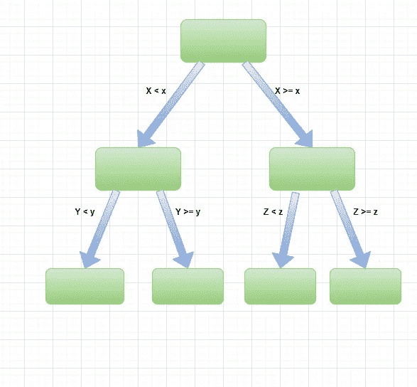
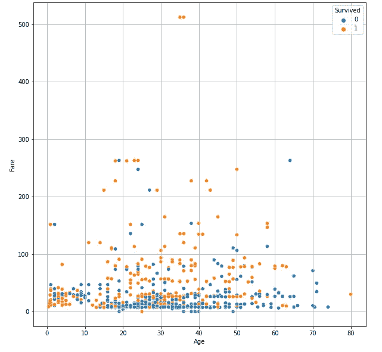
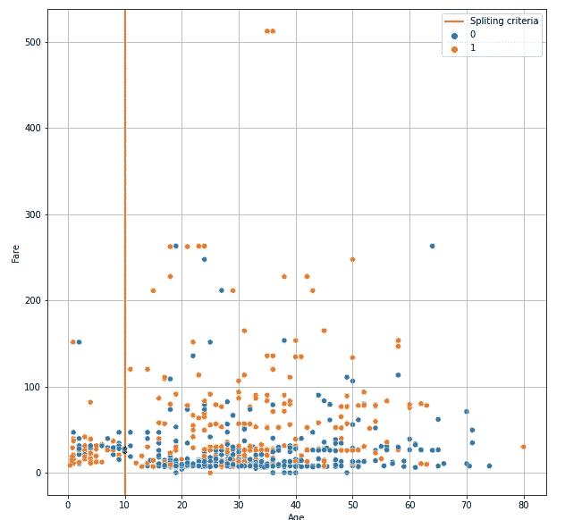
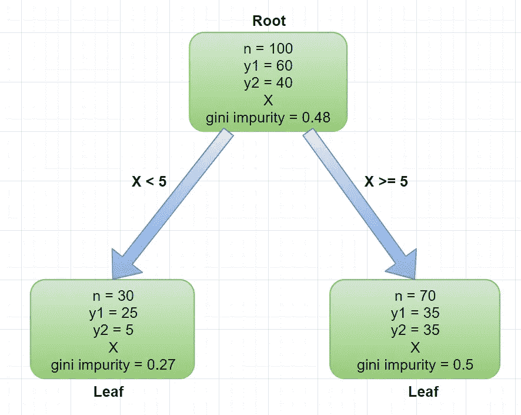
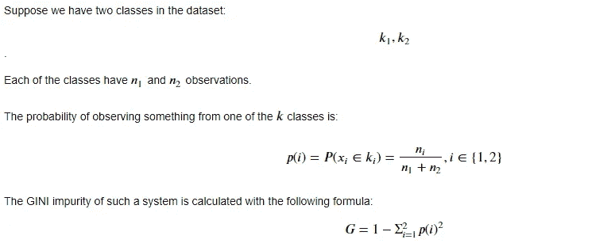
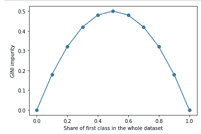
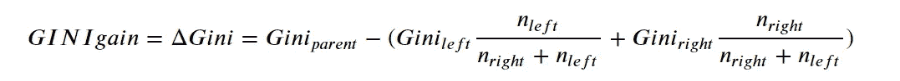
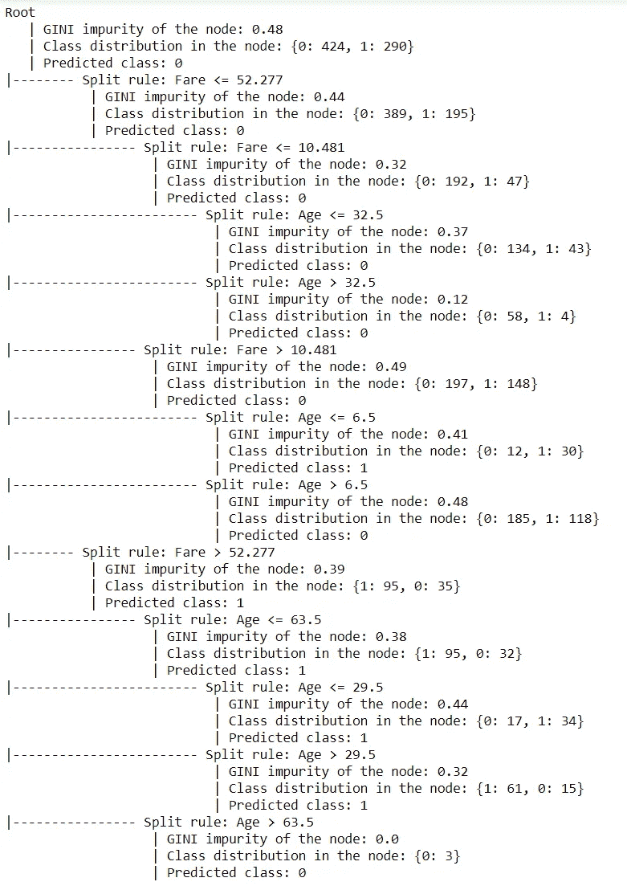

# Python 中的决策树算法从零开始

> 原文：<https://towardsdatascience.com/decision-tree-algorithm-in-python-from-scratch-8c43f0e40173?source=collection_archive---------5----------------------->

## 用 Python 编写只使用 NumPy 和 Pandas 的流行算法，并解释其中的内容



决策树架构；按作者分类的图表

本文的目的是通过遍历实现该算法的代码，使决策树分类器的所有部分变得清晰。代码只使用了 NumPy、Pandas 和标准 python 库。

完整的代码可以通过[https://github.com/Eligijus112/decision-tree-python](https://github.com/Eligijus112/decision-tree-python)访问

到目前为止，当目标变量是二进制并且特征是数字时，代码创建一个决策树。这完全足以理解算法。

用 python 构建决策树的黄金标准是 scikit-learn 实现:

<https://scikit-learn.org/stable/modules/tree.html>  

当我测试我的代码时，我想确保结果与 scikit-learn 实现相同。

本文使用的数据是著名的泰坦尼克号幸存者数据集。我们将使用两个数字变量——乘客的年龄和票价——来预测乘客是否幸存。



年龄+票价~生存；按作者分类的图表

目标是创建数字变量的**【最佳】**分割。目测数据，我们可以猜测一个好的分割方法是将数据分成两部分:年龄为 10 的观察值和年龄≥ 10 的观察值:



拆分数据集；按作者分类的图表

现在，一些迫在眉睫的问题可能会出现:

*这是一个好的分裂吗？*

也许以 200 英镑的价格分开会更好？

*我们如何量化拆分的“好处”？*

*计算机如何寻找最佳分割？*

所有这些问题都将在本文结束时得到解答。

决策树算法(简称 DT)是一种机器学习算法，用于在给定一组输入特征的情况下对观察值进行分类。该算法在不同的决策级别创建一组规则，从而优化某个度量。

目标变量将表示为 **Y = {0，1}** ，特征矩阵将表示为 **X.**

要扩展的关键词:

**节点**

**基尼系数**(我们正在优化的指标)

**级别**

**分裂**

一个**节点**是决策树中的构建块。当查看决策树的典型模式(如标题图片中的模式)时，节点是向下连接到其他节点的矩形或气泡。

每个节点都有以下主要属性:

***基尼杂质分数***

***观察次数***

***属于每个二元目标类的观测值的数量。***

***特征矩阵 X 表示落入节点的观察值。***

python 中的自定义**节点**类(我写的):

决策树的第一个节点叫做 ***根。*** 树底部的节点叫做 ***树叶*** 。

如果满足拆分标准，那么每个节点都有两个链接节点:左节点和右节点。例如，一个非常简单的具有一个根和两个叶的决策树可能如下所示:



示例决策树；按作者分类的图表

```
**n —** number of observations**y1 —** number of first class elements**y2 —** number of second class elements **X —** numeric feature for the observations
```

如果特征 X 小于 5，则输入将转到左侧节点。大于或等于 5 的特征值将去往正确的节点。

如上所述，每个节点都有一个 GINI 杂质分数。为了计算 GINI 杂质，所需要的只是目标变量在节点中的分布，或者简单地说，节点中有多少 Y=1 和 Y=0 观测值。

GINI 杂质的正式定义如下:

*Gini 杂质是对从集合中随机选择的元素被错误标记的频率的度量，如果根据子集中标签的分布对其进行随机标记的话。*

代数定义:



GINI 杂质公式；公式取自作者的笔记本

例如，如果在一个节点中有 10 个观测值是幸存者，5 个观测值不是幸存者，则:

```
p(survivors) = 10 /(10 + 5) = 0.66..
p(non-survivors) = 5 /(10 + 5) = 0.33.. 
```

因此，GINI 杂质可以通过平方这两个数字，将它们相加，然后从 1 中减去来计算:

```
gini impurity = 1 - (0.66..^2 + 0.33..^2) = 0.44.. 
```

在二进制情况下，最大基尼系数等于 0.5，最小基尼系数等于 0。值越低，节点越“纯”。无论我们有多少个观察值，我们都可以根据整个数据集计算其中一个类的份额，并绘制一个关系:



基尼不纯度与数据集中的类别份额；作者图片

我们总是寻找 GINI 杂质最低的分裂。

*别的不说，最基本的直觉是，一个节点中的一类观测值越多，其杂质就越低。*

level 属性定义在创建节点之前进行了多少次拆分。例如，根节点的级别为 0，那么左右节点的级别为 1，依此类推。

在自定义节点类中，树的最大深度可以通过超参数 **max_depth 来调节。**

分裂过程是一个过程，其中我们在每个节点中搜索哪个特征和哪个特征值是最好的，以将数据分成两个更小的部分。

在分类的情况下，我们希望最大化**基尼增益。**回到之前的例子:


示例决策树；按作者分类的图表

根节点的基尼系数为 0.48。左节点得分为 0.27，右节点得分为 0.5。 ***我们“获得”了多少基尼？***

计算公式如下:

Gini gain =父节点 Gini 杂质减去左右节点的 Gini 杂质的加权平均值。



基尼增益公式；来自作者的笔记本

在上面的例子中，插入我们将得到的所有值:

```
0.48 — (0.27 * 30 /100 + 0.5 * 70/100) = **0.049**
```

GINI 增益等于 0.049。任何正的基尼系数都是一种进步。这意味着我们的决定会使节点更加“纯净”。

该算法如何在数字列中搜索最佳拆分？

对于每个特征，我们对特征值进行排序，并得到两个相邻值的平均值。

例如，假设我们的特征 1 如下:

```
feature_1 = [7, 5, 9, 1, 2, 8]
```

已排序:

```
feature_1 = [1, 2, 5, 7, 8, 9]
```

邻居的方式:

```
feature_1 = [1.5, 3.5, 6.5, 7.5, 8.5]
```

然后，我们检查来自上述向量的每个值的 GINI 增益是多少。而且，我们对数据集中的所有要素都执行此操作。

***最终分割值和分割特征是具有最高 GINI 增益的一个。***

增长树的自定义节点对象的超参数(将来会添加更多)是 **max_depth: int** 和 **min_samples_split: int** 变量。

max_depth 整数定义了树应该增长到多深。在 max_depth 深度处，停止搜索最佳分割特征和分割特征值。

min_samples_split 整数定义了开始最佳分割搜索时节点中的最小观察次数。例如，如果节点有 51 个观察值，但 min_samples_split = 55，则树的生长停止。

那么，代码是如何工作的呢？

首先，读取数据:

```
# Loading data
d = pd.read_csv(‘data/train.csv’)# Dropping missing values
dtree = d[[‘Survived’, ‘Age’, ‘Fare’]].dropna().copy()# Defining the X and Y matrices
Y = dtree[‘Survived’].values
X = dtree[[‘Age’, ‘Fare’]]# Saving the feature list 
features = list(X.columns)
```

然后我们定义超参数字典。

```
hp = {
 ‘max_depth’: 3,
 ‘min_samples_split’: 50
}
```

然后我们启动根节点:

```
root = Node(Y, X, **hp)
```

主要的树构建函数是 **grow_tree()** 函数。

```
root.grow_tree()
```

就是这样！

为了查看结果，我们可以调用 **print_tree()** 函数。

```
root.print_tree()
```

结果是:



全决策树；作者摘录

从 scikit-learn 实现中获得的决策树是相同的:

```
|--- Fare <= 52.28
|   |--- Fare <= 10.48
|   |   |--- Age <= 32.50
|   |   |   |--- class: 0
|   |   |--- Age >  32.50
|   |   |   |--- class: 0
|   |--- Fare >  10.48
|   |   |--- Age <= 6.50
|   |   |   |--- class: 1
|   |   |--- Age >  6.50
|   |   |   |--- class: 0
|--- Fare >  52.28
|   |--- Age <= 63.50
|   |   |--- Age <= 29.50
|   |   |   |--- class: 1
|   |   |--- Age >  29.50
|   |   |   |--- class: 1
|   |--- Age >  63.50
|   |   |--- class: 0
```

尽管如此，scikit-learn 实现输出的信息比我的实现少。

事实证明，最佳的第一次初始拆分是值为 52.28 的票价特征，而不是值为 10 的建议年龄特征。

我写的代码构建了与 scikit-learn 实现相同的树，并且预测是相同的。但是 scikit-learn 算法的训练时间要快得多。但是我的目标不是让树长得更快。我的目标是为任何机器学习爱好者编写一个可理解的代码，以便更好地理解正在发生的事情。

如果您发现任何错误或只想添加功能，请在此回购[https://github.com/Eligijus112/decision-tree-python](https://github.com/Eligijus112/decision-tree-python)中随意创建一个拉取请求。