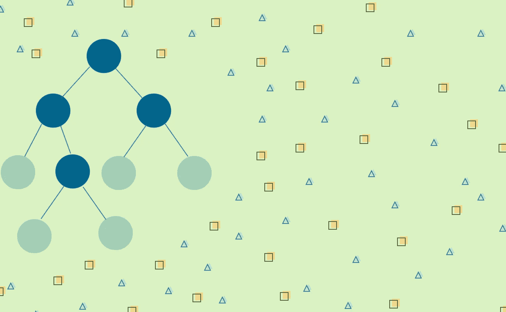
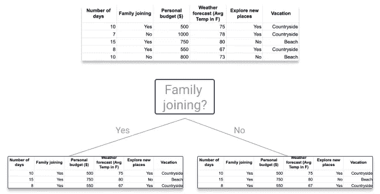
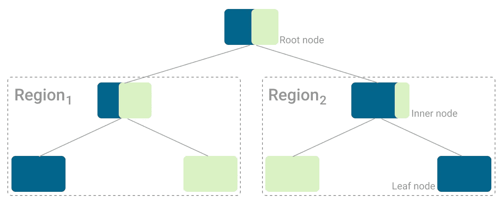
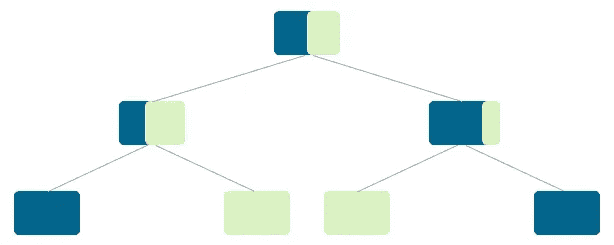
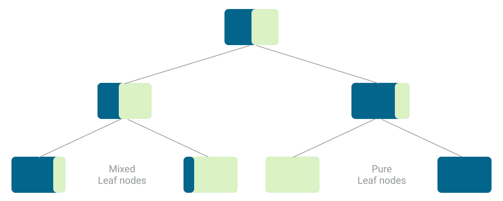
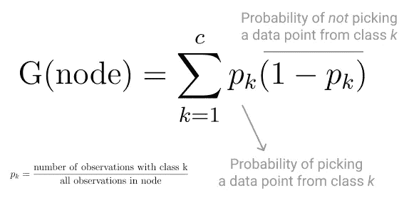
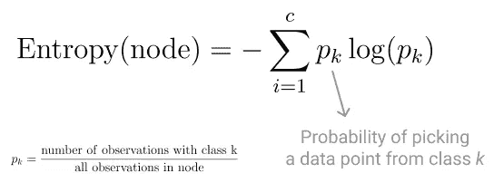
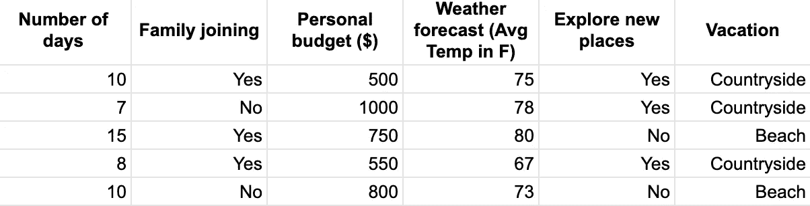
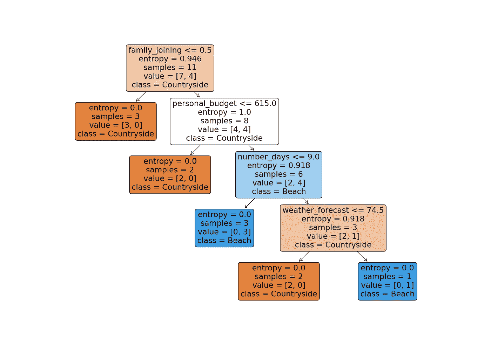
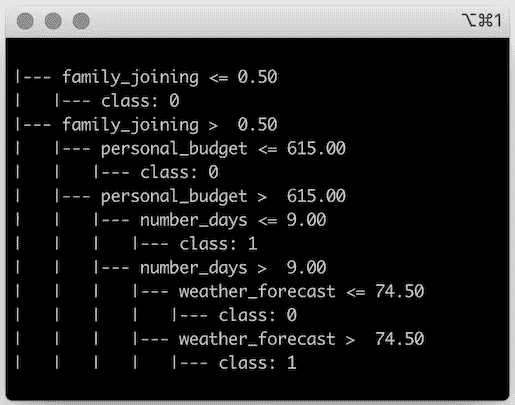

# 决策树分类器在现实生活中的解释:选择度假目的地

> 原文：<https://towardsdatascience.com/decision-tree-classifier-explained-in-real-life-picking-a-vacation-destination-6226b2b60575?source=collection_archive---------0----------------------->

## [入门](https://towardsdatascience.com/tagged/getting-started)

## 决策树是一种受监督的机器学习算法，它使用一组规则来做出决策，类似于人类做出决策的方式。



图片作者。

*这是致力于基于树的算法系列的第一篇文章，基于树的算法是一组广泛使用的监督机器学习算法。*

*如果你想看决策树、随机森林和梯度推进决策树，请继续关注，用现实生活中的例子和一些 Python 代码来解释。*

**决策树**是一种受监督的机器学习算法，它使用一组规则来做出决策，类似于人类做出决策的方式。

思考机器学习分类算法的一种方式是，它是为了做出决策而构建的。

你通常说*模型预测*新的、以前从未见过的输入的类别，但是在幕后，算法必须*决定*分配哪个类别。

一些分类算法是概率性的，如[朴素贝叶斯](https://en.wikipedia.org/wiki/Naive_Bayes_classifier)，但也有一种基于规则的方法。

我们人类也一直在做基于规则的决定。

当你计划下一个假期时，你使用基于规则的方法。你可能会根据你要去度假多长时间、可用的预算或者你的大家庭是否会一起来选择不同的目的地。

这些问题的答案决定了最终的决定。如果你根据你对每个问题的回答不断缩小可用度假目的地的范围，你可以把这个决策过程想象成一棵(决策)树。

# 一棵做决定的树

**决策树**可以执行分类和回归任务，所以你会看到作者称它们为 **CART 算法:分类和回归树**。这是一个总括术语，适用于所有基于树的算法，而不仅仅是决策树。

但是让我们把重点放在决策树上进行分类。

**决策树**背后的直觉是，你使用数据集特征来创建*是/否*问题，并不断分割数据集，直到你分离出属于每个类的所有数据点。

在这个过程中，你将数据组织成一个树形结构。

每次你问一个问题，你就给树增加了一个节点。而第一个节点称为**根节点**。

*提问的结果*根据一个特性的值分割数据集，并创建新的节点。

如果您决定在分割后停止流程，那么最后创建的节点称为**叶节点**。



包含树节点、根节点和两个叶节点的决策树示例。(图片由作者提供)

每次你*回答一个问题*，你也在创建分支并将特征空间分割成不相交的**区域**【1】。

树的一个分支具有对应于回答*是*到*问题*的所有数据点，这是前一个节点中隐含的规则。另一个分支有一个包含剩余数据点的节点。



*树中不同区域和节点类型的例子。*(图片作者提供)

这样，通过树中的每个分裂或分支来缩小特征空间，并且每个数据点将只属于一个区域。

目标是继续*分割*特征空间，并应用规则，直到没有更多规则可应用或没有数据点留下。

然后，该给每个叶节点中的所有数据点分配一个类了。

# 分配课程

该算法试图完全分离数据集，使得所有叶节点，即不再进一步分割数据的节点，属于单个类。这些被称为**纯叶节点。**



*只有纯叶节点的树的例子。*(图片作者提供)

但是大多数情况下，你最终会得到混合的叶节点，其中并不是所有的数据点都属于同一个类。



*在将最终类分配给每个节点之前，具有纯叶节点和混合叶节点的树的示例。*(图片作者提供)

最终，**算法只能给每个叶节点中的数据点分配一个类别**。

因为该节点中的所有数据点都具有相同的类。

但是对于混合叶节点，该算法在该节点的所有数据点中分配**最常见的类别**。

# 很难造出完美的树

理想的树是尽可能最小的树，即具有较少的分裂，能够准确地分类所有数据点。

这听起来很简单，但实际上是一个 [NP 难题](https://en.wikipedia.org/wiki/NP-hardness)。构建理想的树需要[多项式时间](https://en.wikipedia.org/wiki/Time_complexity#Polynomial_time)，随着数据集的增长，多项式时间会呈指数增长。

例如，对于一个只有 10 个数据点的数据集和一个具有[二次复杂度](https://en.wikipedia.org/wiki/Big_O_notation)，O(n)的算法，该算法执行 10*10 = 100 次迭代来构建树。将该数据集进一步扩展到 100 个数据点，算法将执行的迭代次数将增加到 10，000 次。

> 寻找*最佳树在理论上是理想的，但随着数据集的增长，这在计算上变得不可行！*

*为了将这个 NP 难问题转化为计算上可行的问题，该算法使用了一种 [**贪婪方法**](https://en.wikipedia.org/wiki/Greedy_algorithm) 来构建下一个最佳树。*

*一种**贪婪的方法**做出局部最优的决定来挑选每个分割中使用的特征，而不是试图做出最佳的整体决定【2】。*

*因为它针对本地决策进行了优化，所以它只关注手边的节点，特别是对该节点最好的节点。因此，它不需要探索该节点及其以外的所有可能的拆分。*

# *选择最佳分割*

*在每次分割时，该算法试图将数据集分割成尽可能小的子集[2]。所以，像任何其他机器学习算法一样，目标是**尽可能最小化损失函数**。*

*分类算法的一个流行损失函数是[随机梯度下降](/stochastic-gradient-descent-explained-in-real-life-predicting-your-pizzas-cooking-time-b7639d5e6a32)，但是它要求损失函数是可微分的。所以，在这种情况下这不是一个选项。*

*但是，由于您正在分离属于不同类的数据点，损失函数应该根据分割前后属于每个类的数据点的比例来评估分割。*

> *决策树使用损失函数来评估基于结果节点的*纯度*的分割。*

*换句话说，你需要一个损失函数来评估基于结果节点的纯度的分割。一个损失函数，比较分裂前后的阶级分布[2]，像**基尼杂质**和**熵**。*

## *基尼杂质*

*[基尼系数](https://en.wikipedia.org/wiki/Decision_tree_learning#Gini_impurity)是衡量不同阶层间差异的指标[1]。*

**

*节点的基尼杂质。*

## *熵*

*与基尼不纯相似，熵是节点内混沌的一种度量。在决策树的上下文中，混乱是指在一个节点上，所有的类都平等地出现在数据中。*

**

*节点的熵。*

*使用熵作为损失函数，仅当每个结果节点的熵低于父节点的熵时，才执行分裂。否则，拆分不是*局部* *最优*。*

# *为什么要使用决策树*

*尽管决策树是一种简单的算法，但它有几个优点:*

*   ***可解释性**你可以将决策树形象化。*
*   ***无需预处理**在构建模型之前，您不需要准备数据。*
*   ***数据健壮性**该算法可以很好地处理所有类型的数据。*

## *可解释性:可视化树*

*基于树的算法的一个最大的优点是，你可以实际可视化模型。*

*你可以*看到*算法做出的决定，以及它如何对不同的数据点进行分类。*

*这是一个主要的优势，因为大多数算法都像黑盒一样工作，很难清楚地查明是什么让算法预测到特定的结果。*

## *不需要预处理*

*一些机器学习算法要求特征值尽可能相似，因此算法可以最好地解释这些特征的变化如何影响目标。*

*最常见的预处理要求是特征*归一化，*因此相同比例的所有特征以及这些值的任何变化都具有相同的比例权重。*

*基于树的算法中的规则是围绕每个单独的特征建立的，而不是考虑整个特征集。每个*决策*都是一次查看一个特征，因此它们的值不需要标准化。*

## *数据稳健性*

*基于树的算法非常擅长处理不同的数据类型。你的数据集可以混合数字和分类数据，你不需要对任何分类特征进行编码。*

*这是基于树的算法自己处理的预处理清单上的一项。*

# *🛩🏝选择度假目的地*

*计划下一个假期可能很有挑战性。假期总是不够长，有预算限制，有时大家庭想一起来，这使得后勤工作更加复杂。*

*当需要做一个涉及太多变量的决策时，你喜欢从算法中寻求第二种意见。挑选一个度假目的地是一个完美的例子！*

*每当你开始计划假期时，你总是会考虑到:*

*   *假期的持续时间，*
*   *个人预算，*
*   *天气预报，*
*   *如果你的大家庭要加入，*
*   *如果你喜欢冒险，想要探索新的地方。*

*因为决策树据说是模仿人类如何做决定，这就是你正在使用的算法。*

*好处是，最终，你将能够可视化决策树，并且*看到*算法如何选择目的地。*

*仔细考虑你以前度假的决策过程和你经常考虑的标准，你建立了一个数据集。*

**

*来自先前休假决策流程的数据集。(图片由作者提供)*

*尽管决策树算法可以处理不同的数据类型，ScikitLearn 当前的实现[不支持分类数据](https://github.com/scikit-learn/scikit-learn/issues/5442)。*

*要使用来自 [ScikitLearn](https://scikit-learn.org/stable/) 的决策树分类器，您不能跳过预处理步骤，需要在训练模型之前对所有分类特征和目标进行编码。*

```
*import numpy as np
from sklearn import preprocessing def encode_feature(array):
    *""" Encode a categorical array into a number array

    :param array: array to be encoded
    :return: numerical array
    """* encoder = preprocessing.LabelEncoder()
    encoder.fit(array)
    return encoder.transform(array) feature_names = ['number_days', 'family_joining', 'personal_budget', 'weather_forecast', 'explore_new_places']class_names = ['Countryside', 'Beach']features = np.array([[10, 'Yes', 950, 75, 'Yes'],
                     [10, 'Yes', 250, 78, 'Yes'],
                     [7, 'Yes', 600, 80, 'No'],
                     [8, 'Yes', 750, 67, 'Yes'],
                     [10, 'Yes', 800, 73, 'Yes'],
                     [8, 'Yes', 850, 64, 'Yes'],
                     [15, 'No', 350, 78, 'No'],
                     [8, 'Yes', 850, 81, 'Yes'],
                     [6, 'No', 750, 59, 'Yes'],
                     [12, 'Yes', 1050, 54, 'Yes'],
                     [10, 'No', 230, 74, 'No'],
                     [3, 'Yes', 630, 74, 'Yes'],
                     [10, 'Yes', 830, 74, 'No'],
                     [12, 'No', 730, 52, 'Yes']]) # Encoding categorical features
features[:, 1] = encode_feature(features[:, 1])
features[:, 4] = encode_feature(features[:, 4])targets = np.array(['Countryside','Beach','Beach','Countryside',
                    'Beach', 'Countryside', 'Beach','Countryside',
                    'Beach', 'Beach', 'Countryside','Countryside',
                    'Beach', 'Beach'])targets = encode_feature(targets)*
```

*预处理:✅完成*

*现在是时候构建并可视化决策树了。*

```
*import pandas as pd
from sklearn import tree
import matplotlib.pyplot as plt
from sklearn.model_selection import train_test_split def print_feature_importance(names_array, importances_array): *""" Prints out a feature importance array as a dataframe. """* importances = pd.DataFrame(data=names_array)
    importances[1] = importances_array importances = importances.T
    importances.drop(0, axis=0, inplace=True)
    importances.columns = feature_names

    print(str(importances.reset_index(drop=True)))def build_tree(features, targets, feature_names, class_names): *""" Builds a decision tree.
        Prints out the decision tree 1) as a plot, 2) as text.
        Also outputs: 1) feature importance, 2) training set and test set mean accuracy of tree

        :param features: model features
        :param targets: model targets
        :param feature_names: names of the dataset features
    """* train_features, test_features, train_targets, test_targets = train_test_split(features, targets, test_size=0.2, random_state=123) decision_tree = tree.DecisionTreeClassifier(random_state=456)
    decision_tree = decision_tree.fit(train_features, train_targets) # Visualizing the decision tree

    # 1\. Saving the image of the decision as a png    plt.subplots(figsize=(17, 12))
    tree.plot_tree(decision_tree, feature_names=feature_names, filled=True, rounded=True, class_names=class_names)
    plt.savefig("decision_tree.png") # 2\. Output the tree as text in the console
    tree_as_text = tree.export_text(decision_tree, feature_names=feature_names)
    print(tree_as_text) # Feature Importance
    # Turns the feature importance array into a dataframe, so it has a table-like output format
    print_feature_importance(feature_names, decision_tree.feature_importances_) # Training and test mean accuracy
    train_error = np.round(decision_tree.score(train_features, train_targets), 2)
    test_error = np.round(decision_tree.score(test_features, test_targets), 2)

    print("Training Set Mean Accuracy = " + str(train_error))
    print("Test Set Mean Accuracy = " + str(test_error)) build_tree(features, targets, feature_names, class_names)*
```

*这段代码一次做很多事情，所以让我们来解开它。*

*它从**使用 [train_test_split](https://scikit-learn.org/stable/modules/generated/sklearn.model_selection.train_test_split) 函数将数据集分割成训练和测试**开始，因此您可以使用未用于训练模型的数据点来测试模型准确性。*

# *构建模型并可视化树*

*默认情况下，ScikitLearn 使用基尼系数作为损失函数。但是您也可以使用熵作为损失函数，并在 [DecisionTreeClassifier](https://scikit-learn.org/stable/modules/generated/sklearn.tree.DecisionTreeClassifier.html) 中调整其他参数。*

*训练好模型后，您可以使用 [plot_tree](https://scikit-learn.org/stable/modules/generated/sklearn.tree.plot_tree.html#sklearn.tree.plot_tree) 方法可视化生成的决策树，并保存为 *decision_tree.png* 。*

**

*通过训练模型生成的决策树。(图片由作者提供)*

*您也可以在输出控制台中可视化该树，您可以使用 [export_text](https://scikit-learn.org/stable/modules/generated/sklearn.tree.export_text.html) 方法*。**

**

*在输出控制台中将决策树可视化为文本。(图片由作者提供)*

# *特征重要性*

*但是那个决策树有问题！*

*您注意到功能 *explore_new_places* 没有出现在任何地方。即使你确定这是你决策过程中重要的一部分。*

*为了弄清这一点并理解为什么模型中没有使用 *explore_new_places* ，您可以在决策树模型中查找 [feature_importances_](https://scikit-learn.org/stable/modules/generated/sklearn.tree.DecisionTreeClassifier.html#sklearn.tree.DecisionTreeClassifier.feature_importances_) 属性。这将告诉你*每个*特征对模型准确性的贡献有多大。*

*[feature_importances_](https://scikit-learn.org/stable/modules/generated/sklearn.tree.DecisionTreeClassifier.html#sklearn.tree.DecisionTreeClassifier.feature_importances_) 属性只是一个值数组，每个值对应于模型的一个特征，其顺序与输入数据集的顺序相同。*

*因此，为了更好的可读性，您可以决定创建函数 print_feature_importance，并将值数组从 [feature_importances_](https://scikit-learn.org/stable/modules/generated/sklearn.tree.DecisionTreeClassifier.html#sklearn.tree.DecisionTreeClassifier.feature_importances_) 属性转换为 [dataframe](https://pandas.pydata.org/docs/reference/api/pandas.DataFrame.html) ，并使用特性名称作为标题。*

**

*可视化特征重要性。(图片由作者提供)*

**explore_new_places* 的要素重要性为 0，这意味着在预测中根本不使用它。*

*乍一看，你可能会想，*我可以去掉这个特性。**

***但是特性的重要性并不一定意味着该特性永远不会在模型中使用。**这只意味着它没有在这个树中使用，这是一个特定的训练-测试分割。*

*所以你不能马上消除这个特性。*

*为了确认 *explore_new_places* 与模型无关，您可以用数据集的不同训练测试分割构建几棵树，并检查 *explore_new_places* 是否仍然具有零重要性。*

# *模型性能*

*最后，为了评估算法的性能，您可以使用[得分](https://scikit-learn.org/stable/modules/generated/sklearn.tree.DecisionTreeClassifier.html#sklearn.tree.DecisionTreeClassifier.score) 方法计算训练集和测试集上预测的平均准确度。*

**

*训练集和测试集预测的平均准确性。(图片由作者提供)*

*正如你所看到的，这个模型被过度拟合并记住了训练集。由于测试集的平均准确率为 67%，它不能很好地推广到以前从未见过的观察结果。*

# *一个决策树是不够的*

*尽管决策树有其优势，但它不能提供与其他分类和回归算法相同的精确度。*

***决策树容易过拟合**。如果您构建了一个非常高的树，分割特征集直到您得到纯叶节点，您可能会过度适应训练集。生成的树如此复杂，以至于很难*阅读*和解释。*

*另一方面，如果你的决策树很小，它会对数据进行欠拟合，导致高偏差。*

**

*高偏差和高方差的决策树示例。(图片由作者提供)*

*决策树在它们可以处理的数据类型方面是健壮的，但是算法本身不是很健壮。数据的微小变化可能会彻底改变树，从而改变最终结果[1]。*

# *隐藏在森林中的力量*

*与其他机器学习算法相比，一个单独的**决策树**本身的准确性就很低。单独一棵树通常不会产生最佳预测，但是树结构使得控制[偏差-方差权衡](/bias-variance-tradeoff-in-machine-learning-models-a-practical-example-cf02fb95b15d)变得容易。*

> *一个单独的决策树不够强大，但是整个森林足够强大！*

*在结合多个树并控制偏差或方差的算法中，如[随机森林](https://en.wikipedia.org/wiki/Random_forest)，与单个决策树相比，该模型具有更好的性能。*

**请继续关注本系列的下一篇文章*，因为它们是关于增压和装袋的。这些技术应用于基于树的算法，并分别解决偏差和方差问题。*

# *结论*

*决策树是一种基于规则的分类和回归问题的方法。它们使用每个要素中的值将数据集分割成一个点，在该点处，具有相同类的所有数据点被分组在一起。*

*然而，在可解释性和性能之间有一个明显的平衡。*

*你可以很容易地想象和解读一棵小树，但是它有很高的方差。训练集中的微小变化，可能会导致完全不同的树和完全不同的预测。*

*另一方面，具有多个分支的高树产生更好的分类。但很可能是在记忆训练数据集。所以它不擅长对从未见过的数据进行分类。*

*希望你喜欢学习决策树！*

*敬请关注本系列的下一篇文章！接下来的文章将探索基于树的集成算法，这些算法使用 Boosting 和 Bagging 技术来控制偏差和方差。*

**感谢阅读！**

# *参考*

1.  *加雷斯·詹姆斯，丹妮拉·威滕，特雷弗·哈斯蒂，罗伯特·蒂布拉尼。(2013).统计学习导论:在 r .纽约的应用*
2.  *页（page 的缩写）tan m . stein Bach 和 V. Kumar。(2005)数据挖掘简介。*艾迪森·卫斯理**