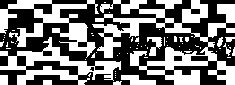
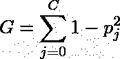
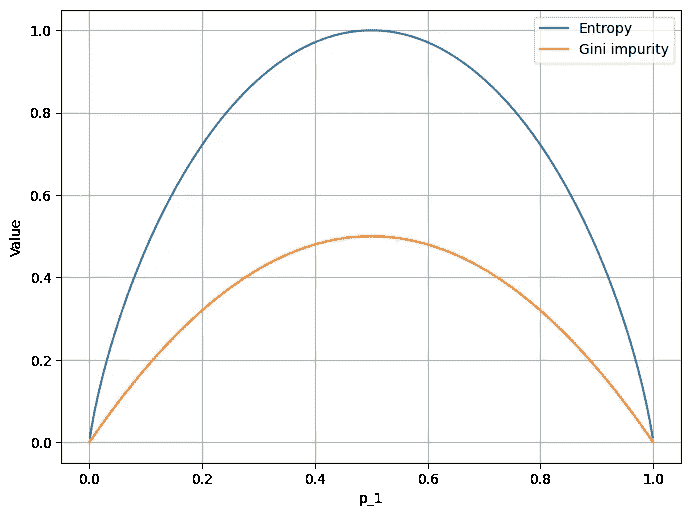
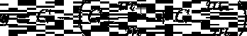

# 决策树—从头开始实施

> 原文：<https://towardsdatascience.com/decision-tree-implemented-from-scratch-f11f7ca6aa0?source=collection_archive---------34----------------------->


蝴蝶效应，与决策树无关…，波兰 2020(作者供图)。

*我想把这个作品扩展成一个系列——教程* [*视频*](https://www.youtube.com/watch?v=NSVTTuOhwz0) *。如果你有兴趣，请* ***订阅*** *到我的* [*简讯*](https://landing.mailerlite.com/webforms/landing/j5y2q1) *保持联系。*

# 介绍

当谈到制作模型时，不难有这样一种印象，即当今世界都是关于神经网络的。许多团队似乎吹嘘超级酷的架构，好像获得足够高质量的数据很简单，GPU 机架 24/7 开放(免费)，他们的客户的耐心被设置为无穷大。

在本文中，我们将介绍一种最基本的机器学习算法，称为*决策树*。决策树通常被认为是“救援”模型，因为它们不需要大量的数据就能工作，并且易于训练。尽管有过度拟合的倾向，但由于预测机制的本质，这些树在解释上有很大的优势。

传统上，我们将从零开始实现和训练模型，使用基本的 numpy 和 pandas。请注意，无论如何，我们实现它的方式不是唯一可能的方式。在这里，我们通过从第一原理设计我们的树来集中解释算法的内部工作。因此，更多地将其作为演示，而不是生产解决方案，例如在 [scikit-learn](https://scikit-learn.org/stable/modules/generated/sklearn.tree.DecisionTreeClassifier.html) 中可以找到。

# 理论

决策树因其类似于树的结构而得名。经过训练的树将通过一系列*节点*传递示例数据(也称为“splits”，稍后会详细介绍)。每个节点都充当下一个节点的决策点。最终节点，即“叶子”，相当于最终预测。

# 培训过程

训练决策树是识别最佳节点结构的过程。为了解释这一点，考虑一个二维输入特征向量，我们希望为其识别一个目标类。第一个节点需要“知道”要检查向量的哪个分量 *x[k]，k = 1，2，…，n* ，以及要检查的阈值 *x[t]* 是什么。根据决定，向量将被路由到不同的节点，依此类推。

一个训练有素的树的节点和它们各自的参数 *(k，x[t])* 以这样一种方式选择，即错误识别的目标类的数量是最低的。现在的问题是如何构建这样的节点？

这里，至少有两个数学公式可以帮助我们。

## 交叉熵公式



## 基尼系数(基尼系数)



蝴蝶效应，与决策树无关…，波兰 2020(作者供图)。

这两个公式都表达了关于系统的某种 T2 信息。因为交叉熵函数看起来非常类似于基尼系数(图 1。)，我们可以使用它们中的任何一个来建立我们的直觉(和模型)。然而，为了清楚起见，让我们使用后者。



图一。基尼系数与熵的关系是根据一个实例类的概率计算的。(图片由作者提供)

# 解释

如前所述，这两个函数都表达了某种信息。考虑一个二进制分类系统(在这种情况下，类的数量是 *C = 1* ，我们只能打赌一个给定的例子是否应该被赋予一个给定的标签)。从分类的角度来看，如果能够知道结果应该是什么，那么最安全的情况就是发生了。在这种情况下，与结果相关的概率要么为零，要么为一。由于对于 *C = 1* ， *G = 1-p = p(1-p)* ，这种情况下的基尼系数为零。这个系统是“纯”的，在某种意义上我们知道会发生什么。

现在，我们一不确定 *(0 < p < 1)，G > 0* ，正好在我们知道最少 *p = 1/2* 的时候达到峰值。熵也是如此。它越高，系统就越“混乱”,或者说我们得到的“信息”最少。

添加更多的类 *C > 1* 不会改变这里的逻辑。这两个数字通过总和 *j = 1，2，…，C* 从所有类别中提取贡献。

# 减少杂质

好吧，但是基尼系数如何帮助我们解决训练决策树的问题呢？如前所述，这都是关于战略性地设置节点，因此它们都有助于做出好的决策。任何决策(任何节点)都相当于在某个特定值沿给定轴对参数空间进行切片或*分裂*。如果选择 *(k，x[t])* 的方式使我们对系统的了解逐渐增加，那么更有可能做出“好”的决策。换句话说，在这两个几乎形成的子空间中，不确定性比开始时要少。

如果 G+和 G-是与分裂后的子空间相关联的基尼杂质值，我们可以将所谓的*基尼增益*定义为:



其中 *m* 是示例计数，(+)和(-)是指子空间。

增益 *g* 越高,“更明智”的节点将能够区分不同的情况。如果所有的节点都是这样选择的，我们就有了一个合理的模型。

# 履行

让我们创建一个简单的人工数据集，其中每个例子都表示为一个三维向量 x ∈ ℝ。

```
import numpy as np
import pandas as pd

from sklearn.datasets import make_classification

X, y = make_classification(
        n_samples=12,
        n_classes=3,
        n_clusters_per_class=2,
        n_features=3,
        n_informative=3,
        n_redundant=0,
        n_repeated=0,
        random_state=42)

df = pd.DataFrame(X, columns=[x for x in range(X.shape[1])])
df["target"] = y
```

在这里，我们使用熊猫只是为了方便“把东西放在一起”。最重要的是我们有三维数据 *(n = 3)* 以及三个目标类 *(C = 3)* 。下表显示了数据集。

```
|      0 |      1 |      2 |  target |
|-------:|-------:|-------:|--------:|
|  0.78  | -1.09  | -0.99  |       0 |
|  1.56  |  0.87  | -0.93  |       1 |
|  1.17  | -0.25  |  0.54  |       0 |
| -1.84  | -0.70  | -2.71  |       2 |
| -1.91  | -1.57  |  0.98  |       1 |
| -0.96  | -0.77  | -3.92  |       2 |
| -0.83  | -2.70  | -2.13  |       0 |
|  0.02  |  2.20  | -0.08  |       2 |
|  1.62  |  0.38  |  0.83  |       0 |
| -0.14  | -0.70  |  1.39  |       1 |
|  2.29  |  0.48  |  0.32  |       1 |
|  0.53  |  2.33  | -0.12  |       2 |
```

# 基尼杂质

计算基尼系数是我们会反复做的事情。因此，将其包装为函数是有意义的。

```
def gini(df):
    probs = {}
    for c in df["target"].unique():
        probs[c] = len(df.query("target == @c")) / len(df)
    return sum([p * (1 - p) for p in probs.values()])
```

整个函数是前面陈述的公式的实现。我们迭代目标类(`line 3.`)，并通过计数事件获得概率。

# 基尼增益

有了基尼系数的代码，让我们创建一个基尼系数的函数。

```
def gini_gain(df, feature_name, feature_value):
    df_a = df.query(f"{feature_name} < @feature_value")
    df_b = df.query(f"{feature_name} >= @feature_value")

    total_gini = gini(df)
    gini_a = gini(df_a)
    gini_b = gini(df_b)

    m, m_a, m_b = len(df), len(df_a), len(df_b)

    return total_gini - gini_a * m_a / m - gini_b * m_b / m
```

自然，增益值取决于对 *k* ( `feature_name`)和*x【t】*(`feature_value`)的具体选择。因此，该函数必须将它们作为输入。然后，我们简单地将数据集分成两部分，用`_a`和`_b`替换((+)和(-)，并返回增益值。

# 寻找最佳分割

功能`gini`和`gini_gain`只是工具。为了找到最佳分割 *(k，x[t])* ，我们需要比较各种选项，选择增益最大的一个。最简单的方法是迭代现有维度 *(k = 1，2，…，n)* ，并沿该维度扫描阈值 *x[t]* ，每次都评估增益。

```
def find_best_split(df, density_per_feature=10):
    splits = pd.DataFrame()

    for feat in [feat for feat in df.columns if feat != "target"]:
        split_candidates = np.linspace(
            df[feat].min(),
            df[feat].max(),
            num=density_per_feature,
        )

        _splits = pd.DataFrame()
        _splits["candidate_values"] = split_candidates
        _splits["feature"] = feat
        _splits["gini_gain"] = _splits["candidate_values"].apply(
            lambda value: gini_gain(df, feat, value)
        )

        splits = pd.concat([splits, _splits])

    best_split = splits \
        .sort_values(by="gini_gain", ascending=False) \
        .iloc[0]

    return best_split["feature"].iloc[0], \
           best_split["candidate_values"].iloc[0]
```

如您所见，`density_per_feature`是一个附加参数，用于选择我们扫描的粒度(通常越大越好，但也越长)。`line 4.`中的循环是循环结束。然后，我们定义`split`和`_split`纯粹是为了方便。有了这些辅助数据帧，我们可以使用`.apply`方法自动获得帧中每个条目的基尼系数，并使用`.sort_values`找到最佳选项。识别之后，我们返回节点的选择维度以及阈值。

# 那棵树

决策树由节点组成。在训练时，我们不仅需要使节点“最优”,而且我们需要创建整个树结构，以便节点一起工作。而对于节点，我们有`find_best_split`函数，我们需要将它们组织成一棵树。

> 要理解递归，首先要理解递归。

考虑以下函数:

```
def func(tree, max_iter=5):
    max_iter -= 1
    if max iter <= 0:
        return [max_iter]
    node = [max_iter, func(tree, max_iter)]
    tree.append(node)
    return node
```

这是一个递归函数。它随后构建了一个简单的树(或者更确切地说是一个“树枝”)，通过嵌套连续的数字，就像这样:

```
tree = func([])
print(tree)

[4, [3, [2, [1, [0]]]]]
```

如您所见，调用`func`的过程一直持续到它达到`max_iter`条件。在此之前，它会一直调用自身并向结构中添加节点。

我们的决策树是一个二叉树(每个节点分支到两个子节点)。因此，我们需要稍微修改一下`func`，以支持模式子节点，并用一对 *(k，x[t])* 替换单个数字。因此，我们可以接受一个约定，其中每个节点由四个元素的列表定义:

1.  分割特征(或尺寸) *k* ，
2.  分裂值(阈值)*x【t】*，
3.  如果决策条件为真，则响应的子节点，
4.  决策条件为假时做出响应的子节点。

此外，我们需要定义一个停止条件，以防止无休止的循环链。我们同意采用以下方法:

1.  一旦我们只剩下给定子节点的单个类的所有元素，这意味着已经识别了特定决策节点序列的标签。因此，我们可以存储一个类标签。
2.  如果我们怀疑树可能太深，我们也可以终止递归并取类的平均值(或模式)。这个模型不太精确，但是训练速度更快。

# 种植树木

让我们用`split`代替`func`的名字，并重新加工内部零件。

```
def split(tree, df, max_depth=5):

    splitting_feature, splittng_value = find_best_split(df)

    df_a = df.query(f"{splitting_feature} < @splitting_value")
    df_b = df.query(f"{splitting_feature} >= @splitting_value")

    max_depth -= 1

    if len(df_a) == 0 or len(df_b) == 0 or max_depth == 0:
        target_a = set(df_a["target"]) if len(df_a) > 0 else set([])
        target_b = set(df_b["target"]) if len(df_b) > 0 else set([])
        target =Hey! Do you mind helping me out? target_a.union(target_b)

        node = [splitting_feature, splitting_value, target, target]
        return node

    node = [
        splitting_feature, 
        splitting_value, 
        split(tree, df_a, max_depth=max_depth),
        split(tree, df_b, max_depth=max_depth),
    ]
    tree.append(node)
    return node

tree = split([], df, max_depth=10)
```

现在，我们来分解它。如果你仔细观察，`split`函数递归地工作，就像`func`一样。区别在于我们如何构造每个节点。这里，在我们为一个给定的节点确定了最佳对，并将数据集分成两个子集之后，我们测试是否达到了停止条件。如果子集`df_a`和`df_b`中的任何一个缺少元素，这意味着我们已经到达了一片叶子，将不会再有来自该节点的分裂。同时，`target_a`或`target_b`是一个空集，因此集合的并集`target`将包含剩余的标签。除非我们提前终止这个过程(通过`max_iters`),否则`set`操作会将标签压缩到一个单元素集合中。这样，我们不仅唯一地标识了目标类，还坚持了将节点定义为四元素列表的惯例，其中最后两个元素是可迭代的，这防止了`TypeError`异常。

如果条件不适用，该过程继续。在这种情况下，每个节点“记住”最佳参数以及源于当前参数的两个子节点。

一个经过训练的树的示例可能如下所示:

```
[2, 0.208,
    [1, -1.023,
        [0, -0.839, {0}, {0}],
        [0, 0.804,
            [0, -1.845, {2}, {2}],
            [0, 1.5628, {1}, {1}]
        ]
    ],
    [1, -0.429,
        [0, -1.915, {1}, {1}],
        [0, 2.166,
            [0, 1.172, {0}, {0}],
            [0, 2.290, {1}, {1}]
        ]
    ]
]
```

# 作为模型的树

虽然这种嵌套结构可能看起来不令人满意，但对于机器来说，理解起来非常简单。基于该树的模型只需要使用列表的第一个元素来选择要检查的特性，将其与第二个元素进行比较，并根据结果将问题转发给第三个或第四个元素。重复这个过程，直到得到一个集合，并返回它的内容作为一个预测。

让我们实现这样一个模型。

```
def model(tree, data):
    node = tree
    while not isinstance(node, set):
        feature = node[0]
        value = node[1]
        node = node[2] if data[feature] < value else node[3]
    return list(node)[0]
```

现在，我们可以使用`.apply`方法对数据集运行这个模型:

```
df["predicted"] = df.get([0, 1, 2]).apply(
    lambda row: model(tree, row.to_numpy()), axis=1
)
```

请注意，`[0, 1, 2]`列表指的是特征的名称。结果如下表所示。

```
|          0 |         1 |          2 |   target |   predicted |
|-----------:|----------:|-----------:|---------:|------------:|
|  0.784972  | -1.09651  | -0.999525  |        0 |           0 |
|  1.56221   |  0.876346 | -0.937159  |        1 |           1 |
|  1.1727    | -0.258296 |  0.542743  |        0 |           0 |
| -1.84585   | -0.703202 | -2.71293   |        2 |           2 |
| -1.91564   | -1.57344  |  0.982937  |        1 |           1 |
| -0.966766  | -0.774834 | -3.92814   |        2 |           2 |
| -0.839739  | -2.70451  | -2.13491   |        0 |           0 |
|  0.0284821 |  2.20555  | -0.0827445 |        2 |           2 |
|  1.62031   |  0.382993 |  0.835343  |        0 |           0 |
| -0.144515  | -0.700331 |  1.39023   |        1 |           1 |
|  2.29084   |  0.486279 |  0.323968  |        1 |           1 |
|  0.532064  |  2.33869  | -0.120604  |        2 |           2 |
```

# 结论

正如您所看到的，决策树非常简单，但是实现起来可能并不简单。无论如何，在任何生产代码中，我们强烈建议您使用已经存在的实现。此外，你可能还应该研究所谓的*集成*方法，如随机森林，由于结合了几个模型的优势，它可能会给你带来额外的准确性提升。

*原载于*[*https://zerowithdot.com*](https://zerowithdot.com/decision-tree/)*。*