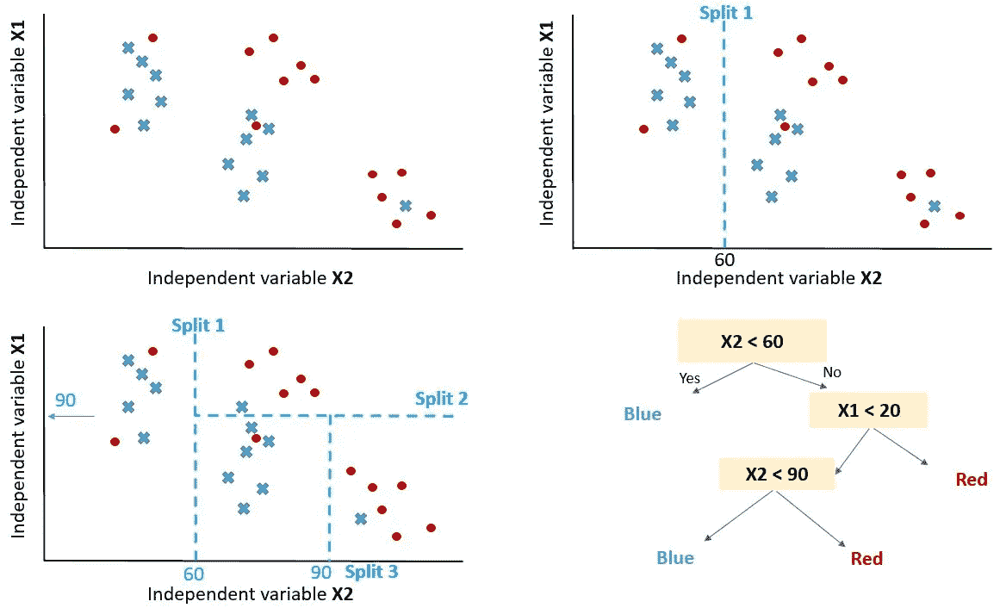
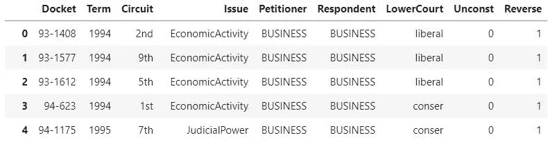
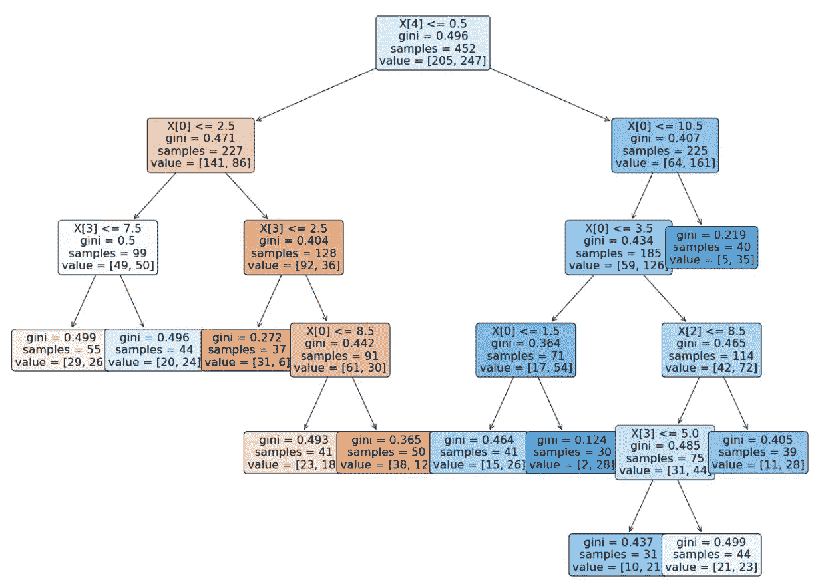

# Python 中的决策树模型—构建、可视化、评估

> 原文：<https://towardsdatascience.com/decision-tree-models-934474910aec?source=collection_archive---------5----------------------->

## 使用 Python 的 MITx Analytics Edge 指南和示例

分类和回归树(CART)可以被转换成用于预测分类的图表或规则集。当逻辑回归模型无法提供足够的决策界限来预测标签时，它们会有所帮助。此外，决策树模型更容易理解，因为它们模拟了人类的决策过程。此外，决策树回归可以捕捉非线性关系，从而允许更复杂的模型。


作者根据[约翰·西门子](https://unsplash.com/@emben?utm_source=medium&utm_medium=referral)在 [Unsplash](https://unsplash.com?utm_source=medium&utm_medium=referral) 上的照片修改

## 购物车模型是如何工作的？

考虑两个独立变量 X1 和 X2 的情况。我们想预测结果是红色还是蓝色。CART 试图将这些数据分割成子集，使每个子集尽可能地纯净或同质。



决策树逻辑和数据分割-作者图片。

第一次分割(split1)以这样的方式分割数据，如果变量 X2 小于 60 将导致蓝色结果，否则将导致查看第二次分割( *split2* )。 *Split2* 导向预测红色当 **X1 > 20** 考虑 **X2 < 60** 时。如果**X2<90**split 3 将预测蓝色，否则预测红色。

## 如何控制模型性能？

在您通过学科知识或特征选择过程为模型选择了要考虑的变量后，您将需要定义最佳分割数。

分割的目标是增加每个节点结果的同质性。提高其对数据进行分类的能力。换句话说，每次拆分后增加纯度。如果我们预测蓝色和红色，如果可能的话，选择给出全部蓝色和全部红色的分裂数。选择将生成纯结果的拆分数量。

> 纯节点是导致完美预测的节点。

但是如何量化拆分后的纯度，以确保我们有尽可能多的纯节点。

我们的目标是减少每次拆分后的不确定性。一个不好的拆分会让结局 50%蓝 50%红。例如，完美的分割将给出 100%的蓝色。

要衡量拆分在拆分后信息增加方面的表现，我们可以依赖以下指标:

1 — **熵** [ `entropy = -1*sum(p*log(p))` ]

2 — **基尼杂质** [ `Gini = sum(p(1-p)), where p is the proportion of misclassified observation within the sub partition` ]

# 例子:预测法官史蒂文斯的决定

目标是预测史蒂文法官是否投票推翻法院判决，1 表示投票推翻判决，0 表示他支持法院的判决。

代码和数据可在 [**GitHub**](https://github.com/muadelm/MITx_Analytics_Edge/tree/main/CART%20model_Supreme%20Court%20Forecasting) 获得。

数据框显示如下，带有目标变量(反向)。



史蒂文法官的法庭判决——图片由作者提供

**重要提示**:决策树(DT)既可以处理连续变量，也可以处理数值变量。但是如果您使用 Python Scikit Learn，您可能会得到分类的 ValueError。

这些要素具有许多分类值，我们将使用以下函数将其转换为数值:

```
**def** convert_cat(df,col):
    """
    input: dataframe and col list of categorical columns
    output: dataframw with numerical values
    """
    **for** c **in** col:
        item_list **=** df[c]**.**unique()**.**tolist()
        enum**=**enumerate(item_list)
        d **=** dict((j,i) **for** i,j **in** enum)
        print(c)
        print(d)

        df[c]**.**replace(d, inplace**=True**)
    **return** dfconvert_cat(df,['Circuit', 'Issue', 'Petitioner', 'Respondent',
       'LowerCourt'])
```

将数据分为训练和测试

```
X_train, X_test, y_train, y_test **=** train_test_split(X, Y, test_size**=**0.2, random_state**=**0)
```

基于训练数据构建决策树模型

```
clf **=** tree**.**DecisionTreeClassifier('gini', min_samples_leaf**=**30, random_state**=**0)
clf **=** clf**.**fit(X_train, y_train)
```

绘制决策树模型

```
**from** sklearn **import** tree *# for decision tree models*plt**.**figure(figsize **=** (20,16))
tree**.**plot_tree(clf, fontsize **=** 16,rounded **=** **True** , filled **=** **True**);
```



决策树模型—作者图片

使用分类报告评估模型。

```
report **=** classification_report(predTree, y_test)
print(report)
```

## 参考

关于 edX 的 MITx 分析课程

<https://machinelearningmastery.com/classification-and-regression-trees-for-machine-learning/>  <https://blog.bigml.com/2016/09/28/logistic-regression-versus-decision-trees/> 