# 决策树

> 原文：<https://towardsdatascience.com/decision-trees-14a48b55f297?source=collection_archive---------22----------------------->

## 机器学习中的分类树和回归树综述


西蒙·瑞在 [Unsplash](https://unsplash.com/s/photos/decision-trees?utm_source=unsplash&utm_medium=referral&utm_content=creditCopyText) 上拍摄的照片

这篇文章将作为决策树的高级概述。它将涵盖决策树如何使用递归二进制分裂进行训练，以及使用**[**信息增益**](https://homes.cs.washington.edu/~shapiro/EE596/notes/InfoGain.pdf)****[**基尼指数**](http://www.learnbymarketing.com/481/decision-tree-flavors-gini-info-gain/)**进行特征选择。我还将调整超参数和修剪决策树进行优化。这篇文章中涉及的两个决策树算法是 **CART(分类和回归树)**和 **ID3** **(迭代二分法 3)。**********

****决策树在预测建模方面非常流行，并且执行分类和回归。决策树是高度可解释的，并且为更复杂的算法提供了基础，例如随机森林。****

****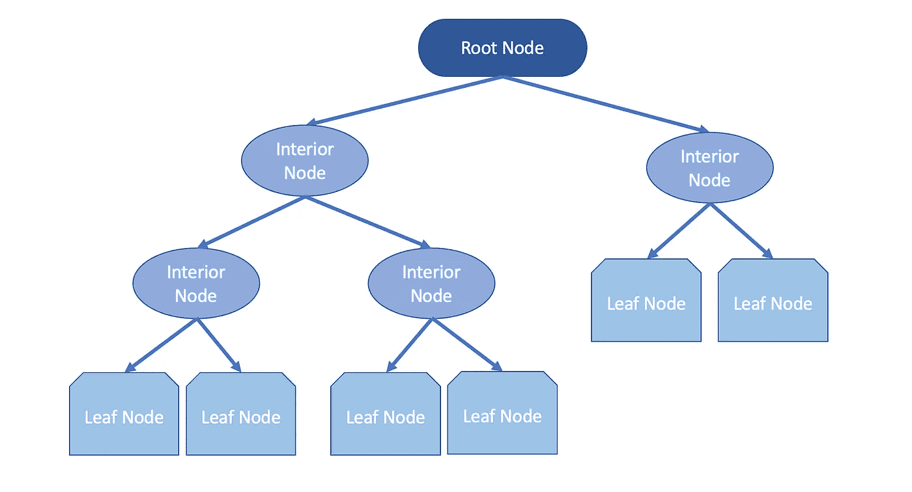****

****作者图片****

****决策树的结构可以被认为是一个 [**有向无环图**](https://www.statisticshowto.com/directed-acyclic-graph/)**一系列节点，其中每条边都是从前面指向后面的。这个图是单向流动的，任何对象都不能是自身的子对象。看一下上面的 DAG，我们可以看到它从一个根节点开始，最佳属性成为内部节点，即决策节点。然后，内部节点检查条件并执行决策，将样本空间一分为二。叶子节点代表一个分类，当记录到达叶子节点时，算法将分配相应叶子的标签。这个过程被称为样本空间 的递归 [**划分。使用决策树时的术语:**](https://online.stat.psu.edu/stat555/node/100/)******

```
****Parent Node** - a node divided into sub-nodes**Child Node** - sub-nodes from a parent node**Root Node** - represents the sample space/population that will be split into two or more sets (sub-nodes)**Decision Node** - sub-node that splits into more sub-nodes

**Leaf Node** - nodes without splits (children)**Branch** - a subsection of a decision tree**Pruning** - reducing the size of a decision tree by removing nodes**
```

## ****分割标准****

********

****凯文在 [Unsplash](https://unsplash.com/s/photos/split-tree?utm_source=unsplash&utm_medium=referral&utm_content=creditCopyText) 上[悲伤](https://unsplash.com/@grievek1610begur?utm_source=unsplash&utm_medium=referral&utm_content=creditCopyText)的照片****

****决策树使用一些成本函数来选择最佳分割。我们试图找到在分类训练数据方面表现最佳的最佳属性/特征。重复该过程，直到到达叶节点，因此，被称为 [**递归二进制分割**](https://daviddalpiaz.github.io/stat432sp18/slides/isl/trees.pdf) 。当执行这个过程时，所有的值被排列起来，树将测试不同的分割，并选择返回最低成本的一个，使这成为一个贪婪的方法。****

****需要注意的是，由于算法重复地将数据划分成更小的子集，最终的子集(叶节点)由很少或只有一个数据点组成。这导致算法具有 [**低偏差和高方差**](https://www.listendata.com/2017/02/bias-variance-tradeoff.html) 。****

## ****熵和信息增益****

****决策树的一个广泛使用的度量是熵。以克劳德·香农命名的香农熵为我们提供了测量不确定性的方法。说到数据，熵告诉我们我们的数据有多乱。高熵值表示预测能力较低，可以将特征的熵视为该特征中的信息量。决策树在进行分割时最大化类的纯度，在叶节点中提供更清晰的类。熵是在每次分割前后计算的。如果熵增加，将尝试另一个分裂，或者树的分支将停止，即，当前树具有最低的熵。如果熵减小，分裂将被保持。计算整个数据集熵的公式:****

****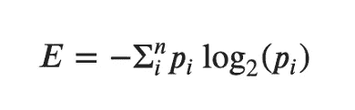****

****其中 **𝑛** 是组的数量，( **𝑝𝑖** )是属于第 ***i*** 组的概率。假设我们有一个包含 462 个正(1)标签和 438 个负(0)标签的数据集。我们可以通过以下方式计算数据集的熵:****

****信息增益使用熵作为杂质的度量。这是分裂前后熵的差异，它会给我们一个不确定性减少了多少的数字。它也是 ID3 分类树算法中使用的关键标准。要计算信息增益:****

****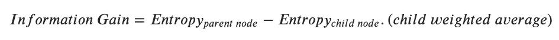****

## ****基尼杂质****

****当执行分类任务时，使用基尼指数函数。来自 [**科拉多基尼**](https://en.wikipedia.org/wiki/Corrado_Gini) 这个函数告诉我们树中的叶节点有多“纯”。基尼系数永远是一个从 0 到 0.5 的值，这个值越高，这个群体就越混乱。为了计算基尼系数:****

****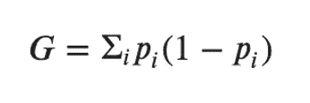****

****其中( **𝑝𝑖** )是属于第 ***i*** 组的概率。上面的等式表明，基尼系数等于 1 减去每次分割中不同概率的总和。****

## ****修剪决策树****

********

****图片由 Shutterstock 上的 [ueuaphoto](https://www.shutterstock.com/g/ueuaphoto) 提供****

****当决策树通过执行递归二分分裂来训练时，我们也可以设置停止树的参数。决策树越复杂，就越容易过度拟合。我们可以通过使用超参数修剪来修剪树:****

*   ******最大深度** -决定我们希望树有多深****
*   ******min_samples_leaf** -每个叶节点中训练样本的最小数量****
*   ******最大叶节点数** -最大叶节点数****
*   ******最小 _ 杂质 _ 减少**-**-**阈值确定一个节点是否会分裂或变成一片叶子****

****还有更多可以更改的参数，如需列表和更详细的解释，请查看 [**文档**](https://scikit-learn.org/stable/modules/generated/sklearn.tree.DecisionTreeClassifier.html) 。****

## ******带 Scikit 的决策树-学习******

****我们用 sklearn 搭建一个决策树分类器。我将使用 [**泰坦尼克号数据集**](https://www.kaggle.com/c/titanic) ，目标是`Survived`特征。我正在加载的数据集之前已经清理过了。有关数据集中要素的描述，请参阅下面的数据字典。****

****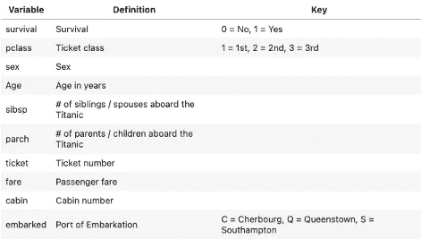****

****作者图片****

******导入必要的库******

******载入并预览数据集******

****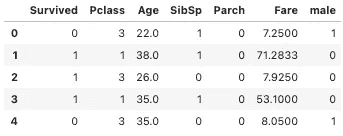****

******定义预测器和目标特征，执行训练测试分割，预处理数据******

******训练决策树分类器******

****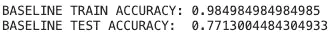****

****决策树分类器在训练集上的表现优于测试集，表明模型过拟合。决策树易于过度拟合，因为递归二进制分裂过程将持续到到达叶节点，导致模型过于复杂。这是我们执行超参数调整和修剪来优化分类器的地方。****

******标图树******

****为了直观地看到分割，绘制树可能是有帮助的。我们可以用一些额外的库来绘制树。****

****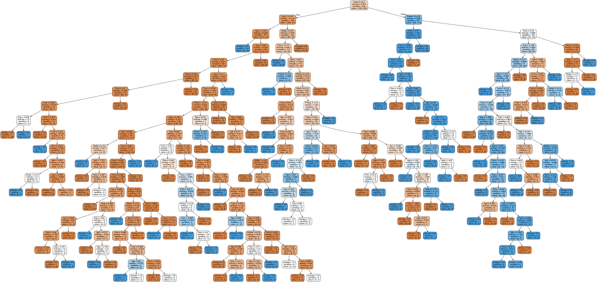****

******特征重要性******

****如果我们想要检查模型的 [**特征重要性**](/the-mathematics-of-decision-trees-random-forest-and-feature-importance-in-scikit-learn-and-spark-f2861df67e3) ，我们可以使用决策树分类器中的`.feature_importances_`属性。使用基尼系数计算特征重要性。****

****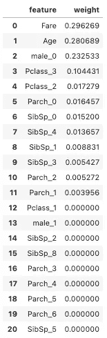****

******用网格搜索 cv 优化决策树分类器******

****通过运行交叉验证的网格搜索，我们可以输入包含决策树超参数的不同值的参数字典。我已经使用了上面提到的剪枝超参数和默认的 5 折交叉验证。****

****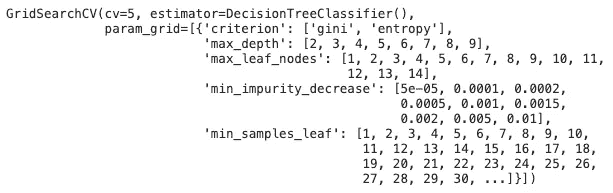********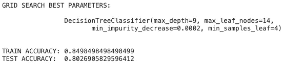****

****通过运行交叉验证的网格搜索，最佳参数改善了我们的偏差-方差权衡。具有默认参数的第一个模型在训练集上的表现比测试集好 20%，表明树中的低偏差和高方差。具有来自网格搜索的超参数集的决策树显示，从训练和测试集来看，方差降低了 5%。****

## ******用推车回归******

****执行回归任务的决策树也像分类一样将样本划分成更小的集合。回归树的目标是递归地划分样本空间，直到一个简单的回归模型能够适合单元。回归树中的叶节点是分区的单元。适合每个分区的简单回归模型取该分区因变量的平均值，即样本平均值用于进行预测。****

****我们使用上面的熵作为杂质的量度来进行分类。对于回归，CART 算法利用 [**均方误差**](https://www.statisticshowto.com/mean-squared-error/) 作为杂质的度量。****

****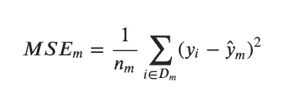****

*   ******𝐷𝑚** 是节点 **𝑚** 中的训练子集****
*   ******𝑛𝑚** 是节点 **𝑚** 的训练样本数****
*   ******𝑦𝑖** 是第 ***i*** 个样本的目标值****
*   ******𝑦̂𝑚** 是预测的目标值，样本的平均值****

****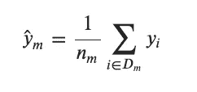****

****在评估模型的性能时，我们会着眼于[**【RMSE】**](https://www.statisticshowto.com/probability-and-statistics/regression-analysis/rmse-root-mean-square-error/)。这就是误差平方平均值的平方根。通过求平方根，我们可以测量误差的大小，大误差的权重大于平均值。我们将用于评估模型拟合优度的指标是 [**R 平方**](https://statisticsbyjim.com/regression/interpret-r-squared-regression/) 值。r 平方告诉我们因变量中方差的百分比，共同解释 *(Frost 等人，2020)* 。****

****CART 不仅可以用于回归。[这里有一篇](https://neptune.ai/blog/anomaly-detection-in-time-series)来自 [Neptune.ai](https://neptune.ai/blog) 的有趣文章，其中决策树用于检测时间序列数据中的异常值/异常。****

## ****使用 Scikit-Learn 的回归树****

****让我们继续用 sklearn 构建一个 [**决策树回归器。我将使用从 kaggle 中检索到的**](https://scikit-learn.org/stable/modules/tree.html#regression) **[**Ames 房屋数据集**](https://www.kaggle.com/c/ames-housing-data-summer-2018/data) 。出于本教程的目的，我将只使用 3 个连续特征和目标特征。******

**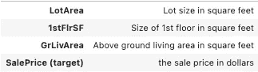**

****加载数据集，定义预测器和目标特征，并执行训练测试分割****

****训练决策树回归器****

**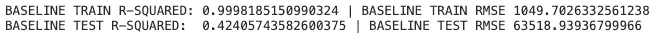**

**决策树再次过度适应训练集。与分类类似，我们可以运行交叉验证的网格搜索来优化决策树。**

****用网格搜索 cv 优化决策树回归器****

**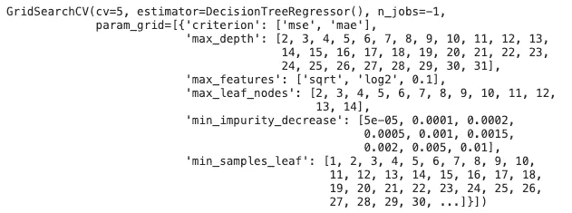****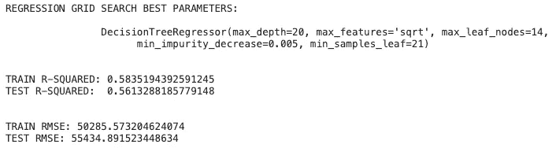**

**通过使用决策树回归器运行交叉验证的网格搜索，我们提高了测试集的性能。使用 r 平方得分为`.9998`的默认参数，r 平方与基线决策树回归器的数据过度拟合。使用网格搜索的参数，我们将测试集的 r 平方从`.42`增加到`.56`。训练 r 平方为`.58`告诉我们，模型不会过度拟合训练数据，并将在看不见的测试集上类似地执行。**

## **结论**

**决策树是很好的预测模型，可用于分类和回归。对于过多的机器学习问题，它们具有高度的可解释性和强大的功能。虽然分类和回归任务之间有许多相似之处，但理解每种任务使用的不同度量标准是很重要的。决策树的超参数有助于防止它们过度适应训练数据。需要注意的是，虽然执行网格搜索有助于找到决策树的最佳超参数，但是它们的计算开销也很大。根据所选的可能参数，您可能需要运行数小时甚至数天的网格搜索。**

**我希望这篇文章有助于更好地理解回归和分类树。如果有任何遗漏或我可以解释得更清楚的地方，请随时留下反馈！非常感谢你花时间查看这篇文章。**

## **资源**

*   ***1.10。决策树。(未注明)。检索自*[*https://scikit-learn.org/stable/modules/tree.html#*](https://scikit-learn.org/stable/modules/tree.html#)**
*   ***sk learn . tree . decision tree classifier .(未标明)。检索自*[*https://sci kit-learn . org/stable/modules/generated/sk learn . tree . decision tree classifier . html*](https://scikit-learn.org/stable/modules/generated/sklearn.tree.DecisionTreeClassifier.html)**
*   ***sk learn . tree . decision tree regressor .(未标明)。检索自*[*https://scikit-learn . org/stable/modules/generated/sk learn . tree . decisiontreeregressor . html*](https://scikit-learn.org/stable/modules/generated/sklearn.tree.DecisionTreeRegressor.html)**
*   **Ronaghan，S. (2019 年 11 月 01 日)。决策树的数学，随机森林和 Scikit-learn 和 Spark 中的特征重要性。检索自[*https://towards data science . com/the-mathematics-of-decision-trees-random-forest-feature-importance-in-scikit-learn-and-spark-f 2861 df 67 e 3*](/the-mathematics-of-decision-trees-random-forest-and-feature-importance-in-scikit-learn-and-spark-f2861df67e3)**
*   ***14.2 —递归分区。(未注明)。检索自*[*https://online.stat.psu.edu/stat555/node/100/*](https://online.stat.psu.edu/stat555/node/100/)**
*   **布朗利，J. (2020 年 8 月 14 日)。机器学习的分类和回归树。检索自[*https://machine learning mastery . com/class ification-and-regression-trees-for-machine-learning/*](https://machinelearningmastery.com/classification-and-regression-trees-for-machine-learning/)**
*   **弗罗斯特，伦巴第，哈得罗，米，阿克萨米托娃，拉梅萨，劳里。。。杜贝博士(2020 年 11 月 03 日)。回归分析中如何解释 R 平方？检索自[*https://statisticsbyjim . com/regression/interpret-r-squared-regression/*](https://statisticsbyjim.com/regression/interpret-r-squared-regression/)**
*   ***RMSE:均方根误差。(2020 年 7 月 06 日)。检索自*[*https://www . statisticshowto . com/probability-and-statistics/regression-analysis/RMSE-root-mean-square-error/*](https://www.statisticshowto.com/probability-and-statistics/regression-analysis/rmse-root-mean-square-error/)**
*   ***sk learn . metrics . mean _ squared _ error。(未注明)。检索自*[*https://scikit-learn . org/stable/modules/generated/sk learn . metrics . mean _ squared _ error . html*](https://scikit-learn.org/stable/modules/generated/sklearn.metrics.mean_squared_error.html)**
*   ***泰坦尼克号——机器从灾难中学习。(未注明)。检索自*[*https://www.kaggle.com/c/titanic*](https://www.kaggle.com/c/titanic)**
*   ***2018 年夏季艾姆斯住房数据。(未注明)。检索自*[*https://www.kaggle.com/c/ames-housing-data-summer-2018/data*](https://www.kaggle.com/c/ames-housing-data-summer-2018/data)**