# 决策树和随机森林——用 Python 实现来解释。

> 原文：<https://towardsdatascience.com/decision-trees-and-random-forests-explained-with-python-implementation-e5ede021a000?source=collection_archive---------8----------------------->

## 在本文中，我将带您了解决策树和随机森林算法的基本工作原理。我还将借助一个例子展示它们是如何在 Python 中实现的。

照片鸣谢——菲利普·塞尔纳克在 Unsplash 上

决策树是一种受监督的机器学习算法，它模仿人类的思维过程。它会做出预测，就像现实生活中人类大脑会做的那样。它可以被认为是一系列 if-then-else 语句，随着它的增长，它会在每个点上继续做出决策或预测。

决策树看起来像流程图或倒置的树。它从根长到叶，但方向颠倒。由于决策树的结构，我们可以很容易地解释决策树的决策/预测过程。

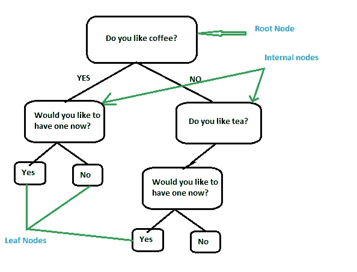

典型的二叉分裂决策树

起始节点被称为**根节点。**它通过基于某种标准做出决策而进一步分裂成所谓的**内部节点。**进一步分裂的内部节点称为父节点，由父节点形成的节点称为子节点。不再分裂的节点被称为**叶节点**。

根据目标变量的类型，决策树可以是分类树或回归树。在分类树的情况下，类别基于叶节点中的多数预测。在回归的情况下，最终预测值基于叶节点中的平均值。

根据是二分分裂还是多路分裂，有各种决策树算法。二进制拆分意味着父节点拆分成两个子节点，而在多路拆分中，父节点拆分成两个以上的子节点。

**CART** 意为分类和回归树算法处理二叉分裂树，而 **ID3** 算法处理多路分裂树。我们将详细讨论 CART 算法。(*以下决策树是指 CART 算法树*)

决策树将数据分成不同的子集，然后根据选择的属性进行拆分。该属性是根据称为**基尼指数的同质性标准选择的。**

基尼指数，基本上测量分裂发生后节点的纯度(*或杂质，我们可以说*)。也就是说，它是分割后子节点与父节点的纯度的度量。

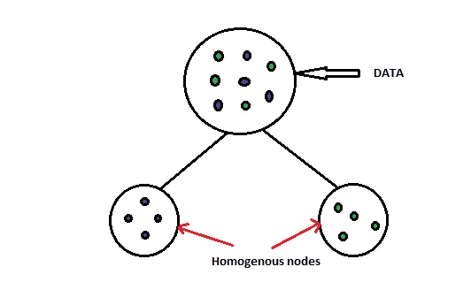

树应该基于导致子节点最大同质性的属性进行分裂。基尼指数的公式如下:

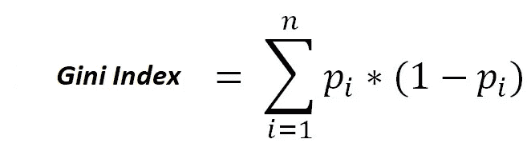

其中 **p** i 是找到带有标签 **i** 的点的概率， **n** 是目标变量的类数/结果值。

因此，该树在父节点计算基尼指数。然后为每个属性计算子节点的加权基尼指数。选择一个属性，使得我们在子节点中获得最大的同质性，并且执行分割。重复这个过程，直到所有属性都用尽。最后，我们得到了我们称之为完全成长的决策树。因此，导致初始分裂的属性可以被认为是预测的最重要的属性。

一个完全成长的决策树的问题是，它过拟合。这意味着它吸收了所有的训练数据，无法进行归纳，导致测试数据的性能很差。为了解决这个问题并从决策树中获得最大的效率，我们需要**修剪**完全成长的树或者**截断**它的成长。

修剪是一种技术，我们可以修剪完全生长的树的不太重要的分支，而截断是一种技术，我们控制树的生长，以避免过度拟合。

截断更常用，它是通过调整树的超参数来实现的，这将在示例中讨论。

总的来说，决策树是高效的算法，不需要或只需要最少的数据处理。它们可以有效地处理线性和非线性数据、分类或数字数据，并根据给定的属性集进行预测。最重要的是，它们很容易解释。

决策树的一些缺点是，它们过拟合。数据的微小变化可能会改变整个树结构，这使得它们成为高方差算法。基尼系数的计算使它们变得复杂，并且消耗大量的时间和内存。此外，它们可以被称为贪婪算法，因为它们只考虑直接分割的影响，而不考虑进一步分割的影响。

# 随机森林

各种模型(线性回归、逻辑回归、决策树等)的组合。)集合在一起作为单个模型以实现最终结果，称为**系综。**因此，在系综中，不同的模型被视为一个整体，而不是分开的。

随机森林是用大量决策树构建的强大集成模型。它克服了单一决策树的缺点以及其他一些优点。但这并不意味着它总是比决策树好。在某些情况下，决策树可能比随机林表现得更好。

集合以这样一种方式起作用，即集合中的每个模型都有助于补偿每个其他模型的缺点。我们可以说，如果一个随机的森林由 10 棵决策树组成，每棵树可能在处理数据时表现不佳，但是强壮的树有助于填补虚弱的树的空白。这就是为什么集成是一个强大的机器学习模型。

随机森林中的单棵树必须满足两个标准:

1.  **多样性**:意味着集合中的每一个模型都应该独立运行，并且应该与其他模型互补。
2.  **可接受性**:这意味着集合中的每个模型都应该至少比随机猜测的模型表现得更好。

**Bagging** 是一种常用的集成技术，用于实现分集准则。装袋台代表**B**o 带 **Agg** regation。**自举**是一种用于创建自举样本的方法。这些样本是通过对给定数据进行均匀采样并替换而创建的。引导样本包含整个数据集中大约 30%–70%的数据。创建统一长度的自举样本，并将其作为输入提供给随机森林模型中的各个决策树。然后将所有单个模型的结果**汇总**以得出最终决策。

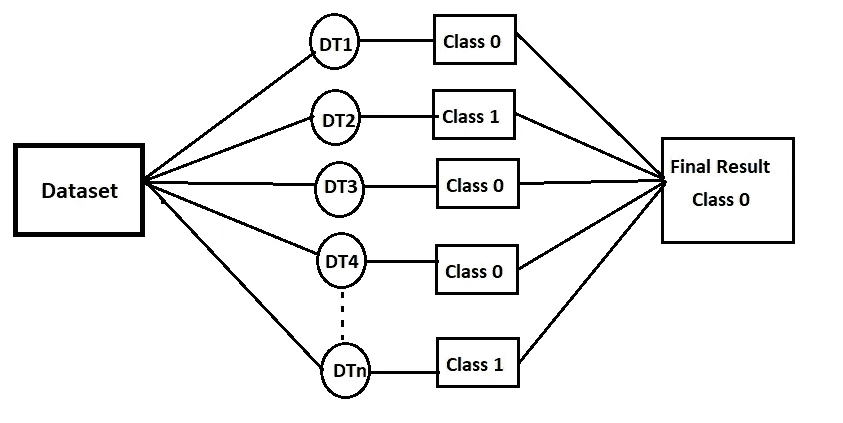

典型的随机森林分类器

此外，并不是所有的特征都用来训练每一棵树。在每棵树的每个节点上选择固定数量的随机特征集。这确保了不同树的功能之间没有相关性，并且它们独立地起作用。

在随机森林分类器中，由单个树预测的多数类被认为是最终预测，而在随机森林回归器中，所有单个预测值的平均值被认为是最终预测。

在随机森林模型中，通常不会将数据分为训练集和测试集。整个数据用于形成自举样本，从而总是留出一组数据点来形成各个树的测试或验证集。这些样品被称为**非袋装(OOB)** 样品。因此，对于随机森林集合中的每棵树，存在一组在其训练数据中不存在的数据点，并被用作评估其性能的验证集。

**OOB 误差**计算为 OOB 样本中不正确预测数与 OOB 样本预测总数的比率。

随机森林还通过消除不太重要的特征/属性，帮助确定给定数据中所有特征中的重要特征。这导致更好的预测结果。借助基尼系数计算，通过计算杂质的减少或纯度的增加来确定特征的重要性。

随机森林相对于决策树的主要优势在于它们是稳定的，并且是低方差模型。它们还克服了决策树中存在的过拟合问题。由于它们使用引导数据和随机的功能集，因此确保了多样性和稳健的性能。它们不受维数灾难的影响，因为它们不会同时考虑单个树的所有特征。

随机森林的主要缺点是缺乏可解释性。与决策树不同，我们无法追踪算法是如何工作的。另一个缺点是它们复杂且计算量大。

现在让我们在电信客户流失数据集的帮助下，看看决策树和随机森林模型的 python 实现。

## Python 实现

对于电信运营商来说，留住高利润的客户是头号业务目标。电信行业平均每年经历 15–25%的流失率。我们将分析一家领先电信公司的客户数据，建立预测模型来识别高流失风险的客户，并识别流失的主要指标。

该数据集包含连续四个月(六月、七月、八月和九月)的客户级别信息。月份分别编码为 6、7、8 和 9。我们需要使用前三个月的数据(特征)来预测最后一个月(即第九个月)的客户流失。

分析流程:

1.导入所需的库
2。阅读并理解数据
3。数据清理和准备
4。筛选高价值客户
5。流失分析
6。探索性数据分析
7。模型建筑
8。模型构建—超参数调整
9。最佳模特

导入所需的库。当需要的时候，我们会从不同的库加载更多的包。

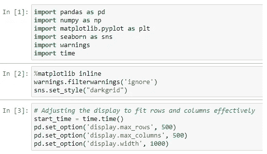

数据被载入 pandas 数据框架并进行分析。

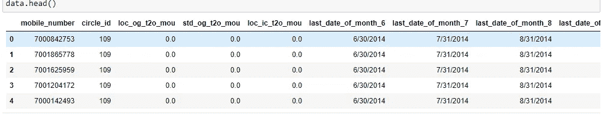

最初的分析告诉我们，该数据有 99999 行和 226 列。有许多需要估算或删除的缺失值。

大部分空值超过 30%的列被删除，对于其他列，空值被适当地估算为平均值/中值/众数。最后，我们有 99999 行和 185 列的数据集。

由于大部分收入来自高价值客户，我们相应地过滤数据，得到一个 30011 行 185 列的数据集。

我们为这些客户执行探索性数据分析(EDA)。

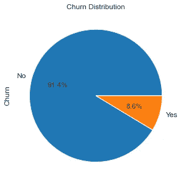

流失分析

我们可以看到 91.4%的客户是非流失客户，只有 8.6%的客户是流失客户。所以这是一个不平衡的数据集。以下是来自 EDA 的一些分析图。

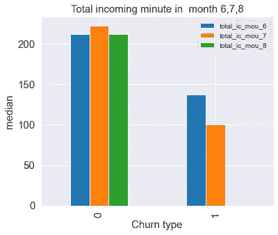

电信公司网络内的 std 呼入使用分钟数

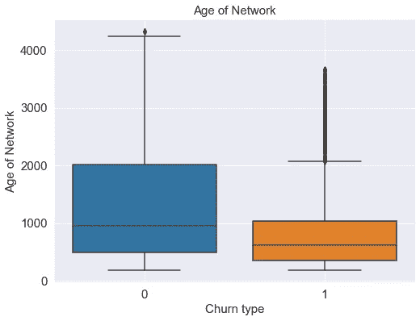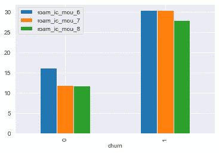

流失和非流失的漫游呼入分钟数

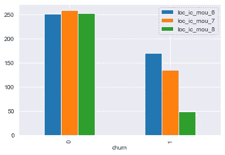

流失和非流失的本地传入使用分钟数

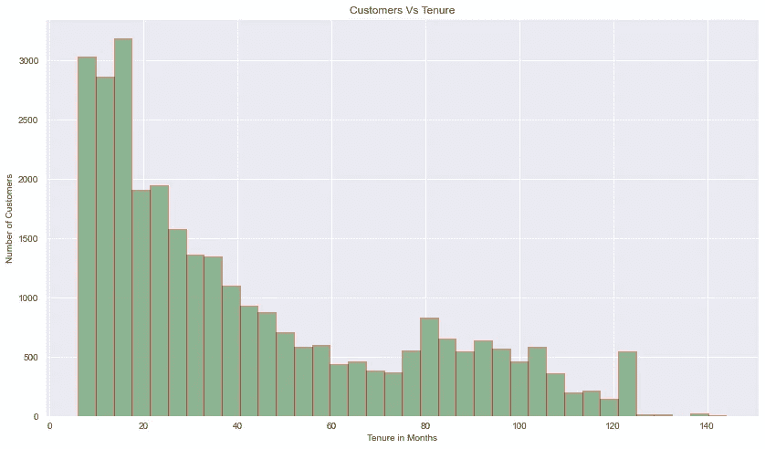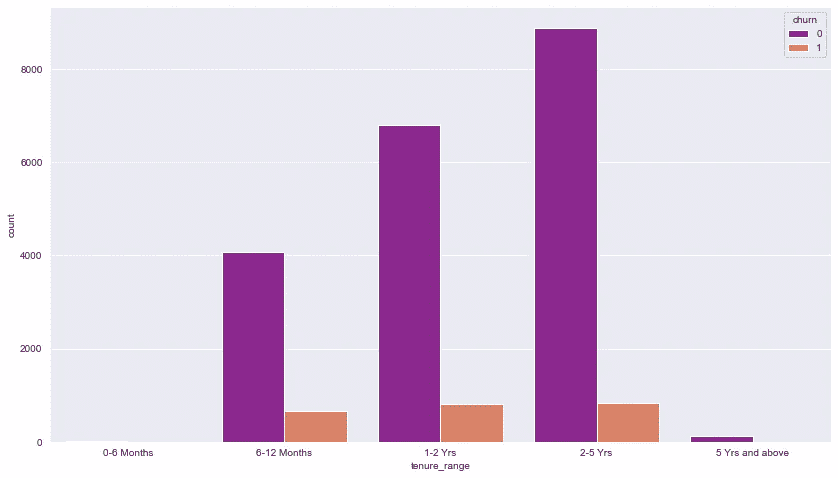

我们将数据分为训练集和测试集，并将流失变量分离为 **y、**因变量，其余特征为自变量 **X、**

我们需要处理阶级不平衡，因为我们建立的每一个模型在多数阶级中都有好的表现，而在少数阶级中表现最差。我们可以通过平衡类来处理不平衡的类。意味着增加少数或减少多数阶级。

有以下各种类别不平衡处理技术:

1.  随机欠采样
2.  随机过采样
3.  SMOTE——合成少数过采样技术
4.  ADASYN——自适应合成采样方法
5.  smetomek—过采样后欠采样

我们用逻辑回归、决策树和随机森林模型实现了所有的技术。我们需要专注于那些能给我们带来高灵敏度/高召回率的模型。结果如下:

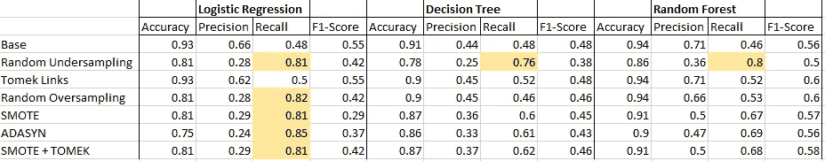

各种模型的评估指标比较

正如我们在汇总表中看到的那样，对于随机欠采样的随机森林、随机欠采样的逻辑回归、随机过采样、SMOTE、ADASYN、SMOTE+TOMEK，我们的召回值很高。在逻辑回归中，ADASYN 的回忆率最高。

我们将使用欠采样方法选取随机森林进行进一步分析。

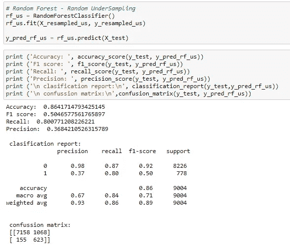

我们知道随机森林通过消除不太重要的特征来赋予我们特征的重要性。我们运行随机森林分类器并选择重要特征:

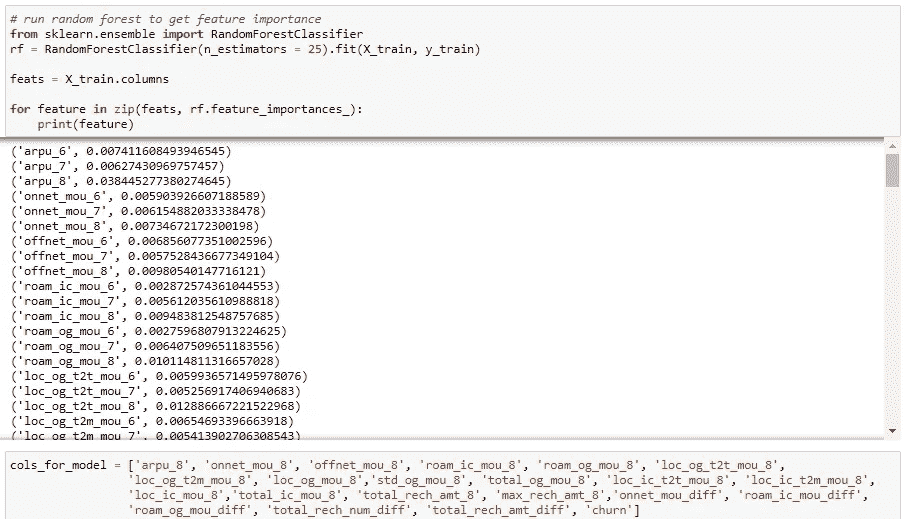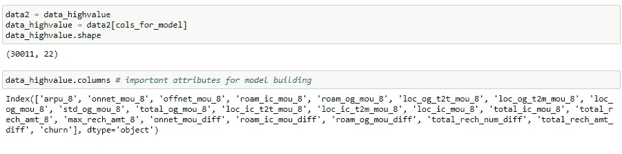

我们使用 GridSearchCV 对随机森林欠采样模型进行超参数调整。对于决策树分类器，超参数的调整是类似的。对于基本模型，我们只需要用决策树分类器替换随机森林分类器。

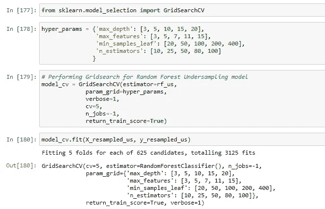

我们得到以下最佳分数和最佳模型。

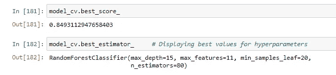

由`[**GridSearchCV**](https://scikit-learn.org/stable/modules/generated/sklearn.model_selection.GridSearchCV.html#sklearn.model_selection.GridSearchCV)`提供的网格搜索从由`param_grid`参数指定的参数值网格中详尽地生成候选值。这个过程在计算上是昂贵和耗时的，尤其是在大的超参数空间上。

还有另一种方法叫做 RandomizedSearchCV 来寻找最佳模型。这里，从指定的概率分布中采样固定数量的超参数。这提高了流程的时间效率，降低了模型的复杂性。

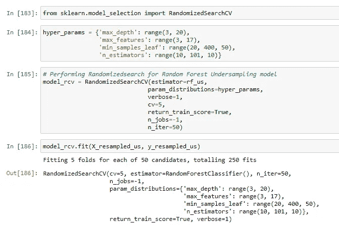

我们得到以下最佳分数和最佳模型。

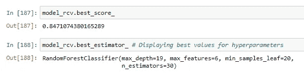

## 通过比较上述模型得到的分数和复杂度，我们得出结论，使用 RandomizedSearchCV 得到的模型是最好的模型。

我们对测试集进行预测，得到如下结果。

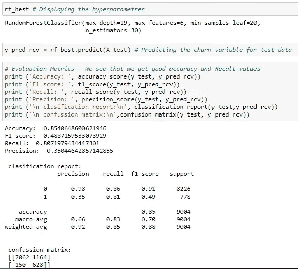

我们得到了 81%的召回率和 85%的准确率。以下是客户流失的 10 大重要预测指标。

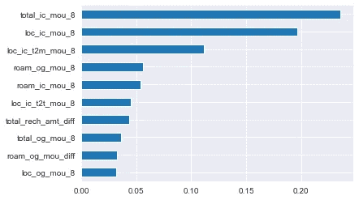

这就完成了我们的分析。希望这篇文章内容丰富，易于理解。此外，我希望您喜欢分析分析中包含的彩色图表。

请随意评论并给出您的反馈。

***可以在领英上联系我:***[***https://www.linkedin.com/in/pathakpuja/***](https://www.linkedin.com/in/pathakpuja/)

***请访问我的 GitHub 个人资料获取 python 代码。文中提到的代码，以及图表，可以在这里找到:***[***https://github.com/pujappathak***](https://github.com/pujappathak)

***参考文献:***

[*https://sci kit-learn . org/0.16/modules/generated/sk learn . grid _ search。RandomizedSearchCV.html*](https://scikit-learn.org/0.16/modules/generated/sklearn.grid_search.RandomizedSearchCV.html)

[*https://sci kit-learn . org/stable/modules/generated/sk learn . model _ selection。GridSearchCV.html*](https://scikit-learn.org/stable/modules/generated/sklearn.model_selection.GridSearchCV.html)