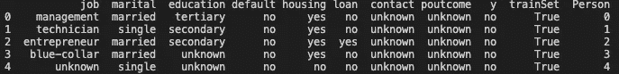
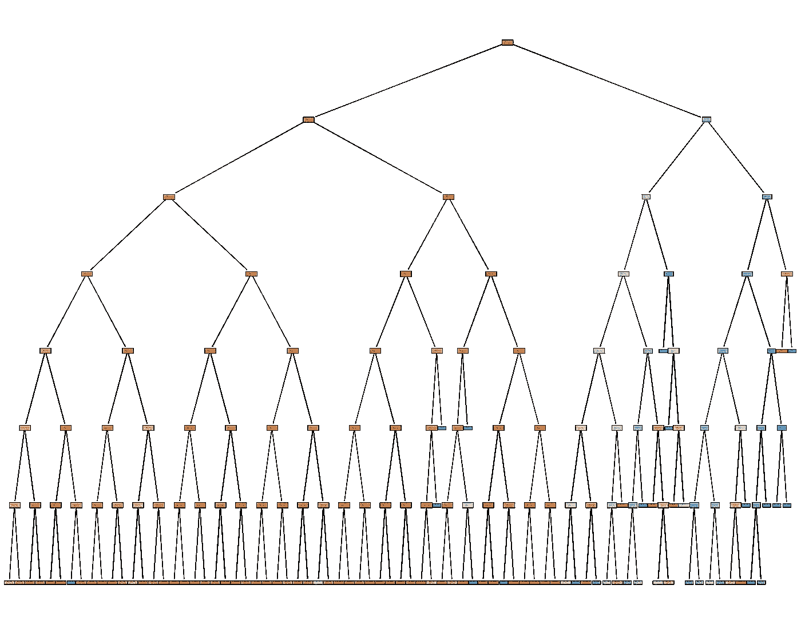
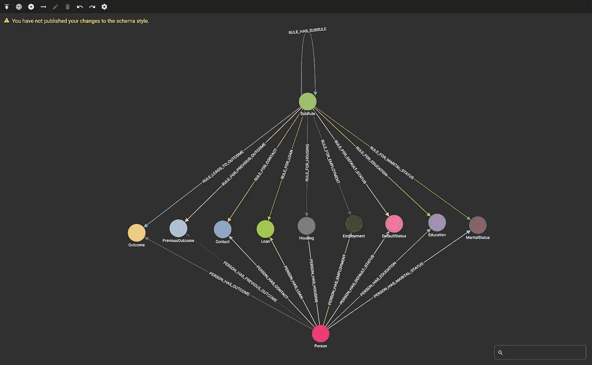
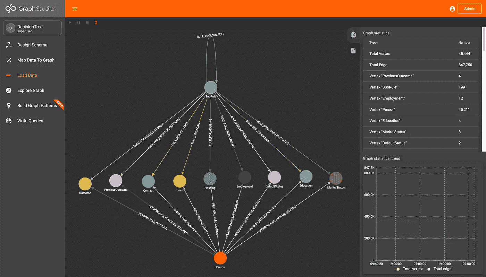
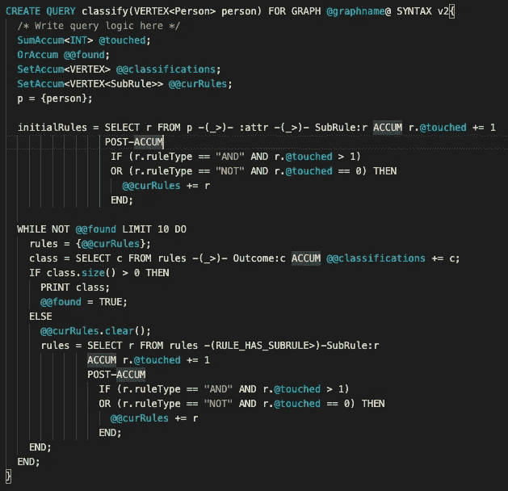
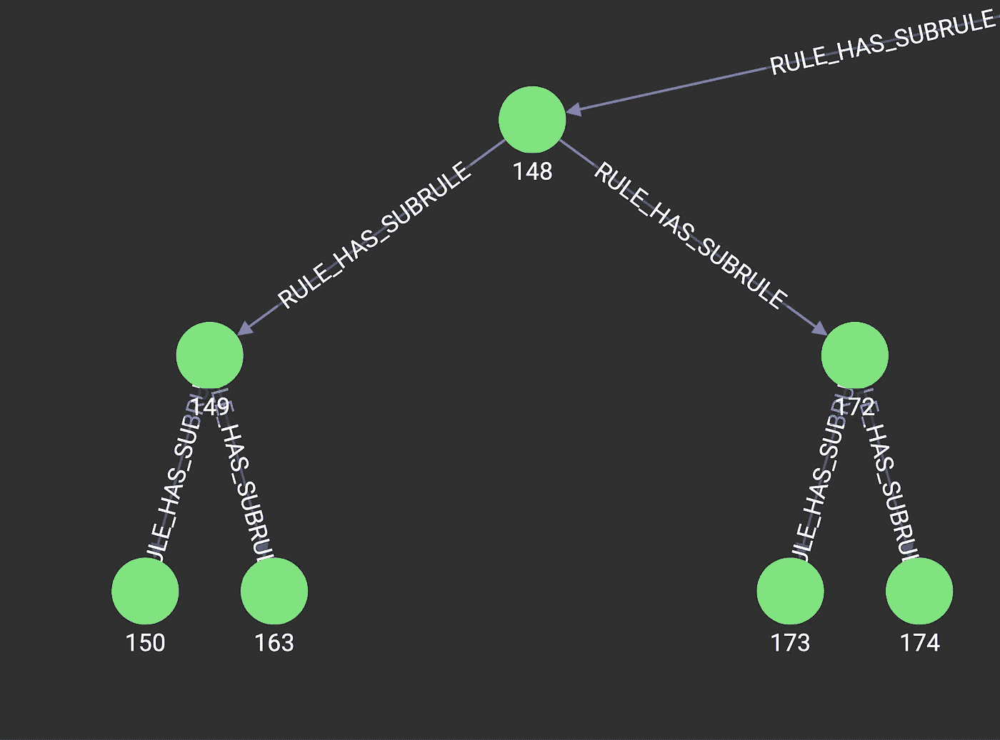

# TigerGraph 中的决策树

> 原文：<https://towardsdatascience.com/decision-trees-in-tigergraph-5eb47868a91a?source=collection_archive---------27----------------------->

## 在你的数据库中进行 ML 分类

## 介绍

我在 Optum 工作期间，3 个趋势非常重要——可解释的机器学习模型、知识图数据表示和这些知识图中规则的执行。结合这些趋势，我创建了一个在 TigerGraph 实例中执行决策树的方法。

## 数据源-银行数据集

数据来自托管在 Kaggle 上的一个数据集，在这里找到:[https://www . ka ggle . com/prakharrathi 25/banking-dataset-marketing-targets](https://www.kaggle.com/prakharrathi25/banking-dataset-marketing-targets)。鼓励通读 Kaggle 页面上的数据集信息，但如果给定的客户要使用银行产品，数据集是一个二进制分类问题。为了训练决策树，我们只使用数据集中的分类变量，因为这些变量可以很容易地建模为我们的 TigerGraph 模式中的顶点。

将数据帧输入决策树(图片由作者提供)

## 决策图表

决策树是一个机器学习模型，其中的**节点**被组织成一个**树结构**，其中每个节点都是一个条件语句，比如检查一个数据点的属性是否存在。这些树被训练成使用最少数量的条件来分类数据点。决策树很容易解释，因为每个节点在其条件表达式中都有明确的含义，说明它要测试什么特性。决策树分类的这种可解释性使其区别于其他机器学习模型类型，如深度神经网络。

为了训练决策树，我们在 Python Jupyter 笔记本中使用 sklearn，仅使用上述分类变量。使用最大深度 7，我们实现了 89%的准确性(注意数据集是不平衡的，所以这不是最好的度量，但目前满足我们的目的)。下面是输出的树:

经过训练的决策树(图片由作者提供)

一旦对决策树进行了训练，就构建了一个熊猫数据帧，它由决策树中每个节点之间的边组成，最终将被插入到我们的 TigerGraph 实例中。

## 老虎图

数据在 TigerGraph 中建模，每个结果(签署或拒绝银行产品)以及每个个体和分类属性都是一个顶点类型。此外，还引入了一个“子规则”顶点，它为决策树中的每个节点建模。这些顶点类型中的每一种都通过模式定义的一系列边相互连接，如下图所示:

TigerGraph 模式(图片由作者提供)

定义了两个加载脚本，将数据和决策树加载到用 pyTigerGraph 编写的 TigerGraph 实例中。运行这些脚本后，我们可以看到图表中有多少数据:

数据已加载(图片由作者提供)

## 老虎图中的累加器

根据 TigerGraph 文档，**“累加器是特殊类型的变量，在遍历和探索过程中累加关于图的信息。”**累加器可以是**全局**或**局部**，其中局部累加器绑定到每个单独的顶点，全局累加器是图形范围的。GSQL 的这一元素使得代码非常紧凑，易于理解。更多信息，请查看 [TigerGraph 文档](https://docs.tigergraph.com/dev/gsql-ref/querying/accumulators)。

## 遍历查询

遍历决策树并进行分类的查询使用多个累加器。首先，给定图中的个人，我们通过遍历图来收集他们的所有属性。从这些属性中，我们可以通过简单地从属性遍历到子规则来了解哪些子规则适用于这些属性。然后给每个子规则分配一个连续计数，看它以前是否被遍历过。由于决策树对“与”和“非”操作进行操作，因此通过检查子规则被触及的次数，子规则被反复过滤为有效规则，直到达到分类。

分类查询(按作者分类的图片)

由于累加器和图形结构的强大功能，分类查询非常简单和紧凑(大约 30 行代码)，尤其是与具有大约 10k 行代码的其他规则引擎相比。由于规则是在图中定义的，并且分类是通过遍历图中的边来进行的，因此性能比传统的规则引擎(例如基于 SQL 和 Drools 的规则引擎)高得多，因为 TigerGraph 通常可以在每个执行线程中每秒遍历大约 200 万条边。

此外，我们可以探索 GUI 可视化工具 TigerGraph GraphStudio 中的决策树，以帮助理解为什么要对个人进行分类。

TigerGraph 中决策树的摘录(图片由作者提供)

## 结论

这种设置将允许用户在 TigerGraph 内部运行可解释的机器学习模型，他们的数据就驻留在那里。许多不同的业务流程，比如索赔裁决，可以表示为决策树，并且可以在知识图中执行。可以做更多的工作来训练 TigerGraph 中的决策树模型，消除将数据移入和移出实例的需要。所有代码都可以在这里找到:[https://github.com/parkererickson/tigergraphDecisionTree](https://github.com/parkererickson/tigergraphDecisionTree)。