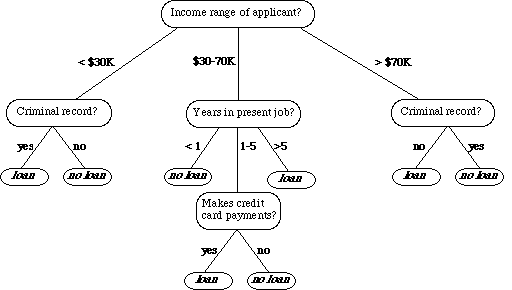
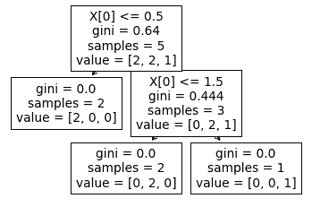
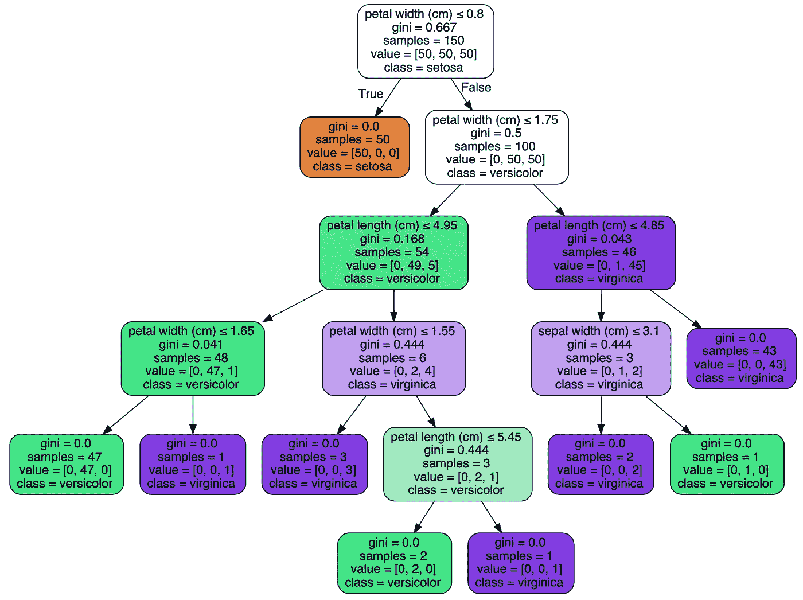

# 决策树——机器学习算法及其 Python 实现

> 原文：<https://towardsdatascience.com/decision-trees-machine-learning-algorithms-with-implementation-in-python-5bc034e67fc8?source=collection_archive---------31----------------------->

## 机器学习算法— 30 天挑战

## 在本文中，我们将研究决策树以及如何使用 Python (Scikit-learn)实现它们

在本文中，我们将研究决策树，这是你的 ML 算法工具箱中的另一个基本而重要的机器学习算法。


图片来自 [Unsplash](https://unsplash.com/photos/Agx5_TLsIf4)

我们将从了解它的功能和工作原理开始。我们将不研究数学部分，因为它本身是另一篇文章。然后我们将使用`scikit-learn`来实现它

*   什么是决策树
*   Python 实现(虚拟数据)
*   Python 实现(真实世界数据集)
*   绘制决策树
*   应用程序
*   结论
*   你能做什么
*   其他 ML 算法

> 这是我 30 天文章写作挑战的一部分。请随意查看我的新人帖子上的文章:

[](https://nouman10.medium.com/lets-publish-30-articles-in-30-days-a0b8111855bb) [## 让我们在 30 天内发表 30 篇文章

### 在这篇文章中，我将接受挑战，在未来 30 天内写 30 篇与数据科学相关的文章…

nouman10.medium.com](https://nouman10.medium.com/lets-publish-30-articles-in-30-days-a0b8111855bb) 

# 什么是决策树

决策树是一种用于分类和回归目的的机器学习算法(尽管在本文中，我们将专注于分类)。顾名思义，它的行为就像一棵树。

它在条件的基础上起作用。每个条件都将训练数据分成两个或更多个较小的训练数据集。

例如，如果我们构建一个应用程序来决定一个人的贷款申请是否应该被接受。我们可以从检查申请人的信用评分开始。如果低于某个阈值，我们拒绝申请。否则，我们会检查其他内容，直到所有内容都检查完毕，然后我们接受申请。

这方面的一个例子如下:



图片来自 [Madhu Sanjeevi ( Mady )](https://medium.com/u/2e3bcbe5a8ae?source=post_page-----5bc034e67fc8--------------------------------)

# Python 实现(虚拟数据)

让我们从在一些虚拟数据上实现决策树开始。

我们首先从`scikit-learn`导入`tree`模块，并初始化虚拟数据和分类器。我们将分类器与数据相匹配，并使用一些新数据进行预测。分类器预测新数据为 **1。**让我们使用`tree`模块中内置的`plot_tree`来绘图

```
tree.plot_tree(clf)
```

这将绘制以下树:



作者图片

在根节点，我们有 5 个样本。它检查 X 中的第一个值，如果它小于或等于 0.5，它将样本分类为 **0。**如果不是，那么它检查 X 中的第一个值是否小于或等于 1.5，在这种情况下，它给它分配标签 **1** ，否则为 **2。**

请注意，决策树不包括对 x 中第二个值的任何检查。这不是错误，因为在这种情况下不需要第二个值。如果决策树能够在不需要所有特征的情况下进行所有分类，那么它可以忽略其他特征。

# Python 实现(真实世界数据集)

现在让我们使用`iris`数据集来实现它。代码同上，除了我们使用`scikit-learn`加载`iris`数据集

在这种情况下，准确率为 100%,因为决策树能够构建一个对所有训练数据进行准确分类的树。

这里我们不会使用内置的`plot_tree`函数来绘制树。在下一节中，我们将使用`graphviz`来绘制决策树。

# 绘制决策树

让我们使用`graphviz`为上面的分类器绘制树。

`graphviz`允许我们创建一个更加美观的决策树，即使是非技术人员也能容易理解，因为他们以前从未听说过决策树。

我们将使用以下代码来绘制决策树:

我们从`tree`模块中调用`export_graphviz`函数，并赋予它特性和类名。我们甚至可以将树保存到一个文件中，但是在本例中我们没有这样做。这是上面代码的输出:



作者图片

看看如何轻松解读决策树

# 应用程序

*   决策树的应用之一是根据历史数据评估业务的潜在增长机会。
*   决策树的另一个应用是使用人口统计数据来寻找潜在客户。
*   贷方还使用决策树来预测客户拖欠贷款的概率，通过使用客户过去的数据应用预测模型生成。

# 结论

让我们总结一下本文所做的工作:

*   我们从决策树如何工作的一般解释开始
*   然后，我们用 Python 在一些虚拟数据上实现了它，随后在一个数据集上实现了它
*   然后我们绘制了使用`scikit-learn`构建的决策树
*   最后，我们研究了决策树的应用。

# 您可以做什么:

*   尝试从头开始实现决策树。为此，你需要理解决策树背后的数学原理
*   将您的实现与`scikit-learn`中的实现进行比较
*   在各种其他数据集上测试上面的代码。

如果你有任何问题，请随时联系我。请继续关注我，因为我计划在未来讲述更多的机器学习算法

# 其他 ML 算法:

*   线性回归——用 Python 实现的机器学习算法

[](https://medium.com/mlearning-ai/linear-regression-a-to-z-2ab3d1b7277c) [## 线性回归—从 A 到 Z

### 在本文中，我们将从数学上研究线性回归，以及如何使用 Python (Scikit-learn)实现它

medium.com](https://medium.com/mlearning-ai/linear-regression-a-to-z-2ab3d1b7277c) 

*   k-最近邻——机器学习算法及其 Python 实现

[](https://nouman10.medium.com/k-nearest-neighbors-a-to-z-with-implementation-in-python-74630ffb79a2) [## k-最近邻-用 Python 实现的 A 到 Z

### 在本文中，我们将从数学上研究 k-最近邻，以及如何使用 Python 实现它…

nouman10.medium.com](https://nouman10.medium.com/k-nearest-neighbors-a-to-z-with-implementation-in-python-74630ffb79a2) 

*   k-Means-机器学习算法及其在 Python 中的实现

[](/k-means-machine-learning-algorithms-with-implementation-in-python-ac1d48e90239) [## k-Means-机器学习算法及其在 Python 中的实现

### 在本文中，我们将研究 K-Means 以及如何使用 Python (Scikit-learn)实现它

towardsdatascience.com](/k-means-machine-learning-algorithms-with-implementation-in-python-ac1d48e90239) 

如果您觉得以上内容对您有用，请分享并随时支持我-->

*   [https://www.buymeacoffee.com/nouman10](https://www.buymeacoffee.com/nouman10)