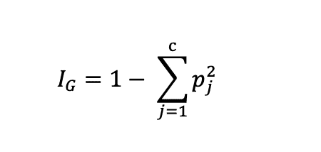
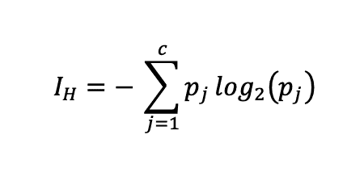
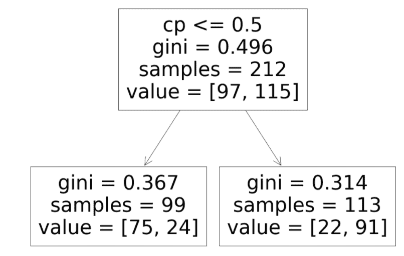
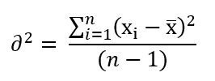

# 引擎盖下的决策树:划分数据

> 原文：<https://towardsdatascience.com/decision-trees-under-the-hood-partitioning-data-b8b3922f5738?source=collection_archive---------24----------------------->

## 决策树如何为类和数值预测拆分数据


里卡多·戈麦斯·安吉尔在 [Unsplash](https://unsplash.com?utm_source=medium&utm_medium=referral) 上的照片

人类总是用“如果”来做二元决策..然后..否则..”决策过程的结构。如果下雨，带把伞；如果它能飞，它就是一只鸟；如果这只鸟听起来嘎嘎叫，那它就是一只鸭子；如果动物有四条腿…我们需要更多的信息，那里有许多四条腿的动物。

决策树使用相关特征(也称为变量)以类似的方式重复分割数据。

让我们以两种四条腿的动物——狗和猫为例。闭着眼睛，有人可以根据猫和狗独特的(看不见的)特征，如体重和声音，来区分它们。

假设你在用体重:体重高于 10 公斤的是狗，低于 10 公斤的是猫。但是你可以想象，有些狗和猫不能仅仅通过体重来区分，因为有些狗可能太小，有些猫可能太大。在这些情况下，你可以使用另一个特征:它们听起来像什么——喵还是汪？这一特征清楚地区分了剩下的不能单独用体重来区分的动物。

现在，如果我给你带来一种新动物，让你闭上眼睛猜它是狗还是猫，你首先会问它的重量是否大于 10 公斤。如果是，那么你很确定这是一只狗，但是为了进一步确认，你问了第二个问题:它听起来像什么——喵还是汪？

但是如果你改变特征的顺序，先问动物听起来像什么呢？狗不会说“喵”，猫也不会发出“汪”的声音。这意味着如果你使用声音作为区别特征，你可以 100%正确地区分两只动物，而不用询问体重或任何其他变量。

这说明有些特性比其他特性更重要。决策树根据哪个功能最能分割数据来决定先问哪个问题。

总之，本例中有三个关键信息:

(1)您可以基于数字阈值(例如>或< 10 千克体重)或分类特征(例如喵或汪汪)来分割数据；

(2)一些变量比其他变量更重要(在这个例子中，声音比体重更重要)；

(3)有些数据因为特征鲜明(蜥蜴不会飞，所以容易拆分(比如鸟类 vs 蜥蜴！)还有一些比较难。也就是说，两组之间的差异越大(即不同的特征)，就越容易将它们分开。

基础知识说完了，现在让我们进入技术细节。

# 决策树是如何工作的？

在引擎盖下，决策树工作流程从选择分割数据的最佳特征开始。然后，使用上一节中描述的阈值或分类特征对数据进行分区。

完成第一次划分后，生成的树的深度为*1*。如果存在不同类别混合的剩余数据(即，不能仅通过重量区分的狗和猫的混合)，则使用下一个最佳特征进行第二次分割。

这个过程基本上是重复的，直到所有的数据都被清楚地分开，或者你用完了所有的特性。如果所有样本数据被清楚地分成各自的目标类别(例如，所有动物被分成猫和狗)，则一些特征可能保持不被使用；并非所有功能都是必需的。

生长的树现在是代表数据(也称为训练数据)的模型。对于一个新的预测，您所做的就是通过您刚刚创建的决策树逐个运行观察的特征。

# 那么数据到底是如何分区的呢？

让我们先来理解一个我们会反复使用的关键术语——“杂质”。

如果一个要素正确地分隔了数据集中的两个类，这就是纯分割。在我们的例子中，如果*动物的声音*可以将所有的狗和所有的猫分开，那么得到的分割数据就是纯净的。但是，如果*动物体重*能够正确分离 90%的数据，就意味着 10%的数据有猫狗混杂。所以他们不纯洁。随着深度的增加，决策树算法将这种杂质最小化。

在分类中，有两个标准用于分割数据:基尼系数和熵。

## a)基尼系数不纯

*基尼系数*衡量样本中错误阶层的比例。因此，基尼系数为 0.5 意味着所得数据中两个阶层的比例相等(50%-50%)——这是衡量杂质的最高标准。同样，基尼系数为 0.0 意味着一个阶级的情况为 0%，而另一个阶级的情况为 100%。基尼系数的值介于 0 和 0.5 之间，其中 0 表示绝对纯分裂，0.5 表示最差的不纯分裂。

基尼系数的数学表达式是:



这里 j 代表目标类(猫或狗)，p 是节点中类的比例(狗的数量和猫的数量)。(图片由作者提供)

因此，在 100 只动物的样本中，如果不纯节点有 60 只狗和 40 只猫，那么基尼不纯将是:

`Gini = 1 - {(60/100)^2 + (40/100)^2} = 0.48`

## b)熵/信息增益

术语*熵*大概来源于物理学(热力学第二定律)；它是系统的物理属性，用来衡量无序状态。在信息论中,( Claude Shannon)设计了这个概念来测量从消息传输到接收的丢失信息量。

它的数学公式是:



熵的数学公式。(图片由作者提供)

符号的含义与基尼中的相同。然而，熵的值介于 0-1 之间。

上述相同数据的熵可计算如下:

```
Entropy = - {(60/100)*log2(0.6) + (40/100)*log2(0.4)} 
= 0.52
```

请注意，分类特征使用每个类别分割目标，而数字/连续特征的分割候选是特征中的唯一值。有时，算法[首先对值进行排序](https://spark.apache.org/docs/1.3.0/mllib-decision-tree.html)，然后选择每个唯一值进行拆分，以找到最佳拆分。

# 那么如何从测量杂质到决定分裂(或不分裂)？

我们已经看到了决策树如何在幕后工作，以及算法如何选择使用杂质标准来分割数据。现在，我们如何从测量杂质转向决定:

(a)是否要进一步分裂

(b)使用哪个特征进行分割

杂质测量用于计算所谓的*信息增益*。它是分割前后杂质的差异，由每个节点中各自的样本大小加权。如果分裂后杂质减少，信息增益应该为正，因此算法将继续进一步分裂数据。本质上:

```
Information gain 
= Information in the parent node 
  – information in the left child node 
  – information in the right child node
```

在用于计算的数学公式中:

```
Information gain 
= (parent_sample*parent_gini 
   - left_sample*left_gini 
   - right_sample*right_gini)/parent_sample
```

让我们用下面的假设例子，用上面的公式计算信息增益:



计算信息增益的决策树。(图片由作者提供)

```
# data
parent_sample, parent_gini = 212, 0.496
left_sample, left_gini = 99, 0.367
right_sample, right_gini = 113, 0.314# information gain calculation
= (212*0.496 - 99*0.367 - 113*0.314)/212
= 0.15725
```

所以在假设的例子中，第一次分离后的信息增益是 0.15。如果进一步的分裂将继续给出所需的信息增益，树将继续分裂，除非您通过超参数调整来限制它的增长以避免过度拟合。

# 回归呢？

在回归中，*方差*是代替杂质的度量。它衡量数据相对于平均值的可变性。自然地，较大的方差意味着数据点是分散的，远离平均值并且彼此远离。

它的数学公式是:



计算回归中的方差。(图片由作者提供)

旁注:如果你听说过*标准差*，那只是方差的平方根。

类似于分类，选择用于分类和数字特征的分裂候选。分割完成后，算法会比较分割前后的方差，只要方差减小，分割就会继续。

# 摘要

*   *决策树*根据数据的特征和算法对数据进行分割，只要*杂质*减少，分割就会继续。
*   计算杂质有两种主要方法:*基尼&熵。*
*   分类特征和数字特征的分裂候选被不同地选择——对于分类特征:每个类别；对于数字特征:每个唯一值。
*   只要*信息增益*是有利的，所有特征都用尽或者树的生长通过修剪被限制，分割就继续。
*   回归树使用*方差*作为决定是否划分数据的度量。

感谢阅读。请随意[订阅](https://mab-datasc.medium.com/subscribe)以获得我即将发布的文章的通知，或者通过 [Twitter](https://twitter.com/DataEnthus) 或 [LinkedIn](https://www.linkedin.com/in/mab-alam/) 与我联系。