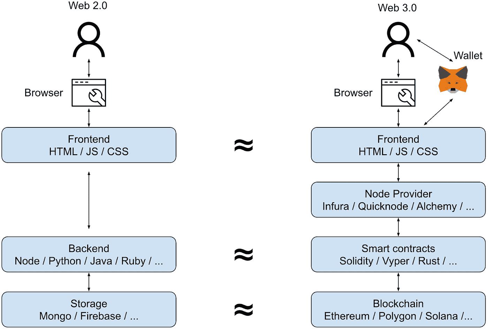
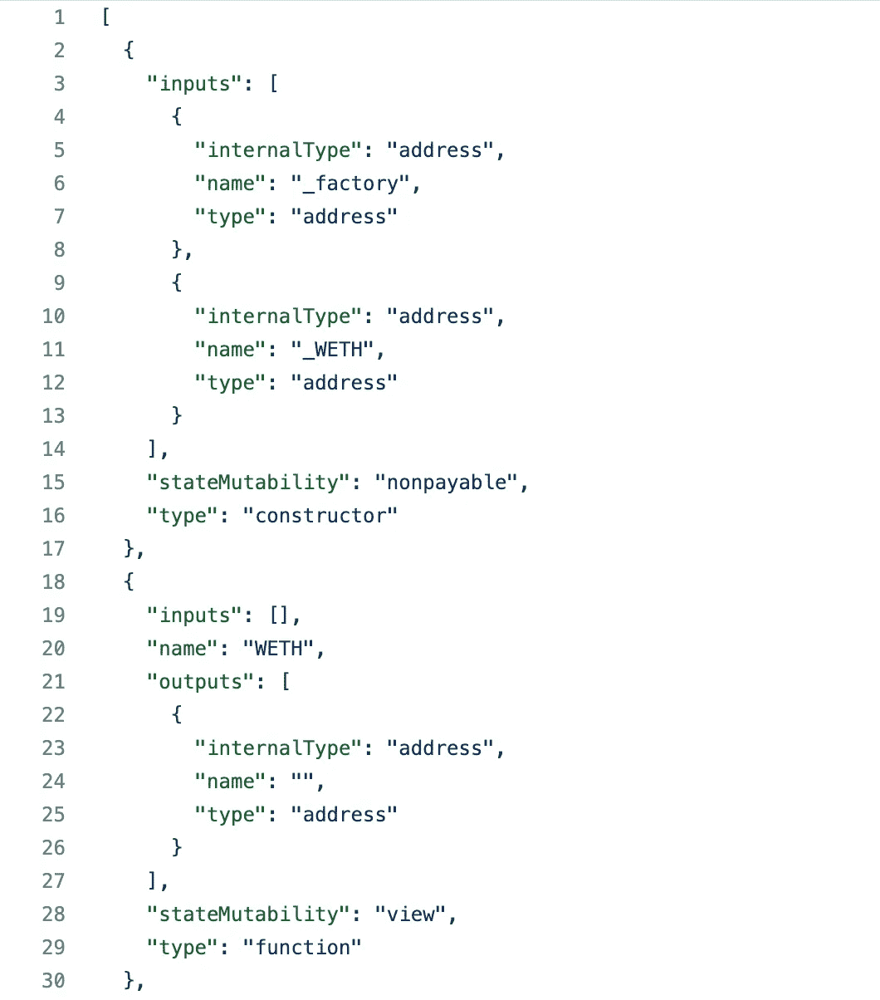

# 解码以太坊智能合约数据

> 原文：<https://towardsdatascience.com/decoding-ethereum-smart-contract-data-eed513a65f76?source=collection_archive---------1----------------------->

## 加密数据实践—第 1 部分



[Web2 - > Web3 演变](/what-is-crypto-data-fef70ecadf7b) —图片作者

*2023–03–14 编辑* : *增加了对节点提供商角色的简要说明*

在本系列的前两篇文章中，我描述了[什么是加密数据](/what-is-crypto-data-fef70ecadf7b)和[为什么它是一个独特而有吸引力的机会](/why-every-data-scientist-should-pay-attention-to-crypto-39b4c25ff319)。如果你还没有阅读这些文章，我强烈建议你在继续之前阅读，因为它们为理解这篇文章提供了重要的背景。在本帖中，我们将亲自动手，讨论将以太坊智能合约数据解码为人类可读格式的技术细节。这是深入理解潜在用户活动的必要的第一步。我们将重点关注以太坊作为主要示例，但我们在此讨论的许多概念将更广泛地适用于所有 EVM 兼容链和智能合约，例如 Polygon、BSC、乐观等。

正如我们在以前的帖子中所讨论的，智能合约事务类似于智能合约支持的 web3 应用程序中的后端 API 调用。每个智能合约事务的详细信息以及导致的应用程序状态更改都记录在称为事务、调用和日志的数据元素中。事务数据元素表示由用户(或者更准确地说是 EOA)发起的函数调用，调用数据元素表示由智能合约在事务内发起的附加函数调用，日志数据元素表示在事务执行期间已经发生的事件。

需要注意的一件重要事情是，为了与智能合约交互并使用上面提到的数据元素，您需要通过一个节点。节点是运行构成网络的区块链软件的参与者，它们充当通往区块链的网关。通常，访问节点的最快方式是通过节点提供者，如 Alchemy、Infura 或 Quicknode。如果你有兴趣了解更多，这篇炼金术博客文章提供了一个关于节点以及如何使用它们的很好的解释。

一旦有了数据元素，我们就可以非常精确地描述由于事务而在应用程序和区块链上发生的状态变化。当进行总体分析时，给定的分散式 web3 应用程序的所有事务、跟踪和日志的集合可以提供用户群及其在产品中的活动的全面而深刻的视图。然而，这样做很有挑战性，因为许多重要的细节都是以十六进制编码的字符串记录的。例如，在以太坊网络上使用 Uniswap 交换一对令牌的交易(该特定记录可以通过查询[谷歌在以太坊](https://console.cloud.google.com/bigquery?p=bigquery-public-data&d=crypto_ethereum&page=dataset)上的公共数据集中的`transactions`表获得，也可以在[以太坊](https://etherscan.io/tx/0x87a3bc85da972583e22da329aa109ea0db57c54a2eee359b2ed12597f5cb1a64)上查看):

```
hash: 0x87a3bc85da972583e22da329aa109ea0db57c54a2eee359b2ed12597f5cb1a64
nonce: 449
transaction_index: 37
from_address: 0x3c02cebb49f6e8f1fc96158099ffa064bbfee38b
to_address: 0x7a250d5630b4cf539739df2c5dacb4c659f2488d
value: 0E-9
gas: 228630
gas_price: 91754307665
**input: 0x38ed1739000000000000000000000000000000000000000000000000000000009502f900000000000000000000000000000000000000000000a07e38bf71936cbe39594100000000000000000000000000000000000000000000000000000000000000a00000000000000000000000003c02cebb49f6e8f1fc96158099ffa064bbfee38b00000000000000000000000000000000000000000000000000000000616e11230000000000000000000000000000000000000000000000000000000000000003000000000000000000000000a0b86991c6218b36c1d19d4a2e9eb0ce3606eb48000000000000000000000000c02aaa39b223fe8d0a0e5c4f27ead9083c756cc2000000000000000000000000528b3e98c63ce21c6f680b713918e0f89dfae555**
receipt_cumulative_gas_used: 2119514
receipt_gas_used: 192609
receipt_contract_address: None
receipt_root: None
receipt_status: 1
block_timestamp: 2021–10–19 00:00:18
block_number: 13444845
block_hash: 0xe9ea4fc0ef9a13b1e403e68e3ff94bc94e472132528fe8f07ade422b84a43afc
max_fee_per_gas: None
max_priority_fee_per_gas: None
transaction_type: None
receipt_effective_gas_price: 91754307665
```

如果您在 Etherscan 上查看[交易](https://etherscan.io/tx/0x87a3bc85da972583e22da329aa109ea0db57c54a2eee359b2ed12597f5cb1a64)，您可能会注意到，它已经解码了这个原始记录，并提供了很好的上下文来帮助您理解交易细节。虽然这非常有用，但它并不是为了回答需要转换和汇总数据的问题而设计的，例如，所有 Uniswap 用户交易的总价值是多少，或者 Uniswap 用户的 3 个月保留期是多少。要回答这些问题，我们需要能够收集所有记录，解码它们，并批量处理相关细节。我们将在这篇文章的剩余部分讨论如何做到这一点。

# 解码交易

如果我们检查原始数据记录，我们可以看到交易是由 EOA`0x3c02cebb49f6e8f1fc96158099ffa064bbfee38b`发起的，目的地是与 Uniswap v2 路由器关联的智能合同地址`0x7a250d5630b4cf539739df2c5dacb4c659f2488d`。然而，相关的请求细节在`input`字段中被编码为一个长的十六进制字符串。

在我们进入如何从`input`中提取人类可读的数据之前，讨论一下它的结构将是有益的。前面的`0x`表示这个字符串是十六进制的，所以它与实际的信息内容无关。之后，每 2 个十六进制字符代表一个字节。前四个字节，在本例中是`38ed1739`，是被调用函数的散列签名。其余的字节是传递给函数的参数的散列。这意味着输入字符串的长度可以根据调用的特定函数和所需的参数而变化。

为了解码这个十六进制字符串，我们需要参考应用程序二进制接口或 ABI。这是一个 json 对象，包含给定智能契约的所有函数和事件接口定义(即名称和类型)。ABI 的功能是查找事务数据中的散列签名与人类可读接口定义的匹配。一个[的例子 ABI](https://gist.github.com/yifeihuang/8c80e1e0154ed78ad63ea86cc9374803) 看起来像这样



Uniswap v2 路由器 ABI 的局部视图—图片由作者提供

ABI 通常可以在 Etherscan 等块浏览器上找到，与合同源代码放在一起。这里是 Uniswap v2 路由器合同的 [ABI 的链接。](https://etherscan.io/address/0x7a250d5630b4cf539739df2c5dacb4c659f2488d#code)

一旦我们手头有了 ABI，我们就可以写来解码交易:

在示例代码中需要注意一些事情:

1.  此代码旨在用于大量事务的批处理。它假设数据已经存在于本地存储中(而不是从区块链中实时获取)，并且非常适合像 PySpark 这样的分布式处理框架。
2.  `@lru_cache(maxsize=None)` —我们缓存契约对象的创建，以减少在大量事务中重复相同计算的开销。这假设解码的目标是少量(大约几千个)不同的智能合约。
3.  它利用开源的 web3 包方法`decode_function_input`根据 ABI 提供的模板提取数据。然而，这种方法返回的数据通常是不可序列化的(例如字节数组),有时还会缺少人类可读的键。因此，使用实用方法`convert_to_hex`来执行提取后处理，将数据转换成可序列化的 json 对象，并在缺少的地方附加上人类可以理解的键，这是非常有帮助的(甚至是必要的)。这使得保存和重用解码后的数据变得更加容易。
4.  同样的代码也可以用于解码*跟踪*数据元素。这是因为它们只是由智能合约发起的内部交易。

使用上面的代码产生这个解码的输入数据

```
function called:  swapExactTokensForTokens
arguments:  {
  "amountIn": 2500000000,
  "amountOutMin": 194024196127819599854524737,
  "path": [
    "0xA0b86991c6218b36c1d19D4a2e9Eb0cE3606eB48",
    "0xC02aaA39b223FE8D0A0e5C4F27eAD9083C756Cc2",
    "0x528B3e98c63cE21C6f680b713918E0F89DfaE555"
  ],
  "to": "0x3c02cebB49F6e8f1FC96158099fFA064bBfeE38B",
  "deadline": 1634603299
}
```

由此我们可以更容易理解

1.  这个调用是对一个名为`swapExactTokensForTokens`的方法的调用，用户放入 2，500，000，000 个单位的起始令牌，并期望得到至少 194，024，196，127，819，599，854，524，737 个单位的目标令牌。这些数字看起来可能是天文数字，但请记住，令牌单元通常用 1/10^n 表示，其中 n 大约是 18。n 有时被称为令牌的十进制值。
2.  `path`数组描述了在这个事务中交换的令牌。每个数组元素都是一个令牌协定的地址。第一个是 [USDC](https://etherscan.io/token/0xa0b86991c6218b36c1d19d4a2e9eb0ce3606eb48) (一种与美元挂钩的稳定币)，第二个是[包裹 Eth](https://etherscan.io/token/0xc02aaa39b223fe8d0a0e5c4f27ead9083c756cc2) (带有 ERC20 接口的以太坊)，第三个是 [DXO](https://etherscan.io/token/0x528b3e98c63ce21c6f680b713918e0f89dfae555) (一种 deep.space 游戏内币)。
3.  将 1 和 2 放在一起，我们可以推断出用户请求是用 2，500 USDC (USDC 的十进制值为 6)交换~ 1 . 94 亿 DXO (DXO 的十进制值为 18)。由于这种特定的成对互换不是直接可用的，所以交易将通过 weh 的中介令牌来进行。

# 解码日志

这个交易在执行过程中还发出了 7 个事件，可以通过查询谷歌在以太坊上的公共数据集中的`logs`表得到，也可以在以太扫描上查看[。与用户请求的交换相对应的两个最突出的记录是:](https://etherscan.io/tx/0x87a3bc85da972583e22da329aa109ea0db57c54a2eee359b2ed12597f5cb1a64#eventlog)

```
log_index: 47
transaction_hash: 0x87a3bc85da972583e22da329aa109ea0db57c54a2eee359b2ed12597f5cb1a64
transaction_index: 37
**address: 0xb4e16d0168e52d35cacd2c6185b44281ec28c9dc**
**data: 0x000000000000000000000000000000000000000000000000000000009502f90000000000000000000000000000000000000000000000000000000000000000000000000000000000000000000000000000000000000000000000000000000000000000000000000000000000000000000000000000000000093f8f932b016b1c
topics: [
'0xd78ad95fa46c994b6551d0da85fc275fe613ce37657fb8d5e3d130840159d822',
'0x0000000000000000000000007a250d5630b4cf539739df2c5dacb4c659f2488d',
'0x000000000000000000000000242301fa62f0de9e3842a5fb4c0cdca67e3a2fab']**
block_timestamp: 2021-10-19 00:00:18
block_number: 13444845
block_hash: 0xe9ea4fc0ef9a13b1e403e68e3ff94bc94e472132528fe8f07ade422b84a43afc
```

和

```
log_index: 50
transaction_hash: 0x87a3bc85da972583e22da329aa109ea0db57c54a2eee359b2ed12597f5cb1a64
transaction_index: 37
**address: 0x242301fa62f0de9e3842a5fb4c0cdca67e3a2fab
data: 0x0000000000000000000000000000000000000000000000000000000000000000000000000000000000000000000000000000000000000000093f8f932b016b1c000000000000000000000000000000000000000000a137bb41b9113069a51e190000000000000000000000000000000000000000000000000000000000000000
topics: [
'0xd78ad95fa46c994b6551d0da85fc275fe613ce37657fb8d5e3d130840159d822', '0x0000000000000000000000007a250d5630b4cf539739df2c5dacb4c659f2488d', '0x0000000000000000000000003c02cebb49f6e8f1fc96158099ffa064bbfee38b']**
block_timestamp: 2021-10-19 00:00:18
block_number: 13444845
block_hash: 0xe9ea4fc0ef9a13b1e403e68e3ff94bc94e472132528fe8f07ade422b84a43afc
```

同样，相关的细节在`topics`和`data`字段中被编码成十六进制字符串。与交易`input`的情况一样，浏览这些数据字段的结构是有益的。`topics`是一个数组，其中第一个元素表示事件接口定义的散列签名。`topics`数组中的任何附加元素通常是事件中涉及的区块链地址，根据具体的上下文，它们可能存在，也可能不存在。`data`代表事件参数值，长度可根据事件定义而变化。与交易一样，我们需要引用 ABI 契约，以便将它转换成人类可读的形式。

敏锐的读者会注意到，上面日志中的契约地址`0xb4e16d0168e52d35cacd2c6185b44281ec28c9dc`和`0x242301fa62f0de9e3842a5fb4c0cdca67e3a2fab`不同于用户 EOA 最初调用的路由器 v2 契约`0x7a250d5630b4cf539739df2c5dacb4c659f2488d`。这两个地址对应于 USDC-WETH 和 DXO-WETH 令牌对的 Uniswap v2 对合同。这些合约负责持有各自交易对的流动性，并实际进行互换。用户最初与之交互的路由器契约充当协调器，并向适当的成对契约发起内部事务(*跟踪*)。因此，为了解码这些事件，我们还需要[对契约 ABI](https://etherscan.io/address/0xb4e16d0168e52d35cacd2c6185b44281ec28c9dc#code) 。解码日志的示例代码如下:

与事务解码的代码类似，示例代码针对批量解码用例进行了优化，旨在与 PySpark 之类的工具结合使用，以处理大量日志事件。运行上述产量:

```
event emitted:  Swap
arguments:  {
  "sender": "0x7a250d5630B4cF539739dF2C5dAcb4c659F2488D",
  "to": "0x242301FA62f0De9e3842A5Fb4c0CdCa67e3A2Fab",
  "amount0In": 2500000000,
  "amount1In": 0,
  "amount0Out": 0,
  "amount1Out": 666409132118600476
}
```

和

```
event emitted:  Swap
arguments:  {
  "sender": "0x7a250d5630B4cF539739dF2C5dAcb4c659F2488D",
  "to": "0x3c02cebB49F6e8f1FC96158099fFA064bBfeE38B",
  "amount0In": 0,
  "amount1In": 666409132118600476,
  "amount0Out": 194900241391490294085918233,
  "amount1Out": 0
}
```

我们可以断定，这两个事件确实是最初请求中的`path`之后的`swap`事件——USDC>和> DXO。我们可以看到路由器契约(以`488D`结尾)是两个事件中的发送者，充当协调者。USDC-韦瑟配对合约(结束`c9dc`)用 25 亿单位的 USDC 交换 666，409，132，118，600，476 单位的韦瑟，然后将得到的韦瑟转移到 DXO-韦瑟配对合约(结束`2Fab`)。然后，DXO-WETH 合同将 WETH 的 666，409，132，118，600，476 个单位交换为 DXO 的 194，900，241，391，490，294，085，918，233 个单位，并按照最初的要求将其发送回用户(EOA 结束`E38B`)。

# 结束语

正如这个例子所希望说明的，一旦有了工具，解码的过程就相对简单了，但是知道解码什么以及如何解释结果数据就不简单了。根据您试图回答的具体问题，有些功能和事件比其他功能和事件更相关。为了分析 web3 应用程序中的经济活动和用户行为，了解特定智能合同的工作方式，并确定利益衡量标准中涉及的关键功能和事件非常重要。最好通过结合实际使用产品、在 Etherscan 等块浏览器上检查数据耗尽以及阅读智能合约源代码来完成。这对于开发正确的解码和分析策略是至关重要的。

我希望这是一次有用的讨论，我已经帮助你更好地了解了如何使用加密数据。在我的下一篇文章中，我将展示一个在 NFT 最大的市场 Opensea 上的深潜分析的例子。如果你想在帖子发布时得到通知，请务必点击电子邮件图标进行订阅。

*感谢您的阅读，如果您有任何问题或意见，请随时联系我们。*[*Twitter*](https://twitter.com/yifei_huang)*|*[*Linkedin*](https://www.linkedin.com/in/yifeihuangdatascience/)