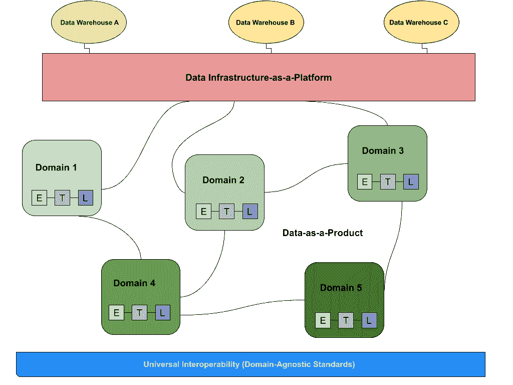

# 解码数据网格

> 原文：<https://towardsdatascience.com/decoding-the-data-mesh-594b44b4b26f?source=collection_archive---------16----------------------->

## *构建数据网格？避免这 7 个网状概念。*

图片来自 [**里卡多·戈麦斯天使**](https://unsplash.com/@ripato) 上 [**下**](https://unsplash.com/) 。

*data mesh 的创始人 Zhamak Dehghani 消除了关于 data mesh 的常见误解，data mesh 是一种越来越流行的构建分布式数据架构的方法，并分享了一些最佳团队是如何起步的。*

如今，似乎每个数据人都分成两个阵营:理解 [**数据网**](https://martinfowler.com/articles/data-monolith-to-mesh.html) 的人和不理解的人。

请放心:无论你在哪个阵营，你都不会孤单！

在最近的记忆中，很少有一个话题像风暴一样席卷了数据世界，催生了一个繁荣的社区，数百篇博客文章，以及挣扎于民主化和可扩展性的各行各业的数据领导者松了一口气。

但是，随着这种新的采用，也带来了对数据网格的真实性质以及如何构建数据网格产生误解的新机会，这种误解只会增加。

几个月前，我加入了 Thoughtworks '[**Zhamak Dehghani**](https://www.linkedin.com/in/zhamak-dehghani)， [**数据网格框架的先驱**](https://www.montecarlodata.com/what-is-a-data-mesh-and-how-not-to-mesh-it-up/) ， [**Lena Hall**](https://www.linkedin.com/in/lena-hall?miniProfileUrn=urn%3Ali%3Afs_miniProfile%3AACoAAAyXorcBWLmnvFiEFUvIRtvucDipohqb8iw&lipi=urn%3Ali%3Apage%3Ad_flagship3_search_srp_all%3BSlguGml9S2yL1SOmJAgMQQ%3D%3D) 微软大数据工程总监，参加了一个关于 [**万物数据网格**](https://www.montecarlodata.com/what-is-a-data-mesh-and-how-not-to-mesh-it-up/) 的讨论。在交谈中，Zhamak 消除了许多最大的误解，包括数据网格是否是一种独立的技术，谁应该(或不应该)建立一种技术，以及数据网格是否只是数据虚拟化的另一种说法(提示:它不是)。

以下是我们谈话中的几个要点——请务必收听 [**的完整录音**](https://www.youtube.com/watch?v=TewRPC3nSZg) 以获得更多的神话终结和真知灼见。(注意:为了篇幅和清楚起见，有些引文已经过编辑。)

# 您能从单一解决方案中构建数据网格吗？

*在高层次上，数据网格由三个独立的组件组成，数据源、数据基础设施和由功能所有者管理的面向领域的数据管道。数据网格架构的底层是一个通用的互操作性层，反映了与领域无关的标准，以及可观察性和治理。图片由蒙特卡洛提供。*

扎马克将数据网格定义为“**一种社会技术转变**——一种我们收集、管理和共享分析数据的新方法。”

数据网格**不是**一种技术解决方案，甚至不是技术的子集——它是我们如何管理和操作数据的组织范式，由几种不同的技术组成，无论是开源还是 SaaS。

你不能只用一个数据库来构建微服务架构。你不会仅仅用一个数据仓库或者一个 BI 工具来构建一个数据网格。相反，数据网格可以部分地由这些技术驱动——以及其他许多技术。

简而言之，如果数据架构包括以下四个基本元素，那么它就是一个数据网格:

*   将数据所有权从一个集中的团队分配给最适合控制数据的人——通常是数据来源的业务领域
*   给予这些团队长期的责任感，并让他们具备将数据视为产品所需的产品思维
*   为团队提供自助式数据基础架构
*   解决新的联合数据治理模型可能带来的新问题

继续下一个。

# 数据网格是数据虚拟化的另一种说法吗？

在数据社区中，对于分散的数据所有权实际上是如何工作的还存在困惑。正如 Lena 所描述的，一些技术人员想知道分散数据所有权的概念是否与[数据虚拟化](https://en.wikipedia.org/wiki/Data_virtualization)的概念重叠，换句话说，这是一种允许应用程序跨许多孤岛检索和操作数据的数据管理方法。

> 根据 Zhamak 的说法，过去的情况是虚拟化位于您的 OLTP 系统和微服务或运营数据库之上，并按原样公开数据或进行一些小的转换。当谈到将它应用到数据网格时，这可能不是一个明智的想法。

“无论是数据网格还是 API 库，您都在尝试公开一个已经针对事务性目的进行了优化的数据库，以便进行分析。预测分析或历史趋势建模都需要一个非常不同的数据视图，”她说。“如果您考虑在您的微服务数据库上使用虚拟化，并公开它们，称之为网格，这可能是一个坏主意。”

# 每个数据产品团队是否管理他们自己独立的数据存储？

在数据网格范式下，面向领域的数据团队不拥有自己的数据存储，但他们对自己的数据和相关数据产品的质量和可用性负责。图片由 [Unsplash](http://www.unsplash.com/) 上的 [Lagos Techie](https://unsplash.com/photos/IgUR1iX0mqM) 提供。

**根据扎马克的说法，这个问题的答案是否定的。**

> “Data mesh 会说，作为一名数据产品开发人员，我希望拥有自主权——拥有所有的结构元素、存储和计算、查询系统，以及所有允许我为数据科学家提供数据的东西，”Zhamak 解释道。“但这并不意味着我现在必须拥有自己的地理位置分离的存储层。事实上，如果网格是由一个云提供商提供的跨组织设置，您可能不会这样做。您可能只有一个存储层。”

“然而，它们是独立的模式，它们是独立的访问权限管理，它们是独立的租赁模型，允许数据产品以自主的方式部署，”她说

数据存储通常由中央数据工程或基础设施团队维护，他们负责确保数据网格对于每个领域都是有效的和可操作的。虽然每个领域的分析师和数据科学家负责在数据网格上构建和维护产品(比如仪表板、模型和报告)，但他们并不是管理使分析、数据科学和 ML 成为可能的基础设施的人。

# 自助式数据平台和分散式数据网格是一回事吗？

大型组织已经在实施用于基础设施管理的自助服务平台，但是根据 Zhamak 的说法，数据网格的自助服务在几个关键方面有所不同:

“今天构建的大多数服务或数据平台都是为集中式数据团队构建的，旨在帮助数据专家更快地处理积压的工作。它们旨在为试图优化来自世界各个角落的摄取的集中团队提供服务。

数据平台在其当前状态下，通常是为了不同于数据网格的目的而优化的。 [**为支持数据网格而构建的数据平台**](https://www.montecarlodata.com/the-quick-and-dirty-guide-to-building-your-data-platform/) 应进行优化，以给予领域团队自主权，并给予通才技术人员创建数据产品的能力——端到端地管理他们的数据，并直接服务于他们的数据消费者:数据分析师、数据科学家和其他最终用户。

# 数据网格是否适合所有数据团队？

虽然越来越多的组织开始采用或探索数据网格，但扎马克认为该模型“在其发展过程中仍处于相当初级的阶段。”

面临扩展数据可靠性问题的组织是采用数据网格最有意义的组织。Zhamak 说，早期采用者往往专注于工程，并对投资“建筑和购买技术”持开放态度，因为不是所有的元素都可以买到。

> 根据 Zhamak 的说法，如果您的利益相关者感到寻找和使用正确数据的痛苦，并且您的创新周期正在放缓，那么您可能是研究数据网格的合适人选。

2021 年，数据团队更早变大，数据更通用。因此，需要围绕一种自助式、分散式的方法来管理数据，而无需另起炉灶。数据网格可以有所帮助。

# 您团队中的一个人“拥有”数据网格吗？

正如他们所说，没有一个数据工程师是孤岛，尤其是在构建数据网格的时候。(图片由 [Grzegorz Walczak](https://unsplash.com/photos/yoIIPcrWhjI) 在 [Unsplash](http://www.unsplash.com/) 上提供)

引入数据网格模型需要的不仅仅是技术。这需要整个组织的文化认同。

“我认为数据和所有数据驱动的计划和数据平台投资在组织中非常明显，并且具有高度的政治性，特别是在大型组织中，因此必须有自上而下的支持和自下而上的宣传，”扎马克说。

她证明，当组织有一个直接向首席执行官报告的首席数据官或首席数据分析官时，他们在大规模采用数据网格时往往更有效。尽管如此，这些领域仍有望获得其数据的所有权，因此需要支持这一计划，无论这意味着专用资源还是跨组织的支持。

“如果域名不在船上，我们所做的就是在一个集中的团队中过度设计数据的分布，”她说。

当您试图在您的组织中增加对数据网格的采用时，团队应该得到一到三个与愿景一致的领域，作为推进设计和实现的倡导者。通常，基础设施团队——实践者和工程师——并不难说服，因为他们经常感到痛苦。

# 数据网格会造成数据工程师和数据分析师之间的摩擦吗？

同样，答案是:不。事实上，它往往是相反的！

因为数据网格要求数据所有权去中心化，所以采用这种分布式的、面向领域的模型通常会在历史上有摩擦的领域带来健康的和解。

例如，当组织有一个负责管道的工程团队，一个对下游数据建模的数据工程组，以及更下游消费数据的分析师时，事件通常会导致相互指责。但是，数据网格的数据治理通用标准确保围绕数据质量、数据发现、数据产品模式以及数据健康和理解的其他关键元素达成一致。

根据 Zhamak 的说法，任何良好的数据网格所固有的这种自助服务能力包括:

*   静态和动态数据加密
*   数据产品版本化
*   数据产品模式
*   数据产品发现、目录注册和发布
*   数据治理和标准化
*   数据生产谱系
*   数据产品监控、警报和记录
*   数据产品质量指标

当打包在一起时，这些功能和标准化提供了一个健壮的 [**可观察性**](https://www.montecarlodata.com/b_a_goals/data-observability-checklist/) —和信任层。

“我们在操作领域看到的发展始于我们自己的特别结构化日志记录，这是我们已经作为一种良好的软件工程实践在做的事情，”Zhamak 说。“我真的希望，通过谱系、指标和 SLO，我们可以开发一些开放标准，用来传达这些质量指标，如您的信任矩阵，或者以标准化的方式跟踪谱系，并在此基础上创建一个健康的工具生态系统。”

在我看来，像 data mesh 这样的组织结构实际上允许适当的自治和关于治理的讨论，迫使您的团队回答这样的问题:何时以及如何使用数据？我们关心的标准是什么，我们希望让每个人都拥有这些标准？或者甚至:每个域应该拥有哪些职责？

# 事实:数据网格标志着行业向分散化和民主化的转变

无论你站在数据网格的哪个位置，毫无疑问，这个话题激发了关于成为一名数据专业人员意味着什么，以及如何为你的组织真正传播和运营大规模数据的讨论。

> 事实上，与我交谈过的许多公司应用数据网格概念的时间比他们意识到的要长；他们只是没有合适的词语来描述它。

这种转变通常始于数据团队和利益相关者之间更好的沟通、组织协调以及对数据在公司中的作用的理解。有了这三个支柱，避免最困难的网状概念就容易多了。

*对数据网格有更多疑问？报名参加 Zhamak Dehghani ' s talk at*[***IMPACT:The Data Observability Summit***](https://events.montecarlodata.com/impact-data-summit-2021?utm_source=blog&utm_medium=kolibri+data+mesh&utm_id=impact)*今年 11 月或接触* [***巴尔***](https://www.linkedin.com/in/barrmoses) *和* [***蒙特卡洛团队***](http://www.montecarlodata.com/) *。*

*并请务必查看* [*数据网格学习*](https://www.meetup.com/data-mesh-learning-meetup) *社区，了解更多现场活动或加入他们的 Slack 频道。*

