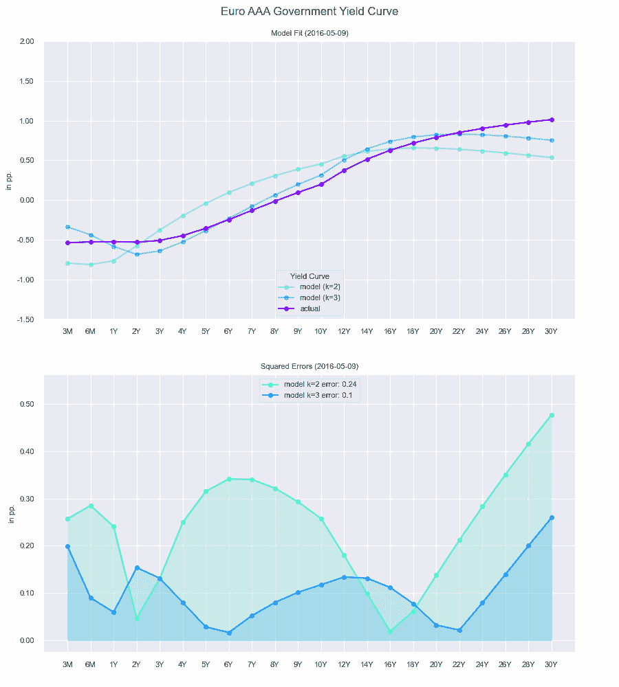
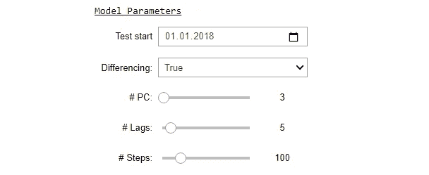
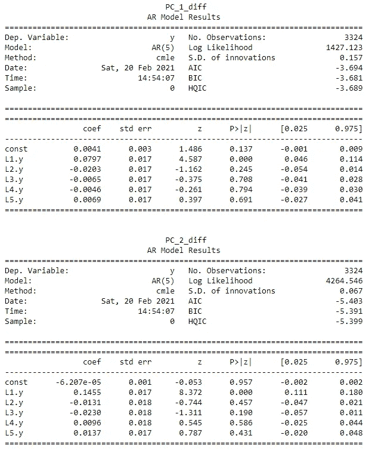

# 欧元收益率曲线的分解和预测

> 原文：<https://towardsdatascience.com/decomposing-predicting-the-euro-yield-curve-b3ad1670fdbb?source=collection_archive---------7----------------------->

## 应用主成分分析

肖恩·奥尔登多夫在 [Unsplash](https://unsplash.com?utm_source=medium&utm_medium=referral) 上拍摄的照片

利率期限结构(“收益率曲线”)是根据不同到期日的价格(以收益率表示)绘制同一类型债券(如信贷质量、行业)的表示。对于金融机构来说，理解其行为及其对公司资本基础的直接影响是至关重要的。

在本文中，我通过将收益率曲线分解为主要驱动因素来研究其潜在动态。因此，我将应用几篇学术论文中提出的主成分分析(PCA)。将探讨以下主题:

1.  介绍数据
2.  与传统的收益曲线因素“水平”、“斜率”和“曲率”相比，解释方差的主要驱动因素(主成分)
3.  评估从一组缩减的维度生成的模型产量曲线与实际产量的拟合度(样本内与样本外)
4.  推导未来 1 个月的非线性压力情景
5.  用自回归时间序列模型检验主要主成分的可预测性

所描述的思想的 Python 实现可以从我各自的存储库中访问和派生。

<https://bernhard-pfann.github.io/>  

***来自《走向数据科学》编辑的提示:*** *虽然我们允许独立作者根据我们的* [*规则和指导方针*](/questions-96667b06af5) *发表文章，但我们并不认可每个作者的贡献。你不应该在没有寻求专业建议的情况下依赖一个作者的作品。详见我们的* [*读者术语*](/readers-terms-b5d780a700a4) *。*

# 1.介绍数据

基础数据代表每日欧元区 AAA 级政府债券的即期利率。所选时间跨度从 2005 年 1 月至 2020 年 12 月，可在此自由访问[。](https://www.ecb.europa.eu/stats/financial_markets_and_interest_rates/euro_area_yield_curves/html/index.en.html)

在清理和过滤相关信息的数据后，可以绘制不同时间点的产量曲线。下面的图表使水平和陡度的下降非常明显。

以更精细的时间步长考察收益率曲线的变化，可以揭示宏观经济长期漂移背后的水平、斜率和曲率的波动动态。

图表 1:实际收益率曲线与一年期滞后版本的对比|图表 2:所示收益率曲线之间的差异

为了更好地理解曲线上每个点的驱动因素，需要评估波动率以及到期日之间的不同相关性。因此，由 30 个不同期限的即期利率构成的收益率曲线需要一个 30x30 的协方差矩阵。

不同期限债券收益率的滚动波动性

# 2.主成分解释

用如此大量的参数构建统计模型，增加了模型的复杂性以及由虚假输入产生的不确定性。主成分分析(PCA)是一种众所周知的技术，通过将所有特征的可变性压缩到有限的一组变换特征中来减少这种高维度。

输入数据矩阵，其中每个“x”代表特征“f”的第“n”次观察

在这种情况下，X 的每个特征都是给定期限内每日收益率的向量。为了捕捉所有期限的最大可变性，导出特征向量。这些向量基于 X 的协方差矩阵，并在投影到向量本身时最小化距离之和。作为参考，请查看以下视频中对该主题的更深入的解释...

特征值分解产生与初始数据矩阵相同数量的向量。然而，向量是按重要性排序的，因此只需要保留最重要的向量以供进一步分析。

每个特征向量“w”表示所有维度的向量方向。Lambda 陈述了每个 w 的重要性。

绘制前 3 个特征向量时，可以观察到特定到期日的发音，这给出了关于向量经济意义的初步直觉(例如，PC2 捕捉到短期和长期到期日方向不同的收益率曲线移动)

前 3 台电脑的特征向量

在仅保留前 3 个特征向量之后，与原始收益率曲线的简单矩阵乘法将每个收益率曲线转换成 3 维数据点。

输入矩阵“X”与保留的特征向量“W”的矩阵乘法产生变换的分数“T”

每个点代表转换到二维空间的完整收益率曲线

可以观察到，PC1 的高值对应于利率的一般低水平(2019/20 年的紫色/蓝色点)，反之亦然。此外，收益曲线的增加的陡度由 PC2 跟踪(2009/10 年的石灰绿/橙色点)。

图表 1:实际收益率曲线|图表 2:降维后的收益率曲线

为了完成我关于导出的特征分数(主成分)的可解释性的结论，每一个都可以比作传统因素“水平”、“斜率”和“曲率”的代理。这些通常被视为到期日之间的某种利差(例如，10Y-6M 的利差代表陡度)

为了对收益率曲线的未来行为进行建模和预测，需要将推导出的分数反向转换成有意义的原始单位。这是通过将特征分数乘以特征向量的倒数来实现的。

得分“t”与特征向量矩阵“w”的逆矩阵相乘产生生成的模型收益曲线

得到的矩阵代表生成的模型产量曲线，其中每条曲线可以仅由 3 个因子描述。

# 3.适合度

要查看低维生成的模型收益率曲线是否真的有用，有必要评估它们与实际实现的曲线的拟合程度。下面描述了这些曲线的直接比较，以及每个时间点的平方偏差。

基于二维和三维模型收益率曲线的拟合优度评估。

很明显，基于三维的模型曲线比二维的更接近实际的产量曲线，因为压缩到更小的维数总是意味着一些信息的损失。

对于预测建模，评估样本外拟合更重要，因为特征向量只能事后导出。

三维模型与实际曲线之间差异的 RMSE。

不出所料，与在整个时间范围内拟合的收益率曲线模型相比，样本外拟合显示 RMSE 增加。然而，收益率曲线形状是整体 RMSE 的叠加驱动力。

# 4.推导压力情景

压力情景的评估及其对资本基础的影响是银行和保险中金融风险管理职能的一个组成部分。最简单的形式是平行的向上或向下冲击。

然而，由于所研究的 3 个 PCs 很好地捕捉了屈服曲线的可变性，直接对部件施加应力可以给出真实的非线性应力场景。可以应用直观的历史风险价值概念，找出所选滚动时间窗口的最大向上和向下变化。通过考虑该窗口内 5%的最大偏差，可以建立 95%的置信区间。

同样，特征分数的反向变换给出了模型收益曲线，在这种情况下是应力曲线。与每个 PC 的经济解释一致，水平、坡度和曲率的冲击是结果。

# 5.收益率曲线预测

几乎每个金融建模任务中最有趣的问题是关于它对未来做出预测的潜力。在这种情况下，我提出了一个简单的自回归(AR)模型，通过其自身的滞后来预测特征得分的每个向量。

n 滞后自回归模型

根据定义，x 的一步提前预报应该是其自身滞后和拟合的相应系数的点积。为了完全指定模型参数，定义了训练和测试范围以及考虑滞后的最大数量。

此外，有效的时间序列模型要求基础数据的均值、方差和协方差具有平稳性。

特征分数随时间的变化

可以清楚地观察到，特征分数的前两个向量明显是非平稳的(也得到了增强的 Dickey-Fuller 检验的支持)。因此，将时间序列转换成一阶差分是必要的。

一阶差分特征分数随时间的变化

在完成这些相关的规范和转换之后，可以评估实际的模型拟合。每个分量的第一个滞后显示出统计显著性(p 值> 0.05)，这似乎是有希望的，即使系数大小只是边缘的。

为了评估模型预测的性能，需要将其误差与基准模型进行比较。它最常用的实现是一个简单的预测器，预测 t+1 中的值等于前一个时段 t+0 中的值。

比较两种模型的预测误差可以清楚地看出，ar 模型几乎类似于基准模型，因为它的小系数值接近于 0。然而，小而显著的第一个滞后导致了 RMSE 在整个测试数据上的边缘表现。

所有到期日相对于实际实现收益率曲线的 RMSE 预测误差

# 结论

总之，主成分分析的应用有助于将看似高维的收益率曲线数据分解为几个主要驱动因素。有了这些有限的维度，也就有了经济意义，金融模型的因果关系和可解释性就可以得到改善。压力情景或一步到位预测的推导是金融风险管理或投资组合构建中的用例，可以进一步扩展。

如果你想继续我的工作，请随意查看相应的 Github 库。

<https://bernhard-pfann.github.io/> 