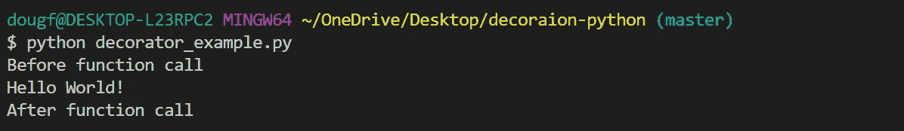

# Python 中的装饰器和闭包示例

> 原文：<https://towardsdatascience.com/decorators-and-closures-by-example-in-python-382758321164?source=collection_archive---------17----------------------->

## 如何使用装饰器增强函数的行为

作者:[爱德华·克鲁格](https://www.linkedin.com/in/edkrueger/)和[道格拉斯·富兰克林](https://www.linkedin.com/in/douglas-franklin-1a3a2aa3/)。

安吉丽娜·乔利维特在 Unsplash 上拍摄的照片

这里讨论的代码可以在这个库中找到。

<https://github.com/edkrueger/joblib-demo>  

我们将从这些概念的密集描述开始。然后再举一个说明性的例子。

## 装饰、关闭和范围

装饰是一种设计模式，允许您修改功能的行为。装饰器是一个函数，它接受一个函数并返回该函数的一个扩充副本。

当编写闭包和装饰器时，必须记住每个函数的作用域。在 Python 中，函数定义范围。闭包可以访问返回它们的函数的范围；装饰者的范围。

装饰品-照片由 Yoksel 拍摄🌿在 Unsplash 上的 Zok

如果你不懂这个行话，那也没关系。这里有一个例子来阐明这些概念。

## 示例:装饰

让我们回顾一下这段代码的范围、闭包和修饰。

装饰示例

这个**装饰器**将一个函数作为输入，并返回一个我命名为`closure`的**闭包**。这个闭包运行传递给`my_decorator`的`func`，并返回一个添加了一些打印语句的版本。

`my_decorator`、`closure`和`say_hello`三种功能都有自己的**范围**。关于`closure`有趣的是，它可以访问其作用域之外的变量**；`my_decorator.`父作用域内的变量**

虽然看起来不像，但是在`my_decorator`的范围内有变量——特别是作为参数传递的`func` 。注意`func`可以被`closure`访问，它在第 4 行被调用。因此，闭包正在访问装饰器的父作用域中的一个变量。

> 装饰者返回一个闭包。闭包是装饰器返回的东西。

这个要点中显示的第二个函数是`say_hello`。这个函数打印一个字符串并返回“无”。如果您愿意，可以在 [Python 文档中阅读更多关于 None 的内容。](https://docs.python.org/3/library/constants.html)

在第 16 行，我通过用`my_decorator`装饰 `say_hello`的**将**关闭**分配给`hello`。在这样做的时候，我定义了一个新的**函数**——闭包`hello.`,然后我在第 17 行把它叫做闭包。你能猜到这个调用会返回什么吗？**

say_hello()输出

你可能是对的。现在你可以看到装饰是如何扩展函数的行为的。然而，我们可以利用一种更方便的语法来修饰函数。

## 装饰者“@ Syntax”

在 Python 中，decorators 可以很容易地用`@`符号来应用。并非所有装饰器的应用程序都使用这种语法，如上面的例子所示，但是所有的`@`符号都是装饰器的应用。很多人用过 decorators(像`@app.route()`用 Flask)都不知道这个设计模式。

由@timefunc 修饰的函数“single_thread()”

当您在函数定义前包含`@timefunc`时，这个装饰器将应用于该函数。类似于我们如何定义一个**新函数**、`hello`，通过设置它等于`my_decorator(say_hello)`；我们在全局名称空间中重新定义了**`single_thread()`，使其不指向原始函数`single_thread()`，而是指向闭包。**

**也就是说，使用`@`符号来应用装饰器定义了一个新函数。使用这种样式，原始的函数名将被保留。当我们调用上面代码中的`single_thread()`函数时，相当于调用`timefunc(single_thread)`(如果不是被`@timefunc`修饰的话)。**

**因此，`@`符号是增强函数行为的一种优雅方式。**

## **结论**

**装饰是增强功能行为的有力工具。您可能会使用 decorators，因为您可以在 Flask 文档中找到它们。但是，编写自己的代码会很有用。例如，您可能想要计时或跟踪一个函数。通过编写实现这一点的 decorators，您可以获得一个优雅的、可重用的模式来跟踪函数的运行时和行为。**