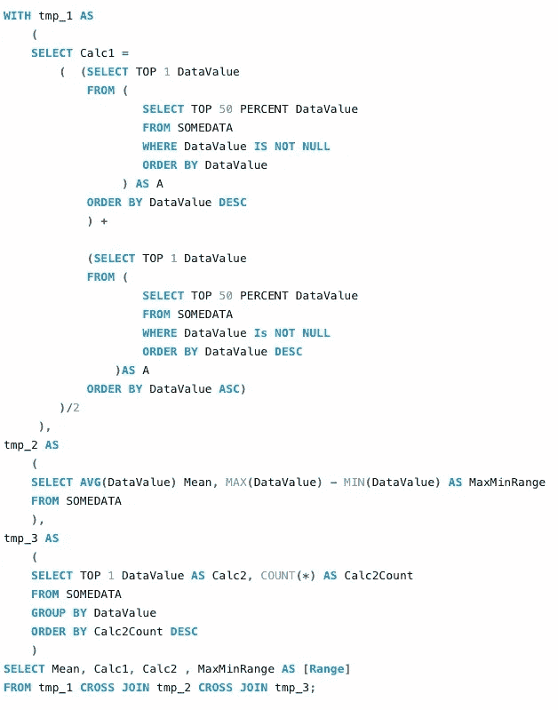
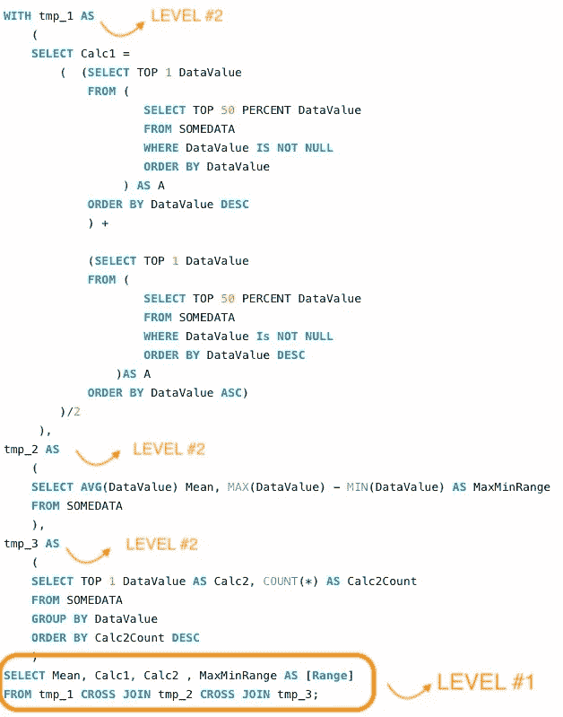
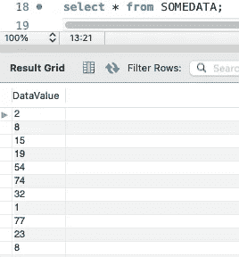
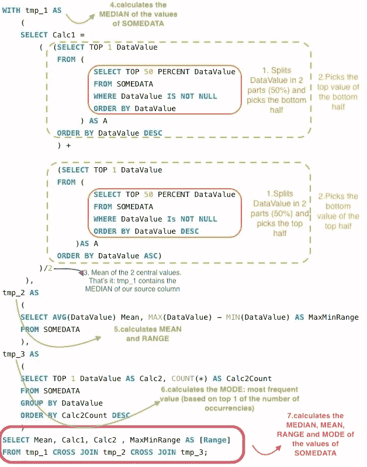

# 解密复杂的 SQL

> 原文：<https://towardsdatascience.com/decrypting-complex-sql-2050aeb98082?source=collection_archive---------8----------------------->


照片由 [@alexmotoc](https://unsplash.com/@alexmotoc) 在 [Unsplash](https://unsplash.com/photos/bYOB7SrWo5w) 上拍摄

## [*招数*](https://towardsdatascience.com/tagged/tips-and-tricks)

## 一种分析和理解复杂 SQL 的有效方法

在这个故事中，我想分享一种解决复杂 SQL 查询的棘手理解的可能方法。当我们需要处理一些现有的 SQL 代码时，可能是没有文档记录的、写得很差的，或者使用了我们还没有掌握的 SQL 版本，处理这些代码可能会令人沮丧。

无论我们需要对它做什么，只是按原样运行它，在数据科学或分析过程中使用它，修改它，等等。，无论如何我们需要理解它。

内容:

```
**·** [**What can make SQL tricky**](#c6fd)
· [**Breaking SQL complexity**](#03e9)
  ∘ [1\. Improve the code format and structure](#7c69)
  ∘ [2\. High level SQL review](#4be2)
  ∘ [3\. Clarify unknown SQL clauses, syntaxes and functions](#969c)
  ∘ [4\. Split and analyse inner to outer SQL](#592b)
**·** [**In a nutshell…**](#f2cf)
```

# 什么会使 SQL 变得复杂

当我们寻找一个新的 SQL 查询时，我们完全理解的主要障碍是

*   子查询和嵌套逻辑的大量使用
*   未知的子句、函数、语法、数据库特定的命令
*   结构不良或记录不良的代码

那么，假设我们需要快速理解一个 SQL 查询，我们能做些什么来优化我们的 SQL 分析方法吗？

# 打破 SQL 复杂性

在这一节中，我将介绍可以使我们的 SQL 分析更有效的 4 个主要因素。

1.**改进代码格式和结构**

**2。高级 SQL 审查**

**3。澄清未知的 SQL 子句、语法和函数**

**4。拆分和分析内部到外部 SQL**

我将解释每个概念，并将其应用到一个 SQL 示例中，这个示例实际上并不复杂也不冗长，但是完全相同的思想适用于任何 SQL 查询。

在这里，有人给了我们使用这段 SQL 的新数据挖掘工作流程，并告诉我们，它运行在 SQL Server 数据库。是啊，很棒的东西，现在呢？

```
WITH tmp_1 AS
(
SELECT Calc1 =
( (SELECT TOP 1 DataValue
FROM (
SELECT TOP 50 PERCENT DataValue
FROM SOMEDATA
WHERE DataValue IS NOT NULL
ORDER BY DataValue
) AS A
ORDER BY DataValue DESC
) + (SELECT TOP 1 DataValue
FROM (
SELECT TOP 50 PERCENT DataValue
FROM SOMEDATA
WHERE DataValue Is NOT NULL
ORDER BY DataValue DESC
)AS A
ORDER BY DataValue ASC))/2
 ),tmp_2 AS
(SELECT AVG(DataValue) Mean, MAX(DataValue) — MIN(DataValue) AS MaxMinRange
FROM SOMEDATA
),tmp_3 AS
(
SELECT TOP 1 DataValue AS Calc2, COUNT(*) AS Calc2Count
FROM SOMEDATA
GROUP BY DataValue
ORDER BY Calc2Count DESC
)
SELECT Mean, Calc1, Calc2 , MaxMinRange AS [Range]
FROM tmp_1 CROSS JOIN tmp_2 CROSS JOIN tmp_3;
```

## 1.**改进代码格式和结构**

这可能很傻，但是当我们的眼睛欣赏顺序时，首先要做的是以一种好的可读的方式构造 SQL 脚本。这需要 5 分钟，通过使用任何 SQL 客户端的脚本格式化内置工具，或者有很多免费的在线页面。

一旦完成了下面的例子，我们会得到类似这样的结果:



作者截图:格式化的 SQL 查询示例

最大的附加价值是，现在我们可以清楚地看到所有的子查询，它们的嵌套有多深，并且每个选择都非常容易识别。这些将是我们下一步的基础。

## **2。高级 SQL 审查**

***2.1 识别主 SQL 层***

任何查询都可以被视为由其他查询和子查询的层组成。我们可以通过查看 **SELECT** 子句及其依赖项来找到这些层。

现在，复杂的查询可能有许多层，但是为了有一个大概的了解*，我们可以只看一下* ***层 1*** ，看看它如何组合来自其内部层的数据:它做连接、联合、相交等吗？？

这为您提供了一些关于该查询的一般目的的提示。

在我们的例子中



作者截图

所以我们可以理解，LEVEL #1 通过交叉连接来组合 3 个子查询 tmp_1、tmp_2、tmp_3 的数据。

让我们继续学习更多关于我们查询的表。

***2.2 找出表和数据模型***

为了理解我们的 SQL 查询做什么，我们需要识别为每个 SELECT 子句提供数据的表，并推断它们之间的关系，在头脑中构建一种由查询隐式使用的数据模型。

为此，我们只需查看所有可能层的 **FROM** 子句及其子查询。

在我们的简单示例中，所有子查询只使用一个名为“SOMEDATA”的表。我们应该看看它的数据，这将有助于下一步。



作者截图

## 3.**阐明未知的 SQL 子句、语法和函数**

现在我们想更详细地了解我们的 SQL 做了什么。为此，我们需要了解更多我们不熟悉的 SQL 函数、操作符、子句和对象。如果我们不了解所有现有的 SQL 风格、所有可能的数据库供应商和版本，这是完全正常的。

所以只要找出你不知道的任何一段代码并查阅文档就行了。

例如，我们示例中的查询被编写为在数据库 SQL Server 上运行。

在我们的查询示例中，假设我们不理解两个部分:


"..什么是“百分比”？可能是某个特定于 SQL Server 的操作符吗？”


"..我以前见过，但我不记得它是做什么的了”

在阅读文件后，我们了解到

*前 50%*将列数据值中的数据分成 2 组，每组一半数据，取前一半。将它与 ORDER BY 子句结合使用，可以让我们考虑数据值的顶部和底部的 50%。

*同..AS* 动态创建记录集，并将其命名为“tmp_1”，然后可以在同一个查询的其他部分引用它。

## **4。拆分和分析内部到外部 SQL**

现在我们有了理解整个查询的所有元素。为此，我们需要一部分一部分地分析 SQL，从内部查询层开始，然后向上移动到第 1 层。

每当我们理解了属于一个层的所有子查询，我们也应该能够理解它们的外层做什么。

让我们将这个原则应用到我们的查询示例中:我们从查看带有 tmp_1 的 section 的内部子查询开始(参见注释 1。)，那么我们转移到 2。，然后是 3。结合了 1 的知识。第二。这使得我们能够完全理解整个 tmp_1 部分。

当我们数到 7 时。我们知道 SQL 脚本的目的只是计算单个表的列的中值、平均值、范围和众数。



作者截图:SQL 分析示例

# 简而言之…

在这个故事中，我介绍了一种非常有效的方法来分析复杂的 SQL 查询。这 4 个主要步骤非常实用，可以应用于任何复杂度的查询。这种方法适用于任何人，从 SQL 初学者到专家，它只是改变了完成它所需的时间。

感谢阅读。

[随时订阅我的**《分享数据知识》**简讯**。**](http://eepurl.com/humfIH)


如果你想订阅《灵媒》,请随意使用我的推荐链接[https://medium.com/@maw-ferrari/membership](https://medium.com/@maw-ferrari/membership):对你来说，费用是一样的，但它间接有助于我的故事。