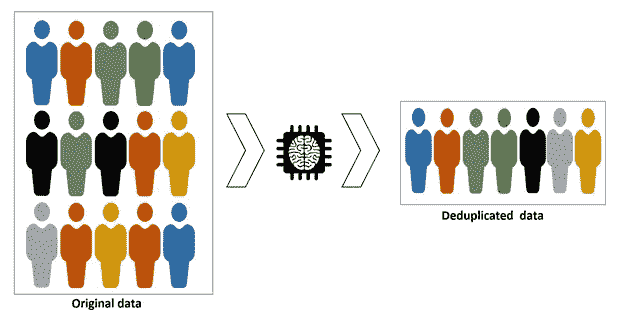
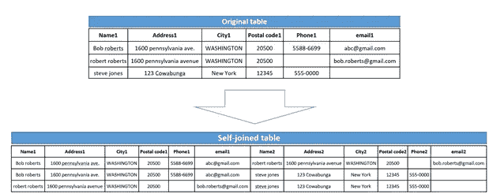

# 使用模糊评分对客户数据进行重复数据删除

> 原文：<https://towardsdatascience.com/deduplication-of-customer-data-using-fuzzy-scoring-3f77bd3bb4dc?source=collection_archive---------28----------------------->

## [行业笔记](https://towardsdatascience.com/tagged/notes-from-industry)

## 使用 Python 处理复杂的客户数据



**摘要:**

对于任何组织而言，数据管理始终是一项挑战，贯穿其规划、收集、处理、存储、管理、分析、可视化和最终解释的生命周期。为了成功管理和保护数据，需要团队之间进行大量规划和协作，以便将数据从一个阶段转移到下一个阶段。数据处理的几个主要步骤是争论、压缩、重复数据删除和加密。对于大多数以客户为中心的组织来说，获得唯一的客户列表将是一个最大的挑战，这不是因为存储成本降低，而是因为了解他们的客户是他们最大的资产。

因此，无论企业规模如何，他们都会花费大量时间和精力，通过线内重复数据删除或后处理重复数据删除来获取正确的数据[1]。本白皮书通过 python 和相关软件包使用模糊评分方法来讨论后处理重复数据删除。

**挑战:**

数据以各种方法收集，有/没有标准的数据收集表格，在不同的地方收集，但集中在一个地方。这些列表通常由第三方编制，没有标准格式，并且通常包含重复或“脏”数据。数据追溯到漫长的历史，包含不准确和不完整。

当试图比较由不同收集方法编制的列表时，很快会遇到几个数据问题的挑战:

1.**不明确的地址**:根据数据收集的时间、地点和主要目的，它可能具有非结构化和非特定的地址、邮政编码甚至姓名。

2.**音译问题**:将带有非罗马字符的地址翻译成英文文本时出现的不一致会导致地址和姓名的变化。

3.**联系信息复杂化**:客户通常会有多个电子邮件地址和电话号码，当企业类型为 B2B 时，这个问题会变得更加突出，在 B2B 中，企业会有多个电话号码和电子邮件地址。

4.**最多重复值**:常见的重复值是因为数据收集不正确，特别是在姓名、电子邮件、电话号码等项下。每种情况都必须得到适当的处理。

**数据标准化:**

开始重复数据消除之前的一个重要步骤是确保数据结构化、对齐并具有一致的格式。因此，遵循以下步骤是明智的:

1.**小写**:高效最简单的一个步骤就是把所有东西都转换成小写，让名字和地址具有可比性。

2.**缩写**:通过建立一个从互联网上获得的或定制的正在处理的数据的知识库，保持单词与缩写的一致性。示例:Street 也表示为 St .，St，Str。、字符串等。

3.**缺失值**:评估每条记录的缺失值，如果有重大缺失值，则将其删除，不要继续处理，这样的记录质量将太低，无法帮助重复数据删除评分。

4.**不正确的国家名称**:Python 包“iso3166”包含所有国家的列表，帮助识别国家名称中不正确的国家名称。

5.**不正确的邮政编码**:‘pgeocode’是一个 python 库，包含所有国家的合法邮政编码，用于验证地址中的邮政编码。出于同样的目的，也有几个付费的 API 来帮助获得正确的邮政编码。

**电话号码和电子邮件地址的验证:**

除了识别重复的电话号码之外，可以进行的附加验证是评估质量和标准化前缀为“+”或“0”或(国家代码)的格式。以下脚本有助于在几秒钟内标准化数百万个电话号码。可以通过付费 API 进行进一步的精确验证，该 API 有助于在线后处理重复数据删除期间的验证。

```
def check_phone(phone, cc):
    try: 
        if int(phone) <1: return np.nan
        if phone== np.nan: return np.nan
    except:pass 

    phone= str(phone)
    cc= str(cc)#print(phone, cc)
    if len(phone)>4 :
        if phone != np.nan or cc != np.nan:
            cc_len = len(cc)
            if(phone[:1] == '+'):
                if phone[1:1+cc_len] == cc:
                    return phone
                else: return phone
            else:
                cc_len = len(cc)
                if phone[:1] == '0':
                    if phone[1:1+cc_len]== cc:
                        return phone.replace('0','+',1)
                    else: 
                        return phone.replace('0','+'+cc,1)
                else:
                    if phone[0:cc_len]== cc:
                        return '+'+phone
                    else:return '+'+cc+phone
    else: return np.nan # Function caller
%time 
account[['calling_code','contact_Phone']].apply(lambda x : check_phone(x.contact_Phone, x.calling_code),axis = 1)
```

**重复的定义:**

定义数据中的哪些重复是该过程的一个重要方面。根据正在解决的问题，重复的定义会发生变化。对于最常见的客户数据，通常是姓名、邮政地址、电话号码和电子邮件地址。这些将形成一组字段，用于查找评分和帮助识别重复。很少有字段(如电话号码或电子邮件)会给出重复的明确指示，另一方面，姓名或地址的重复实际上可以表示实际上是分离的个体。因此，这种情况应该通过半自动/自动验证过程。

**最后的评分:**

评分从基于城市/邮政编码与自身连接的表的自连接开始，然后使用模糊逻辑对其余列(如姓名、电子邮件和电话号码)进行评分。具有正确截止值的评分给出了数据中可能的重复列表，其余的将被丢弃。和往常一样，没有神奇的数字来确定临界值，需要几次迭代才能得出 0-100 之间的数字来定义数据的正确临界值。此外，每个列最好有不同的截止值，如下面的代码所示。



自联接后的结果表

```
# self-joining data based on the parameter
# Preparation of data for fuzzy
def joiner(cntry , file , mcol):
    df_string_all = account[(account.ShippingCountryCode == cntry)]
    df_string_all = df_string_all[address_match_columns]
    global dup
    dup = pd.DataFrame()
    parts = round(df_string_all.shape[0]/1000)
    start_time = time.time()
    if cntry == 'ie':
        mcol = mcol.replace('PostalCode','City')print(cntry.upper(), mcol)
    total_uni = len(df_string_all[mcol].unique())
    unique_col_value = df_string_all[mcol].unique()
    rem = ['xxxxx','Nan','', 'NAN', 'nan', np.nan]
    unique_col_value = [uni for uni in unique_col_value if uni not in rem]

    for i in range(1,parts+1): 
        my_list = unique_col_value[int(round(np.divide((1),parts)*total_uni*(i-1))):\
   int(round(np.divide((1),parts)*total_uni*i))]
        df_string = df_string_all[(df_string_all[mcol].isin(my_list))]
        df_string = df_string.merge(df_string, on= mcol , how = 'left', suffixes=  ('1', '2'))
        col_list = df_string.columns.sort_values().drop( ['Id1', 'Id2']).drop(mcol)df_string = df_string[(df_string.Id1 < df_string.Id2)]
        even = col_list[::2]
        odd = col_list[1::2]
        df_string = df_string[(df_string[['Name1' , 'Name2']].apply( lambda x:fuzz.token_sort_ratio(x['Name1'], x['Name2']), axis = 1) > name_match_cutoff)]
        if df_string.shape[0] >0:
            dup = dup.append(identifier(df_string, even, odd, mcol))
            del df_string
    del df_string_all
    end_time = time.time()
    print('Time taken for : ' ,cntry.upper() , mcol , round((end_time - start_time)/60,2) , ' minutes')
    print('Duplicates for : ',cntry.upper() , mcol, dup.shape)
    return dup
```

下面的块根据用户定义的截止级别识别数据中的重复项:

```
def identifier(df_string, col_even, col_odd, case):
    for i in col_even: 
        for j in col_odd: 
            if(i[:-1] == j[:-1]):
                new_col = i[:-1]+'_score'
                df_string[new_col] = df_string.apply(lambda x: fuzz.token_sort_ratio(x[i], x[j]) , axis = 1)
                df_string[new_col] = df_string.apply(lambda x: 0 if (pd.isnull(x[i]) | pd.isnull(x[j])) else x[new_col], axis=1)col_score =  [k for k in df_string.columns if 'score' in k]
    street_score = [k for k in col_score if 'Street' in k]
    city_score = [k for k in col_score if 'City' in k] +[k for k in col_score if 'Post' in k]

    if case == 'Name': 
        duplicate_con = df_string[((df_string[street_score]> street_match_cutoff).sum(axis= 1) > 0) &\
                                            ((df_string[city_score]> city_match_cutoff).sum(axis=1)>0)]        
    elif case == 'BillingStreet': 
        duplicate_con = df_string[((df_string[city_score]> city_match_cutoff).sum(axis=1)>0) & \
                                           (df_string['Name_score']> name_match_cutoff)]
    else: 
        duplicate_con = df_string[(df_string['Name_score'] > name_match_cutoff) & \
                                            ((df_string[street_score] > street_match_cutoff).sum(axis=1) > 0) & \
                                          ((df_string[city_score]> city_match_cutoff).sum(axis=1)>0)]
    if duplicate_con.shape[0] >0: 
        duplicate_con['2Final_Score'] = round((duplicate_con[col_score].mean(axis = 1)))
        duplicate_con['1Match_Case'] = case
        duplicate_con[case+'1'] = duplicate_con[case]
        duplicate_con[case+'2'] = duplicate_con[case]
        duplicate_con[case+'_score'] = 100
        duplicate_con= duplicate_con.drop(columns= case)

    return duplicate_con
```

函数调用程序

```
country = list(account.ShippingCountryCode.unique())
country = [e for e in country if e not in (['nan', np.nan])]
duplicate = pd.DataFrame()
duplicate_indi = pd.DataFrame()
start = time.time()for cntr in country: 
    file_name = 'account_'+ cntr
    for cols in ['MailingPostalCode', 'PostalCode']:
        duplicate = duplicate.append(joiner(cntr , file_name, cols))

end = time.time()
print('Total Time taken:' , round((end - start)/60,2) , ' minutes')
```

通过 LinkedIn 与我进行有趣的对话:[www.linkedin.com/comm/mynetwork/discovery-see-all?use case = PEOPLE _ FOLLOWS&follow member = shreepadahs](http://www.linkedin.com/comm/mynetwork/discovery-see-all?usecase=PEOPLE_FOLLOWS&followMember=shreepadahs)

**参考文献:**

[1][https://www . data core . com/blog/inline-vs-post-process-de duplication-compression/](https://www.datacore.com/blog/inline-vs-post-process-deduplication-compression/)