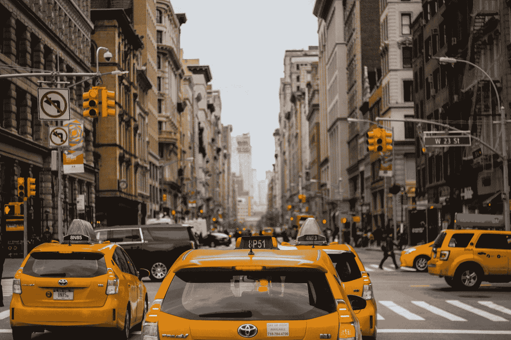
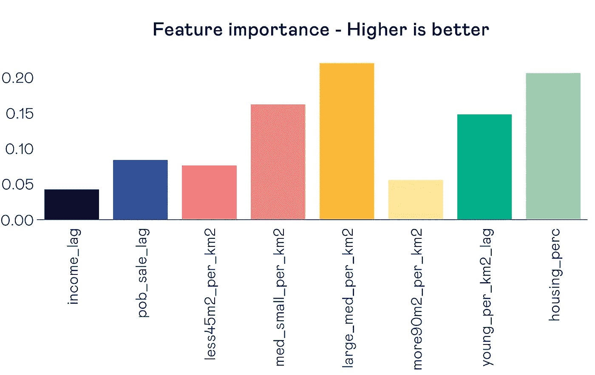
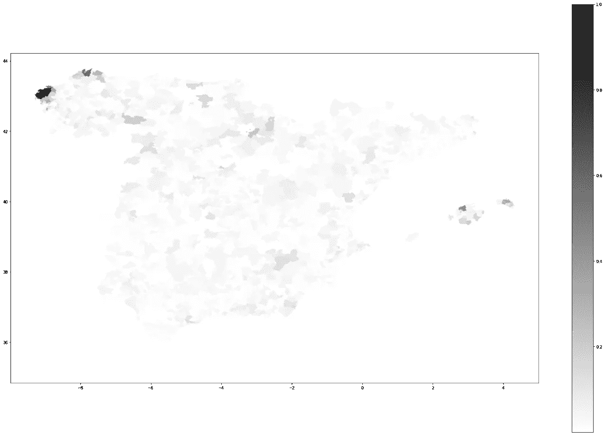

# 深层空气:设计更健康城市的智能数据方法

> 原文：<https://towardsdatascience.com/deep-air-the-smart-data-approach-to-designing-healthier-cities-8cef4bb2c33?source=collection_archive---------22----------------------->

## 如何利用正确的数据和机器学习的结合来塑造未来的智能城市

我们生活在一个越来越意识到生活在污染空气中的负面影响的社会里。结果，污染成为城市设计或重新设计时的一个关键问题。不幸的是，很难评估个人选择的影响，因为因果关系很难证实。由于人类行为对结果至关重要，问题就更加复杂了。幸运的是，城市规划者正在寻找方法来促使人们做出更好的个人选择。不幸的是，规划者没有必要的工具来评估必须做什么来减少污染，尤其是那些负担不起使用大型超级计算机的规划者。


尼克·范·登伯格在 [Unsplash](https://unsplash.com?utm_source=medium&utm_medium=referral) 拍摄的照片

人类对污染水平有相当大的影响。新冠肺炎疫情展示了我们的行为与城市空气污染的关联程度。在巴塞罗那，二氧化氮水平在 2020 年 3 月下降了 64%,达到了以前认为不可能达到的水平。将这一结果与多项研究表明 NO2 污染与糖尿病、高血压、中风、慢性阻塞性肺病和哮喘等健康问题相关的知识相结合。

我们在城市中面临的污染挑战是重要的，成功或失败的后果将会影响到每个人。为了发现我们可以做些什么，我们将我们的力量与 300，000 km/s 结合起来，这是一个巴塞罗那城市规划智库，致力于城市的智能数据。我们旨在智能地使用数据，使城市建筑师在考虑空气污染时做出更明智的决策。有了大量的数据，这从一开始就提出了重要的问题:什么数据是相关的？我们如何让数据变得智能？



照片由[费迪南·斯托尔](https://unsplash.com/@fellowferdi?utm_source=medium&utm_medium=referral)在 [Unsplash](https://unsplash.com?utm_source=medium&utm_medium=referral) 拍摄

# 我们的方法

我们的旅程从 [**Esteve**](https://medium.com/u/dc4e1e8e390f?source=post_page-----8cef4bb2c33--------------------------------) 的厨房餐桌开始，我们讨论了一个有影响力和令人兴奋的项目的各种选择，这个项目将结束我们的商业分析硕士学位。我们很快就决定了**智能城市**的主题，Esteve 最近在这个领域做了一些研究。Esteve 联系了 300.000 km/s 的联合创始人 Mar 和 Pablo。在这八个月的旅程中，他们与 Esteve 一起为我们提供了帮助和支持，并在我们拐错弯时用他们的专业知识为我们提供了指导。没有他们，我们不会走这么远。

我们以 300.000km/s 提供的数据集开始了我们的项目。该数据集包含从移动蜂窝设备收集的关于西班牙**个人移动的汇总旅行数据。西班牙被划分成大约 2500 个地区，所有在这些地区之间的旅行都被收集起来。学者们早就表明，二氧化氮与出行密切相关(最明显的是，来自柴油车)。为了巩固我们的原始数据，我们添加了大量的环境统计数据。这些指标从生活在这些地区的每个年龄组的人数到平均收入不等。**

> *新冠肺炎疫情展示了我们的行为与城市空气污染的关联程度。*

为了准确预测西班牙许多地区的二氧化氮水平，我们需要考虑建模技术。我们的模型结合使用了标准和不常见的机器学习技术。我们从头到尾使用了相关矩阵、随机森林回归树、基于图形的表示和空间滞后特征。当我们努力以最佳方式使用数据时，来自 300，000 km/s 的数据科学家 Andre 向我们介绍了空间滞后的概念。该功能以最佳方式利用了我们拥有的数据(即地理信息)的优势。通过这样做，我们可以将“空间性”引入我们的机器学习词汇。

因此，我们可以提取传统机器学习技术中通常会丢失的重要信息**，如随机森林或 XGBoost。我们查看了莫兰的 I 系数，以确保我们只使用拥有完整信息的空间滞后特征。该系数是对空间自相关的一种度量，简单来说，它表示在地理上相邻的区域中利用相同质量的值的知识来预测元素的好坏程度。**

我们的最终成果是一个模型，该模型使用“正常”和“空间滞后”特征的最佳组合来预测西班牙的 NO2 水平。我们开始了对 30 多个特征的最佳可能模型的初步搜索，并以使用**八个特征来预测整个西班牙**的 NO2 的模型结束。Moran 的 I 得分和不同特征之间的多次尝试在空间上是滞后的。我们建立了一个模型，预测整个西班牙 NO2 水平的准确率为 88.8%。我们发现，住宅建筑所占空间的百分比和表面积在 61 至 90 平方米之间的住宅数量是 NO2 水平的最有效预测因素。其他值得注意的预测因素是面积在 45 至 60 平方米之间的房屋和每平方公里 0 至 25 岁的人口数量。因此，我们可以主要利用居民信息精确预测 NO2 水平。这一见解显示了城市规划是如何影响宜居性的。

```
resall =pd.DataFrame()
res_w1 =pd.DataFrame()**from** **sklearn.ensemble** **import** RandomForestRegressor
**from** **sklearn.model_selection** **import** KFold
**from** **sklearn.model_selection** **import** cross_val_score

seed=7

kfold=KFold(n_splits=10, random_state=seed, shuffle = **True**)

num_trees=100
num_features=5
max_depth = 5
model12=xgb.XGBRegressor(colsample_bytree=0.4,
                 gamma=0,                 
                 learning_rate=0.07,
                 max_depth=3,
                 min_child_weight=1.5,
                 n_estimators=10000,                                                                    
                 reg_alpha=0.75,
                 reg_lambda=0.45,
                 subsample=0.6,
                 seed=42) 
model12.fit(mix_matrix,Y)

results_NO2_avg=cross_val_score(model12, mix_matrix, Y, cv=kfold)

print(f'Random Forest - Accuracy **{**results_NO2_avg.mean()*100**:**.3f**}**% std **{**results_NO2_avg.std()*100**:**3f**}**%')

res_w1["Res"]=results_NO2_avg
res_w1["Type"]="Random Forest"

resall=pd.concat([resall,res_w1], ignore_index=**True**)
```

> 随机森林-精确度 88.876%标准 1.376834%

```
plt.figure(figsize=(30,9))

**for** name, importance **in** zip(names, model12.feature_importances_):
    print(f'**{**name**:**15s**}**  **{**importance**:**.4f**}**')

sns.barplot(x=names, y=model12.feature_importances_)
```

> income _ lag 0.0429
> pob _ sale _ lag 0.0842
> less 45 m2 _ per _ km2 0.0765
> med _ small _ per _ km2 0.1632
> large _ med _ per _ km2 0.2218
> more 90 m2 _ per _ km2 0.0553
> young _ per _ km2 _ lag 0.1494
> housing _ PERC 0.2067



感谢[大卫·卡列加罗](https://medium.com/u/ccf454c79d25?source=post_page-----8cef4bb2c33--------------------------------)和[彼得·布鲁因斯](https://medium.com/u/51970eb0f4f4?source=post_page-----8cef4bb2c33--------------------------------)

```
pred2 = model12.predict(mix_matrix)

abs_diff2 = abs(Y-pred2)/Y
abs_diff2 = pd.DataFrame(abs_diff2)

abs_diff2 = abs_diff2.merge(df_tryout.geometry, how = 'left', left_index = **True**, right_index = **True**)
abs_diff2

abs_diff2 = gpd.GeoDataFrame(abs_diff2, crs="EPSG:4326", geometry='geometry')abs_diff2.NO2_avg = np.clip(abs_diff2.NO2_avg, 0, 1)
fig, ax = plt.subplots(1, figsize=(30, 20))
abs_diff2.plot(column='NO2_avg', cmap='gist_yarg', linewidth=0.8,ax = ax, legend=**True**)
```



地图精度(越暗精度越低)

# 关键的发现

我们陈述了这个项目的目标，提出了两个问题:什么数据是相关的？我们如何让数据变得智能？我们现在能够回答这两个问题，但是为了这样做，我们需要后退一步。

我们都同意，所有可用的数据现在和将来都不足以创建一个数字城市。此外，该模型即使可能也是不可扩展的，因为它需要为每个城市训练等量的数据。

那么，有办法避免这种情况吗？我们需要所有这些数据吗？换句话说，根据该模型可以做出哪些决策？

理想情况下，立法者可能会决定是否禁止卡车通过街道，限制交通流量，或者推广自行车。这些**决策不仅粒度很低**，而且很可能是**二元决策**(例如，我们的立法者会问自己:“这个周末我们是否应该禁止市中心的卡车通行？”).此外，在最乐观的情况下，这些离散的决策将仅适用于**小范围的行动**(例如，立法者可能允许使用三条车道中的两条)。

因此，我们不需要一个高度精确的模型，而是一个足够精确的模型，以帮助领导者在低粒度上进行干预。

> **我们模型的优势在于它能够完全扩展和灵活地适应各种场景**。它可以输入**合成数据，**作为它建立在公开可用的数据源上。


乔纳森·罗杰在 [Unsplash](https://unsplash.com?utm_source=medium&utm_medium=referral) 上的照片

# 最终考虑

多个部门可以利用我们模型的结果。公共部门可能是主要的受益者，因为城市规划会影响污染。与目前使用的路线相比，通过采取创新战略减少各地之间的交通，城市可以以更低的成本产生更大的影响。这个模型将告诉我们，如果我们在整个结构中调整特定的交通流量，会发生什么情况。一个例子是在 Sant Cugat 建造办公室，以减少巴塞罗那的交通流量，从而改善巴塞罗那的空气质量。这一行动与当今政治家们试图在污染过高的地方制定措施时所采取的行动形成了鲜明的对比。

各国可以使用这些模型来检查他们的污染规划是否按照计划进行。我们的预测可以为已采取特定污染最小化措施的区域设定基准，并评估其成效。这种外卖将缩短成功创意的上市时间，因为确认结果所需的时间更少。此外，它还能更快地推出新想法，因为糟糕的想法会更快地被发现。结果将是节约成本和更好地保护环境。


照片由[赫克托·阿圭略·卡纳尔斯](https://unsplash.com/@harguello?utm_source=medium&utm_medium=referral)在 [Unsplash](https://unsplash.com?utm_source=medium&utm_medium=referral) 上拍摄