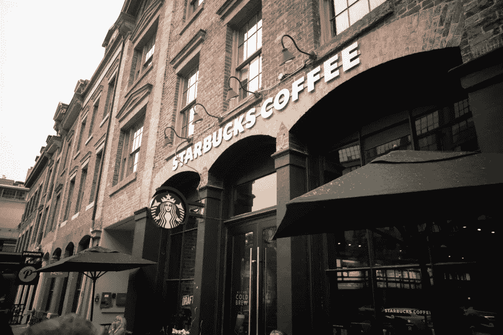
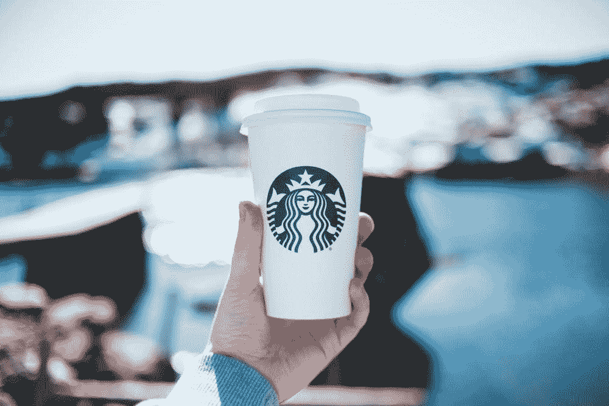
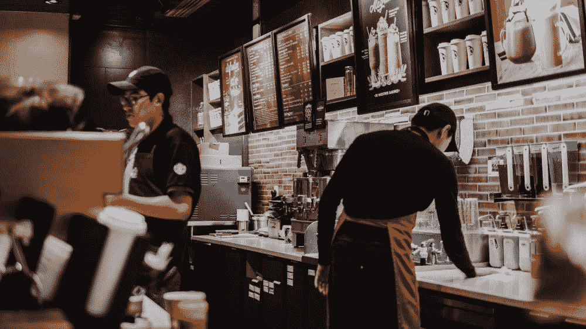
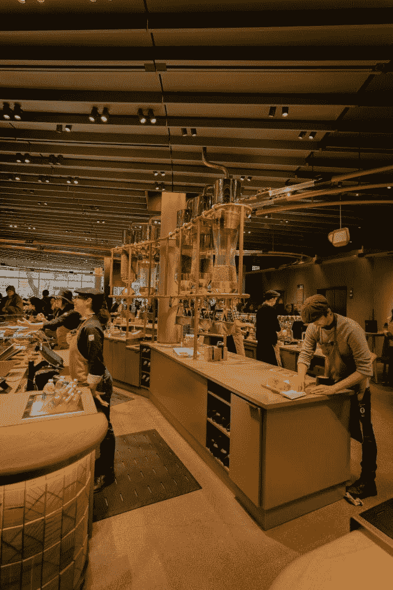

# Deep Brew:将星巴克转型为一家人工智能和数据驱动的公司

> 原文：<https://towardsdatascience.com/deep-brew-transforming-starbucks-into-an-ai-data-driven-company-8eb2e370af7b?source=collection_archive---------16----------------------->

## 星巴克如何使用他们的人工智能平台 Deep Brew 不断创新，为咖啡爱好者提供世界级的体验

[TR](https://unsplash.com/@trance?utm_source=unsplash&utm_medium=referral&utm_content=creditCopyText) 在 [Unsplash](https://unsplash.com/s/photos/starbucks-coffee?utm_source=unsplash&utm_medium=referral&utm_content=creditCopyText) 上拍照

如果你曾经进入过星巴克，你会同意它就像一个普通的咖啡馆:提供浓缩咖啡和拿铁咖啡，研磨咖啡，顾客与咖啡师交谈定制他们的咖啡订单。但是，在快速变化的市场条件下，为遍布全球 78 个市场的[1 亿多顾客提供服务](https://stories.starbucks.com/press/2019/starbucks-celebrates-global-milestone-with-30000th-store/)，要求这家咖啡巨头拥有完美的流程编排，并投资技术创新，将星巴克从一家饮料供应商转变为一家数据驱动的科技公司。Deep Brew 是他们成功的人工智能驱动平台，可以驱动品牌的个性化引擎，优化商店劳动力分配，并推动商店的库存管理。

但星巴克的数据转型早在 2019 年推出 Deep Brew 之前就开始了。因此，在我们放大咖啡巨头的人工智能驱动平台，帮助他们提供数据驱动的咖啡之前，我们将探索他们如何以各种方式利用数据为他们的业务和客户创造价值——巩固星巴克作为无可争议的咖啡店领导者。

# 数字飞轮:郊区客户体验的移动应用

星巴克在 2011 年推出了他们的移动应用，这标志着它进入数据和分析的切入点。事实证明，这是他们数字化转型的最大支柱之一。

起初，它旨在作为一个忠诚度计划，使顾客能够为每次购买收集星星，并在下一次饮料订单中兑换它们。这款应用很快成长为一个中心,顾客可以在这里获得关于菜单、商店位置和营业时间的信息。应用程序中的客户活动为星巴克提供了关于热门商店位置、饮料和一天中的时间的有用信息。

如今，星巴克每周 1 亿笔交易中，有四分之一是通过其移动应用进行的，随着社交距离措施的实施，这一趋势进一步加速。更重要的是，据雅虎财经报道，该应用的会员贡献了星巴克近 50%的收入。

作为其数字飞轮战略的一部分，星巴克移动应用程序允许咖啡爱好者提前下单，并通过商店窗口或走进商店领取。通过融合人工智能和营销的力量，该品牌扩展了其应用程序功能。现在，[星巴克的数字飞轮](https://www.geekwire.com/2019/starbucks-teams-new-restaurant-tech-platform-led-coffee-giants-former-chief-digital-officer/)由四个数字部分组成——奖励计划、个性化、支付和订购。

毫无疑问，星巴克的数字创新被认为推动了增长；他们已经成为借助数据创造忠诚客户的专家。

照片由[埃里克·麦克莱恩](https://unsplash.com/@introspectivedsgn?utm_source=unsplash&utm_medium=referral&utm_content=creditCopyText)在 [Unsplash](https://unsplash.com/s/photos/starbucks?utm_source=unsplash&utm_medium=referral&utm_content=creditCopyText) 上拍摄

# 星巴克如何从数据和人工智能中创造价值

早期，咖啡品牌已经意识到，使用数据分析来最大化他们的**客户生命周期价值** ( *每位客户每次访问的平均购买价格、每位客户每年的访问次数以及平均客户生命周期*)将是获得无与伦比的竞争优势的黄金入场券。

这家咖啡公司就是这样利用数据分析来最大化客户终身价值，同时重塑其品牌产品的:

## 个性化推荐

首先，收集和分析关于顾客消费和偏好的大量数据有助于星巴克根据每位顾客独特的偏好和消费习惯为他们提供个性化的顾客体验。通过分析订单的历史和模式，该应用程序可以建议食物和饮料的选择，但也可以根据顾客通常光顾咖啡店的时间和频率推送量身定制的建议。

通过发送实时触发和推送通知，星巴克与顾客建立了更深层次的联系。购买者注意到该品牌考虑到了他们的偏好，并以定制他们的体验为乐。

## 创新和新产品供应

除了个性化，星巴克还利用从他们的数字飞轮收集的数据来[创造新产品](https://towardsml.com/2018/11/27/the-data-driven-coffee-analyzing-starbucks-data-strategy/)。他们所有的创新产品，如无奶或无糖饮料、夏季特别饮料或新的家庭消费产品，都是分析用户偏好及其背后的数据的结果。

例如，星巴克发现，约 43%的喝茶者在茶中不加糖，约 25%的人在家喝冰咖啡时不加牛奶。这些见解导致了两种不加糖的冰茶 K 杯——芒果绿冰茶和桃子红茶。他们数据工作的其他一些成果是南瓜香料拿铁咖啡和不加牛奶或香料的冰咖啡。

## 开设新店

你可能会觉得每个角落都有一家星巴克店，但实际上，他们会仔细使用飞轮数据来确定每个新星巴克店的最佳位置。这家咖啡巨头利用数据和人工智能，根据收入水平、流量或竞争对手的存在等变量进行收入预测，并帮助确定下一个重大收入机会在哪里。同时，这使他们能够最大限度地降低自相残杀的风险，并将新店定位在服务于特定客户群的区域。

照片由[阿萨埃尔·培尼亚](https://unsplash.com/@asaelamaury?utm_source=unsplash&utm_medium=referral&utm_content=creditCopyText)在 [Unsplash](https://unsplash.com/s/photos/starbucks?utm_source=unsplash&utm_medium=referral&utm_content=creditCopyText) 上拍摄

# Deep Brew:提升人性、商业和客户体验的平台

在接受雅虎财经直播(Yahoo Finance Live)采访时，星巴克(Starbucks)的前首席运营官罗兹·布鲁尔(Roz Brewer)表示，咖啡连锁店的科技未来专注于不断增长的免下车商店，包括可定制的菜单板，这些菜单板利用人工智能根据天气、时间、商店库存、人气、社区偏好和客户的购买历史等因素来建议商品。

他们的人工智能驱动平台 Deep Brew 允许他们利用人工智能和人工智能进行创新，不仅可以个性化得来速体验，还可以自动化耗时的任务，如库存管理和对其物联网(IoT)连接的咖啡机进行预防性维护。

通常，当人们听到技术和自动化正在融入工作场所时，他们会开始担心自己的工作正在被机器人和机器接管。

然而，星巴克首席执行官凯文·约翰逊、星巴克首席技术官格里·马丁-弗利金格和其他人有一个愿景，他们正在宣扬人工智能不是为了取代人的工作。相反，他们认为[人工智能可以用于在工作场所增强人性](https://stories.starbucks.com/stories/2020/how-starbucks-plans-to-use-technology-to-nurture-the-human-spirit/),帮助人们找到融入人性的方法，腾出时间让员工积极与客户联系，并提供重要的个人联系。

在星巴克的新闻博客中，马丁-弗利金格表示，她认为人工智能适用于商业的几乎每个方面——技术、金融、法律、供应链、营销或零售店。

Martin-Flickinger 解释说，通过他们的人工智能技术倡议 Deep Brew，他们正在研究有助于增强人类联系的技术。广泛的人工智能工具套件将提升业务的各个方面以及店内和客户体验。

但这是否意味着我们很快就会看到穿着围裙的机器人在星巴克为我们点餐？一点也不。Deep Brew 更像是人类咖啡师的一个无形、超级智能的助手，帮助他们处理库存、供应链物流和补货订单，节省合作伙伴的时间，预测员工需求和制定时间表。它还可以帮助进行预测性维护，在咖啡机出现故障之前提醒员工。

# 深度酿造的路线图

星巴克数据科学和分析运营首席经理**布赖恩·艾姆斯**在他的[数据创新峰会](https://datainnovationsummit.com/)2020 talk**Deep Brew-星巴克的机器学习-路线图** 期间表示，Deep Brew 计划于 2019 年首次推出，并将 ML 引入咖啡公司，帮助他们在其大型组织中将模型部署到生产中。

他们以 Deep Brew 开始销售的风来自竞争对手麦当劳收购 Dynamic Yield 公司的战略举措，该公司旨在将强化学习和机器学习引入快餐领域。这一事件促使星巴克 C-suite 开始寻找对这一举动的回应，并开始思考将机器学习融入到自己的业务中。Deep Brew 是对瞬息万变的市场变化的完美回应和解决方案。

[*了解更多关于数据创新峰会的信息*](https://datainnovationsummit.com/)

Deep Brew 在去年 COVID world 的免下车活动中发挥了特别重要的作用。有了它，他们可以在不同的免下车商店的屏幕上个性化推荐。Brian 解释说，每个国家的每家商店都有其独特的个性，此外还有其他因素，如星期几、一天中的温度、客流量等。这些都是星巴克在设计由 Deep Brew 驱动的推荐系统时能够应用的要点。

“先进的技术，快速部署的能力和一些先进的大脑对星巴克来说是一个很好的解锁，Brian 肯定地说。

本杰明·拉斯科在 [Unsplash](https://unsplash.com/s/photos/starbucks-brewery?utm_source=unsplash&utm_medium=referral&utm_content=creditCopyText) 上的照片

# 在深层酿造的引擎盖下

Brian 说，Deep Brew 提供的所有东西都要归功于星巴克拥有的惊人数据和基础——他们的企业数据分析平台 EDAP 或统一不同来源数据的数据湖。从湖中，他们获取数据，将其加载到他们的 Deep Brew 平台，运行到计算层，输出到达不同的接触点并与之对话，如移动应用程序、数字免下车服务、网站、社交媒体。

然而，像 Deep brew 这样的机器学习系统很难组装起来，因为它是一个跨功能的复杂解决方案。ML 系统只有一小部分是由 ML 代码组成的。为了使解决方案取得成功，还应该导航所有其他组件，例如数据收集、数据验证、特征提取、流程管理工具、分析工具等。，应该导航。为了训练模型并获得预期的结果，团结所有其他团队并让他们理解在所有维度上保持卓越的重要性是极其困难的。

Brian 认为，这就是为什么很难从一个人的头脑或研究中获得一个概念，并将其大规模应用于一个大型组织。

如今，他们的 Deep Brew 平台发展良好，并向客户提供高度个性化的推荐。但要达到这一阶段，星巴克必须浏览以上所有内容，并吸取一些惨痛的教训——或者像布莱恩所说的“要避免的七宗罪”。

在像 Deep Brew 毕然共享这样的大型组织中大规模部署机器学习系统时，需要避免的一些陷阱是:

1.  对组织中的其他人没有有意义的和一致的提升
2.  没有基线来确保不损害现有的操作
3.  对不同的工作影响没有明确的预期:它会“提升”还是取代他们的工作
4.  不容易获得安全指南和专业知识
5.  不考虑操作
6.  拥有多线程或具有冲突优先级的人员——没有定期召开全体会议的专门团队
7.  告诉人们这是不可能的，却没有表现出来。

[*在 2020 数据创新峰会上看完整届布赖恩·艾姆斯*](https://hyperight.com/deepbrew-machine-learning-at-starbucks-a-roadmap-brian-ames-starbucks/)

# 星巴克的数据驱动未来是什么样子的？

作为数字飞轮计划的一部分，Deep Brew 为星巴克带来了巨大的成功。这使得他们的客户群在 2019 年底大幅增长至近 1800 万，使[在美国的同店销售额增长了 6%](https://www.marketwatch.com/story/starbucks-gets-personal-with-deep-brew-artificial-intelligence-program-2019-10-31) 。

除了数字上的增长，人工智能平台显然帮助这个咖啡品牌实现了他们的雄心，将自己打造成一家数据公司，而且是一家自我维持的公司。这意味着星巴克收集的数据越多，它就越能做出正确的决定来发展业务。

在节省时间的人工智能驱动的助手的推动下，星巴克的员工和合作伙伴可以将他们的时间投入到业务中最重要的部分——咖啡和客户。提供完全个性化的、周到的产品选择给顾客一种温暖的感觉，即他们的偏好很重要，并极大地影响了他们对受喜爱的咖啡品牌的感情。

此外，运营世界级的技术也让这家咖啡连锁店有能力招募一些最优秀的技术人才，转移了一些渴望在科技巨头工作的候选人的注意力。

“在未来 10 年，我们希望在人工智能方面像科技巨头一样优秀，”星巴克总裁兼首席执行官[凯文·约翰逊](https://www.marketingdive.com/news/how-starbucks-uses-ai-to-counter-mobiles-isolating-effect/570404/)在 Marketing Dive 中引用。星巴克的战略是以人为本的数字化战略。约翰逊补充说，正是这种愿景促使人们想要在一个能够影响世界积极变化的环境中做出贡献。

*原载于 2021 年 6 月 30 日 https://hyperight.com*<https://hyperight.com/deep-brew-transforming-starbucks-into-a-data-driven-company/>**。**