# 深潜:人工神经网络

> 原文：<https://towardsdatascience.com/deep-dive-artificial-neural-network-e77aa627dc1b?source=collection_archive---------37----------------------->

## 人工神经网络中涉及的完整解释和数学

蒙罗工作室在 [Unsplash](https://unsplash.com?utm_source=medium&utm_medium=referral) 拍摄的照片

# 什么是安？

ANN 代表人工神经网络。就像人类拥有 BNN 即生物神经网络一样，研究人员试图复制人脑的工作，并提出了人工神经网络的伟大发明。它是一种机器学习算法，现在广泛应用于各个领域。无论是检测 COVID 和癌症等疾病，还是检测图像中的人体姿势。安什么都做。这是迄今为止机器学习研究最多的部分之一。

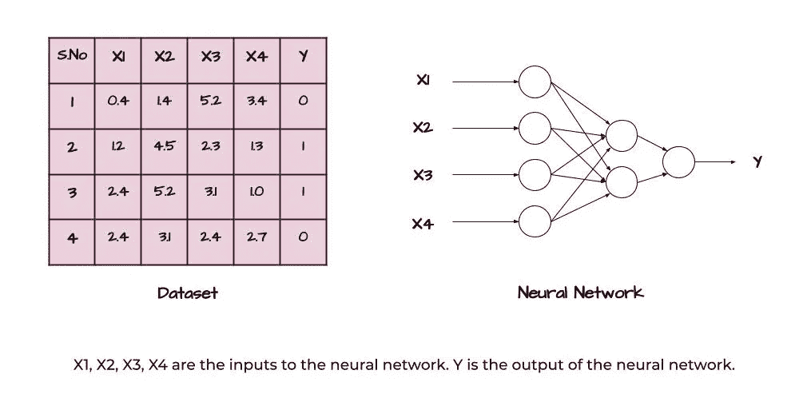

(图片由作者提供)

最小级别的人工神经网络称为感知器。感知器也称为阈值逻辑单元(TLU)。它由单个单元组成，也称为神经元，具有多个输入和单个输出。这是一种最简单的人工神经网络结构。

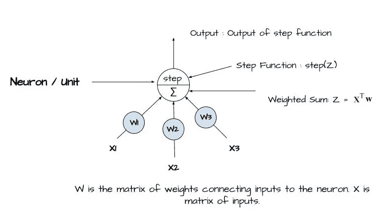

(图片由作者提供)TLU(阈值逻辑单元)的结构

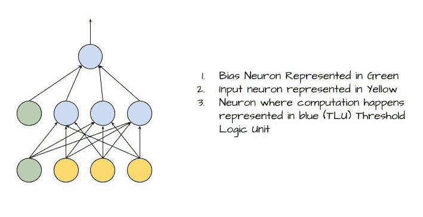

(图片由作者提供)具有偏差的多感知器网络的表示。

为了理解以下感知器模型，将神经元/单元的输入视为数据集的特征，您将在其他机器学习算法中输入这些特征。看看感知器的图表，输入通过称为权重的线与神经元相连。当输入被传递时，它们被单独乘以它们的权重，并且所有这些乘法的总和被传递到阶跃函数上以产生输出。阶跃函数用于提供以下计算的输出。有时，偏差也被添加到输入或 TLU，以向右或向左偏移加权和的结果。这有助于模型更好地适应数据，因为它不仅可以调整网络的权重，还可以调整网络的偏差，使网络适应所需的数据集。因此，神经网络输出的计算公式为:

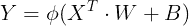

(图片由作者提供)计算简单图层的输出。

其中 phi 是激活函数，X 是输入矩阵，W 是权重矩阵，B 是偏差。

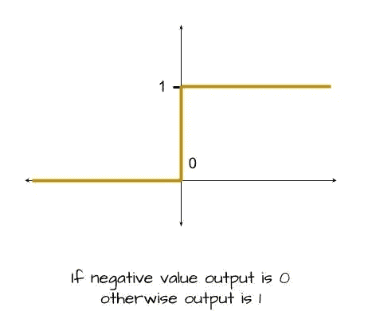

(图片由作者提供)感知机中使用的 Heavyside step/ activation 函数。

当模型有一个输入层、多个隐藏层和一个输出层时，这就是所谓的 MLP(多层感知器)。它的工作类似于感知器，但输入连接到第一层的一些权重，这些权重连接到其他一些输出神经元的一些权重。与感知器类似，首先，输入乘以它们的权重，然后相加传递给阶跃函数。然后，所有神经元的这个阶跃函数的输出乘以权重并相加。然后将其传递到阶跃函数，以获得网络的输出。

当您组合多个神经元以形成深度神经元层并将这些层堆叠成深度堆叠模型时，则该模型被称为人工神经网络。人工神经网络属于深度学习部分，是当今使用最多的算法之一。

# **如何训练一个 ANN？**

使用称为反向传播的算法来训练人工神经网络。首先，采用单个训练实例，并执行正向传递以产生输出。然后将网络损耗与实例的实际输出进行比较。然后这种损失通过整个神经网络反向传播。在反向传播的这一步骤中，首先计算损失的梯度，因为我们必须使损失最小化。然后，计算网络的每个权重矩阵的梯度，并且通过减去η(即网络的学习速率)和损失函数的梯度的乘积来更新权重矩阵。接下来的过程一直持续到最后一层，这个步骤被称为反向传播算法的反向传递。

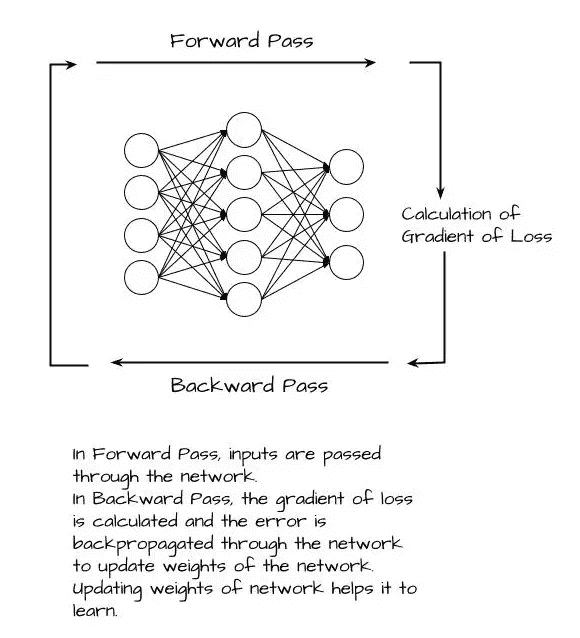

(图片由作者提供)人工神经网络的训练

人工神经网络可以有单个输出，甚至多个输出。所有训练实例通过网络的单次向前和向后传递被称为单个时期。学习复杂模式所需的深度神经网络必须执行各种时期以获得良好的预测结果。

# **什么是步进/激活功能？**

阶跃/激活函数用于给网络增加非线性。如果网络的输出没有非线性，那么网络可能无法预测复杂的模式。因此，激活功能也用于此目的。使用的一些激活功能有:

1.  ReLU(整流线性单位)激活功能
2.  Sigmoid 激活函数
3.  Tanh 激活函数

还有更多……

> ReLU 激活功能

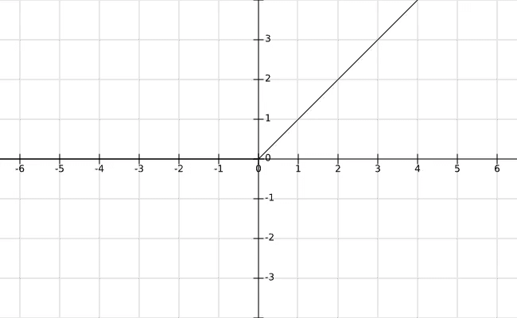

(图片由作者提供)ReLU 激活函数的表示

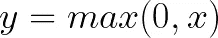

(图片由作者提供)ReLU 激活函数的数学表示

> Sigmoid 激活函数

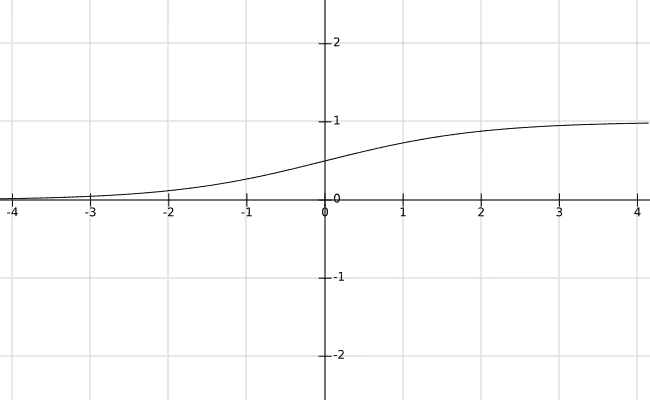

(图片由作者提供)Sigmoid 激活函数的表示

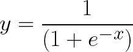

(图片由作者提供)Sigmoid 激活函数的数学表示

> Tanh 激活函数

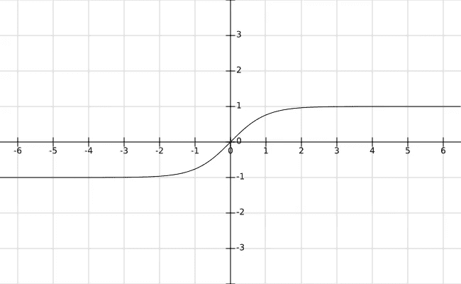

(图片由作者提供)Tanh 激活函数的表示

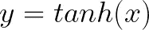

(图片由作者提供)Tanh 激活函数的数学表示

# **安在回归**

回归分析中的人工神经网络有助于预测房价或某个对象边界框的坐标。在基于回归的人工神经网络中，通常不使用激活函数来防止值处于激活函数的范围内。用于训练神经网络的损失函数是均方误差或均方根误差。大多数情况下使用均方误差和均方根误差，但在异常值的情况下，使用平均绝对误差，因为它有助于减少异常值的影响。

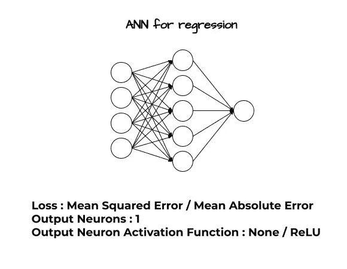

(图片由作者提供)

# 人工神经网络分类

分类中的人工神经网络有助于根据提供的输入值预测类别。从分类狗或猫到分类复杂的人类情感，人工神经网络在各种问题中都有应用。当有 2 个类别要预测时，我们甚至可以使用具有单个输出和逻辑激活函数的神经网络作为最后一层的激活函数。当我们有多个类别要预测时，如果我们希望所有类别的输出值都等于 1，我们可以使用 softmax 激活函数。交叉熵损失函数可用于训练网络。在多类分类中，我们必须为每个类分配一个神经元。

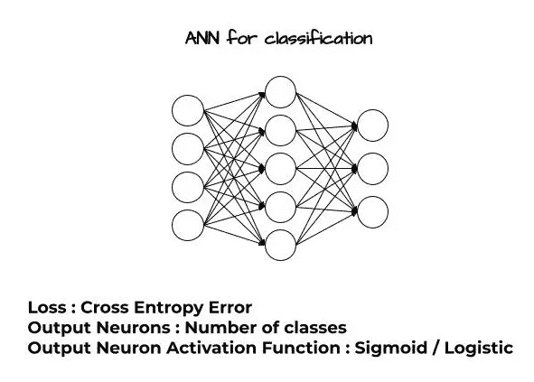

(图片由作者提供)

# 参考

1.  使用 Scikit-Learn、Keras 和 TensorFlow 进行机器学习，第二版，Aurélien Géron，2019 年
2.  麻省理工 6。S191:深度学习介绍，【https://www.youtube.com/playlist? list = PLT bw 6 njqru-rwp 5 _ _ 7c 0 oivt 26 zgjg 9 ni

我希望这篇文章和解释对你有用。请继续关注后续部分中的其他分段技术。

请随时联系并给出你的建议:【https://www.linkedin.com/in/mrinal-tyagi-02a1351b1/ 

[https://github.com/MrinalTyagi](https://github.com/MrinalTyagi)