# 通过阿帕奇齐柏林飞艇深入三角洲湖

> 原文：<https://towardsdatascience.com/deep-dive-into-delta-lake-via-apache-zeppelin-d59db1673584?source=collection_archive---------11----------------------->

## 以互动的方式了解三角洲湖泊的内部机制

Delta Lake 是一个开源项目，支持在数据湖的基础上构建一个 Lakehouse 架构。网上有很多关于如何使用三角洲湖的教程。这个帖子有点不同，是给那些好奇想了解 Delta Lake 内部机制，尤其是事务日志的人看的。

# **启动齐柏林码头集装箱**

为了更直观地演示内部机制，我使用 Apache Zeppelin 运行所有示例代码。你可以通过 Zeppelin docker 轻松复制我所做的。关于如何在 Zeppelin docker 中[玩 Spark，可以查看这篇](https://zjffdu.medium.com/learn-spark-on-zeppelin-in-docker-container-9f3f7b2db230)[文章](https://zjffdu.medium.com/learn-spark-on-zeppelin-in-docker-container-9f3f7b2db230)。这里我只总结为以下几个步骤:

*   第一步。git 克隆[https://github.com/zjffdu/zeppelin-notebook.git](https://github.com/zjffdu/zeppelin-notebook.git)
*   第二步。下载 Spark 3.1.2(这个是我在这个教程里用的，不要用 Spark 3.2.0，还不支持)
*   第三步。运行以下命令启动 Zeppelin docker 容器。`${zeppelin_notebook}`是您在步骤 1 中克隆的笔记本文件夹，`${spark_location}`是您在步骤 2 中下载的 Spark 文件夹。

```
docker run -u **$(**id -u**)** -p 8080:8080 -p 4040:4040 --rm -v ${spark_location}:/opt/spark -v ${zeppelin_notebook}:/opt/notebook -e ZEPPELIN_NOTEBOOK_DIR=/opt/notebook -e SPARK_HOME**=**/opt/spark -e ZEPPELIN_LOCAL_IP=0.0.0.0 --name zeppelin apache/zeppelin:0.10.0
```

然后打开 [http://localhost:8080](http://localhost:8080) ，打开笔记本`Spark/Deep Dive into Delta Lake`，里面有这篇文章的全部代码。

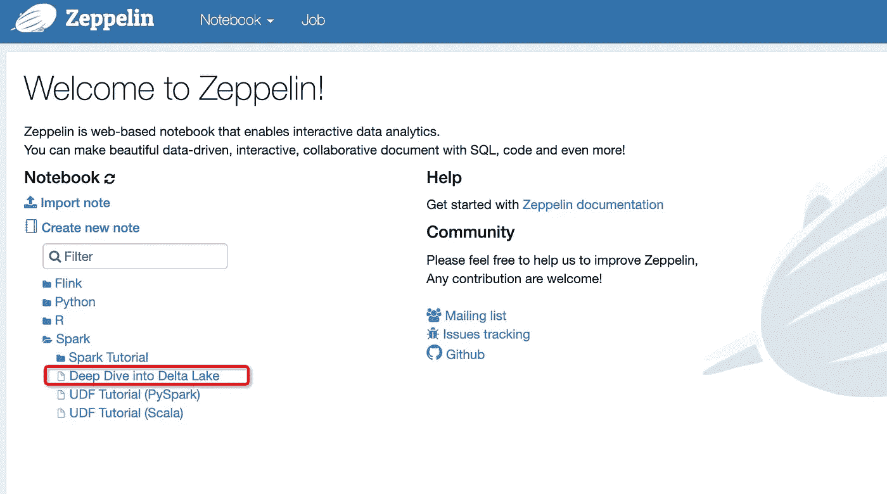

*齐柏林飞船主页(图片由作者提供)*

# 配置火花

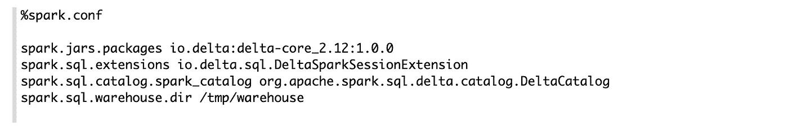

*火花配置(图片由作者提供)*

这是`Deep Dive into Delta Lake,`第一段就是配置 Spark 解释器使用 Delta Lake。

`%spark.conf`是一个特殊的解释器，用来在 Zeppelin 中配置 Spark 解释器。在这里，我按照[快速入门](https://docs.delta.io/latest/quick-start.html#)中的描述配置 Spark 解释器。除此之外，我显式地指定了仓库文件夹，这样我就可以在本教程的后面轻松地检查表文件夹。现在让我们开始使用 Spark，在 Zeppelin 中播放 Delta Lake。

# 创建增量表

首先让我们创建一个包含两个字段的增量表`events`: id 和 data。

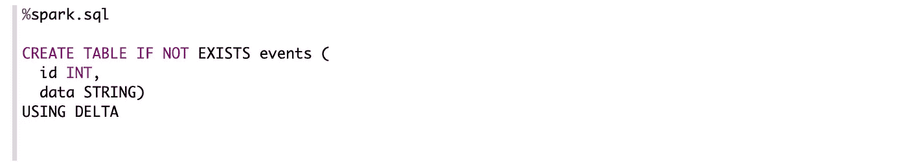

*创建增量表(图片由作者提供)*

那么 Delta 在这个 create SQL 语句下面做什么呢？实际上，达美做了两件事:

*   在仓库文件夹`/tmp/warehouse`下创建一个目录`events`
*   添加包含该表模式的事务日志

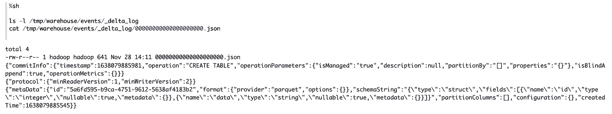

作者图片

# 插入数据

现在让我们将一些数据插入到这个增量表中。这里我只插入了 2 条记录:(1，data_1)，(2，data_2)

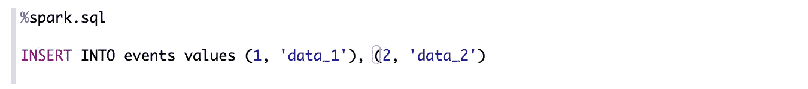

插入数据(图片由作者提供)

然后让我们运行一个 select SQL 语句来验证这个 insert 语句的结果。

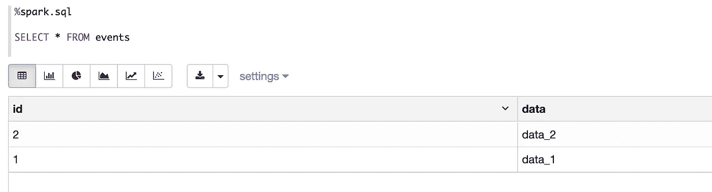

查询表(作者图片)

那么 Delta 在这个 insert SQL 语句下面做了什么呢？让我们检查表格文件夹`/tmp/warehouse/events`，有 2 个变化

*   生成另一个新的事务日志文件。
*   生成 2 个拼花文件

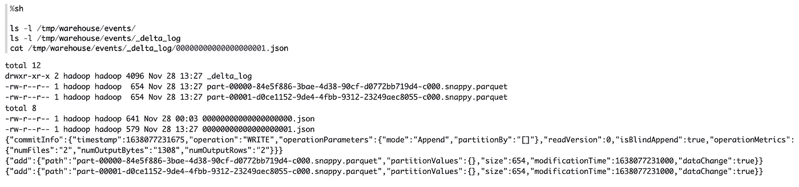

作者图片

首先，我们来看一下新生成的事务文件(000000000000000001.json)。这个 JSON 文件可读性很强，它包含了这个 insert SQL 语句的操作:添加包含 2 条记录的 2 个 parquet 文件。需要注意的是，这个新的事务日志文件中没有表模式信息，因为它已经在第一个事务日志文件(00000000000000000.json)中。当 Delta 读取该表时，它将合并此后的所有历史事务文件，以获得该表的所有信息(包括该表的模式以及包含哪些数据文件)

因为我们只插入 2 条记录，所以很自然地猜测每个拼花包含一条记录。我们可以直接读取这两个拼花文件来验证这一点。如下面的代码所示，我们的猜测是正确的。

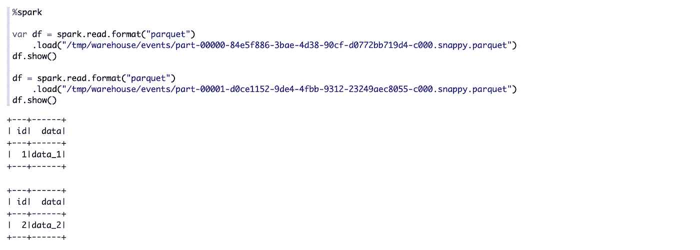

作者图片

# 更新数据

Delta 最重要的特性是 ACID 支持，你可以在任何时候更新表而不影响同时读/写同一个表的其他人。现在让我们更新这个`events`表。

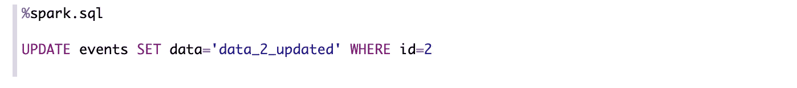

更新数据(图片由作者提供)

然后运行 select 语句来验证这个 update 语句的结果。

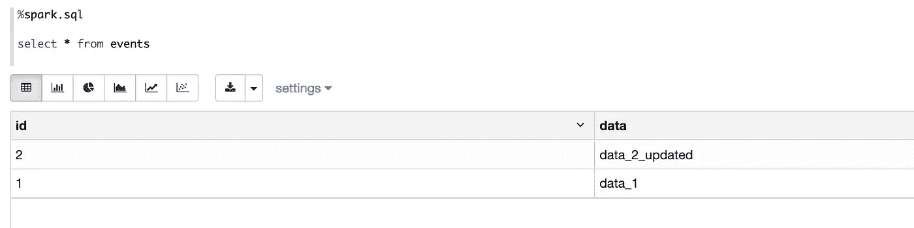

作者图片

那么这个 update 语句在底层做什么呢？我们可以检查`events` 表文件夹，会发现 2 处变化:

*   生成另一个新的事务日志文件
*   添加了另一个拼花文件(之前的两个拼花文件仍然存在)

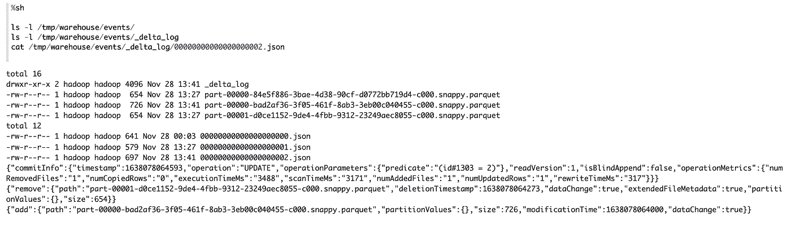

作者图片

首先，让我们看看新事务日志文件的内容，这里有 2 个操作:

*   移除一个拼花文件
*   添加新的拼花文件

我们很自然地猜测，被移除的文件包含记录(2，data_2)，而新添加的文件包含记录(2，data_2_updated)。让我们直接读取这两个 parquet 文件来验证我们的猜测。

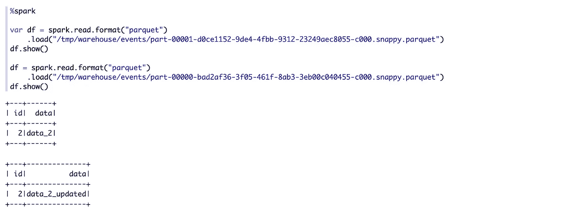

作者图片

现在让我们使用德尔塔的时间旅行功能。我们希望在此更新操作之前使用此表的最新版本。

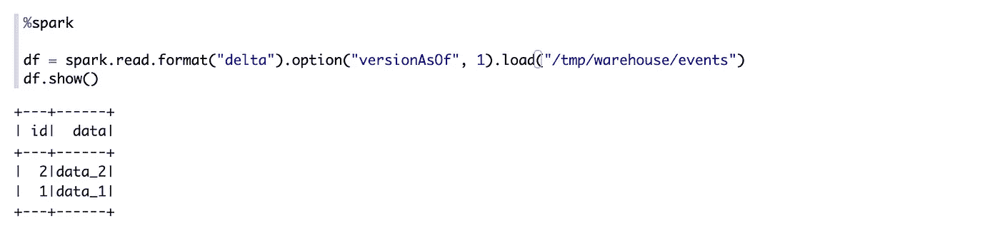

作者图片

时间旅行功能之所以有效，是因为 Delta 不删除数据文件，它只在事务日志中记录所有操作。当您阅读该表的版本 1 时，Delta Lake 将只阅读前两个事务日志:00000000000000000 . JSON & 000000000000001 . JSON。

# 删除数据

现在让我们对这个`events`表进行删除操作。


删除数据(图片由作者提供)

然后运行 select 语句来验证 delete 语句的结果。

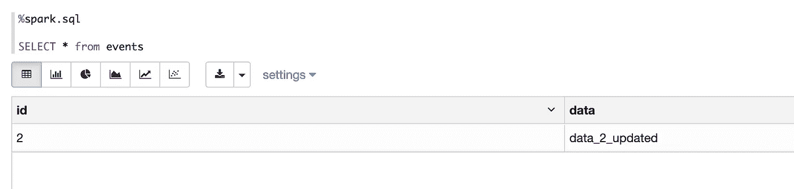

作者图片

那么 Delta 在底层对这个删除操作做了什么呢？我们仍然可以检查`events`表文件夹，并会发现 2 处更改:

*   生成新的元数据事务日志文件
*   添加了一个新的拼花文件

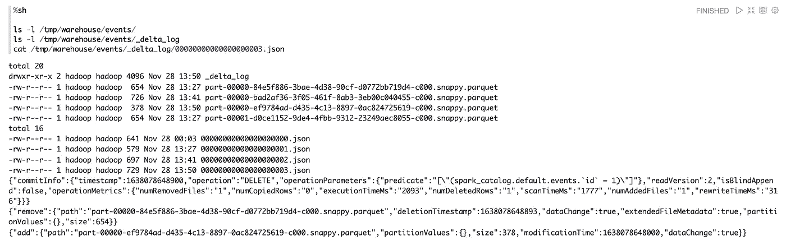

作者图片

在新的事务日志文件中，我们仍然可以看到两个操作:`remove`和`add`

人们很自然地会猜测删除操作只是删除了包含 record (1，data_1)的文件，那么这个新的`add`操作是做什么的呢？实际上，新添加的 parquet 文件是空的，其中不包含任何内容，我们可以直接读取这两个 parquet 文件来验证这一点。

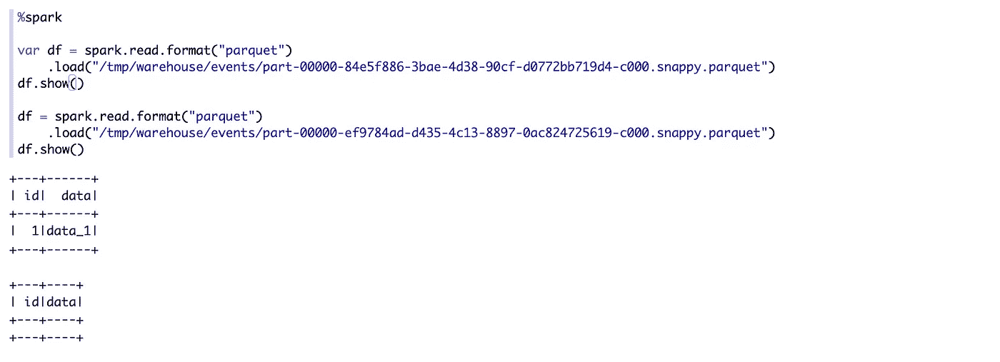

作者图片

# 摘要

在这篇文章中，我做了 4 个主要步骤来玩三角洲湖:

*   创建表格
*   插入数据
*   更新数据
*   删除数据

在每一步，我都检查事务日志和数据文件中发生了什么变化。所有步骤都是在 Apache Zeppelin docker 容器中完成的，您可以轻松地再现它们，希望本文对您了解 Delta Lake 的内部机制有用。

# 参考

[](http://zeppelin.apache.org/) [## 齐柏林

### Apache Zeppelin 解释器概念允许任何语言/数据处理后端插入 Zeppelin。目前…

zeppelin.apache.org](http://zeppelin.apache.org/) [](https://databricks.com/blog/2019/08/21/diving-into-delta-lake-unpacking-the-transaction-log.html) [## 了解 Delta Lake 事务日志- Databricks 博客

### 事务日志是理解 Delta Lake 的关键，因为它是贯穿其许多…

databricks.com](https://databricks.com/blog/2019/08/21/diving-into-delta-lake-unpacking-the-transaction-log.html) [](https://databricks.com/blog/2020/09/29/diving-into-delta-lake-dml-internals-update-delete-merge.html) [## Delta Lake 教程:如何使用 DML 轻松删除、更新和合并

### 在以前的博客《深入三角洲湖:解包事务日志和深入三角洲湖:模式实施》中…

databricks.com](https://databricks.com/blog/2020/09/29/diving-into-delta-lake-dml-internals-update-delete-merge.html)