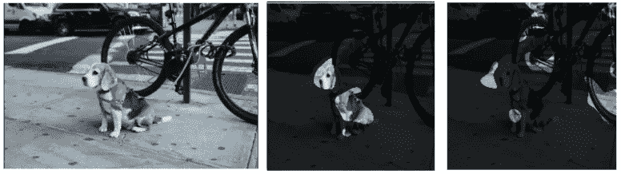
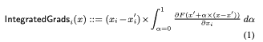
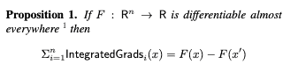
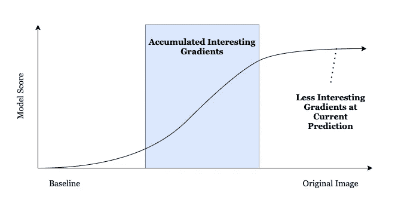
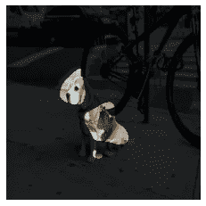
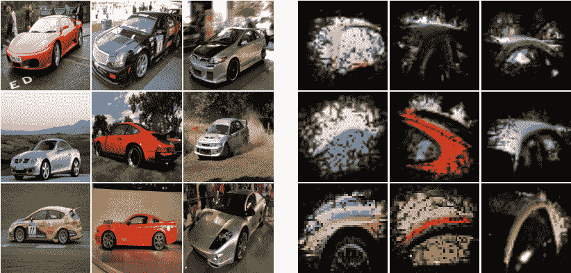

# 深入研究集成梯度的神经网络解释

> 原文：<https://towardsdatascience.com/deep-dive-into-neural-network-explanations-with-integrated-gradients-7f4b7be855a2?source=collection_archive---------31----------------------->

## [提示和技巧](https://towardsdatascience.com/tagged/tips-and-tricks)

## 从业者指南

深度神经网络是一种被高度利用的模型，在图像、自然语言处理和时间序列等特定领域取得了巨大成功。虽然这些模型在这些专业领域的功效是无与伦比的，但神经网络由于其不透明性而经常被认为是“黑盒”模型。

考虑到这一点，我们如何能够窥视并理解神经网络呢？模型不可知的可解释性方法，如莱姆、SHAP 和 QII [2]确实存在，它们在黑盒假设下运行，即只有输入和输出是已知的。然而，对于神经网络来说，这些方法的计算成本可能是不切实际的，因为神经网络的特征数量往往比其他领域(如表格数据)高一个数量级。图像将具有多个通道的数千个像素，时间序列数据引入了时间维度因子，NLP 模型通常利用高维嵌入空间来编码语言。幸运的是，神经网络的训练过程和框架通常取决于梯度下降法。网络梯度的可用性提供了创建解释的替代过程，该过程提供了额外的输入，既有助于解释方法的速度，也提供了解释的公理化好处。

这个博客将详细解释积分梯度(IG)方法，包括数学基础，它与其他方法的比较，以及你如何自己使用它。所示的例子在图像领域很容易说明，但 IG 可以用于任何深度学习任务。



[pix abay 上 StockSnap 的原始图片](https://pixabay.com/photos/dog-puppy-animal-cute-leash-pet-2583329/)和作者编辑的图片|左:原始图片|中:小猎犬的综合渐变说明|右:山地车的综合渐变说明

# 什么是综合梯度法？

综合梯度是由 M. Sundararajan，A. Taly，Q. Yan 在[的《深度网络的公理化归属](https://arxiv.org/abs/1703.01365)中提出的。计算输入记录 x 和基线记录 x’的综合梯度属性的等式如下:



让我们从分解这个等式的组成部分及其背后的动机开始。我们将从在我们的博客文章中引用的解释分类法中结合集成的梯度开始:[选择一种解释技术](/picking-an-explainability-technique-48e807d687b9)。在我们的分类法中，我们必须为解释技术定义:范围&输出、输入、访问和阶段。

第一部分是我们试图解释的范围和结果。积分梯度足够灵活，可以解释输入 x 上任何可微分函数的输出，最直接的函数是神经网络分类器的标量输出。在上面的等式中，这是在 x 上操作的 *F* 函数。IG 方法的范围是全局和局部的。这是如何实现局部和全局范围的，最好在下一节进一步阐述这些原则后再讨论。

被解释的输入将是神经网络可以操作的 x 向量。最简单的情况是网络的顶层输入，尽管情况可能不总是这样。例如，在 NLP 用例中，解释必须在嵌入空间，而不是句子输入，因为梯度不能从嵌入字典传播。
K. Leino，S. Sen，a .，，和 L. Li 在[对深度卷积网络的影响导向解释](https://arxiv.org/pdf/1802.03788.pdf)中也提出了一种解释网络内部层的方法，以供进一步分析。

最后，本说明的阶段和访问是访问网络梯度的岗位培训。推理是这样的，我们需要查询并从神经网络中获取导数，因为模型有助于组成函数 *F* 。

## 公理

IG 满足了一些理想的公理，这些公理在论文[1]中进行了概述。我们将强调对解释方法特别重要的两个公理:

1.  完备性公理
2.  敏感性公理

使用 IG 的主要动机是完整性公理。也就是说，“给定 x 和基线 x’，x 的属性加起来就是输入 x 处的 *F* 的输出和基线 x’“[1]”之间的差。该属性是可取的，因为它直接将属性与对 *F* 函数的贡献联系起来，并针对输出标量向每个输入分量给出局部解释比例权重。使这成为可能的机制是由于沿着路径的函数的积分和导数的逆性质，允许函数值的重建。



在这一点上，可以适当地描述为什么这也是实现一组适用于解释分类法中的全局范围的解释所需要的。除了选择一个恒定的基线之外，实现完整性公理意味着一个记录的每个解释都可以与不同记录的任何其他解释相比较。所有属性的相对贡献都在同一标度上，即 *F* 函数输出的标度。这可能是概率单位空间中的[0，1]，或者是 logit 标度上的(-inf，inf)。

IG 方法的第二个理想公理是灵敏度公理。这个公理分两部分描述。
1。“对于在一个特征上不同但具有不同预测的每个输入和基线，不同的特征应该被赋予非零属性。”【1】
2。“如果深度网络实现的功能(在数学上)不依赖于某个变量，则该变量的属性总是零。”[1]

一般来说，梯度会违反这个公理。IG 等式的最后一部分α表示从基线到 x 值的路径，有助于解决这个问题。相对于α的导数产生一个乘法因子(x-x’)，这意味着如果基线和 x 值对于某些 xᵢ是相同的，则没有属性提供给该输入。换句话说，路径线积分同时满足完备性和敏感性公理，因为梯度仅沿着观察基线变化的 k 维路径收集。

积分梯度建议使用 x '和 x 之间的直线路径，这主要是为了满足对称公理:“如果交换两个输入变量不改变函数，则它们是关于函数对称的。例如，x 和 y 是对称的 w.r.t. *F* 当且仅当对于 x 和 y 的所有值 *F* (x，y) = *F* (y，x】[1]。虽然这确实成立，但应该注意的是，对基于 IG 的归因的进一步研究可能不需要满足这一公理。直线路径存在局限性，因为插值可能会穿过网络决策流形中的分布点。只要 *F* 是连续可微的，沿 k 维内任何路径的梯度积分将满足完备性和敏感性公理。

# 方法比较

值得比较和考虑不同解释方法之间的根本差异，以及使用 IG 相对于其他常见解释方法的利弊。

## 集成的梯度和显著图

我们先来比较一下 IG 和另一个常见的梯度解释器:显著图。在最简单的意义上，显著图是神经网络的输入特征相对于最终输出的梯度。这种解释突出了最易起反应并可能迅速改变输出的特性，但只对偏离原始输入的小偏差有意义。IG 的完整性公理给出了输出内容的更强(和更完整)的表示。这是因为为显著图接收的梯度通常在模型的饱和梯度区域中。



图片由作者提供，灵感来自 Ankur Taly 的[解释机器学习模型——斯坦福 CS 理论](http://theory.stanford.edu/~ataly/Talks/ExplainingMLModels.pdf)

在类似的比较中，显著图和 IG 之间的关系类似于 LIME 和 Shapley 值之间的关系。

## 综合梯度&沙普利值

比较 IG 和 QII [2]等基于 Shapley 的方法的最好理由是，因为这两种方法给出的解释可以用于局部和全局，因为它们满足类似的公理。IG 的完备性和敏感性公理类似于我们博客中提到的效率和伪公理:[ML 模型的 Shapley 值](/the-shapley-value-for-ml-models-f1100bff78d1)

综合梯度和基于 Shapley 值的策略采用两种不同的方法来逼近 Shapley 值。Shapley 值推广到称为 Auman-Shapley 值的无限连续区域。这些概念植根于联盟博弈理论，旨在平均所有环境的影响。对于 Shapley 值，空间是阶乘的，因此使用抽样方法。对于 Auman-Shapley 值，空间是无限的，但是积分梯度直线路径也可以被认为是保存了 Auman-Shapley 值的理想公理的唯一样本。

从这个意义上说，抽样的差异就是理论差异的所在。QII 在 x 附近构建了一组假设记录，通过测试某个特性是否始终是输出的驱动因素，或者其他特性的变化是否会使某个特性的值影响较小，从而使解释更加可靠。你甚至可以认为这些类似于梯度，只是步长更大。另一方面，IG 只选择一条路径，但沿着这条路径采集许多样本。通过这样做，IG 确实因为没有评估那么多假设路径而失去了一些健壮性。另一方面，由于神经网络的连续可微性质，样本可以比离散 Shapley 值方法具有更强的分布忠实性。

没有强有力的理由证明哪种方法在理论意义上更好，所以通常选择实用的方法。QII 是一种不需要访问模型内部的方法，因此对更广泛的模型架构更有用。神经网络域具有更高的维数，其中离散 Shapley 值采样方法通常是难以处理的。x 附近的记录空间太大，对于具有数千个输入的模型来说，没有统计意义上的结果。梯度的可用性允许进行可管理的计算量。这种估计是通过在 x 和 x’基线之间的直线的离散分区处取梯度并乘以激活乘数(x-x’)来完成的。如果梯度流形足够平滑，10–20 次离散分割就足够了。在高度不稳定的流形中，可以采用更多的插值点，但在实践中，很少需要超过 100 个点作为接近的估计量。

有进一步的研究可以弥补基于 IG 和 Shapley 值的方法之间的上下文差距，例如找到有代表性的中性基线，拥有多个基线，或者使用语义上有意义的基线，例如接近决策边界。一种这样的方法是边界属性变化[4]，它设置最近的类边界作为基线。

# 实践中的综合梯度

本博客的其余部分将强调在实际环境中使用 IG 时要做出的许多选择。在实践中使用 IG 时，一个从业者可以做出的选择相当多，灵活性是必不可少的。下面的文章将使用一个名为 TruLens 的[开源渐变解释库来展示 IG 如何在实践中使用。代码示例将引用兴趣分布(DoI)、兴趣数量(QoI)和自定义内部影响方法，这些都是 TruLens 的构建模块，在:](https://www.trulens.org/)[用 TruLens 解释神经网络的实用介绍](https://medium.com/trulens/a-hands-on-introduction-to-explaining-neural-networks-with-trulens-504bfab1a578)中有概述。

## 将集成渐变转换为代码

在前面的章节中，IG 被定义为连续空间中的函数，但是我们也强调了可以通过直线插值的离散分割来进行估计。

TruLens 有一个随时可用的 IG 实现，它忠实于原始方法。

```
from trulens.nn.attribution import IntegratedGradients
from trulens.visualizations import MaskVisualizer# Create the attribution measure.
ig_computer = IntegratedGradients(model, resolution=10)# Calculate the input attributions.
input_attributions = ig_computer.attributions(beagle_bike_input)# Visualize the attributions as a mask on the original image.
visualizer = MaskVisualizer(blur=10, threshold=0.95)
visualization = visualizer(input_attributions, beagle_bike_input)
```



[原始图片](https://pixabay.com/photos/dog-puppy-animal-cute-leash-pet-2583329/)由 StockSnap 在 Pixabay 上拍摄，并由作者编辑|可视化 Beagle 类解释:集成渐变

IG 的实现和定制也很简单，利用 TruLens 兴趣分布(DoI)。DoI 表示一组要平均的记录；对于 IG，我们希望使用基线的线性插值。TruLens 开源实现定义了这种线性插值 DoI，仅此一项就足以开始在 IG 上创建定制。[https://github . com/truera/trulens/blob/master/trulens/nn/distributions . py](https://github.com/truera/trulens/blob/master/trulens/nn/distributions.py)

TruLens DoI 对分布中的所有梯度进行平均。为了应用 IG 的敏感性，LinearDoI 还定义了 get_activation_multiplier。

您可以继承 TruLens DoI 类来实现自己的 DoI。一旦定义了 DoI，就可以使用 InternalInfluence 方法构建自定义属性。

```
from trulens.nn.distributions import DoIclass MyCustomDoI(DoI):
    def __call__(self, z):
        ... def get_activation_multiplier(self, activation):
        ...from trulens.nn.attribution import InternalInfluence 
from trulens.nn.quantities import MaxClassQoI
from trulens.nn.slices import InputCut, OutputCut, Slice# Define a custom influence measure
infl = InternalInfluence(model, 
    Slice(InputCut(), OutputCut()),
    MaxClassQoI(),
    MyCustomDoI())
```

如果要尝试不同的路径策略，DoI 将是最佳选择。

## 输出功能的定制

集成梯度的另一个定制区域是将要解释的输出 *F* 。你可以选择解释 logit vs probit 层。解释这两种情况的原因取决于最终的用例。模型概率会对分数做出准确的贡献，而 logits 可能会对记录给出更好的比较分数，这些记录更接近概率单位空间的 1 或 0 区域，这些区域会被 sigmoid 函数挤压。TruLens 中的 InternalInfluence 方法允许您通过切片和剪切对象选择任何输出图层。

```
from trulens.nn.attribution import InternalInfluence 
from trulens.nn.quantities import MaxClassQoI
from trulens.nn.distributions import LinearDoi
from trulens.nn.slices import InputCut, Cut, Slice# Get the layer name to explain from the model summary
model.summary() # you may be able to also see from print(model)
layer_to_explain = 'logits'# Define a custom influence measure
infl = InternalInfluence(model, 
    Slice(InputCut(), Cut(layer_to_explain)),
    MaxClassQoI(),
    LinearDoi())
```

另一个用例是将 *F* 定义为输出的类别比较。例如，查看车辆数据集，如果查询特定的类别，IG 可能会关注车轮，以了解为什么选择汽车作为主要分类。


图片来自[深度卷积网络的影响导向解释](https://arxiv.org/abs/1802.03788)【3】经许可转贴汽车的内部属性特征

如果我们改为改变 *F* 函数:*F*=(A 类输出)-(B 类输出)。这就问了为什么模型会认为分类应该是敞篷车还是轿车，反之亦然，那么 IG 的解释就会集中在车顶上。



图片来自[深度卷积网络的影响导向解释](https://arxiv.org/abs/1802.03788)【3】经许可转贴汽车与敞篷车的内部属性特征

通过定义一个自定义 QoI，并将其提供给 InternalInfluence 实例化，可以在 TruLens 中轻松更改这个查询函数。QoI 的 __call__ 函数应返回用于获取梯度的标量值。

```
from trulens.nn.quantities import QoIclass MyCustomQoI(QoI):
    def __init__(...):
        ...
    def __call__(self, y):         
        ...from trulens.nn.attribution import InternalInfluence 
from trulens.nn.distributions import LinearDoi
from trulens.nn.slices import InputCut, OutputCut, Slice# Define a custom influence measure
infl = InternalInfluence(model, 
    Slice(InputCut(), OutputCut()),
    MyCustomQoI(),
    LinearDoi())
```

## 定制基线

这篇博客的最后一个主题，但可能是 IG 中最重要的考虑因素，是基线的选择。在图像领域，文献中使用的最普遍的基线是空图像。从语义上来说，这是一个非常直观的基线:最终的属性分数将是图像本身的属性差异减去一个假定的无信息基线。

不幸的是，有相当多的反例图像强调这可能是一个有问题的基线。一个例子与灵敏度公理有关，即如果像素与基线没有差异，那么该像素将获得零属性。事实上，一个空的图像并不是没有信息的，而是实际上包含了黑色。因此，如果对一幅黑色对分类非常重要的图像进行综合渐变，这些属性将会丢失。一个这样的例子可能是企鹅、熊猫或黑色汽车的图像。

由于该基线引起的不期望行为的另一个反例可能是水印的存在。让我们假设一个训练集，其中 99%的图像共享相同的水印。带有水印的每个记录将出现在所有分类中。因为水印保证不同于基线，并且梯度不隐含地满足灵敏度，所以水印将以随机化的属性结束，因为每个记录将使用它来解释不同的结果。然而，期望的行为将是对水印没有属性。在这种情况下，分布模式基线会更有意义。

这突出了在选择基线时理解数据集分布的需要。有一些研究强调，离类簇非常远的基线选择可能导致随机化的属性，并且您可能希望选择导致更强的属性本地化的基线[4]。在选择基线时，可能需要利用分布平均值或分布模式。一个建议是选择一个有内在意义的基线，这样分数减去基线也保留了意义。这样，属性将更容易被人理解。

这可能意味着找到一个得分为 0 的中性基线，其中的解释将总是解释模型得分。或者在边界属性的情况下[4]，基线表示最接近的错误分类。这将创建一个解释，显示最有可能导致错误分类的区域，或者换句话说，突出显示最容易混淆的输入。这是梯度解释研究的一个开放而活跃的领域。

# 参考

[1] M. Sundararajan，A. Taly，Q. Yan，[深度网络的公理化归属](https://arxiv.org/abs/1703.01365) (2017)，
机器学习第 34 届国际会议论文集，机器学习研究论文集第 70 卷

[2] A .达塔，s .森和 y .齐克，[通过量化输入影响的算法透明性](https://www.andrew.cmu.edu/user/danupam/datta-sen-zick-oakland16.pdf) (2016)，第 37 届 IEEE 安全和隐私研讨会会议录

[3] K. Leino，S. Sen，a .，m .和 L. Li，[深度卷积网络的影响导向解释](https://arxiv.org/abs/1802.03788) (2018)，IEEE 国际测试会议论文集

[4] Z. Wang，m .和 a .，[稳健模型更容易解释，因为属性看起来是正常的](https://arxiv.org/abs/2103.11257) (2021)，预印本。