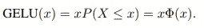
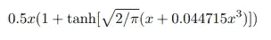
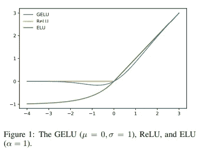

# 对 BERT 模型代码的深入研究

> 原文：<https://towardsdatascience.com/deep-dive-into-the-code-of-bert-model-9f618472353e?source=collection_archive---------5----------------------->

## 分解拥抱脸 Bert 实现


[https://unsplash.com/@emilep](https://unsplash.com/@emilep)

已经有很多教程介绍如何从头开始创建一个简化的 Bert 模型，以及它是如何工作的。在本文中，我们将做一些稍微不同的事情——我们将通过分解 BERT 的所有组件来实现拥抱脸。

## 介绍

在过去的几年中，变压器模型彻底改变了 NLP 领域。BERT(来自变压器的双向编码器表示)是最成功的变压器之一，它在各种任务上的表现优于以前的 SOTA 模型，如 LSTM，这得益于通过注意力机制和训练时间更好地理解上下文，因为与 LSTM 的递归结构不同，BERT 是并行化的。

现在不用再等了，让我们深入代码，看看它是如何工作的。首先，我们加载 Bert 模型并输出 *BertModel* 架构:

我们分别分析这三个部分:*嵌入*、*12 层重复 Bert 层编码器*和*池器*。最终我们将添加一个*分类*层。

从原始文本开始，首先要做的是将我们的句子分割成记号，然后我们可以将这些记号传递给*bertembings。*我们使用的*bertokenizer*是基于词块——子词标记化可训练算法，它有助于平衡词汇量和未登录词。看不见的单词被分割成子词，这些子词是在分词器的训练阶段得到的(更多细节在这里)。现在让我们从*20 个新闻组*数据集中导入几个句子，并对它们进行分词

```
from sklearn.datasets import fetch_20newsgroups
newsgroups_train = fetch_20newsgroups(subset='train')inputs_tests = tokenizer(newsgroups_train['data'][:3], truncation=True, padding=True, max_length=max_length, return_tensors='pt')
```

一旦句子被分割成记号，我们就给每个记号分配一个在 n 维空间中代表该记号的代表性数字向量。每个维度保存该单词的一些信息，因此如果我们假设特征是*财富、性别、可爱*，则在训练嵌入层之后，该模型将使用以下三维向量来表示例如单词 king:(0.98，1，0.01)和 cat with (0.02，0.5，1)。然后，我们可以使用这些向量来计算单词之间的相似度(使用余弦距离)并做许多其他事情。

> 注意:实际上我们不能推导出这些特性的名字到底是什么，但是这样想有助于更清楚地了解它们。

因此 *word_embeddings* 在这种情况下是一个形状矩阵(30522，768)，其中第一维是词汇维度，而第二维是嵌入维度，即我们用来表示单词的特征的数量。对于 *base-bert* 来说是 768，对于更大的型号它会增加。一般来说，嵌入维度越高，我们就越能更好地表示某些单词——这在一定程度上是正确的，在某种程度上，增加维度不会增加模型的准确性，但计算复杂性会增加模型的准确性。

```
model.embeddings.word_embeddings.weight.shape
output: torch.Size([30522, 768])
```

*位置嵌入*是必需的，因为不同于例如 LSTM 模型，其顺序地处理记号，因此通过构造具有每个记号的顺序信息，Bert 模型并行地处理记号，并且为了结合每个记号的位置信息，我们需要从*位置嵌入*矩阵添加该信息。它的形状是(256，768 ),其中前者代表最大句子长度，而后者是单词嵌入的特征维度——因此，根据每个标记的位置，我们检索相关向量。在这种情况下，我们可以看到这个矩阵是学习来的，但也有其他实现方式，它是使用正弦和余弦来构建的。

```
model.embeddings.position_embeddings.weight.shapeoutput: torch.Size([256, 768])
```

*token_type_embeddings* 在这里是“多余的”,来自 Bert 训练任务，其中评估两个句子之间的语义相似性——需要这种嵌入来区分第一个和第二个句子。我们不需要它，因为我们只有一个用于分类任务的输入句子。

一旦我们提取了句子中每个单词的单词嵌入、位置嵌入和类型嵌入，我们只需将它们相加就可以得到完整的句子嵌入。所以第一句话应该是:

对于我们的 3 个句子的小批量，我们可以通过以下方式获得它们:

接下来我们有一个*层名*步骤，帮助模型更快地训练和更好地概括。我们通过标记的均值嵌入和标准差来标准化每个标记的嵌入，使其具有零均值和单位方差。然后，我们应用一个经过训练的权重和偏差向量，这样它可以被转换为具有不同的均值和方差，这样模型在训练期间可以自动适应。因为我们独立于其他示例计算不同示例的平均值和标准差，所以它不同于批标准化，在批标准化中，标准化是跨批维度的，因此依赖于批中的其他示例。

让我们最后应用 [Dropout](https://arxiv.org/abs/1706.06859) ，其中我们用零替换某些具有一定丢失概率的值。Dropout 有助于减少过度拟合，因为我们随机阻止来自某些神经元的信号，因此网络需要找到其他路径来减少损失函数，从而学习如何更好地概括，而不是依赖于某些路径。我们还可以将辍学视为一种模型集成技术，因为在每一步的训练过程中，我们随机停用某些神经元，最终形成“不同”的网络，我们最终在评估期间集成这些网络。

注意:因为我们将模型设置为评估模式，我们将忽略所有的脱落层，它们只在训练中使用。为了完整起见，我们仍然包括它。

```
norm_embs_dropout = model.embeddings.dropout(norm_embs)
```

我们可以检查是否获得了与模型相同的结果:

```
embs_model = model.embeddings(inputs_tests[‘input_ids’], inputs_tests[‘token_type_ids’])
torch.allclose(embs_model, norm_embs, atol=1e-06) # True
```

## 编码器

编码器是最神奇的地方。有 12 个*泊位*，前一个泊位的输出被输入下一个泊位。这是注意力被用来创建依赖于上下文的原始嵌入的不同表示的地方。在 *BertLayer* 中，我们首先尝试理解 *BertAttention —* 在导出每个单词的嵌入后，Bert 使用 3 个矩阵——键、查询和值，来计算注意力得分，并基于句子中的其他单词导出单词嵌入的新值；以这种方式，Bert 是上下文感知的，每个单词的嵌入不是固定的和上下文无关的，而是基于句子中的其他单词导出的，并且当导出特定单词的新嵌入时，其他单词的重要性由注意力分数表示。为了导出每个单词的查询和关键字向量，我们需要将其嵌入乘以一个训练过的矩阵(对于查询和关键字是分开的)。例如，要导出第一个句子的第一个单词的查询向量:

我们可以注意到，在整个查询和键矩阵中，我们只选择了前 64 列(= *att_head_size* )(稍后将阐明原因)——这是转换后单词的新嵌入维数，它小于原始嵌入维数 768。这样做是为了减少计算负担，但是实际上更长的嵌入可能会导致更好的性能。事实上，这是降低复杂性和提高性能之间的权衡。
现在我们可以导出整个句子的查询和关键矩阵:

为了计算关注分数，我们将查询矩阵乘以关键矩阵，并通过新嵌入维度的平方根(=64= *att_head_size* )对其进行标准化。我们还添加了一个修改过的注意力面具。初始注意屏蔽(*输入['attention_mask'][0]* )是 1 和 0 的张量，其中 1 表示在那个位置有一个标记，0 表示它是一个填充标记。
如果我们从 1 中减去注意力屏蔽，然后乘以一个很大的负数，当我们应用 SoftMax 时，我们有效地将那些负值归零，然后根据其他值导出概率。让我们看看下面的例子:

如果我们有一个 3 个标记+ 2 个填充的句子，我们为它获得以下注意力掩码:[0，0，0，-10000，-10000]
让我们应用 SoftMax 函数:

让我们检查一下我们得出的注意力分数是否与我们从模型中得到的分数相同。我们可以用下面的代码从模型中获得注意力分数:

```
as we defined output_attentions=True, output_hidden_states=True, return_dict=True we will get last_hidden_state, pooler_output, hidden_states for each layer and attentions for each layerout_view = model(**inputs_tests)
```

*out_view* 包含:

*   *last _ hidden _ state*(batch _ size，sequence_length，hidden_size):最后一个*播放器*输出的最后一个隐藏状态
*   *Pooler _ output*(batch _ size，hidden _ size)*池层*的输出
*   *hidden _ States*(batch _ size，sequence_length，hidden_size):每个 *BertLayer* 输出的模型的隐藏状态加上初始嵌入
*   *注意事项* (batch_size，num_heads，sequence_length，sequence_length):每个*铺位*一个。注意力最大值后的注意力权重

```
torch.allclose(attention_scores, out_view[-1][0][‘attn’][0, 0, :, :], atol=1e-06)) # Trueprint(attention_scores[0, :])
tensor([1.0590e-04, 2.1429e-03, .... , 4.8982e-05], grad_fn=<SliceBackward>)
```

注意力得分矩阵的第一行表示，为了为第一个标记创建新的嵌入，我们需要关注权重= 1.0590e-04 的第一个标记(关注其自身)，权重= 2.1429e-03 的第二个标记，等等。换句话说，如果我们将这些分数乘以其他记号的向量嵌入，我们将得到第一个记号的新表示，但是，我们将使用下面计算的值矩阵，而不是实际使用嵌入。

值矩阵的推导方式与查询矩阵和键矩阵相同:

然后，我们将这些值乘以注意力分数，以获得新的上下文感知单词表示

```
new_embed_1 = (attention_scores @ V_first_head)
```

现在你可能想知道，为什么我们从张量中选择前 64 个(= *att_head_size* )元素。嗯，我们上面计算的是伯特注意力层的**一头**，但实际上有 12 头。这些注意力头部中的每一个都创建单词的不同表示( *new_embed_1* matrix)，其中例如给定下面的句子“我喜欢在意大利餐馆吃比萨饼”，在第一个头部中，单词“比萨饼”可能主要注意前一个单词，单词本身和后面的单词以及剩余的单词将几乎没有注意力。在下一个标题中，它可能会关注所有动词(如和吃)，并以这种方式从第一个标题中捕捉不同的关系。

现在，我们可以用矩阵形式将它们一起导出，而不是分别导出每个头部:

来自第一个例子和第一个头的注意力与我们之前导出的相同:

```
example = 0
head = 0
torch.allclose(attention_scores, attention_probs[example][head]) # True
```

我们现在连接来自 12 个头部的结果，并通过我们在嵌入部分已经看到的一系列线性层、归一化层和漏失层来获得第一层编码器的结果。

我们只是简单地通过一个线性层传递我们串联的注意力结果。然后我们需要归一化，但是我们可以看到，我们没有立即归一化 *output_dense* ，而是首先将其与我们的初始嵌入相加——这被称为*剩余连接*。当我们增加神经网络的深度时，即，堆叠越来越多的层时，我们会遇到消失/爆炸梯度的问题，当在消失梯度的情况下，由于传播的梯度接近于零并且初始层停止改变权重并改善，所以模型不再能够学习。当权重由于最终爆炸的极端更新而不能稳定时，与爆炸梯度相反的问题。现在，适当的权重初始化和归一化有助于解决这个问题，但是已经观察到的是，即使网络变得更加稳定，性能也会随着优化变得更加困难而下降。添加这些剩余连接有助于提高性能，即使我们不断增加深度，网络也变得更容易优化。剩余连接也用于 *out_layernorm* ，它实际上是第一个 *BertLayer 的输出。*最后要注意的是，当我们计算 *interm_dense，*将 *AttentionLayer* 的输出通过一个线性层后，一个非线性 *GeLU* 激活函数被应用。*葛禄*表示为:



[https://arxiv.org/pdf/1606.08415v3.pdf](https://arxiv.org/pdf/1606.08415v3.pdf)

但为了加快计算速度，可以用下面的公式来近似计算:



[https://arxiv.org/pdf/1606.08415v3.pdf](https://arxiv.org/pdf/1606.08415v3.pdf)

从图中我们可以看出，如果由公式 *max(input，0)】给出的 *ReLU，*，*在正域中是单调的、凸的和线性的， *GeLU* 在正域中是非单调的、非凸的和非线性的，因此可以近似更容易复杂的函数。



[https://arxiv.org/pdf/1606.08415v3.pdf](https://arxiv.org/pdf/1606.08415v3.pdf)

我们现在已经成功地复制了一个完整的*贝特勒*。该层的输出(与初始嵌入的形状相同)进入下一个*层*以此类推。总共有 12 个*泊位。因此，将所有这些放在一起，我们可以从编码器获得所有 3 个示例的最终结果:*

> *注意* out_layernorm *每一层的输出如何输入到下一层。*

我们可以看到这与 *out_view* 中的结果相同

```
torch.allclose(out_view[-2][-1], out_layernorm, atol=1e-05) # True
```

## 普尔勒

现在我们可以将最后一个*、*(即【CLS】、*、*的**第一个令牌**输出通过一个线性层，并应用 *Tanh* 激活函数来获得池化输出。使用第一个令牌进行分类的原因来自于作为 Bert state 的作者如何训练模型:

> 每个序列的第一个标记总是一个特殊的分类标记([CLS])。对应于该令牌的最终隐藏状态被用作分类任务的聚集序列表示。

```
out_pooler = torch.nn.functional.tanh(out_layernorm[:, 0] @ model.pooler.dense.weight.T + model.pooler.dense.bias)
```

## 分类者

最后，我们创建一个简单的类，这将是一个简单的线性层，但你可以添加一个 dropout 到它和其他东西。这里我们假设一个二进制分类问题( *output_dim=2* )，但是可以是任意维度。

```
from torch import nn
class Classifier(nn.Module):

    def __init__(self, output_dim=2):
        super(Classifier, self).__init__()
        self.classifier = nn.Linear(model.config.hidden_size, output_dim, bias=True)

    def forward(self, x):
        return self.classifier(x)classif = Classifier()
classif(out_pooler)tensor([[-0.2918, -0.5782],
        [ 0.2494, -0.1955],
        [ 0.1814,  0.3971]], grad_fn=<AddmmBackward>)
```

## 结论

现在你应该理解了 Bert 的每一个构件，因此下一步就是实际应用了！在下一篇[文章](https://medium.com/@alexml0123/monitor-bert-model-training-with-tensorboard-2f4c42b373ea)中，我们将展示 Bert 的行动，以及如何使用 TensorBoard 监控训练，如果训练过程中出现问题，tensor board 有助于及早发现。

## 参考

[https://arxiv.org/pdf/1606.08415v3.pdf](https://arxiv.org/pdf/1606.08415v3.pdf)
https://arxiv.org/pdf/1810.04805.pdf
https://jalammar.github.io/illustrated-transformer/
https://github.com/huggingface/transformers/