# 面向数据科学家的 Python 深度挖掘统计分布

> 原文：<https://towardsdatascience.com/deep-diving-statistical-distributions-with-python-for-data-scientists-a0a4badc8d1a?source=collection_archive---------22----------------------->

对于任何数据科学家来说，了解统计数据、数据分布以及如何在现实世界中使用它们是非常重要的。除了理论知识之外，能够在建模、数据分析和推动洞察力方面使用它们也很有帮助。

在深入统计分布之前，这里有一个用 Python 生成随机数的快速回顾。


米克·豪普特在 [Unsplash](https://unsplash.com?utm_source=medium&utm_medium=referral) 上的照片

我们可以在 python 中使用 numpy 和 random 来做同样的生成随机数的工作。

我们也可以从特定的分布中抽取随机数，如正态分布、均匀分布等。我将在每个特定的发行版下详细讨论这些细节。我们将使用 Python 中的 SciPy 库来生成统计分布。

## 均匀分布

在这种分布中，特定范围内的值同样可能出现。给定范围之外的值永远不会出现。让我们从一个均匀分布中产生 100，000 个数字，并把它们画出来。用于从分布中生成随机数的函数称为 rvs。为了定义边界，我们使用 loc 和 scale。

我们得到了这个图表。我们可以看到，在 0 到 10 之间，每个数字出现的概率都是相等的，但在 0 到 10 之外，每个数字出现的概率都是 0。

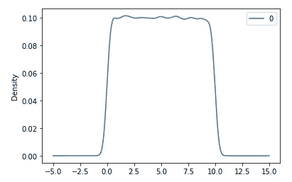

均匀分布

我们可以从这种分布中得出进一步的见解。如果我们想知道从这个分布中得到的观测值低于某个特定值的概率，我们可以用 cdf 来计算。它给出了密度曲线下的面积，直到 x 轴上的某个值。假设我们在 5 处画截止点，并想知道曲线下 x=5 处的面积，即

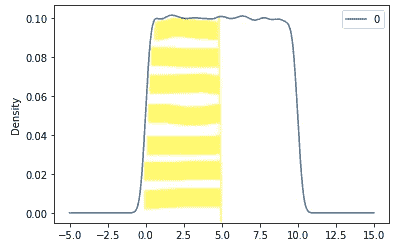

在均匀分布上使用 cdf

```
stats.uniform.cdf(x=5.0, #cutoff
                 loc=0,
                 scale=10)
```

这将给出 0.5 的输出，这意味着在这个特定的均匀分布中，如果我们挑选一个观察值，它有 50%的机会在 0 和 5 之间。

cdf 的倒数是 ppf。给定概率，ppf 给出 x 轴上的截止值。例如，要获得临界值，我们有 30%的机会在该值以下绘制观察值

```
stats.uniform.ppf(q=0.3, *#probability cutoff*
                 loc=0, *#distribution start*
                 scale=10) *#distribution end*
```

这将导致值 3。因此，在 x 轴值为 3 时，我们可以对分布进行切片，使其 30%位于图表的左侧。

为了得到给定值 x 的实际概率密度，我们使用 pdf。这将基本上给出 x 值处的分布高度值。由于均匀分布是平坦的，在上面的例子中，0 到 10 之间的所有 x 值将具有相同的概率密度。并且该范围之外的所有点将具有概率密度= 0。

现在，要从任何均匀分布中获得随机数，我们可以使用:

```
np.random.uniform()
```

要从上面使用的均匀分布中获得随机数，请使用:

```
np.random.uniform(0 *#low limit*
                  ,10 *#upper limit*
                  ,(3,4)) *#size*
```

这将产生如下数组:

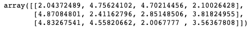

## 正态/高斯分布

同上，我们可以使用 SciPy、norm 和 rvs 来生成这个分布

```
from scipy.stats import norm
stats.norm.rvs()
```

它看起来是这样的:

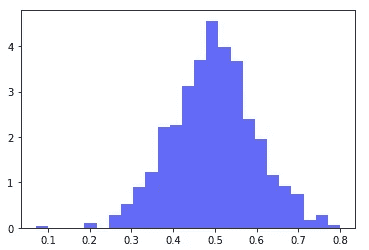

正态分布

我们可以使用 cdf 来获得 x 轴上临界值以下的曲线下面积。例如:

```
print(stats.norm.cdf(x=0.4))
```

类似地，我们可以使用 ppf 得到 x 轴上某个概率的截止值(从曲线下的面积百分比)。例如:

```
*#Find the quantile for the 97.5% cutoff*
print(stats.norm.ppf(q=0.975))
```

从某种正态分布中生成随机数可以有多种方式。

如果我们想从特定平均值和标准偏差的正态分布中生成随机数:

```
np.random.normal(1 *#mean*
                 ,2 *#standard deviation*
                 ,(3,2)) *#size*
```

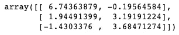

如果我们想从 0 到 1 之间的正态分布中生成随机数

```
np.random.rand(3,2)
```

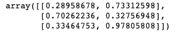

如果我们想从标准的正态分布中产生随机数

```
np.random.randn(3,2)
```

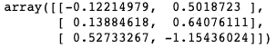

## 二项分布

这是一个离散的概率分布。在实验中只有两种可能的结果。我们可以用二项分布来计算成功的概率。它告诉你在 n 次试验中成功的可能性有多大。所以 x 轴是试验中成功的次数，y 轴是试验的次数。我们需要两个参数来定义二项式分布——试验成功的概率和试验次数。一项试验可能有多个事件。例如，抛 10 次硬币= 1 次尝试。

```
**from** **scipy.stats** **import** binom

coin=stats.binom.rvs(size=10000 *# number of trials*
          ,n=10 *#number of flips in a trial*
          ,p=0.5 *#probability of success (say getting heads)*
         )print(pd.crosstab(index="counts",columns=coin))
```

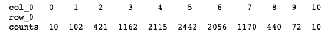

这表明，在所有的 10000 次试验中，只有 10 次我们抛硬币，没有头。这是有道理的，因为这是一个公平的硬币，有相同的概率获得正面或反面。我们可以看到 2442 次，我们有 5 个头。10000 次翻转中只有 10 次是正面朝上的。

```
pd.DataFrame(coin).hist()
```

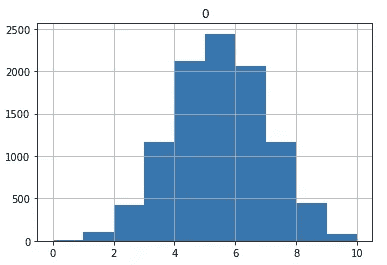

公平掷硬币

如果我们现在掷一枚不公平的硬币，有 80%的机会正面朝上，那么图表应该向右倾斜，因为我们会有更多正面朝上的结果。

```
**from** **scipy.stats** **import** binom

coin=stats.binom.rvs(size=10000 *# number of trials*
          ,n=10 *#number of flips in a trial*
          ,p=0.8 *#probability of success*
         )

print(pd.crosstab(index="counts",columns=coin))
```

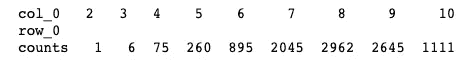

有趣的是，由于这枚硬币偏向于正面，在 10000 次试验中，没有一次我们只得到 1 个正面。在一次试验中，我们至少得到了两个头，而这也只发生了一次。我们可以清楚地看到在这个案子的审判中有更多人头的偏见。

```
pd.DataFrame(coin).hist()
```

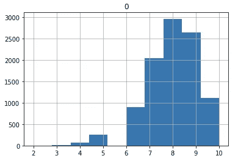

有偏向的硬币投掷

与其他分布相同，cdf 给出了在一定范围内成功的概率。例如，如果我们想知道在有偏向的硬币情况下，掷 5 次或更少次正面朝上的概率是多少:

```
stats.binom.cdf(k=5, *#probability of 5 success or less*
               n=10, *#with 10 flips*
               p=0.8) *#success probability 0.8*
```

超过 5 次成功的概率为:

```
1-stats.binom.cdf(k=5, *#probability of 5 success or less*
               n=10, *#with 10 flips*
               p=0.8) *#success probability 0.8*
```

在像这样的离散分布中，我们用 pmf 代替 pdf。pmf 代表概率质量函数。它是在给定的成功次数 k 下观察值的比例。

```
stats.binom.pmf(k=5, *#probability of 5 success* 
               n=10, *#with 10 flips*
               p=0.5) *#success probability 0.5*
```

我们可以通过给定参数 n(试验次数)和 p(成功概率)从特定的二项分布中生成随机数。例如:

```
np.random.binomial(n=52, p=0.7, size=(2,3))
```

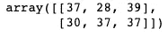

## 几何分布

这也是一个离散分布。它模拟了事件发生所需的时间。例如，如果成功=正面，那么在抛一枚公平硬币时，需要尝试多少次才能获得成功？

```
heads = stats.geom.rvs(size = 10000, *#We generate 10000 trails of flips*
                      p=0.5) *#fair coin*

print(pd.crosstab(index="counts", columns = heads))
```

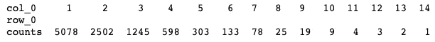

在交叉表中我们可以看到，一半的情况下，只需要翻转 1 次就可以得到一个头。这是有道理的，因为我们在掷一枚公平的硬币。所以这个图也是右偏的。

```
pd.DataFrame(heads).hist()
```

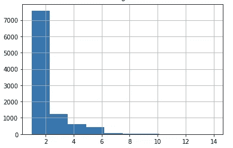

几何分布

我们可以使用 cdf 来获得更多的洞察力。例如，前 3 次翻转成功的概率是多少？

```
three_flip = stats.geom.cdf(k=3,
                           p=0.5)
print(three_flip)
```

我们在两次翻转中成功的概率是多少？这可以使用 pmf 来解决。

```
stats.geom.pmf(k=2,
              p=0.5)
```

## 指数分布

这是几何分布的连续版本。在给定发生率的情况下，它模拟特定事件发生所需的时间。

例如，如果发生率是每小时一次，那么等待一个多小时的事件发生的概率是多少？

```
prob = stats.expon.cdf(x=1,
                      scale=1) *#arrival rate*
1-prob
```

## 泊松分布

它模拟给定时间间隔内成功/事件发生的概率。例如，如果一个等候室的到达率为每小时一次，那么一个小时内有多少人到达？

```
arr = stats.poisson.rvs(size=10000,
                       mu=1) *#average arrival time 1*

print(pd.crosstab(index='counts', columns = arr))
```


有趣的是，当到达率为每小时一次时，我们经常在一小时内看到 0 次到达。我们有时也会看到更多的到达者。现在可能是最忙的时候。

```
pd.DataFrame(arr).hist()
```

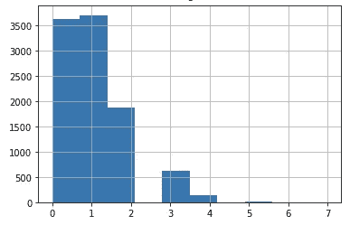

因此，在这种情况下，我们会希望在这些繁忙的时间里，在等候室里有更多的椅子。在这种情况下，每小时一次的到达率可能是欺骗性的，我们可能会遇到资源短缺。

通过统计分布，我们可以更深入地了解我们正在进行这种建模的数据和业务。