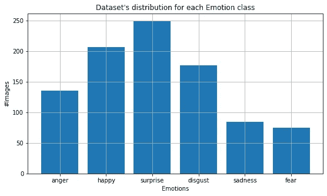
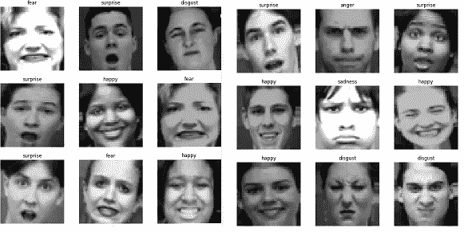
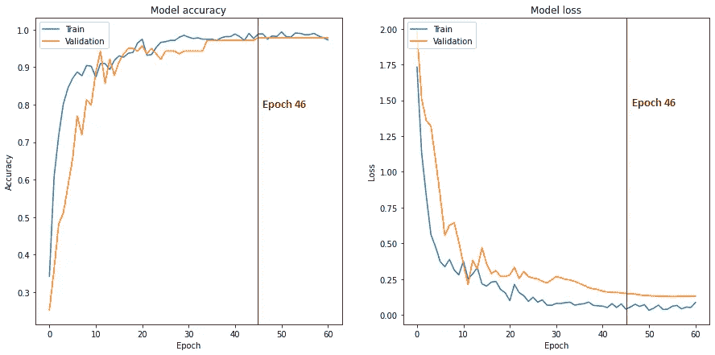
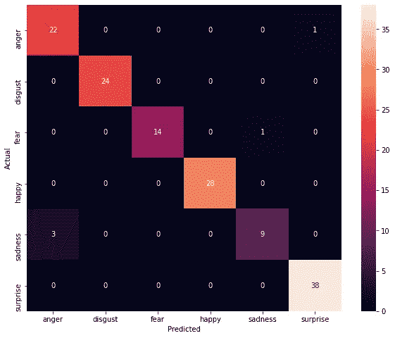
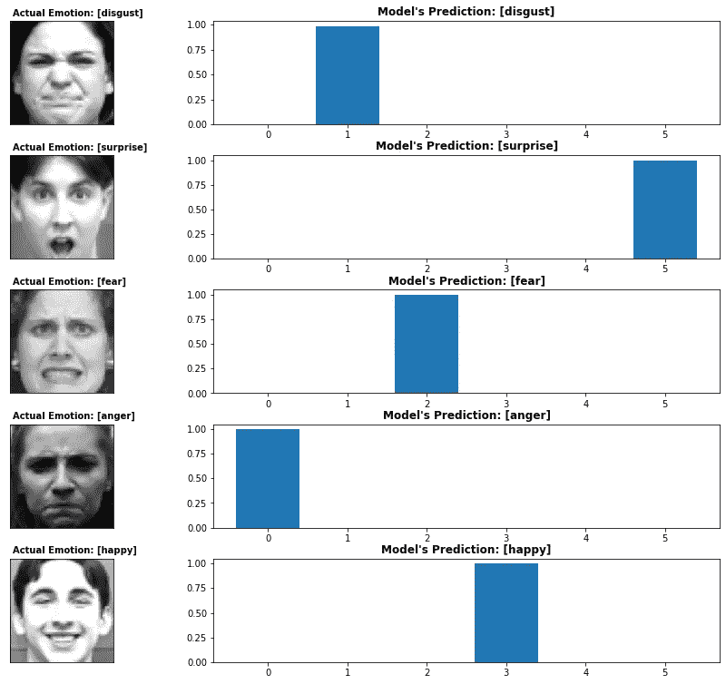

# 基于面部表情的深度情感识别

> 原文：<https://towardsdatascience.com/deep-emotion-recognition-based-on-facial-expressions-ed02fd7f8627?source=collection_archive---------20----------------------->

## 第 1 部分:关于如何针对情感识别微调面部表情效率网络的教程🎯

在机器人学硕士学位论文的启发下，我决定写一篇三部曲的文章。这一努力背后的愿望是分享我通过这次神奇的旅程获得的发现和知识。这三篇文章将主要采取循序渐进的编码教程的形式，同时在理论层面上解释已经做出的许多技术选择。


[腾雅特](https://unsplash.com/@tengyart?utm_source=medium&utm_medium=referral)在 [Unsplash](https://unsplash.com?utm_source=medium&utm_medium=referral) 上的照片

在我们开始实现之前，让我们稍微讨论一下**面部表情识别** (FER)领域:

> FER 是一个科学研究领域，研究试图从面部表情识别/推断情绪状态的技术和方法。在人类交流中，面部表情在推断情绪方面起着至关重要的作用，这可能有助于理解他人的意图。根据不同的调查[1，2]，**言语成分只传达了人际交往的三分之一**，**非言语成分传达了三分之二**。大多数与态度和感觉有关的信息存在于面部表情中。因此，面部表情被证明在整个信息交流过程中起着至关重要的作用。表情和情绪密不可分。埃克曼和弗里森在[3]引发了第一波**基础情绪理论**启发了对情绪表达的研究。他们使用了典型情绪面部表情的静态照片，并记录了有限的一组“基本”情绪(快乐)的识别和产生的某种程度的普遍性😀，惊喜*😮*，恐惧*😨*，厌恶*🤮*，悲伤*😭*和*愤怒😡*)。

这些 **6 个类别**也将用于我们的任务，并且 **CK+48** [4]是选择的数据集，将帮助我们训练和评估我们的模型。整个实现发生在使用 GPU 加速的 Google Colab 上。所以，事不宜迟，让我们开始我们的任务吧…

# 数据预处理✂️

a)首先，让我们导入必要的库，如下所示。

将数据集存储到 Google Drive 后，您必须挂载驱动器并转到包含数据集的目录。

下一步是将我们的数据加载到内存中，这就是为什么我创建了两个辅助函数来简化事情。下面您可以看到描述其功能的文档字符串(为了避免文章中出现大量代码)。当然，你可以在我的 [GitHub](https://github.com/skanelo/Deep-Emotion-Recognition) 账号上找到完整的代码。

这是我们的数据分布图。



作者图片

***注:*** *理想情况下，我们应该有* ***等分布的类*** *供我们训练，因为与“恐惧”的例子相比，模型更频繁地遇到“惊讶”的例子。最后，这将损害模型的性能，因为我们将在后面看到，大多数错误分类将与“悲伤”和“恐惧”这两个类别有关。*

b)我使用的数据集包括 927 幅形状为 48×48×3 的图像。之后，我们将数据集随机分为训练集( *70%* )、验证集( *15%* )和测试集( *15%* )(一般来说，这被认为是拆分数据的一个很好的经验法则)。

分割的指示打印如下所示。

```
X_train has shape: (**648**, 48, 48, 3) y_train has shape: (**648**, 6)  X_valid has shape: (**139**, 48, 48, 3) y_valid has shape: (**139**, 6)  X_test has shape: (**140**, 48, 48, 3) y_test has shape: (**140**, 6)X_train + X_valid + X_test = **927** samples in total
```

***注:*** *我们的验证和测试集从同一个分布中抽取是非常重要的。在这段* [*视频*](https://www.youtube.com/watch?v=M3qpIzy4MQk&ab_channel=DeepLearningAI) *中，吴恩达博士以一种引人注目(且易于消化)的方式解释了原因。问题是，我们的数据来自相同的分布(因为它是在实验室约束下创建的)，但一些类别之间的样本数量很大程度上不相等，再加上数据量相对较小，可能会损害模型的效率。理想情况下，我们应该以某种方式“控制”X_valid 和 X_test 的* ***~140 个样本*** *，方法是从每个类别* *中抽取* ***~23 个不同的示例。***

c)此外，数据扩充将只用于训练样本，以便让模型遇到各种不同的例子，因为我们没有太多的例子可供我们使用，因此这将有助于它增强其预测性能。

***注意:*** *并不是 ImageDataGenerator 类的所有参数都相关。对此我们必须小心。例如，垂直翻转对我们的任务没有意义，可能会损害模型的精度。*

应用于训练样本的一些增强示例如下所示。



作者图片

# 模型创建和微调🚀

我创建了函数 build_model，它加载了在 ImageNet 上预训练的 EfficientNetB0 模型(没有它的原始分类器),并在它的顶部添加了 3 层，如下图所示。只选择 3 层(而不是更复杂的东西)的想法来自于官方文档 [Keras](http://Image classification via fine-tuning with EfficientNet) 展示了如何在图像分类上微调 EfficientNet。此外，该函数使用 Adam 优化器、分类交叉熵损失函数和作为度量的准确性来编译模型。

在我的 GitHub repo 中，我上传了模型的概要以及模型的图形，这样[就可以看一下](https://github.com/skanelo/Deep-Emotion-Recognition/tree/main/model%20summary)。

至于培训阶段，我使用了 3 个非常有用的回访:

*   **ModelCheckPoint:** 保存达到最佳验证精度的模型的权重。
*   **提前停止:**如果连续 15 个时期验证精度没有提高，训练将被中断(该回调防止过度拟合)
*   **reducelronplateaueu:**这是一个调度程序，每当验证精度处于稳定状态时，它会将学习率降低一半。

上述回调的组合确保了我们的模型不会过度拟合。当然，我们也可以通过我们的学习曲线观察到这一点，我们稍后会进行检查。

***注:*** *至于批量，我试验了一个取值范围。对于批量大小为 16 和 32 的样本，训练时间增加了(这确实很重要，尤其是当数据集相当大时)，而验证准确性甚至没有比 64 个样本的批量更高。另一方面，一批 128 个样本当然加速了训练过程，然而，不仅验证不是更好，而且还观察到学习曲线的显著振荡(这可能妨碍模型的收敛)。*

***注意:*** *两个* ***我在建立这个模型的过程中意识到的非常重要的事情是:****(1)D****尽管在大多数情况下像素归一化被应用于输入图像，EfficientNet 仍然通过* [*它的重新缩放层*](https://keras.io/api/applications/efficientnet/) *来实现这一点，因此，使用会损害模型的性能。***【2】*D****尽管模型将形状(224，224，3)的张量作为输入，但我意识到，当我修改输入层以接收形状(48，48，3)的张量而不是将数据集重新缩放到 224x224 时，可以获得更好的性能。我设法找到的唯一相关资料来源是阿德里安·罗斯布鲁克关于 pyimagesearch.com 的一篇文章。***

# 学习曲线📈 📉

最后，模型只需要 46 个时期就能收敛，训练过程从我们的回调中中断。相应的学习曲线如下所示。



该模型似乎很好地符合新数据，具有相当小的泛化差距。训练和验证准确度都接近 98-99%的准确度。但是，将自动加载模型最佳版本的权重。

# 最终评估🔮

最后，我们将在没有见过的样本上测试我们的模型。这个集合是从我们的初始数据集中抽取的**测试集合**。模型达到了*96.43%的准确率*，*并且通过混淆矩阵来描述预测，以便我们可以彻底检查模型的错误分类。*

**

*作者图片*

*从这个矩阵中你可以观察到，类“悲伤”本质上导致了这个问题。这是绝对合理的，虽然，由于数量很少的例子。此外，不要忘记，即使对一个人来说，表达悲伤、恐惧、厌恶或愤怒的面部表情也可能令人困惑，如果你检查以上面部表情的增强样本，并尝试自己预测每种表情的类别，这一点就会变得明显。你会意识到，即使对人类来说，这项任务也存在固有的困难。*

*您还可以看到模型的一些随机预测，右侧的条形图显示了每个预测的置信度。*

**

*作者图片*

# *结论🏆*

*在本文中，我们看到了如何构建面部表情分类器来预测情绪。对于这个数据集( **CK+48** )，达到 ***96.43%*** 的准确性接近于最先进的性能，在这个三部曲的下一篇文章中，我们将应用可视化技术(GradCam)，通过将热图应用到原始图像上，揭示图像中对模型起关键作用的区域，以便进行推断。这些技术对于深度学习方法非常重要，因为它们有助于模型的可解释性和可解释性。因此，在我们的下一次会议上，我们将看到我们如何解释我们的模型的不准确性，以及我们如何可能改善它。*

*非常感谢您的宝贵时间！(完整的项目可以在**这里找到[**)。**](https://github.com/skanelo/Deep-Emotion-Recognition)***

# ***参考***

*****【1】**阿尔伯特·梅拉比安。没有文字的交流。沟通理论，第 193-200 页，2008 年。***

***凯瑟琳·考拉德，道格拉斯·坎宁安，海因里希·H·布尔霍夫和克里斯蒂安·沃尔雷文。mpi 面部表情数据库——一个经验证的情感和会话面部表情数据库。PloS one，7(3)，2012。***

***保罗·艾克曼，理查德·索伦森和华莱士·弗里森。面部表情中的泛文化因素。科学，164(3875):86–88，1969。***

***Patrick Lucey，Jeffrey F Cohn，Takeo Kanade，Jason Saragih，Zara Ambadar 和 Iain Matthews。扩展的 cohn-kanade 数据集(ck+):一个完整的动作单元和情感表达数据集。2010 年 ieee 计算机学会计算机视觉和模式识别会议-研讨会，第 94-101 页。IEEE，2010 年。***