# (深)屋:制作 AI 生成的屋内音乐

> 原文：<https://towardsdatascience.com/deep-house-making-ai-generated-house-music-e1447b06b53d?source=collection_archive---------10----------------------->

## [实践教程](https://towardsdatascience.com/tagged/hands-on-tutorials)

## 有没有想过我们不在的时候电脑在玩什么？

[附身摄影](https://unsplash.com/@possessedphotography?utm_source=medium&utm_medium=referral)在 [Unsplash](https://unsplash.com?utm_source=medium&utm_medium=referral) 上拍照

很长一段时间以来，人们一直试图制作机器生成的音乐。一些最早的例子是音乐家在钢琴角色上打孔，创造出人类无法演奏的复杂旋律。

最近，它看起来像是 MIDI 文件形式的电子音乐，通过指定各种属性(乐器、音高、持续时间和定时)，歌曲可以被象征性地表示出来。但是 AI 运行整个生成过程是什么样子的呢？

AI 生成的“[人类音乐](https://www.youtube.com/watch?v=S1jWdeRKvvk)”(下文更多)。有趣的是，这收到的两个 SoundCloud 评论来自机器人。似乎对人工智能生成的音乐的最高赞美来自人工智能生成的垃圾邮件

其中一首更好的歌曲被输入到一个 StyleGAN 来创建一个新的音乐视频

这篇文章探索了生成音频技术，用几个小时的家庭音乐来训练 OpenAI 的[点唱机](https://openai.com/blog/jukebox/)。

# 生成音频方法

历史上，生成音频模型是在这些符号音乐表示的数据集上训练的。这些早期(2017 年)的模型，如 [DeepBach](https://sites.google.com/site/deepbachexamples/) 或[midet](https://arxiv.org/pdf/1703.10847.pdf)产生了模仿人类旋律的“乐谱”，效果令人印象深刻。

[迪普巴赫](https://arxiv.org/abs/1612.01010) (Hadjeres 2017)

但是训练和生成原始音频要困难得多。典型的音频文件以 44.1kHz 运行，这意味着每秒包含 44，100 个不同的值。这比仅仅从包含“在斯坦威钢琴上从 00:01 到 00:02 弹奏中音 C”的文件中学习的符号模型要复杂得多。

最近，OpenAI 的 [Jukebox](https://openai.com/blog/jukebox/) 和 DeepMind 的 [WaveNet](https://deepmind.com/blog/article/wavenet-generative-model-raw-audio) 解决了在音频文件中学习长期依赖性的难题。生成原始音频的方法主要有三类，各有利弊。

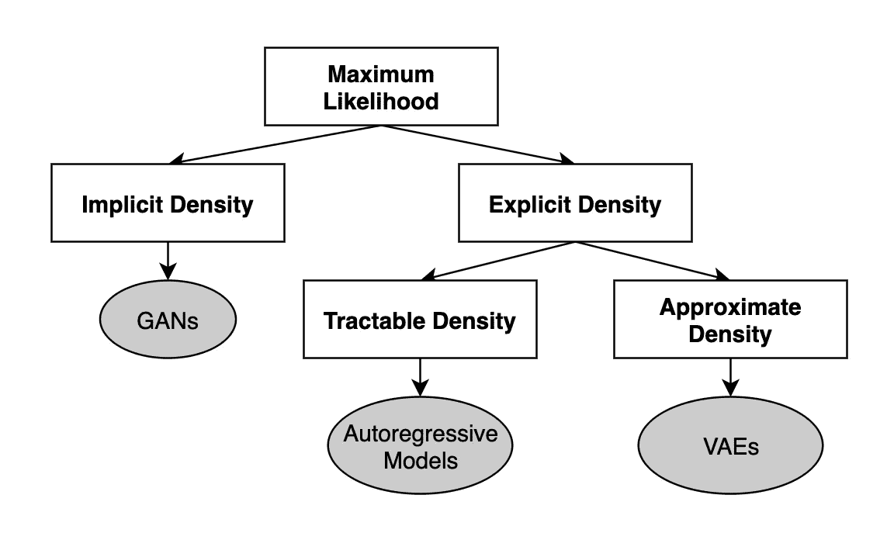

音乐音频合成的深度生成模型(图片由作者提供，基于 [Huzaifah 2020](https://arxiv.org/pdf/2006.06426.pdf) )

## 生成对抗网络

gan 学习将输入向量(通常比数据的维数小得多)映射到目标域中的数据实例。它们实际上是两个相互训练的神经网络的组合。鉴别器(D)试图判断生成的输出是否真实。发生器(G)试图产生这个合成输出来欺骗鉴别器。

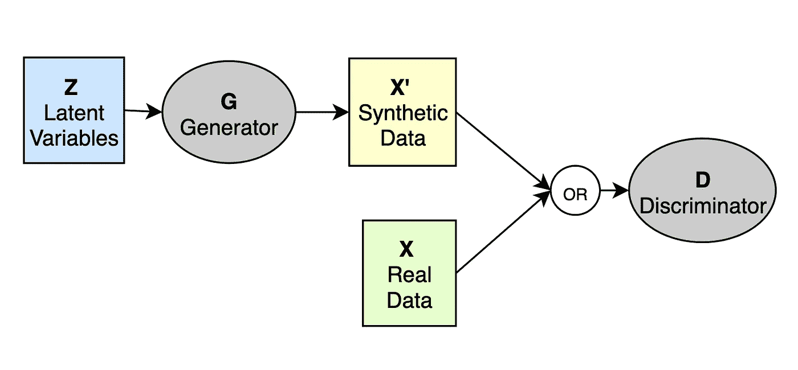

甘建筑(图片作者提供)

随着模型的训练，生成器能够产生与真实例子相媲美的输出。

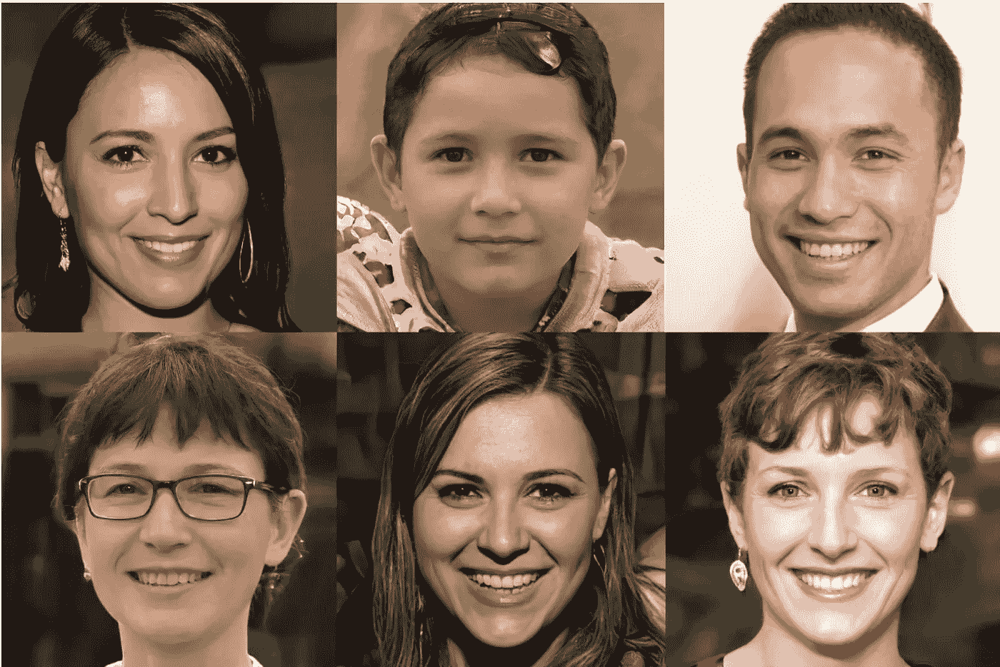

甘斯创造的合成脸。(图片由[ThisPersonDoesNotExist.com](http://ThisPersonDoesNotExist.com)提供)

从理论上讲，GANs 是发电速度最快的架构(以上三种架构中),并且对调节变量有更好的全局控制。然而，GANs 在制作高分辨率图像方面取得的巨大成功还没有转化到音频领域。实际上，它们主要用于从乐器和[短片](https://twitter.com/chrisdonahuey/status/1094024601095401472?lang=en) ( < 4s)中产生[单个音符](https://github.com/chrisdonahue/wavegan)的音色，而不是产生新的乐谱。

## 自回归模型

自回归模型将先前的术语(想想:过去几秒钟的音乐)压缩成隐藏状态，用于预测下一位音频。虽然 RNN 在每个时间步长只看到一个输入样本，并在其状态中保留过去样本的影响，但 WaveNet 可以显式访问输入样本的过去窗口。

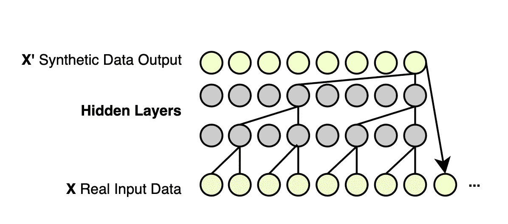

[WaveNet 的](https://deepmind.com/blog/article/wavenet-generative-model-raw-audio)自回归架构。(图片由作者提供)

这种类型的模型最擅长短音频生成。生成的样本通常缺乏长期结构，因此它们通常用于语音生成。然而，自回归模型非常慢。生成新元素需要所有先前的元素都存在。标准化流动模型([并行波网](https://arxiv.org/abs/1711.10433))增加了这些模型的并行性，使生成速度提高了 300 倍。

## 变分自动编码器

传统的自动编码器将输入数据映射到“潜在空间”中，以学习数据集的压缩的底层表示。

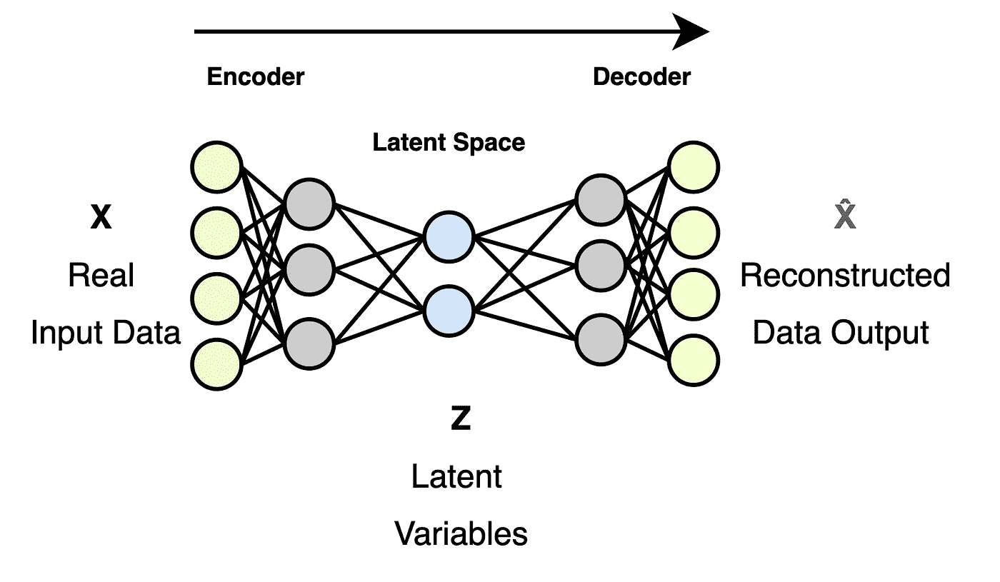

自动编码器架构。(图片由作者提供)

这些潜在变量可用于从低维向量生成新的数据合成样本:将潜在向量输入解码器，合成样本被创建。然而，因为解码器从学习向量中重建数据，它们不能生成新的输出。

为了解决这个问题，变分自动编码器(VAEs) [改为学习](/understanding-variational-autoencoders-vaes-f70510919f73)潜在空间的基本分布的参数，允许在生成时随机采样以创建新的合成样本。

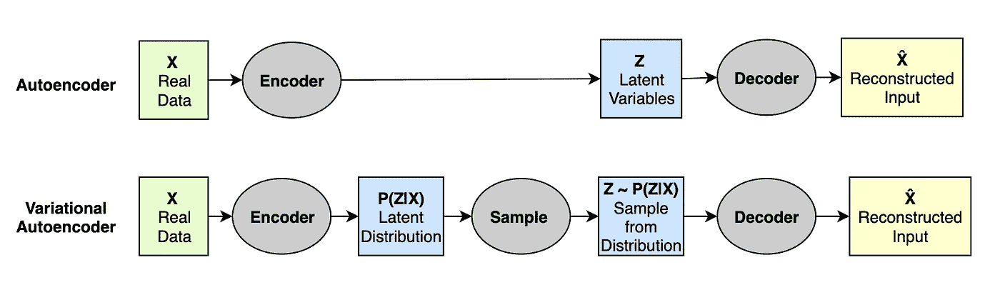

自动编码器与可变自动编码器(图片由作者提供)

在内部，变分自动编码器将输入存储为潜在空间的分布，而不是单点。VAE 学习潜在空间中概率分布的参数，从该潜在空间中可以抽取样本。

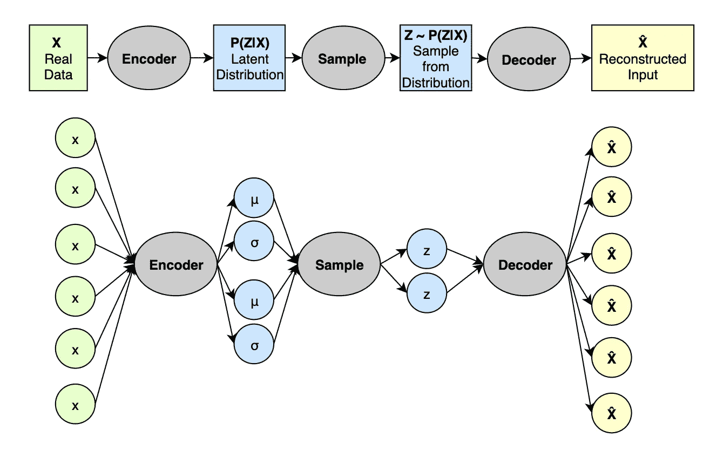

可变自动编码器(VAE)架构。(图片由作者提供)

gan 通常会产生更好的结果，因为它们不处理任何显式的概率密度估计。当模型不了解真实的后验分布时，vae 无法生成清晰的输出。

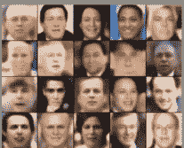

VAEs 生成模糊的合成样本。(图片由[向数据科学](/what-the-heck-are-vae-gans-17b86023588a)提供)

vae 最擅长构建数据空间，用于发现数据的低维参数表示。然而，因为它们学习参数的分布而不是实际值，所以生成的样本可能不精确。他们的输出可能在概率上是正确的，但实际上并不正确。

# 分解自动点唱机

OpenAI 的[点唱机](https://openai.com/blog/jukebox/)结合使用了这些技术。为了处理较长的音频文件，它将输入下采样到一个较低分辨率的空间。在这个压缩空间中(比输入小 128 倍)，生成新颖的音频样本要容易得多。新音频生成后，将被升采样回更高保真的音频电平。

## 压缩音频文件

训练一个模型来生成音频序列需要开发另一个模型来将训练数据(音频文件)从其原始的 44.1kHz 分辨率向下转换到低维空间，然后再转换回来。在这个低维空间中，我们训练生成模型要容易得多(计算成本也低得多)。为了实现这一点，Jukebox 使用分层 VQ 值。把 VQ-VAE 想象成一个翻译器，从原始音频编码到这个低维空间，再解码回来。

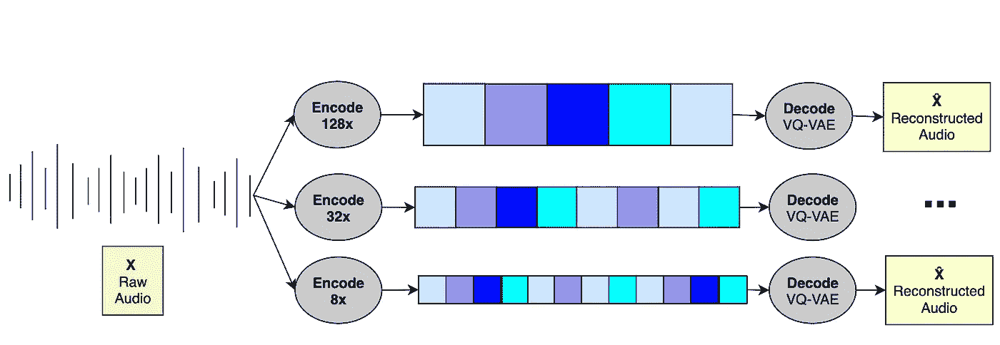

点唱机用分级 VQ 压缩音频。音频被“编码”到低维空间中，以便训练生成模型。(图片由作者提供，基于 [OpenAI](https://openai.com/blog/jukebox/) )

矢量量化变分自动编码器( [VQ-VAE](https://arxiv.org/pdf/1711.00937.pdf) )建立在 VAEs 之上，允许生成更真实的样本。如上所述，vae 通常生成“模糊”的合成数据，因为它们来自分布。VQ-维斯通过量化(想想:变成[离散向量](https://blog.usejournal.com/understanding-vector-quantized-variational-autoencoders-vq-vae-323d710a888a))潜在变量来解决这个问题。

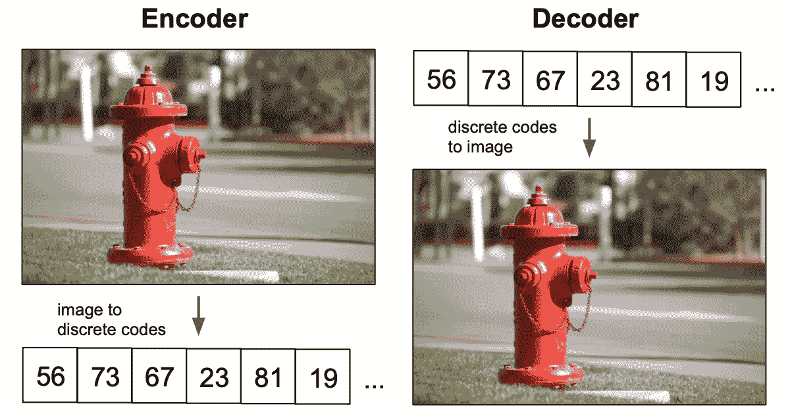

VQ-VAE 输出看起来很真实。(图片由[ML @伯克利](https://ml.berkeley.edu/blog/posts/vq-vae/))

生成的样本由模拟训练集中的音频部分的音频比特组成，而不是由概率上应该存在于训练集中的音频比特组成。结果通常更加真实。对于 VQ-VAEs 如何不同于 VAEs 的视觉直觉，见下面他们的潜在空间的比较。

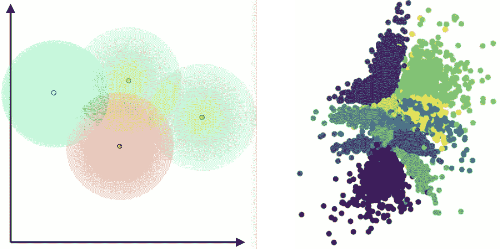

维斯(左)和 VQ-维斯(右)的潜在空间。(图片由 [MLearning.ai](https://medium.com/mlearning-ai/a-crash-course-on-vaes-vq-vaes-and-vae-gans-3fdcc40b059e) 提供)

一个单一的 VQ-VAE 可以有效地抓住当地的结构，但长期的一致性很难。生成的音频在小时间范围内可能听起来合理，但在较长时间范围内听起来就不那么好了。想象一下，一首歌的桥段一直延续，而不是过渡到下一段。在当地，这听起来很有条理，但在全球范围内，这毫无意义。为了更好地学习这些长期的音乐结构，Jukebox 结合了不同时间尺度的多个 VQ 值:亚秒、秒和十秒。这些[分级 VQ 值](https://proceedings.neurips.cc/paper/2018/hash/3e441eec3456b703a4fe741005f3981f-Abstract.html)有助于捕捉波形中的长程相关性。

## 训练一个深宅的 Prior

在我们可以训练我们的生成模型之前，我们需要训练 VQ-VAE 来处理我们的输入音频。因为它是一个自动编码器，我们希望输出听起来尽可能接近输入，所以任何重建损失都是不利的。此外，我们最小化了码本损失，即原始音频样本与其“矢量量化”表示之间的差异。“损失”是我们在重建音频中听到的随机噪声，原始样本中不存在。

高质量输入音频(来自训练数据集)

较低质量的重建音频(通过 VQ-VAE 后)

既然我们可以在这个离散化的空间中工作，我们就可以训练我们的先验来预测音频序列。给定一些过去的输入和辅助数据，可以训练一个[变压器模型](http://Given a number of past inputs and auxiliary data, a transformer)来预测接下来会出现什么声音。[变形金刚](https://blue-season.github.io/transformer-in-5-minutes/)使用[注意力机制](https://d2l.ai/chapter_attention-mechanisms/index.html)来提高学习翻译和预测序列的训练速度。因为它们比 [RNNs](https://stanford.edu/~shervine/teaching/cs-230/cheatsheet-recurrent-neural-networks) 提供了更长序列的计算优势，变压器是原始音频的理想架构。Jukebox 使用[稀疏变压器](https://arxiv.org/pdf/1904.10509.pdf)将每层的计算复杂度从 O(n)降低到 O(n **√** n)。

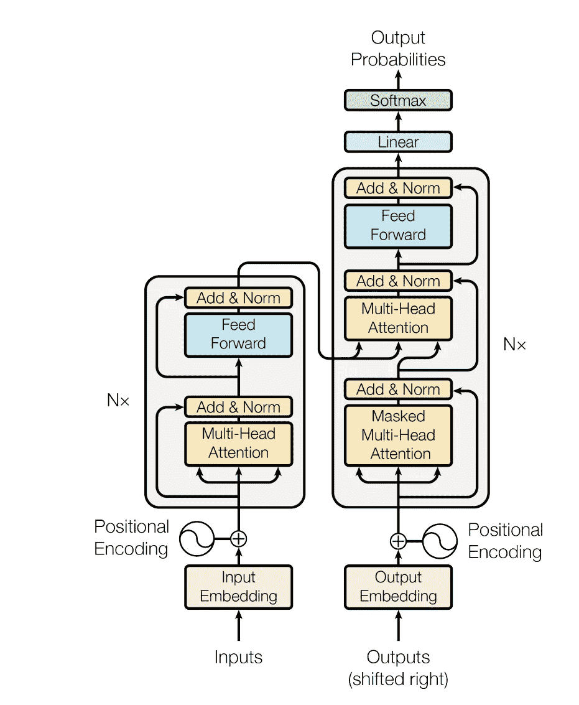

变压器架构。(图片由 [Vaswani 2017](https://arxiv.org/pdf/1706.03762.pdf) 提供)

为了生成音频，我们训练转换器在给定数据集中歌曲的先前编码声音的情况下预测下一个编码声音。在训练期间，我们[根据关于输入音频的辅助信息来调节](https://arxiv.org/pdf/1806.09905.pdf)模型，以使我们能够拥有控制生成的参数。在实践中，这看起来像是在训练音频中传递关于流派、艺术家和歌词的信息，以便在生成时我们可以传递我们希望它输出的艺术家或流派。

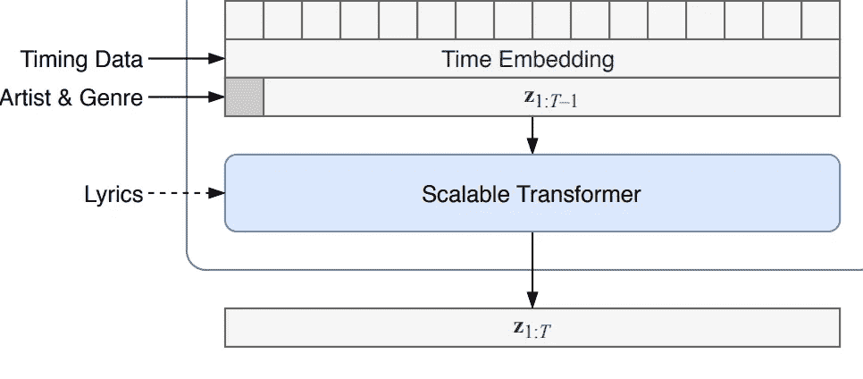

调节信息被传递到我们的变压器模型中。(图片由 [Dhariwal 2020](https://arxiv.org/pdf/2005.00341.pdf) 提供)

最高级别的 prior 接受大约 50 小时的深度室内音乐培训，并去除声道(c/o[sp leapter](https://github.com/deezer/spleeter))。prior 在 NVIDIA 的 Tesla V100 GPU 上训练了 4 天，重量衰减为 0.01。当训练损失在 2 左右时(大约 90k 步)，学习率(LR)被[退火](https://github.com/openai/jukebox#learning-rate-annealing)到 0。学习率退火意味着当你接近训练结束时，随着时间的推移降低你的 LR，以确保你不会失去最小值的位置。

这种输出主要是鼓和低音

这一首听起来像是低音线上的杂乱声音

这一个特别不和谐，大约在 10 秒钟左右分崩离析

虽然 90k 步可能看起来很长，但随着时间的推移，生成轨迹的质量会显著提高。作为参考，将这些早期轨迹(在 33k 和 53k 步生成)与最终部分的最终轨迹(在 90k 步之后)进行比较。

## 生成新的房屋轨迹

为了生成新的室内音乐，我们首先从训练过的先验样本中采样，然后将音轨上采样回其原始采样率。最后，生成的样本通过 VQ-VAE 解码器并变回波形。

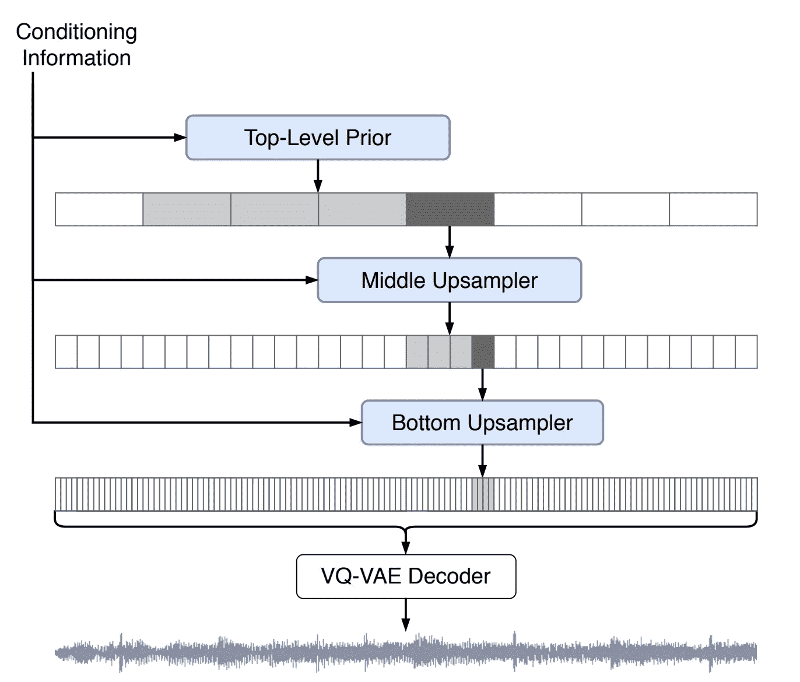

自动点唱机先生成最高级别的音频，然后进行上采样。(图片由 [Dhariwal 2020](https://arxiv.org/pdf/2005.00341.pdf) 提供)

以关于艺术家和流派的信息为条件的顶级先验(级别 2)被采样，以生成训练数据风格的音乐符号的新序列。虽然我们可以' [prime](https://github.com/openai/jukebox#prompt-with-your-own-music) 该模型继续从一个输入的音频文件，下面的样本都是未经 prime 和完全采样从学习的顶级先验。级别 2 生成的音频样本包含音乐的长程结构和语义，但是由于压缩而具有低音频质量。

来自顶级 prior 的音频听起来粗糙且质量差

为了从生成的音频中去除“颗粒”,我们将其向上采样到越来越低的层。这些上采样器模型类似于我们的顶级先验变换器，但首先用更高级别的生成令牌进行调节。将这个级别 2 样本传递给级别 1 上采样器(然后将该样本传递给级别 0 上采样器)。

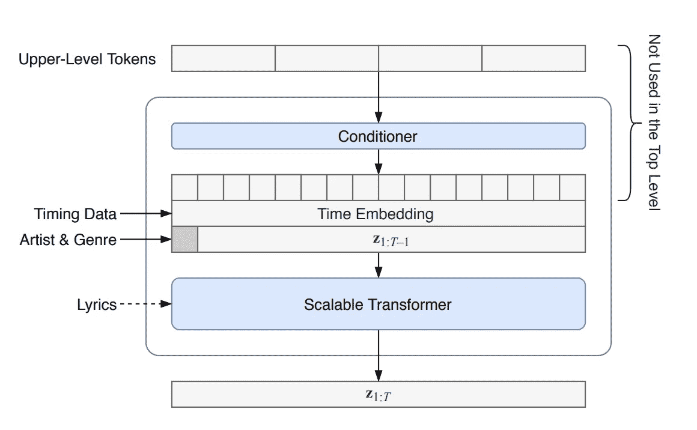

上采样以较高级别的生成音频标记为条件。(图片由 [Dhariwal 2020](https://arxiv.org/pdf/2005.00341.pdf) 提供)

这些上采样器增加了音色等本地音乐结构，极大地改善了音质。

级别 1 是级别 2 的显著改进

而 0 级更好

# (深)房子

那么计算机生成的室内音乐听起来是什么样的呢？下面是一些最好的样本，但更多的你可以查看 SoundCloud 上输出的 [**整个播放列表**](https://soundcloud.com/user-935478966/sets/deep-house-90k-90s-level-0) 。

有点像帮派成员

渐进低音线在 00:12 左右出现

沉重的鼓声，直到 00:11 左右传来钢锅声

大约 00:33 分，进入一首新歌

> 正如一位朋友所说，“这就像一台计算机试图学习如何冒充 Kygo 给它的计算机朋友”

## 限制

**长期结构:**虽然[原始论文](https://arxiv.org/pdf/2005.00341.pdf)将此列为一个限制，但对于我们没有人声的室内音乐来说，这不是什么问题，因为没有人声来清晰地描绘出诗句和合唱(室内音乐是重复的)。

**生成速度:**虽然这些磁道是并行生成的，但因为 Jukebox 是建立在自动回归模型上的，所以单个磁道的生成不是并行的。这些 90 秒的样本花了大约 10 个小时生成。

**过度拟合:**另一个问题是来自生成样本的知识产权侵权。在一些轨道中，如果音频完全淡出，轨道会在几秒钟后随着此介绍重新开始。

在几秒钟的静默之后，过度拟合的音频出现在 00:05

这可能是因为在训练数据集中制作了许多歌曲的 DJ 以这种方式打开了他所有的歌曲，并且模型学会了复制该介绍。

我对所有自动生成的歌曲运行 SoundHound，但没有匹配，但不清楚这是因为 Jukebox 过度拟合了没有匹配的去除人声的歌曲，还是因为它们是真正新颖的样本，只是受到了训练数据集的严重启发。因为 SoundHound 的“哼一首曲子”功能，我的直觉是后者，然而进一步的研究应该调查 IP 和 AI 生成的内容。