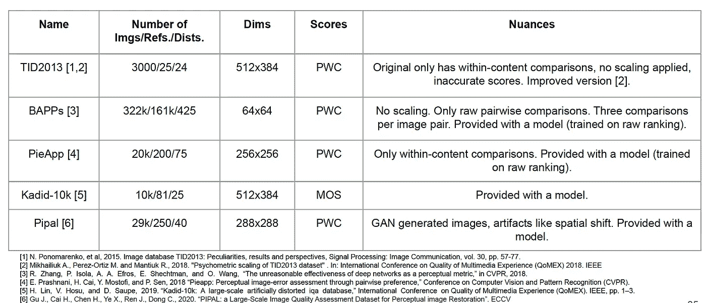
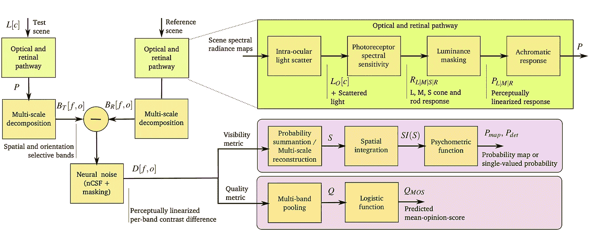

# 深度图像质量评估

> 原文：<https://towardsdatascience.com/deep-image-quality-assessment-30ad71641fac?source=collection_archive---------2----------------------->

## [实践教程](https://towardsdatascience.com/tagged/hands-on-tutorials)

## 深入研究全参考图像质量评估。从主观图像质量实验到深入的客观图像质量度量。

作者图片

在深入研究图像质量评估之前，我对成像管道中的处理步骤知之甚少。我后来发现，相机管道(捕捉光子并将其转换为数字世界的字节的过程)是硬件和软件的协同作用，在每个阶段都经过精心优化，显示模型也是如此——从数字字节到人眼感知的光的物理量的反向转换过程。

为了实现高水平的细节、增强和真实感、图像的深度感，图像处理算法经历了仔细的微调。前一段时间，这些算法是手工配置的。随着时间的推移，自动图像质量评估方法得到了发展，大大简化了算法设计人员的工作。

开发能够捕捉图像感知质量的度量标准的挑战仍然存在。以下面的两张老虎图片为例——图像质量评估最流行的指标之一峰值信噪比(PSNR)未能给图像分配更高的分数，人类观察者会判断该图像具有更好的质量。

在这个例子中，峰值信噪比(PSNR)提供了相反的直观结果，与图像的感知质量相矛盾。在右图中，度量分数较低，但是从视觉上看更好。来自 [BSD](https://www2.eecs.berkeley.edu/Research/Projects/CS/vision/bsds/) 图像数据集的已处理图像。

在我跳到客观的图像质量指标之前，我们首先需要回顾一下制定指标的基本步骤:

我们从标准开始——我们希望度量模型化的东西。然后，我们选择一组图像，稍后我们将在这些图像上训练模型。有了这些图像，我们以人类观察者判断的形式收集数据，询问每张图像符合所选标准的程度。收集完数据后，我们就可以开始建模了。

本文是关于全参考深度图像质量指标的图像损伤评估。因此，我将只简要地谈一下管道的前两步。这些是理解最先进的图像质量评估模型背后的选择的先决条件。我还将简要讨论基于非深度学习的图像质量指标，因为这些指标经常被用作深度模型的构建部分。

这篇文章部分基于我在 [PyData Cambridge](https://www.meetup.com/PyData-Cambridge-Meetup/) 的[演讲](https://www.youtube.com/watch?v=9xsSR_ERJvk)和在 ARM 有限公司的一次受邀演讲。如果你想了解这篇文章主题的更多信息，请不要犹豫给我发消息——我肯定能够提供进一步的指导。

# 标准

通常区分三种类型的图像质量评估。图像美学评估、图像损伤评估和赝像可见性评估。例如，考虑下面的三种情况。

三个图像质量标准。图片作者。

在*审美评估*的第一个案例中，我觉得顶部的图像比底部的图像好看。我会说，它有很好的和有趣的，有点破旧的纹理。因此，美学是公认的摄影规则——光线、对比和构图的恰当运用。在第二种情况下，我们感兴趣的是评估测试图像中相对于参考图像的*可见损伤水平(质量)*。这个问题当然不那么模糊，因为它不直接依赖于个人偏好。最后，在最后一种情况下，我们将有兴趣看到图像中观察者会看到伪像的区域(*可见性* )—这些区域通常不是微不足道的，因为一些损伤可能会被掩盖。虽然第一个(美学)和最后一个(可见度)例子是非常有趣的话题，但在本文中，我将讨论图像损伤/保真度评估。

# 主观质量

那么，如何引发人们对图像质量的判断呢？通常有两种不同的方法。评级和排名。在这篇文章[中，我已经非常详细地讨论了这两种方法，其中我还讨论了合并从两个实验过程中获得的分数的方法。](/dataset-fusion-sushi-age-and-image-quality-and-what-the-hell-do-they-have-in-common-814e8dae7cf7)

分级实验的例子。图片作者。

在评级中，参与者被要求从预定义的尺度中给图像分配一个单一的分数。评级结果取决于为实验和训练程序选择的图像。与此同时，排名要简单得多，因为它问了一个简单的问题——哪张图片更好。排名的一个很大的缺点是大量可能的比较。我也有机会使用有效的配对选择方法进行排序实验，并在本文[中讨论了一般的流程。](/active-sampling-for-pairwise-comparisons-476c2dc18231)

一旦收集了数据，我们就会有一个主观的图像质量数据集，如下图所示。

来自 TID2013 数据集的图像。

数据集中的每个图像都有相应的主观质量分数。

长期以来，缺乏足够大的图像质量数据集阻碍了客观质量算法的发展。理想的数据集将包含一系列图像内容的大量心理测量结果，以及不同损伤程度的各种失真。

收集足够大的数据集的问题已经在许多工作中得到了解决，在 Amazon Mechanical Turk 的帮助下，我们现在有了相当大量的数据集来训练指标。下面我总结了其中最大的几个:

# 客观质量

有了这些数据，我们就可以对感知质量进行建模。典型的图像质量度量将采用失真的图像，并产生与人类参与者提供的分数高度相关的分数。

通常有三种度量标准。无参考(不提供参考图像)、简化参考(提供参考图像的一些信息)和完全参考。在这里，我将重点介绍全引用度量，因为它们经常用于调优图像处理算法。

## 传统(基于像素的)度量

很长一段时间以来，图像质量都是借助峰值信噪比(PSNR)来计算的:

其中 MAX(I)是最大可能像素值，MSE 是均方误差，由下式给出:

另一个流行的度量是计算滑动窗口的图像统计的结构相似性指数度量(SSIM ):

包含三个组件亮度(l)、对比度和结构(s):

其中\mu 和\sigma 是参考图像 x 和测试图像 y 的补丁值的平均值和标准偏差。

作为感知质量评估器的基于像素的度量具有几个流程:

*   它们不是像素偏移不变的，这意味着图像偏移一个像素会破坏质量预测。对于在滑动窗口上操作的度量标准，例如 SSIM，对结果进行平均，这个问题可以在某种程度上得到缓解，但是仍然存在。
*   它们对所有像素值进行相等的等待，并且不考虑掩蔽或视觉突出效果。例如，高斯噪声可能会被图像中的高频细节掩盖，否则高斯模糊在图像的低频区域不会那么明显
*   许多是为标准观看条件开发的，假设图像分辨率在每度 30-60 像素之间，显示亮度为每平方米 100 坎德拉，这在 [CRT 显示器](https://en.wikipedia.org/wiki/Cathode-ray_tube)的时代是合理的。

尽管已经提出了这些度量的变体，例如 MS-SSIM(多尺度 SSIM)或 WSSIM。这些只是稍微改善了性能。

## 模拟人类视觉系统

一类更高级的度量标准旨在对人类视觉系统的假设进行建模或建立在这些假设的基础上(HVS):

<https://www4.comp.polyu.edu.hk/~cslzhang/IQA/TIP_IQA_FSIM.pdf>**:基于参考图像和失真图像之间的相位一致性是解释感知图像质量的有意义特征的假设。相位一致性模型表明，在傅立叶分量在相位上最大的点处感知特征。为了结合对比度信息，对视觉系统很重要的 FSIM 也依赖于图像的梯度图。有一篇非常好的[文章](https://homepages.inf.ed.ac.uk/rbf/CVonline/LOCAL_COPIES/OWENS/LECT7/node2.html)介绍了相位一致性是如何从头开始工作的。对于那些对使用 FSIM 作为损失函数感兴趣的人，请随意查看我的可微分 [pytorch 实现](https://github.com/mikhailiuk/pytorch-fsim)。**

**[**HDR-VDP**](http://hdrvdp.sourceforge.net/wiki/) :拥有一个非常复杂的多个组件模型，负责对人类视觉系统的不同部分进行建模。该模型的优势之一是它是一个白盒度量，每个组件都根据心理物理数据进行了仔细调整。该方法能够模拟不同观看条件下的质量，例如到屏幕的距离及其亮度。该模型的早期版本如下图所示:**

****

**hdr-vdp 早期版本的示意图。Rafal Mantiuk 的图片来自[论文来源](http://hdrvdp.sourceforge.net/hdrvdp.pdf)。**

**大部分处理是基于对比敏感度函数(CSF)。CSF 解释了人类视觉系统感知作为空间频率函数的对比度变化的方式。**

****

**人类在高 CSF 值(每度 6-8 个周期)的空间频率下具有较低的对比度阈值*。*因此，对于对比敏感度函数高的空间频率，感知失真的概率更高。**

# **深度图像质量评估**

**新的大规模图像质量数据集使基于深度学习模型的图像质量度量得以发展。典型的基础模型是卷积神经网络(CNN)。如果你想了解 CNN 的基础和提高其性能的不同技巧，我在一篇由两部分组成的文章中谈到了这一点:[第一部分](/cnn-cheat-sheet-the-essential-summary-for-a-quick-start-58820a14d3b4)和[第二部分](/cnn-cheatsheet-the-essential-summary-part-2-c0b96d58940d)。**

**早期的深度图像质量模型没有太多要训练的数据，并且依赖于为分类模型预先训练的假设也将学习自然场景统计的分布。预训练的 VGG 或亚历克斯网络模型然后被用作特征提取器。在这些质量模型中，从参考和测试图像中提取的特征通常通过均方误差进行比较。因此，从测试和参考图像的特征空间中的距离获得质量分数。**

**它让你想起什么了吗？这正是[知觉丧失](https://arxiv.org/pdf/1603.08155.pdf)正在做的事情！**

****

**图片由[约翰逊](https://arxiv.org/pdf/1603.08155.pdf)拍摄。**

**这里，图像 x 通过生成器网络传递，产生输出 y，其中 y 应该具有 yc 的内容和 ys 的样式。**

**一些作品研究了为什么深层表征可能是良好的感知质量特征，最近的一篇[研究了人类视觉系统中众所周知的概念之间的关系，例如对比敏感度和深层神经网络隐藏层的激活。这项工作还提出了选择深度表征的方法，以最大限度地提高与感知图像质量的相关性。](https://arxiv.org/pdf/1812.00412.pdf)**

****

**图片由塔里克拍摄。**

**现在让我们实际讨论一下深层图像质量评估指标！**

**[**经由 DNN 特征的 IQA:**](https://www1.icsi.berkeley.edu/~stellayu/publication/doc/2016qualityJIST.pdf)最初的作品之一不是比较简单的均方误差，而是将图像分解成多个尺度，并经由[直方图相交核](https://link.springer.com/book/10.1007/3-540-45665-1)比较测试图像和参考图像的特征图直方图。**

********

**图片由[阿米尔沙希](https://www1.icsi.berkeley.edu/~stellayu/publication/doc/2016qualityJIST.pdf)提供。**

**[**DeepSIM**](https://www.sciencedirect.com/science/article/abs/pii/S0925231217301480) :类似地，在测试和参考图像的特征空间中，用 SSIM 代替均方误差。一旦计算出每个特征图的分数，就将结果汇集并回归到单个全局质量分数。**

****

**[**LPIPS**](https://arxiv.org/pdf/1801.03924.pdf) :虽然论文提出了一种新的质量度量，但在我看来，这项工作的主要贡献是比较不同的深度模型，这些模型以不同的方式训练为图像质量评估的特征提取器(在 BAPPS 数据集上)。与那些为不相关的图像任务(例如图像分类)预训练的模型相比，该工作显示了为图像质量评估模型预训练的明显优势。该模型使用特征提取器为两个输入图像产生低维嵌入 d0 和 d1(表示到参考的距离)，然后通过浅网络 G 产生一个比另一个更好的概率。提议的模型还解决了不同层提取的特征的不同范围的问题(例如，早期层可能具有 0 和 1 的范围，0 和 100 之间的更深特征对质量分数的形成具有更大的贡献)，并引入了学习的权重(下图中的橙色)来加权重要性。**

****

**图片由[张](https://arxiv.org/pdf/1801.03924.pdf)提供。**

**[**DeepQA**](https://openaccess.thecvf.com/content_cvpr_2017/papers/Kim_Deep_Learning_of_CVPR_2017_paper.pdf) :随着更多数据可用，模型开始利用迁移学习——在图像质量数据集上微调预训练的模型。甚至后来的训练都是从零开始。早期的模型相当肤浅。下面的模型是在从只有 800 张图像的[实时图像质量](https://live.ece.utexas.edu/research/quality/subjective.htm)数据集的图像中提取的补丁上训练的。该模型学习灵敏度图，即均方误差图的权重，然后对其进行平均以产生单个分数。为了确保灵敏度图不会崩溃到高频噪声，在训练期间引入了平滑约束。**

****

**图片由[金](https://openaccess.thecvf.com/content_cvpr_2017/papers/Kim_Deep_Learning_of_CVPR_2017_paper.pdf)拍摄。**

**[**WA-DIQaM-FR**](https://arxiv.org/pdf/1612.01697.pdf) :后来，随着更大的数据集可用，训练好的端到端模型变得更深更复杂。下面的模型是在来自 [TID2013](http://www.ponomarenko.info/tid2013.htm) 数据集(3000 张图像)的图像上训练的。**

****

**图像由[bosses](https://arxiv.org/pdf/1612.01697.pdf)拍摄。**

**[**PieApp**](https://arxiv.org/abs/1806.02067) :与其他基于通过回归到图像主观得分来学习模型参数的模型不同，PieApp 被训练来预测一个图像比另一个图像具有更好质量的概率(下图中左侧的图)。该模型基于暹罗网络(图中的蓝色)，该网络提取要素，然后使用模型的得分计算部分(图中的绿色)将这些要素映射到单个数字。通过非线性的两个分数之间的差异提供了一个比另一个更好的概率。这种训练过程是由随论文提供的 PieApp 数据集实现的，其中主观实验中收集的基本事实排名分数用于提供更好质量的概率，如 P(A>B)=(A 选择 B 的次数)/(A 和 B 之间的比较总数)。**

********

**图片由 [Prashnani](https://arxiv.org/abs/1806.02067) 提供。**

**[**PIPAL**](https://arxiv.org/pdf/2011.15002.pdf) :类似于传统的基于像素的方法，神经网络不具有像素移位不变性。在评估创成式模型的性能时，此属性尤其重要。其中胡须相对于参考图像的位置稍微不同的猫将被认为质量差。对于人眼来说，这种差异并不重要。为了开发像素移位不变性，PIPAL 提出了空间扭曲差模块，该模块不仅在测试和参考图像的相应位置上比较特征，而且在相应位置周围的小范围上比较特征，以明确地结合对空间错位的鲁棒性。**

********

**PIPAL 网络的完整架构(左)。空间扭曲差分模块(右)。图片由[顾](https://arxiv.org/pdf/2011.15002.pdf)拍摄。**

**[**DISTS**](https://arxiv.org/pdf/2004.07728.pdf) :与 PIPAL 类似，DISTS 允许测试和参考图像在纹理信息上有微小的不一致。该架构基于预训练的 VGG 网络，用作测试和参考图像的特征提取器。DISTS 计算仅具有亮度(l)和结构(s)分量的 SSIM 度量的修改。完整度量是每层计算的 l 和 s 统计的加权线性组合。权重是在卡迪-10K 数据集上调整的。**

****

# **结果比较**

**图像质量度量的性能通常根据 Spearman 等级顺序相关系数(SROCC)与主观分数进行比较。该统计测试该度量是否能够根据主观尺度捕获失真图像的顺序。**

****

**PIPAL 数据集上评估的 Spearman 秩序相关系数。图片由[丁](https://arxiv.org/pdf/2004.07728.pdf)提供。**

**与手工制作的指标相比，在大规模数据集上训练的深度模型始终产生强大的结果。但是，请注意，方法的性能在很大程度上取决于评估它们的数据集，因此一个好的规则是在尽可能多的数据集上测试指标的性能。总体而言，在大多数数据集上，PieApp 的表现往往优于其他产品。**

## ****超越 SROCC** :**

**虽然 SROCC 提供了一些关于图像质量指标性能的见解，但它并没有告诉我们全部情况。在实践中，我们通常更感兴趣的是该指标与准确的主观得分或得分之间的相对距离的匹配程度。然而，实际上，质量度量的分数通常是没有意义的。例如，相距 1 PSNR 的两幅图像的感知质量有多大差异？在 25-30 和 20-25 范围内的 1 PSNR 的差异是否传达了感知质量的相同差异。为了解决这个问题，已经提出了几种方法。最常用的是下面的一种:**

****

**图片由[克拉苏拉](http://hal.univ-nantes.fr/hal-01395440/file/Qomex2016_paper.pdf)提供。**

****从客观分数到主观分数的映射:**通过某种非线性将分数映射到感知均匀的质量空间。通常使用以下映射:**

****

**其中 D 是客观指标的得分，\hat(D)是主观得分的映射，nu_{1…4}是学习参数。然而，这种映射是特定于数据集的，并且依赖于数据集中分数的质量，并且通常不能推广到训练数据之外。**

**对于较小的数据集，考虑使用统计技术来更好地验证模型。**

# **应用程序**

**使用客观质量度量作为训练深度学习模型的损失函数的一个特别有趣的方向。那些对如何使用质量度量来优化现代图像处理算法感兴趣的人可能会对这篇[论文](https://arxiv.org/pdf/2005.01338.pdf)感兴趣。最常用的图像质量指标已经被整合到 python 库中——你可以在:[IQA-皮托奇](https://pypi.org/project/IQA-pytorch/)、 [PIQ](https://pypi.org/project/piq/) 中找到这样的例子。**

# **概观**

**图像质量评估的任务可以分为三个阶段:定义目标、收集人类标签和训练数据的客观质量度量。CNN 和更大且更通用的图像质量评估数据集的最近发展对客观图像质量度量的发展产生了影响。最先进的结果是通过深度模型实现的。然而，这些都有缺点。同样地，固定的输入大小，强制使用固定大小的图像补片或比较学习特征的统计；需要用于训练的大数据集；黑盒架构；推理时间长。这些都是仍然存在且有待解决的挑战。**

**如果你喜欢这篇文章，请与朋友分享！要阅读更多关于机器学习和图像处理的主题，请点击订阅！**

## **喜欢作者？保持联系！**

**我错过了什么吗？不要犹豫，直接在 [LinkedIn](https://www.linkedin.com/in/aliakseimikhailiuk/) 或 [Twitter](https://twitter.com/mikhailiuka) 上给我留言、评论或发消息吧！**

**</perceptual-losses-for-image-restoration-dd3c9de4113>  </deep-video-inpainting-756e60ddcaaf>  </cnn-cheat-sheet-the-essential-summary-for-a-quick-start-58820a14d3b4> **