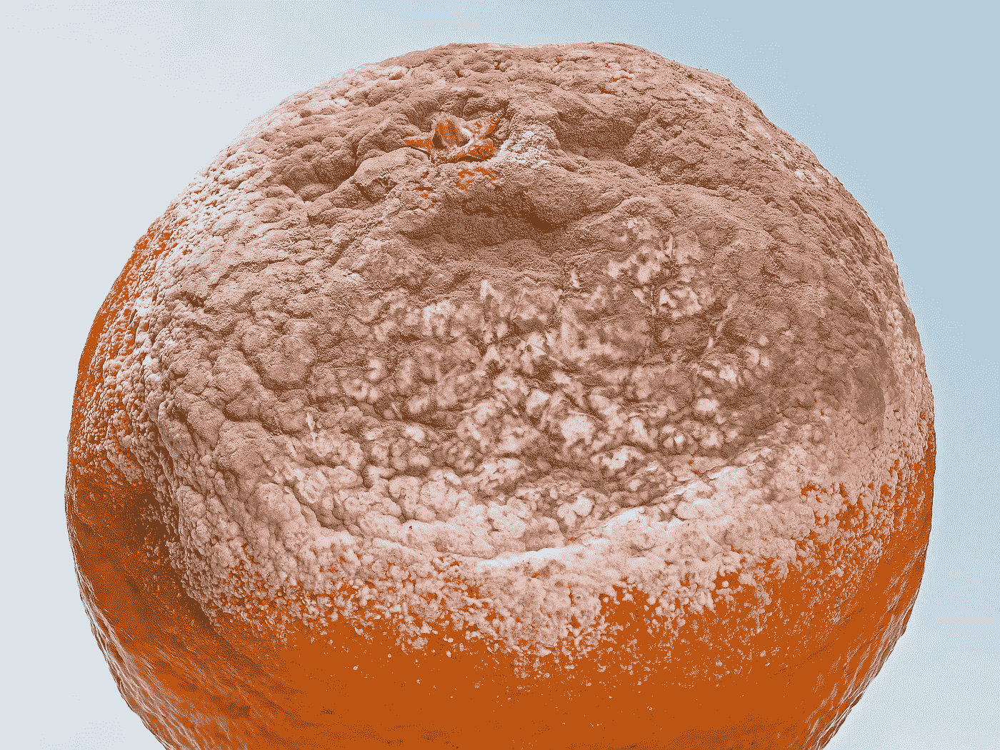
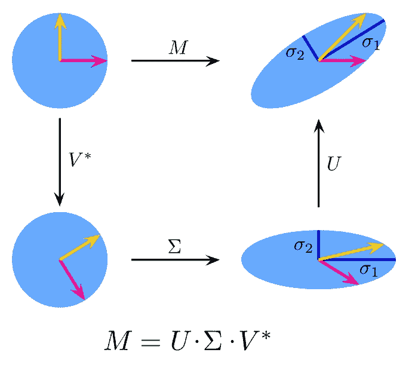

# 深入奇异值分解

> 原文：<https://towardsdatascience.com/deep-in-singular-value-decomposition-98cfd9532241?source=collection_archive---------23----------------------->

## 从头做起

## 数据科学中分解策略的概述，用代码解释。



(src =[https://pixabay.com/images/id-3926174/](https://pixabay.com/images/id-3926174/))(懂吗？分解？)

# 介绍

在数据科学领域工作时，我们经常会遇到计算机很难解释的特征。这通常是因为数据的维度太大，计算机无法估算。这可能会有问题，因为很难观察一个特征的数百个维度。这是人类的情况，当然也包括计算机。

幸运的是，这个问题有一个解决方案。在数据科学的世界中，为了使这些值更容易被统计、机器学习和分析策略所识别，使用所谓的分解是很常见的。在大多数情况下，程序员会使用一种叫做奇异值分解的分解策略。然而(SVD)，也有其他解决方案可以使用，如随机投影。在这两种解决方案中，SVD 使用得更广泛，因为随机投影需要点之间合适的维度空间，因此有时会在某些特征上出现问题。出于这个原因，本文将全部讨论 SVD 以及用 Python 从头开始编写 SVD。然而，如果你想学习更多关于随机投影的知识，以及它在数据科学中是如何运作的，我也有一篇文章可以让你阅读。

</random-projection-and-its-role-in-data-science-f253dd66485b>  

# 关于奇异值分解的更多信息

为了最小化特征的维数，SVD 无疑是数据科学家最常用的方法。这是因为 SVD 是我们所能使用的最通用、最古老的分解方法。SVD 是许多需要解释高维数据的模型的基础。如果不使用 SVD，我们就不太可能拥有自动驾驶汽车或图像识别，因为这些功能太多了，计算机无法在不利用分解的情况下真正读取，而分解通常会发生在 SVD 上。

为什么不用随机投影？答案实际上很简单，尽管随机投影在技术上更有效，并且应该在计算机上运行得更快，但是对于计算机来说，SVD 也很容易执行。考虑到这一点，大部分时间确实没有使用随机投影的好理由，使用随机投影的风险是数据的维度可能不够高维。这可能会导致严重的问题，因为您的要素会被分解，但并不代表原始数据。

# 求矩阵的奇异值分解



( [src =维基百科](https://en.wikipedia.org/wiki/Singular_value_decomposition#/media/File:Singular-Value-Decomposition.svg))

为了弄清楚矩阵的奇异值分解，我们必须首先弄清楚我们到底要计算什么。奇异值分解可以表示为，V^t.是一个对角矩阵。现在让我们看看如何得到 V 矩阵。

v 代表 X 转置 X 的特征向量集，当然我是数据科学家，所以我经常喜欢用代码思考。我们要写一个函数，用 Julia 编程语言来计算所有这些。

这个矩阵需要是正交的。不使用正交矩阵也可以做到这一点，但我们只是在函数中为此做了准备。在 Julia 中，我们可以使用基本模块 LinearAlgebra，以便使用 eigvecs()方法计算特征向量。我们可以用乘法运算符*将矩阵相乘。为了计算 SVD 的 V，我们将转置的 A 乘以 A，然后得到其特征向量。

```
using LinearAlgebra: eigvecsV = eigvecs(transpose(a) * a)
```

接下来，我们将计算 sigma。适马很简单，从原始矩阵中得到特征值，我们可以用线性代数中的八分函数来实现。得到这些特征值后，我们需要求它们的平方根。

```
using LinearAlgebra: eigvals
Σ = eigvals(a)
```

最后，我们需要找到我们的 U 矩阵。为此，我喜欢使用 reduce()方法，以及这个迭代循环的水平连接:

```
U = reduce(hcat,[W[:,i]/S[i] **for** i=1:size(W,2)])
```

现在我们有了三个矩阵，我们可以简单地把它们代入奇异值分解公式。在数学中，我们可以这样表示:

uσv^t

在朱丽亚，我们把它变成了

```
U .* Σ .* transpose(V)
```

# 结论

降维是数据科学家用来解释有太多属性需要观察的数据的基本策略。最流行的降维方法 SVD 的伟大之处在于，它遵循一些相对基本的线性代数概念，保持相对良好的性能，同时也非常有效。考虑到这一点，所有数据科学家可能都应该研究一下这种方法，它提供的关于数据的知识很可能会在数据科学工作中派上用场。降维的目标永远是标准形式，即数据或数学表达式的最简单版本。如果你想了解更多关于标准形式的内容，你可以在这里阅读我的另一篇文章:

</what-on-earth-is-canonical-form-23cef915601d>  

谢谢你看我的文章！我希望这是一篇信息丰富的文章，让读者更好地理解 SVD 及其在数据科学中的应用！