# 深度学习和迁移学习

> 原文：<https://towardsdatascience.com/deep-learning-and-transfer-learning-31c6394b10c5?source=collection_archive---------19----------------------->

## 使用 Keras 的迁移学习的各种实现

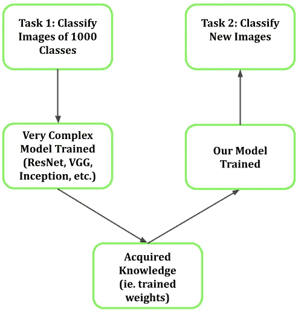

作者图片

对复杂的神经网络模型进行几天、几周甚至几个月的训练并不罕见。我们大多数人都无法获得成功训练这些模型所需的大量数据和计算资源。也就是说，有 OpenAI、脸书、谷歌、脸书等实体。他们拥有开发非常复杂、精确和通用模型的资源。更重要的是，他们愿意为我们这些凡人开源这些模型，用于我们自己的研究。将预先训练好的模型融入到自己的模型中的过程被命名为“迁移学习”。

# 涵盖的主题

在本教程中，我们将回顾使用 Keras 库的迁移学习的四种独特实现。我们将讨论如何实现一个预先训练好的模型。我们将讨论如何只选择预训练模型的特定部分用于我们自己的模型。我们将回顾如何将新的定制砝码加载到预训练模型中。最后，我们将展示如何对图像的形状进行上采样，以符合预训练模型的形状要求。

1.  使用整个(顶层除外)预训练模型进行迁移学习
2.  使用预训练模型的特定部分进行迁移学习
3.  通过将新权重加载到预训练模型中来转移学习
4.  通过对图像形状进行上采样来适应预训练模型的输入要求的迁移学习

# 数据

我们将利用两种图像分类模型，即谷歌的 Inception_V3 ( [链接](https://keras.io/api/applications/inceptionv3/))和微软的 ResNet-50 ( [链接](https://github.com/KaimingHe/deep-residual-networks))。两者都是高度复杂的卷积神经网络，通过 1000 个[类](https://gist.github.com/yrevar/942d3a0ac09ec9e5eb3a)对超过一百万张图像进行训练。我们将在使用 CIFAR-10 数据集的图像分类问题中使用这些模型。CIFAR-10 数据集由 10 个类别(飞机、汽车、鸟、猫、鹿、狗、青蛙、马、船和卡车)的 60，000 幅 32x32 彩色图像组成。有 50，000 幅图像用于训练，10，000 幅图像用于测试。总之，我们将使用迁移学习将 Inception_V3 和 ResNet-50 模型合并到我们自己的模型中，该模型将使用 CIFAR-10 数据集进行训练，以正确预测上面列出的 10 类图像。

## 概念上

迁移学习背后的基本概念可以用下图来解释。假设您试图创建一个多类图像分类模型(10 类:飞机、汽车、鸟、猫、鹿、狗、青蛙、马、船和卡车)。换句话说，你正在建立一个模型，它将尝试并正确地将一幅图像归类为上面列出的 10 个类别之一。开源的 Inception_V3 和 ResNet-50 模型是完整的图像分类模型，由 40 多个层组成，包括一系列卷积层、池化层、正则化层以及在顶部利用 softmax 激活函数的预测密集层。换句话说，您可以使用 Inception_V3 和 ResNet-50 模型，并且只能使用这些模型来对您的图像进行分类。这是因为它们在顶部都有一个完全连接的密集层，这将产生来自 softmax 激活函数的图像分类概率。

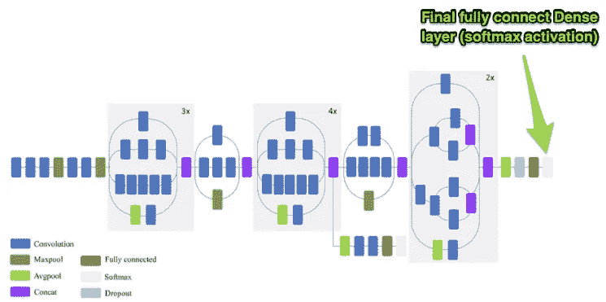

[https://www . researchgate . net/figure/Schematic-diagram-of-InceptionV3-model-compressed-view _ fig 6 _ 326421398](https://www.researchgate.net/figure/Schematic-diagram-of-InceptionV3-model-compressed-view_fig6_326421398)

也就是说，一般输入(即 Inception 和 ResNet 模型被训练的图像)和你的模型将被训练的图像可能是相似的(即动物的图像)与你试图解决的问题可能会有所不同。例如，不是试图分类 1000 个非常不同的图像(即飞机、汽车、鸟、猫等等)由于 Inception_V3 和 ResNet-50 被训练成这样，您可能会对分类各种狗品种感兴趣。在这种情况下，使用独立的 Inception 或 ResNet 模型对犬种进行分类可能会产生不良结果。我们要做的是利用这些复杂模型所学到的知识(即。不同类型图像之间的独特特征)并将该知识转移到我们试图分类的图像(即狗的品种)。下面是另一个传递知识的例子。

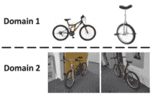

孙，b .，冯，j .，，萨恩科，K. (2016)。令人沮丧的简单领域适应的回归。《第三十届 AAAI 人工智能会议论文集》(AAAI-16)。从 http://arxiv.org/abs/1511.05547[取回](https://arxiv.org/abs/1511.05547)

迁移学习的过程包括从 Inception 或 ResNet 模型中移除原始的完全连接密集层。你基本上消除了模型的预测能力。接下来，您开始添加自己的自定义图层集，其中包括顶部完全连接的密集图层。通过遵循这一过程，您已经构建了一个模型，该模型包含了从 Inception 或 ResNet 模型中获取的大量一般图像分类知识，并且通过添加您自己的微调层来准确地对您自己的任务所需的图像进行分类。

此外，由我们来决定我们希望在模型中使用多少预训练模型。一般来说，在初始模型的早期部分中的卷积层将会学习非常一般化的特性(即垂直/水平线、全局形状等。)与识别非常具体的特征的后面的层相比较。后面的图层对模型没有见过的图像的概化程度较低。

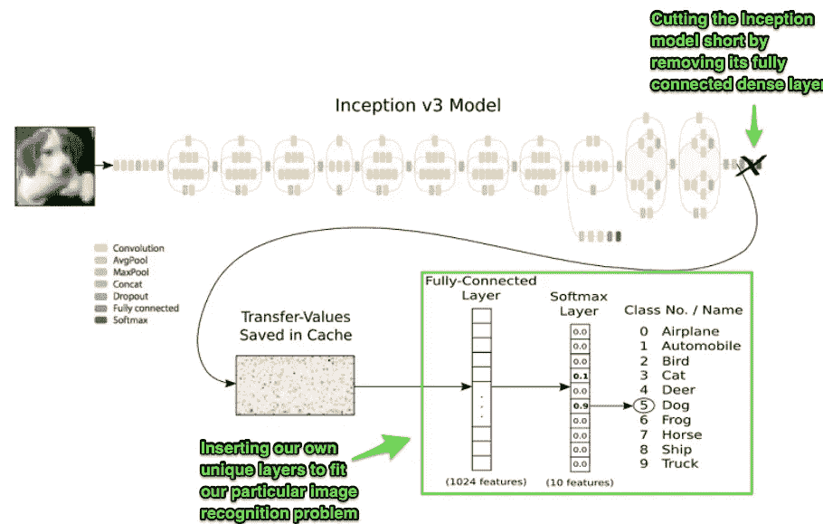

[https://www . Research gate . net/figure/Schematic-of-the-Inception-3-model-created-by-Google-Research-shlens 2016-and-modified _ fig 6 _ 321307161](https://www.researchgate.net/figure/Schematic-of-the-Inception-3-model-created-by-Google-Research-Shlens2016-and-modified_fig6_321307161)

# 说够了，我们来编码吧！

本教程的所有开发都是使用 Google Colab 的数据处理功能完成的。你当然可以在本地机器上运行这段代码，但是除非你有一个专用的 GPU，否则训练时间可能会相当长。

## 图像处理

让我们将所需的库和数据一起导入。如上所述，我们将使用 CIFAR-10 数据集，它由 10 个类别(飞机、汽车、鸟、猫、鹿、狗、青蛙、马、船和卡车)的 60，000 张 32x32 彩色图像组成。有 50，000 幅图像用于训练，10，000 幅图像用于测试。

```
import tensorflow as tf
import numpy as np
import pandas as pd
import matplotlib.pyplot as plt
from keras.utils.vis_utils import plot_model
from tensorflow.keras.utils import to_categorical
from keras.models import Model
from keras import backend as K
from tensorflow.keras.preprocessing.image import ImageDataGenerator
from keras.optimizers import Adam
from tensorflow.keras.applications.inception_v3 import InceptionV3
from tensorflow.keras.applications.resnet50 import ResNet50%matplotlib inlinedata = tf.keras.datasets.cifar10
(train_images, train_labels), (test_images, test_labels) = data.load_data()print(train_images.shape, train_labels.shape, test_images.shape, test_labels.shape)
```

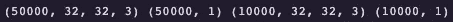

50，000 个训练图像，每个 32x32 乘 3 个通道(彩色)/ 50，000 个训练标签 0–9 个类别

正如你所想象的，32x32 的图像将会非常像素化，但我们仍然可以分辨出图像的一般类别。

```
fig, ax = plt.subplots(1, 5)
fig.set_size_inches(16, 6)for i in range(5):
  img = train_images[i]
  ax[i].imshow(img)
  plt.show()classes = ['airplane', 'automobile', 'bird', 'cat', 'deer', 'dog', 'frog', 'horse', 'ship', 'truck']print('Image Classes:' + str([x[0] for x in train_labels[0:5]]))print('Image Labels: ' + str([classes[x[0]] for x in train_labels[0:5]]))
```

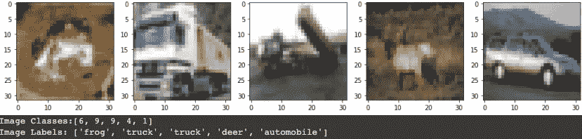

作者图片

# 快速图像处理

## 缩放像素值和一次性编码标签

因为我们的图像是彩色的，所以三个通道(红、蓝、绿)的训练像素值在 0-255 之间。通常的做法是将值缩放 1.0/255 倍，以在 0 和 1 之间转换像素值。此外，我们的类标签已经进行了标签编码(0–9 ),这引入了类之间的自然顺序(即 1 大于 0，2 大于 1…).由于我们有一个分类问题，我们需要消除这些潜在的混淆关系。我们将应用一键编码，将类标签转换成二进制数组。

```
train_images = train_images / 255.0test_images = test_images / 255.0train_labels = to_categorical(train_labels)test_labels = to_categorical(test_labels)
```

# 1.使用整个(顶层除外)预训练模型进行迁移学习

可以想象，根据您的特定需求，迁移学习有多种实现方式。第一种技术包括加载一个预先训练的模型，使用其权重作为模型中的第一个连续层，并添加您自己的自定义层(即。通常称为“微调”的过程)来对 CIFAR-10 图像进行分类。

首先，我们需要实例化预训练的 ResNet-50 模型。将“include_top”参数设置为“False”实质上将删除最后一个(即 top)全连通预测(softmax)密集层。由于这将是我们的模型中的第一层，我们将 input_shape 设置为(32，32，3)，这是我们的 CIFAR-10 图像的形状(即。32x32 像素和 3 个彩色通道(RBG)。

```
K.clear_session()
base_model = ResNet50(include_top=False, weights='imagenet', input_shape=(32, 32, 3), classes=train_labels.shape[1])
```

由于迁移学习的全部目的是使用预先训练好的模型的知识(即。预训练权重)在我们的模型中，我们将“可训练”参数设置为假。这样，我们就不会根据自己的数据重新训练 ResNet-50。我们还可以仔细检查每一层是否冻结。

```
base_model.trainable = False
for layer in base_model.layers:
   print(layer, layer.trainable)
```

最后，我们将构建模型。“预训练模型”变量将包含来自 ResNet-50 的冻结重量。这些权重将被输入到 Flatten 层，这恰好是我们在预训练 ResNet 层之后添加的第一个自定义或微调层。然后，我们继续添加额外的层，密集 1 和密集 2，接着是我们的全连接层，这将使用 softmax 激活功能进行 10 级分类。

```
pre_trained_model = base_model.output flat = tf.keras.layers.Flatten()(pre_trained_model)dense1 = tf.keras.layers.Dense(1024, activation='relu')(flat)dense2 = tf.keras.layers.Dense(512, activation='relu')(dense1)predictions = tf.keras.layers.Dense(10, activation='softmax')(dense2)
```

最后，我们通过传递 base_model 输入(即预训练权重)转换为输入参数，并将我们的预测转换为输出参数。最后，我们编译模型，为训练做好准备。请注意“总参数”和“可训练参数”之间的区别。我们模型中的大多数参数属于 ResNet 层，如果您还记得的话，该层是冻结的。

```
model = Model(inputs = base_model.input, outputs = predictions, name="cifar10_model")model.compile(optimizer=Adam(learning_rate=0.0001), loss='categorical_crossentropy', metrics=['accuracy']) model.summary()
```

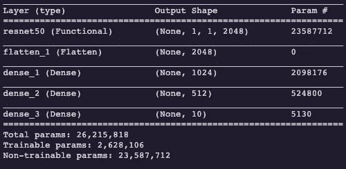

这是建立这个模型的另一种方法。

```
K.clear_session()base_model = ResNet50(include_top=False, weights='imagenet', input_shape=(32, 32, 3), classes=train_labels.shape[1])base_model.trainable = Falsemodel = tf.keras.Sequential([
base_model, tf.keras.layers.Flatten(), 
tf.keras.layers.Dense(1024, activation='relu'), tf.keras.layers.Dense(512, activation='relu'), tf.keras.layers.Dense(10, activation='softmax')])
```

# 2.使用预训练模型的特定部分进行迁移学习

如前所述，当构建卷积网络时，早期的卷积层学习非常一般化的特征(即垂直/水平线、全局形状等。)而后面的卷积层学习非常具体的特征。后面的图层对模型没有见过的图像的概化程度较低。因此，有时最好只使用预训练模型的前几个卷积层，然后添加您自己的微调层，以了解特定于您的训练图像的特征。

首先，我们将再次实例化 ResNet-50 模型，然后我们将打印它的摘要，以确定我们到底要在哪里进行切割。你决定削减预训练模型将需要一些试验和错误。请记住，模型摘要很可能会非常大。

```
K.clear_session()base_model = ResNet50(include_top=False, weights='imagenet', input_shape=(32, 32, 3), classes=train_labels.shape[1])base_model.summary()
```

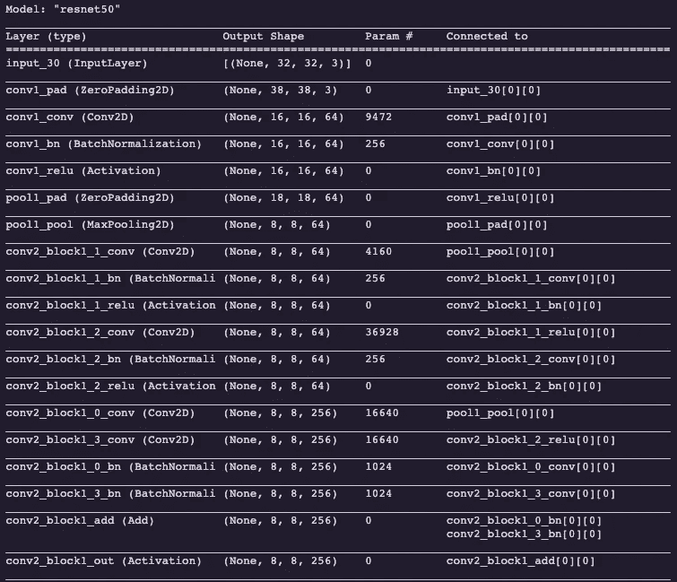

让我们在名为“conv3_block1_3_conv”的图层上进行剪切。注意，我们使用 get_layer()函数获取特定的层，并将其输出设置为 last_output 变量。Last_output 成为我们的微调模型中的第一层，它的输出被传递到展平层。

```
K.clear_session()base_model = ResNet50(include_top=False, weights='imagenet', input_shape=(32, 32, 3), classes=train_labels.shape[1])base_model.trainable = Falselast_layer = base_model.get_layer('conv3_block1_3_conv')last_output = last_layer.outputflat = tf.keras.layers.Flatten()(last_output)dense1 = tf.keras.layers.Dense(1024, activation='relu')(flat)dense2 = tf.keras.layers.Dense(512, activation='relu')(dense1)predictions = tf.keras.layers.Dense(10, activation='softmax')(dense2)model = Model(inputs = base_model.input, outputs = predictions, name="cifar10_model")model.compile(optimizer=Adam(learning_rate=0.01), loss='categorical_crossentropy', metrics=['accuracy']) 
```

# 3.通过将新权重加载到预训练模型中来转移学习

有时，您会希望解冻预训练传输模型中的某些层(即 ResNet 或 Inception)来使用您的训练图像重新训练那些“未冻结”的层。如果您曾经想要将这个新版本的微调模型与一些重新训练的 ResNet 或 Inception 层一起重用，那么您需要在将来将这些权重上传到模型中。在本节中，我们将讨论如何将存储在“h5”文件中的自定义权重加载到预训练模型的架构中。

首先，您需要获得特定于模型架构的权重。这些可以作为模型的更新权重或从您自己的自定义再训练中保存的权重来获得。在本例中，我们将从 github 帐户下载权重。请记住，这些重量不拥有顶部(即。预测)层。注意文件标签中的“notop.h5”。

您需要再次实例化预训练模型，但这次将“权重”参数设置为 **None** 。接下来，我们使用 load_weights()函数加载保存的权重。确保将“by_name”参数设置为 **True** ，因为这将根据每个层的名称加载权重。请记住，此程序仅加载预训练模型的权重(即《盗梦空间》、《雷斯网》、《VGG》等。)它不会加载整个微调模型的权重。

```
K.clear_session()
!wget --no-check-certificate \https://github.com/fchollet/deep-learning-models/releases/download/v0.2/resnet50_weights_tf_dim_ordering_tf_kernels_notop.h5 \-O /tmp/resnet_50_weights_tf_dim_ordering_tf_kernels_notop.h5local_weights_file = '/tmp/resnet_50_weights_tf_dim_ordering_tf_kernels_notop.h5'base_model = ResNet50(weights=None, input_shape=(32, 32, 3), include_top=False, classes=train_labels.shape[1])base_model.load_weights(local_weights_file, by_name=True)
```

最后，我们照常构建我们的模型。我们再次将“可训练”参数设置为 False，因为我们不想重新训练刚刚加载的新重量。

```
base_model.trainable = Falsepre_trained_model = base_model.output flat = tf.keras.layers.Flatten()(pre_trained_model)dense1 = tf.keras.layers.Dense(1024, activation='relu')(flat)dense2 = tf.keras.layers.Dense(512, activation='relu')(dense1)predictions = tf.keras.layers.Dense(10, activation='softmax')(dense2)model = Model(inputs = base_model.input, outputs = predictions, name="cifar10_model")model.compile(optimizer=Adam(learning_rate=0.01), loss='categorical_crossentropy', metrics=['accuracy']) 
```

# 4.通过对图像形状进行上采样以适应预训练模型的输入要求的迁移学习

有些模型要求您在传递数据之前调整数据的输入大小。例如，如果您使用我们上面讨论的第一种迁移学习方法，但是这次使用 Inception_V3 模型，您将会看到下面的错误。这是因为 CIFAR-10 图像的形状为 32x32x3，而 Inception_V3 模型要求图像至少为 75x75，而不考虑通道的数量。另一方面，ResNet 有一个最佳形状，但它不要求您的输入形状是一个特定的大小。

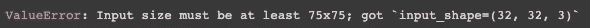

为了遵守这些形状要求，我们需要将图像“上采样”到适当的形状。有各种各样的技术用于执行这个操作，但是 Keras 有一个“Upsamplign2D”类，它只是将像素复制到指定的形状。在下面的例子中，原始图像中的每个像素被复制 3 次。

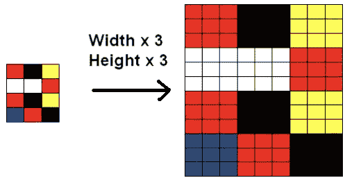

2016 马修·吉亚萨<matthew></matthew>

为了超过像素形状的要求，我们需要将像素放大两倍。我们再次实例化我们的 base_model，这次使用 Inception_V3。请注意，input_shape 为(128，128，3)。我们也将冻结所有的层。现在，我们开始构建我们的顺序模型，第一层是“输入层”，它只是作为数据的入口点。我们将 input_shape 指定为(32，32，3)，这与我们的 CIFAR-10 图像的形状相匹配。接下来，我们需要对图像进行两次上采样(即 32x2=64，64x2=128)。如果我们仅向上采样一次，我们的图像将具有(64，64，3)的形状，这仍然不满足(75x75)的要求。通过两次上采样，我们的图像现在是(128，128，3)，注意这是我们如何获得基本模型的输入形状的。

```
K.clear_session()base_model = InceptionV3(include_top=False, weights='imagenet',  input_shape=(128, 128, 3), classes=train_labels.shape[1])base_model.trainable = Falseinputs = tf.keras.layers.Input(shape=(32, 32, 3)) upsamp1 = tf.keras.layers.UpSampling2D((2,2))(inputs)upsamp2 = tf.keras.layers.UpSampling2D((2,2))(upsamp1)pre_trained_model = base_model(upsamp2) flat = tf.keras.layers.Flatten()(pre_trained_model)dense1 = tf.keras.layers.Dense(1024, activation='relu')(flat)dense2 = tf.keras.layers.Dense(512, activation='relu')(dense1)drop1 = tf.keras.layers.Dropout(0.3)(dense2)dense3 = tf.keras.layers.Dense(128, activation='relu')(drop1)predictions = tf.keras.layers.Dense(10, activation='softmax')(dense3)model = Model(inputs = inputs, outputs = predictions)model.compile(optimizer=Adam(learning_rate=0.0001), loss='categorical_crossentropy', metrics=['accuracy'])
```

另一种写代码的方式。

```
K.clear_session()base_model = tf.keras.applications.InceptionV3(include_top=False, weights='imagenet', input_shape=(128, 128, 3), classes=train_labels.shape[1])base_model.trainable = Falsemodel = tf.keras.Sequential([
tf.keras.layers.InputLayer(input_shape=(32, 32, 3)),
tf.keras.layers.UpSampling2D(size = (2,2)),
tf.keras.layers.UpSampling2D(size = (2,2)),
base_model,
tf.keras.layers.Flatten(),
tf.keras.layers.Dense(1024, activation='relu'),
tf.keras.layers.Dense(512, activation='relu'),
tf.keras.layers.Dropout(0.3),
tf.keras.layers.Dense(128, activation='relu'),
tf.keras.layers.Dense(10, activation='softmax')])model.compile(optimizer=Adam(learning_rate=0.0001), loss='categorical_crossentropy', metrics=['accuracy'])
```

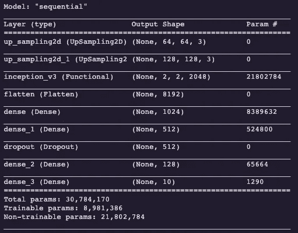

# 结论

迁移学习的出现已经成为人工智能在我们今天看到的许多行业中成功实施的关键驱动因素。随着我们的深度学习模型以指数级增长，变得更加复杂，渴望不断扩展的数据量，这种模型所需的计算资源也在增加。迁移学习提供了人工智能社区来利用(即 stack)这些复杂的模型，而不需要拥有大量金融资源的实体所积累的计算资源。

感谢您的时间，我欢迎任何反馈。

这里有一个 github，它是迁移学习环境中经常使用的各种开源模型([链接](https://github.com/BVLC/caffe/wiki/Model-Zoo))。