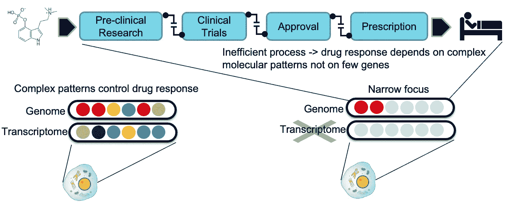
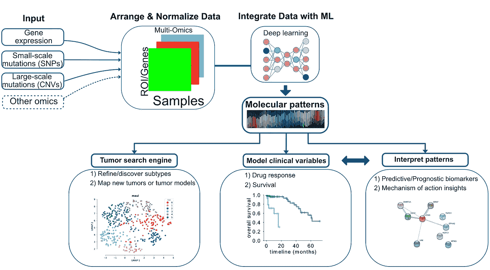
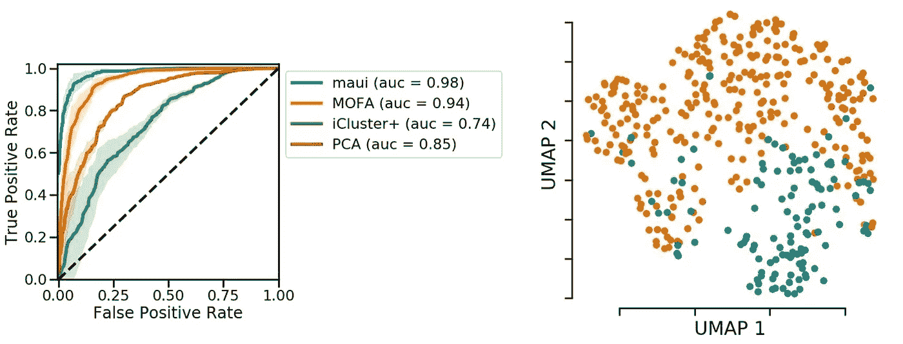
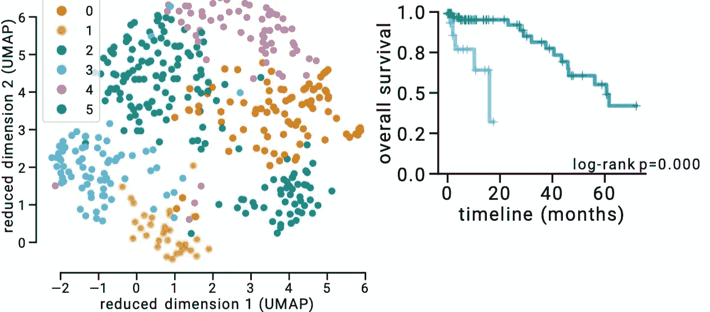
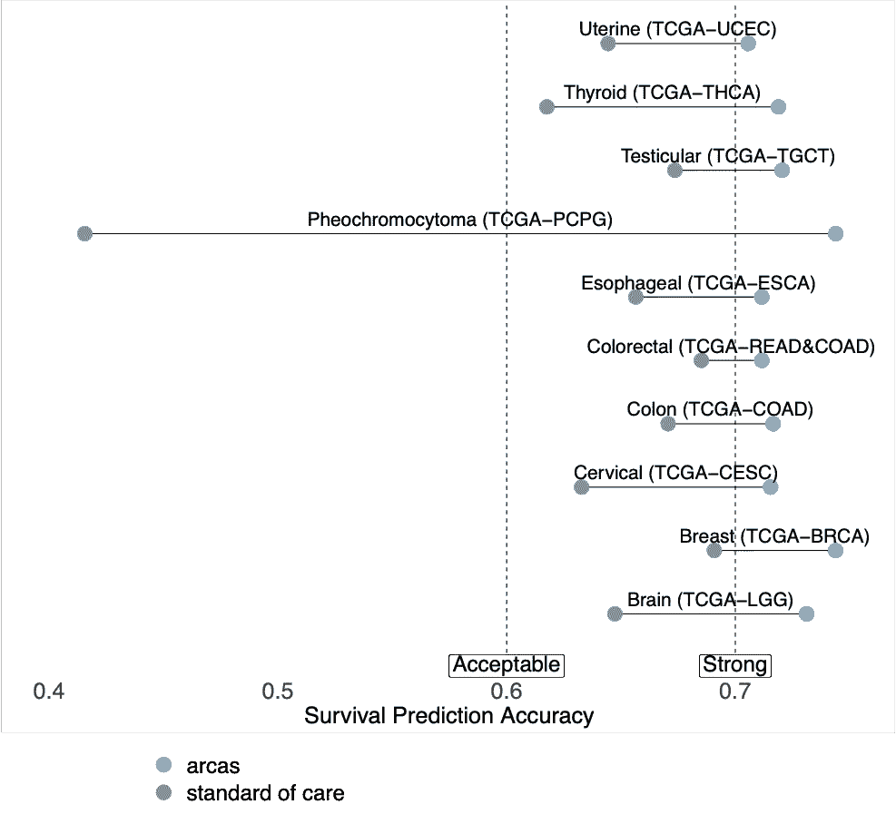

# 基于深度学习的癌症患者分层

> 原文：<https://towardsdatascience.com/deep-learning-based-cancer-patient-stratification-a12f4e2615f2?source=collection_archive---------21----------------------->

[国家癌症研究所](https://unsplash.com/@nci?utm_source=medium&utm_medium=referral)在 [Unsplash](https://unsplash.com?utm_source=medium&utm_medium=referral) 上拍摄的照片

癌症是一个重大的公共卫生和经济问题，其负担日益加重。仅在美国，它就占了 900 亿美元的直接医疗费用。开发一种抗癌药物要花费 27 亿美元。每年大约有 950 万人死于癌症。这比世界上一些大城市的人口还要多。我们的 [Arcas 项目](http://arcas.ai)旨在通过在几十年的基因组技术基础上采用最先进的数据整合和分析方法来改善这种情况。

# 为什么癌症负担这么高？

开发药物并将其提供给患者是一个漫长而耗时的过程。首先，一种需要到达患者体内的化合物，必须经过临床前研究和临床试验的不同阶段。接下来是批准程序，最后医生必须开处方，并相信这可以帮助病人。有时这类药物需要在指南中列出才能被开出——即使它们被批准了。可以肯定地说，这个过程的每一步都存在许多低效之处。

**图 1** :药物研发流程和基因组学数据的使用。作者图片

效率低下最常见或最具影响力的原因是在流程链的不同部分采用了过于简单和狭隘的方法。这里有一个例子:我们说癌症是一种基因组疾病，然而，癌症患者很少得到他们的基因组测序和解释。当他们这样做时，只有几百个基因被测序。信息，如影像学和组织病理学分期等。是有用的，但是提供了疾病的有限图像。因此，如果你不考虑整个基因组，很多信息就会丢失。这是治疗决策的情况，也是药物开发的情况。

现在很清楚，对治疗的反应，特别是对靶向药物的反应，强烈依赖于肿瘤的遗传、表观遗传、转录组构成以及肿瘤微环境(例如: [WINTHER 试验](https://www.nature.com/articles/s41591-019-0424-4))。所有这些在不同的癌症之间有很大的不同，甚至来自同一组织。因此，必须根据癌症的基因型/表观基因型/转录组来评估药物反应。此外，许多药物之所以会失败，仅仅是因为它们只对一部分癌症有效，而这一点在试验时并没有得到最初的认识。

> 许多药物之所以会失败，仅仅是因为它们只对一部分癌症有效，而这一点在试验时没有得到最初的认识

# 用于临床变量建模的多组学模式

消除这些问题的一个方法是接受临床变量，如药物反应，是由基因组/转录组/表观基因组模式驱动的，而不仅仅是由单个基因的突变驱动的。一旦我们接受了这一点，我们就必须有有效的方法来分析来自癌症活检或肿瘤模型的多水平数据集，如多组学。多组学数据的有效整合将为临床变量建模提供无假设或假设稀疏、数据驱动和整合的方法。

> “一种无假设或假设稀疏、数据驱动和集成的临床变量建模方法。”

**图 2** :癌症组学的数据整合可以提供预测临床变量的分子模式。作者图片

在 Arcas，我们开发了这样的[框架，它使用深度学习来整合任何类型的组学数据](http://arcas.ai/solutions)，并发现分子模式，或所谓的潜在因素。潜在因素可用于 **1)聚类/亚型检测或绘制疾病模型和原发肿瘤——类似于生物搜索引擎**。想象一下，你可以为你的疾病模型输入多组学数据，我们可以告诉你这些模型最能代表哪些原发性癌症。此外， **2)我们可以对生存和药物反应等变量进行建模。此外，3)我们还可以解释潜在的因素，并了解它们对应于哪些分子机制或途径**。

# 使用深度学习进行患者分层

分子模式或潜在因素可以根据预后或对药物的反应或任何其他临床变量对患者进行分层。我们已经将部分 Arcas 技术应用于结肠直肠癌。结肠直肠癌主要使用基因表达谱定义了四种亚型。这些亚型被称为共有分子亚型或 CMS。该联盟定义了四种亚型，它们具有不同的分子特征，在某种程度上与存活率相关，然而 19%的患者不能被归入特定的亚型。

## 我们能用潜在因素预测亚型吗？

如果这些分子模式，即潜在因素，包含相关信息，我们应该能够从中预测 CMS。这里我们看到的是一个接收器工作特性曲线，或 ROC 曲线，它显示了一个分类器有多好。在我们的病例中，ROC 曲线显示潜在因素能够预测 CMS 亚型。我们比较了我们的方法与其他方法，也产生潜在的因素或相关的主成分。在所有情况下，我们的预测精度更高。在图 3 的右侧，我们根据 CMS 状态对潜在因素的 2D 投影进行了颜色编码。每个点是原发性肿瘤，由 CMS 状态着色。你可以看到颜色的分离，这意味着有关于 CMS 状态的潜在因素的信息。

**图 3** :利用深度学习获得的潜在因子预测亚型更加准确。左，与其他工具相比的准确性。右，通过减少 2D 的潜在因素来表现结肠直肠肿瘤。从作者的公开出版物【https://pubmed.ncbi.nlm.nih.gov/31792061/. 获得的情节

## 细化子类型

我们可以使用这项技术进一步细化子类型。您可能已经注意到，在图 3 中，有比基于 CMS 的颜色更多的聚类。如果我们应用聚类算法，我们可以找到六个聚类。最大的区别是我们把 CMS2 分成两个集群。从生存的角度来说，这其实很有道理。在图 4 中，我们展示了这两个新集群的生存曲线，它们非常不同。因此，将 CMS2 分成两个亚型是合理的。

**图 4** :结直肠癌细化亚型。绿点和蓝点代表 CMS2 亚型，然而根据这两个组的不同生存特征，根据潜在因素聚类的建议将该亚型分成 2 个亚型更有意义。从作者的公开出版物[https://pubmed.ncbi.nlm.nih.gov/31792061/](https://pubmed.ncbi.nlm.nih.gov/31792061/)获得的情节

## 对其他癌症也有效

我们应该强调的一点是，这种方法并不局限于特定的癌症类型。它适用于任何具有多组学信息的数据集，包括肿瘤模型，如细胞系、PDX 或类器官。事实上，你可以用我们的方法整合细胞系、PDX 和原发肿瘤——这在正常情况下是很难做到的。

**图 5** : Arcas 平台比使用临床特征改善了生存预测。作者图片

我们已经在至少有 100 个样本的癌症基因组图谱数据集上运行了这个，在图 5 中，我们显示了我们改善了多少 C 指数。c 指数是生存预测准确性的一个衡量标准。我们展示了当我们试图仅通过使用临床变量，如年龄、性别和肿瘤分期来预测生存率时会发生什么——与临床变量+潜在因素进行比较。正如你所看到的，在许多癌症中，当使用潜在因素时，我们将这个准确性指标推向了一个更高的水平。

## 结论

随着测序价格的下降，构建和运行我们的模型所需的数据变得越来越容易生成。在不久的将来，液体活检和活检将通过多组学方法进行常规分析。整合和理解这些数据集是改进药物开发和诊断过程的关键。我们的 Arcas 平台从肿瘤活检或疾病模型的多组学数据集提供可操作的见解。

【https://arcas.ai/blog/】本文原载于<https://arcas.ai/blog/>