# 用于 3D 合成的深度学习

> 原文：<https://towardsdatascience.com/deep-learning-for-3d-synthesis-2dd57e2001f?source=collection_archive---------3----------------------->

## 人工智能的现状

## 变压器与卷积深度网络用于合成 3D 数据

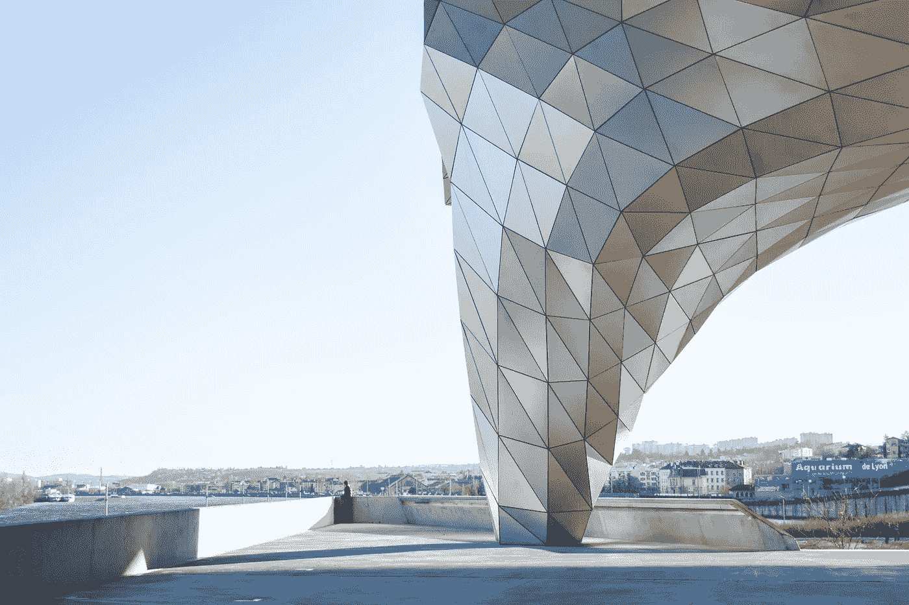

照片由[迪奥戈·努内斯](https://unsplash.com/@dialex?utm_source=unsplash&utm_medium=referral&utm_content=creditCopyText)在 [Unsplash](https://unsplash.com/s/photos/mesh?utm_source=unsplash&utm_medium=referral&utm_content=creditCopyText) 拍摄

## 3D 数据简介

人们一致认为，从单一视角合成 3D 数据是人类视觉的一项基本功能，这对计算机视觉算法来说极具挑战性。但是，随着激光雷达、RGB-D 相机(RealSense、Kinect)和 3D 扫描仪等 3D 传感器的可用性和可负担性的提高，3D 采集技术的最新进展取得了巨大的飞跃。与广泛可用的 2D 数据不同，3D 数据具有丰富的比例和几何信息，从而为机器更好地理解环境提供了机会。然而，与 2D 数据相比，3D 数据的可用性相对较低，且采集成本较高。因此，最近已经提出了许多深度学习方法来从可用的 2D 数据合成 3D 数据，而不依赖于任何 3D 传感器。但是在我们深入研究这些方法之前，我们应该理解处理 3D 数据的格式。

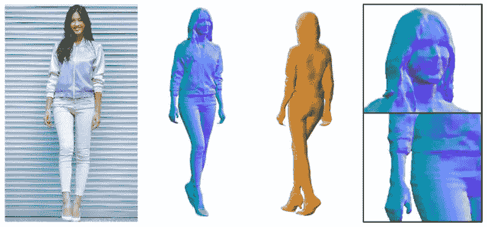

[来自 2D 输入的 3D 合成](https://shunsukesaito.github.io/PIFuHD/)

基于数据的最终用途，合成的三维数据可以用不同的格式表示。一些常用的格式有:

1.  深度图像
2.  点云
3.  体素
4.  网状物

**深度图像**包含一个场景的深度值，其形式为图像帧中每个像素与相机的距离(米)。这种来自场景的深度信息对于许多任务都具有巨大的价值，如自动驾驶汽车、增强现实、机器人等。这种信息对于像在相机扫描静止场景和虚拟相机中的动画时启用运动视差这样的任务非常有用，但是当强调场景中的特定对象用于 3D 建模时，这种信息在现有技术中变得不充分和不准确

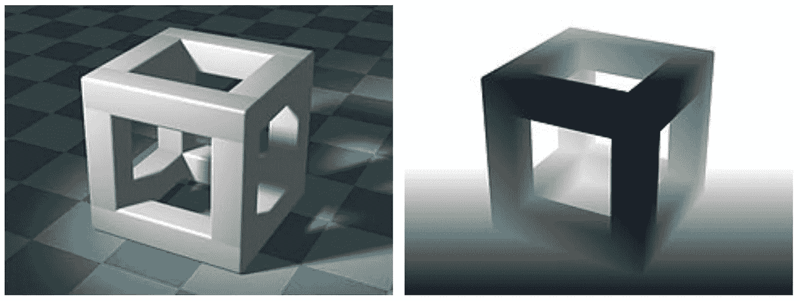

[深度图像](https://bair.berkeley.edu/blog/2018/10/23/depth-sensing/)

****点云**是分布在三维空间中的三维点的集合。这些 3D 点中的每一个都具有由某个(x，y，z)坐标以及其他属性(如 RGB 颜色值)表示的确定性位置。与深度图像不同，点云表示保留了更多高质量的三维空间几何信息，无需任何离散化。然而，点云表示在点之间没有局部连接，从而导致非常大的自由度和高维数，这使得精确合成更加困难。**

**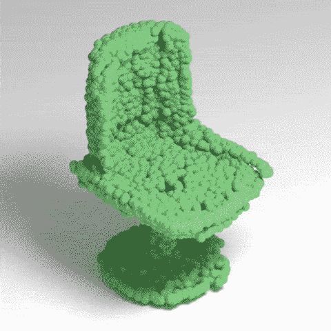**

**[点云表示](http://mgadelha.me/mrt/)**

****体素**或体积像素是空间网格像素到体积网格体素的直接延伸。简单来说，体素就是三维空间中的一个像素。每个体素的相对位置一起定义了体积数据的独特结构。一个体素可以看作是一个固定大小的量化点云。然而，对于 3D 建模，体素表示太稀疏，并且显示出细节和计算资源之间的折衷，这使得其更不可行。**

**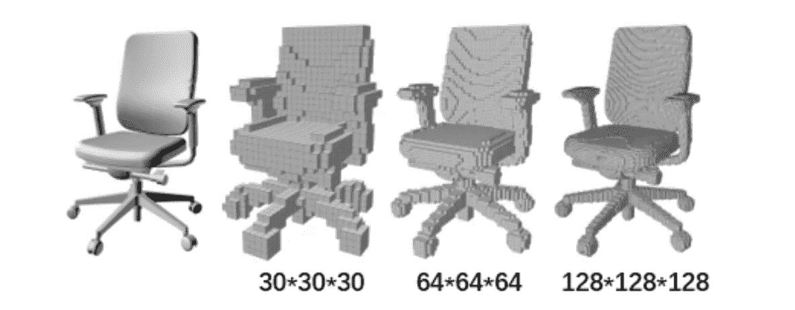**

**[体素表示](https://www.researchgate.net/figure/Three-expressions-of-3D-data-a-Multi-view-b-point-cloud-and-c-voxels_fig2_338614048)**

****多边形网格**是边、顶点和面的集合，它们共同定义了多面体对象的形状和体积。网格的凸多边形面连接在一起，近似于一个几何曲面。与体素类似，网格也可以看作是从一组连续曲面上采样得到的三维点云集合(复杂度相对较低)。网格面可以是三角形(三角形网格)、四边形(四边形网格)或凸多边形(n 边形网格)。接近更真实的表示，网格也可以由带孔的多边形或凹多边形组成，这取决于表示的通用性。然而，与体素和点云不同，体素和点云会丢失重要的表面细节，且对于重建表面模型来说不是微不足道的，网格对于许多实际应用来说是更理想的。因此，考虑到以上几点，与其他格式相比，多边形网格似乎更真实，也是合成的更好的表示。**

**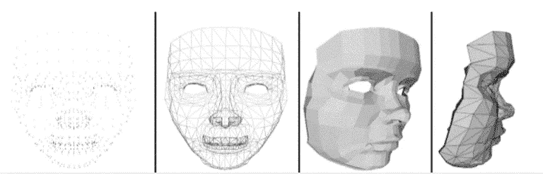**

**[多边形网格表示](https://www.researchgate.net/figure/a-3D-face-vertices-b-3D-polygonal-lines-forming-the-face-c-a-lowpoly-3D-face-model_fig1_308842167)**

**在这篇博客中，我们将讨论三种可用于从 2D 数据合成 3D 数据的方法。在这三种方法中，一种方法基于基于变换器的架构，而另外两种方法分别基于自动编码器和基于图的卷积神经网络。这两种方法之间的关键区别在于，与后者不同，基于变压器的深度网络完全依赖于注意机制来绘制输入和输出之间的全局依赖关系。**

# **卷积神经网络**

**在本节中，我们将讨论最近提出的两种方法，它们使用自动编码器和基于图形的卷积神经网络来合成 3D 数据。**

## **基于自动编码器的卷积神经网络**

**为了理解这种方法，我们将以使用自动编码器网络的 3D 人脸重建和人脸对齐为例。**

****

**[人脸重建和人脸对齐](https://github.com/YadiraF/PRNet)**

**自动编码器使用卷积网络来将输入 2D 图像的维度降低到潜在空间，然后使用该潜在空间表示来重建原始 3D 数据格式。许多研究已经使用自动编码器(基于编码器-解码器的架构)来估计 3D 面部可变形模型系数和模型扭曲函数。这些研究的目的主要是使用这些 3D 模型扭曲函数从单个 RGB 图像恢复相应的 3D 形状，从而同时提供密集的 3D 人脸对齐和重建输出。然而，这种方法的性能受到由人脸模型模板定义的 3D 表示空间的限制。类似地，体积回归网络(VRN) [1]等方法使用全卷积层架构来估计三维二进制体积，作为点云的离散化版本。然而，大多数输出点对应于浪费的非表面点，并且这种离散化也限制了输出表示的分辨率。因此，要讨论的更好的研究将是类似位置图回归网络(PRN)[2]的网络，该网络使用 [*UV 位置和纹理图来联合预测密集对齐并重建 3D 人脸形状。*](https://en.wikipedia.org/wiki/UV_mapping)**

**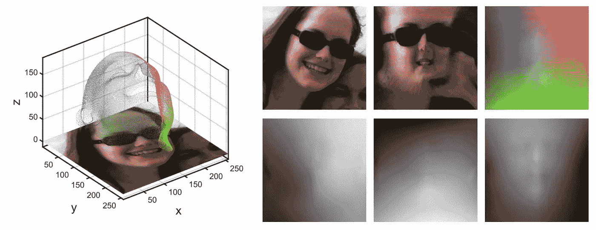**

**[UV 位置和纹理贴图的图解](https://openaccess.thecvf.com/content_ECCV_2018/papers/Yao_Feng_Joint_3D_Face_ECCV_2018_paper.pdf)**

**PRN 以 UV 位置图的形式构建了 3D 面部结构的 2D 表示。UV 位置是记录面部点云的 3D 面部坐标的 2D 图像。该地图还在表示中的每个位置附加 3D 坐标的语义特征。简而言之，UV 贴图是 3D 数据的 2D 表示，它记录了 UV 空间中所有点的 3D 坐标。在计算机图形领域，研究人员经常使用 UV 空间和 UV 位置图来将 3D 空间参数化为 2D 图像平面。转到 PRN 的网络架构，网络采用输入 RGB 图像，并使用简单的编码器-解码器结构(自动编码器)将 2D 图像信息传输到 UV 位置图。自动编码器通过使用 10 个下采样残差块和 17 个上采样转置卷积块来拟合该传递函数，以最终预测 256×256×3 的 UV 位置图。学习的 UV 位置图有助于直接回归要合成的 3D 面部的最终 3D 结构和语义特征。对于像 PRN 这样的训练网络，我们只需要像 2D 图像到 3D 点云映射这样的数据集，这使得这种方法更有用，因为网络的输出格式不受特定 3D 模板或 3D 变形模型线性空间的限制。**

**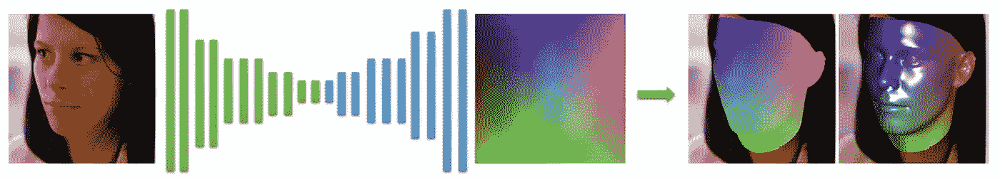**

**[PRN 建筑](https://openaccess.thecvf.com/content_ECCV_2018/papers/Yao_Feng_Joint_3D_Face_ECCV_2018_paper.pdf)**

**因此，考虑到该方法的简单性和有效性，PRN 似乎是从 2D 影像合成 3D 数据用于网络输出格式的最佳选择之一。**

## **基于图的卷积神经网络**

**如前一节所述，大多数传统的基于自动编码器的深度学习方法利用点云和体素数据格式来合成 3D 数据。特别强调这两种数据格式的主要原因是流行的基于网格的网络架构所施加的限制。然而，点云和体素表示有其自身的缺点，如第一部分所述。因此，为了避免体素或点云表示的缺点，许多研究已经转向合成 3D 多边形网格数据，从应用的角度来看，这是更理想的格式。一些在合成网格数据方面非常有效的最佳架构设计方法包括基于图形的卷积神经网络。在本节中，我们将以王等人提出的方法为例。al [3] (Pixel2Mesh)。**

**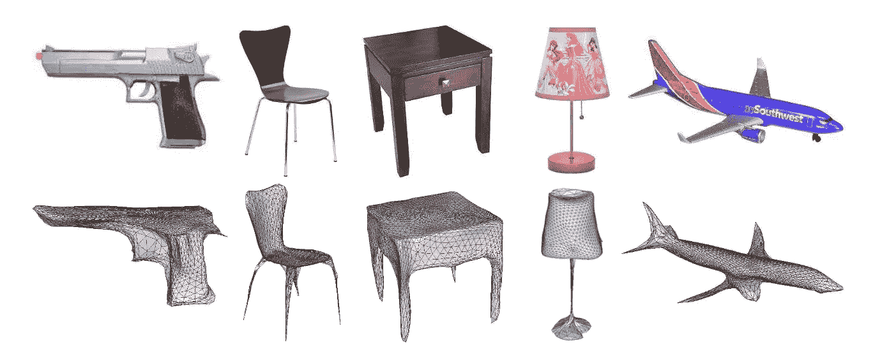**

**[使用 Pixel2Mesh 重建真实世界图像](https://openaccess.thecvf.com/content_ECCV_2018/papers/Nanyang_Wang_Pixel2Mesh_Generating_3D_ECCV_2018_paper.pdf)**

**Pixel2Mesh 是一个基于图形的端到端深度学习框架，它以单个 RGB 彩色图像作为输入，并将 2D 图像以更理想的相机坐标格式转换为 3D 网格模型。基于图形的卷积神经网络提取并利用 2D 图像中的感知特征，通过逐渐变形椭圆体直到其达到语义正确和优化的几何形状来产生 3D 网格。所采用的策略是一种由粗到细的方法，使得椭球体变形过程在几何上平滑和稳定。作者还定义了各种网格相关的损失函数，帮助网络捕捉更多的属性，以保证物理和视觉上吸引人的 3D 几何结果。**

**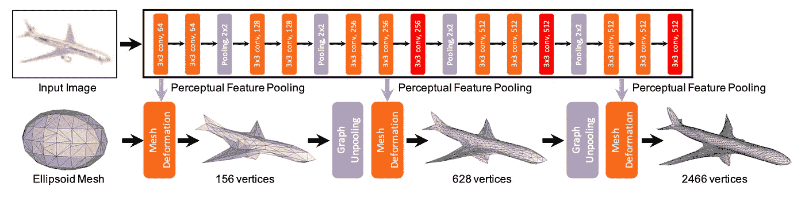**

**[图像特征网络和级联网格变形网络](https://openaccess.thecvf.com/content_ECCV_2018/papers/Nanyang_Wang_Pixel2Mesh_Generating_3D_ECCV_2018_paper.pdf)**

**Pixel2Mesh 的结构主要由级联的网格变形网络和图像特征网络组成。图像特征网络负责从输入 2D 图像中提取感知特征，并将这些特征渐进地传递给基于图形的级联网格变形网络，以将椭球网格的几何形状渐进地变形为目标对象的 3D 网格。网格变形网络的图形卷积网络包含三个变形块以及两个中间图形展开层。变形块渐进地处理网格模型的输入图形，而中间图形展开层渐进地增加图形顶点以增加图形的信息保持能力，同时仍然保持数据的三角形网格结构。除了架构细节，Pixel2Mesh 基于图形的架构的主要优势之一是能够执行同步形状分析，类似于传统的基于图表的方法，直接针对曲面流形进行卷积运算。这种方法通过合并网格对象的两种自然表示(图形和表面流形)在基于图表的方法和 3D 重建方法之间充当桥梁。**

# **基于变压器的深层架构**

**卷积神经网络广泛用于计算机视觉任务，因为它们具有端到端的能力来学习直接从数据执行任务，而不需要任何手工设计的视觉特征。然而，虽然 CNN 的架构设计在计算上要求很高，但是 3D 合成的任务使得这种计算更加密集，并且开启了计算优化和效率提高的大范围。展望下一代神经架构，变压器是可扩展视觉模型的最佳家族，不仅是领域不可知的，而且是计算高效和优化的。此外，最近的研究表明，变换已经在许多基于计算机视觉的任务上取得了最先进的结果。为了理解变压器在 3D 数据合成中的工作，我们将以 Deepmind 的 Polygen 为例[4]。**

**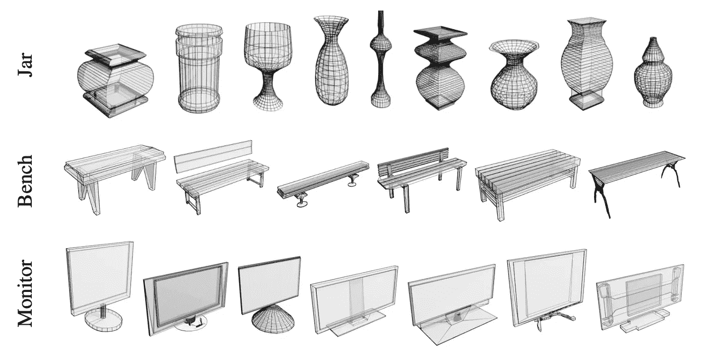**

**[PolyGen 生成的样本](https://arxiv.org/abs/2002.10880)**

**Polygen 是一种直接模拟 n 边形 3D 网格的方法，它使用基于转换器的体系结构依次预测网格面和顶点。模型设计是这样的，它可以调节一系列输入(对象类、体素和 2D 图像),并从概率上产生输出，以捕捉模糊场景中的不确定性。该网络由顶点模型和人脸模型组成。顶点模型是一个屏蔽的变换器解码器，它无条件地表示顶点序列上的分布，以模拟网格顶点。而面部模型是基于指针网络的变换器，其有条件地表达可变长度输入顶点序列上的分布，以对网格面部建模。因此，简而言之，两个转换器模型的目标是通过首先生成网格顶点，然后使用这些顶点生成网格面，来估计 3D 网格上的分布。**

**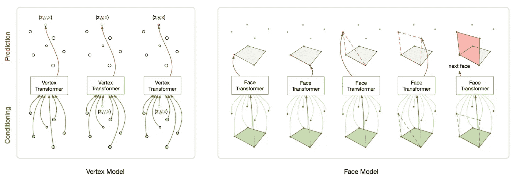**

**[基于变形器的多边形顶点和面模型](https://arxiv.org/abs/2002.10880)**

**Polygen 中使用的变压器架构受到 WaveNet、PixelRNN 和 pointer networks 等顺序模型的启发。这项工作还从多边形 RNN(使用多边形分割)中获得了重要的灵感，而顶点模型类似于 PointGrow [8]的定制自关注架构，使用自回归分解对 3D 点云进行建模。与顺序自回归模型相比，PointGrow 具有更浅的自关注架构，该架构通过对固定长度的点云输入进行操作，使用自关注机制来预测离散坐标分布。因此，Polygen 可以被认为是通过一种新颖的基于变压器的网络设计手段结合起来的一些最佳想法的均衡组合。**

**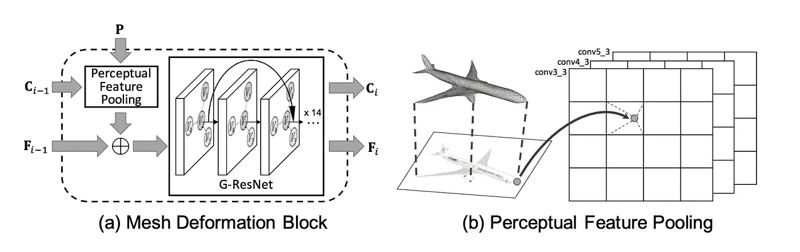**

**[网格变形块和感知特征池操作](https://arxiv.org/abs/2002.10880)**

**Polygen 的一个关键特性是能够根据输入上下文(上下文示例:2D 图像、对象类)调节输出。为了实现这种条件性质，顶点和面部模型的输入流被改变以结合上下文。对于像 2D 图像和体素这样的输入格式，首先使用域适当的编码器对输入进行编码，以便为变换器解码器检索上下文嵌入，从而在嵌入序列中执行交叉注意。而对于像对象类这样的输入格式，预学习类嵌入被投影到一个向量，该向量被添加到位于每个网络块中的自关注层之后的中间变换器预测表示中。这是完全可能的，因为顶点模型的一般性质使用简单的、有表现力的和高建模能力的变换器-解码器架构，该架构允许网络对来自不同域的数据进行建模。转换器使用其高效信息聚合的能力来捕捉网格顶点和对象几何体中存在的强非局部依赖性。**

# **结论**

**在这篇博客中，我们讨论了两种主要的 3D 合成方法，即卷积深度网和基于变换器的深度网。新一代网络的变换器是以计算效率更高和优化的方式设计的，因此可以认为比传统的卷积网络领先了一步。然而，在接近实时推理场景时，transformers 还有很长的路要走，才能赶上我们在 autoencoder 一节中讨论的相对轻量级且快速的推理方法。然而，变形金刚拥有巨大的研究范围，它们的注意力机制能够有效地聚合信息并提取输入和输出之间的全局依赖关系，这使它们更有前途。**

**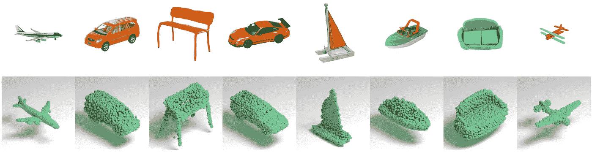**

**[来源](http://mgadelha.me/mrt/)**

***我的博客反映了我所从事的工作，并简单地传达了我对这些话题的理解。我对深度学习的解读可以和你不一样，但我的解读只能和我一样无误。***

# **参考**

**[1] [Jackson，A.S .，Bulat，a .，Argyriou，v .，Tzimiropoulos，g .，Jackson，A.S .。国际计算机视觉会议。(2017)](https://arxiv.org/abs/1703.07834)**

**[2] [用位置图回归网络联合 3D 人脸重建和密集对齐](http://openaccess.thecvf.com/content_ECCV_2018/papers/Yao_Feng_Joint_3D_Face_ECCV_2018_paper.pdf)**

**[3] [Pixel2Mesh:从单幅 RGB 图像生成 3D 网格模型(ECCV2018)](http://openaccess.thecvf.com/content_ECCV_2018/papers/Nanyang_Wang_Pixel2Mesh_Generating_3D_ECCV_2018_paper.pdf)**

**【4】[PolyGen:3D 网格的自回归生成模型](https://arxiv.org/abs/2002.10880)**

**[5] [孙，杨，王，杨，刘，z，西格尔，J. E .和萨玛，S. E .点增长:自回归学习点云生成与自我关注。在*2020 年*](https://arxiv.org/abs/1810.05591)计算机视觉应用冬季会议**