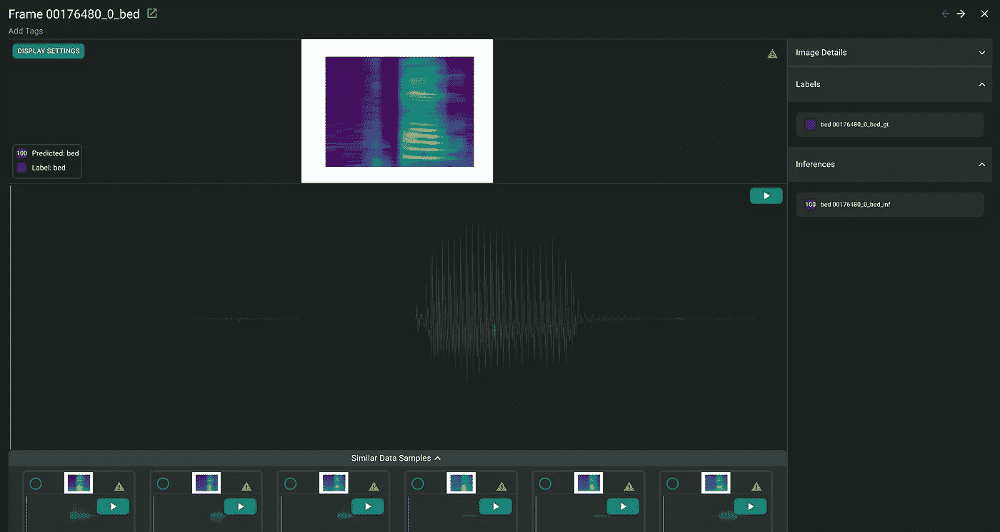
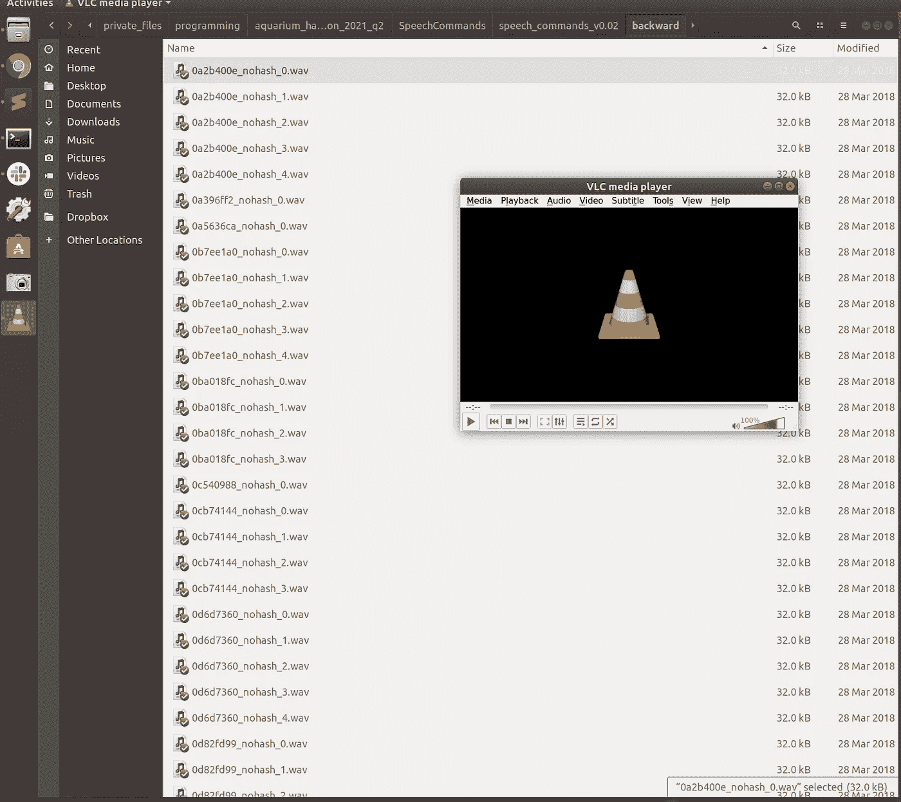
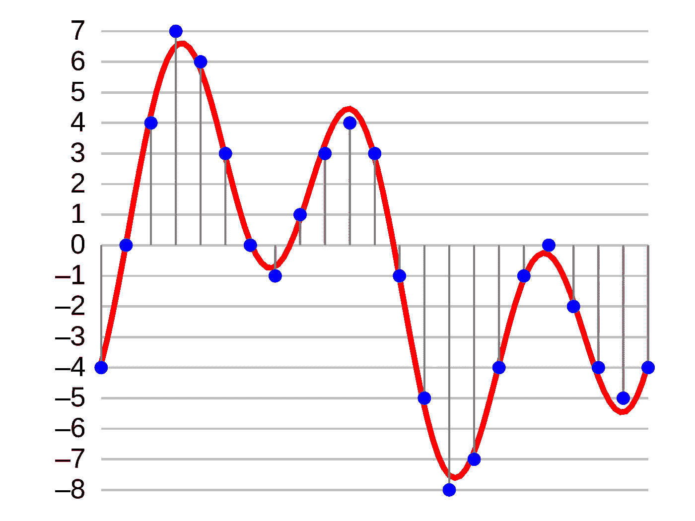
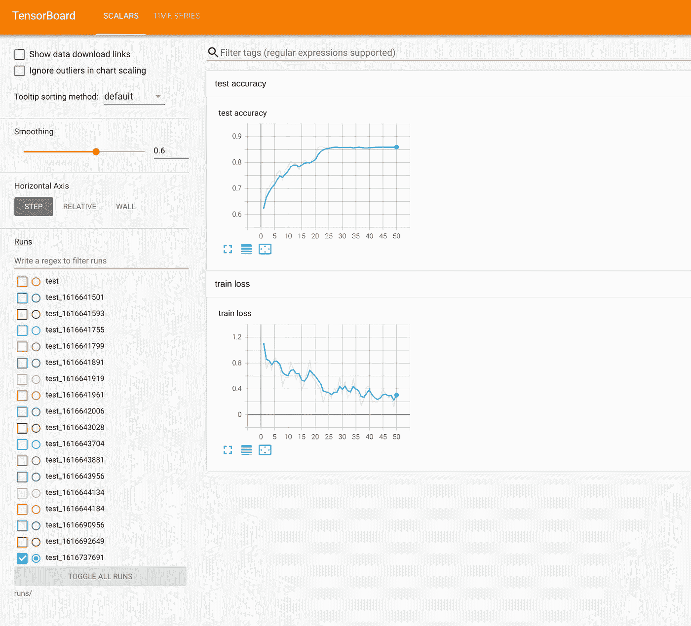
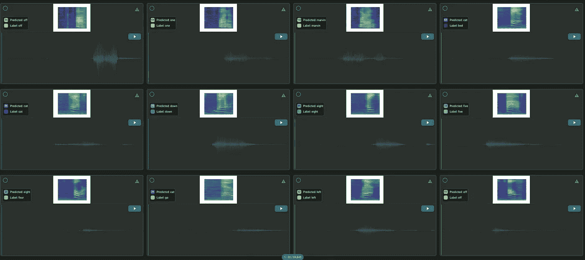
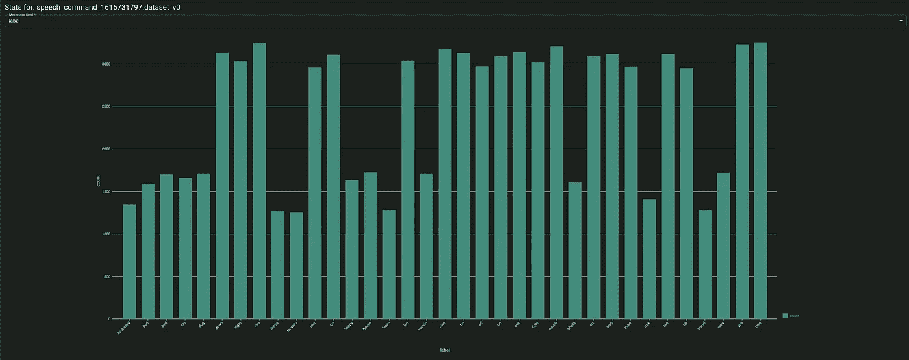
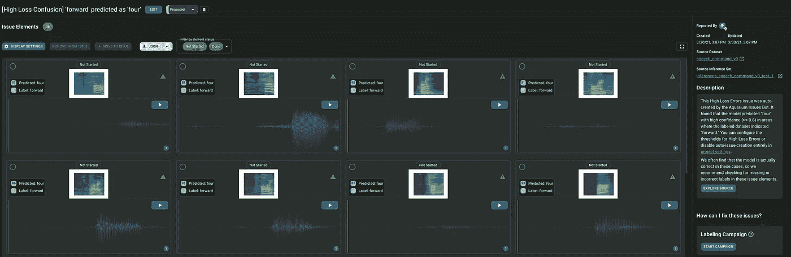
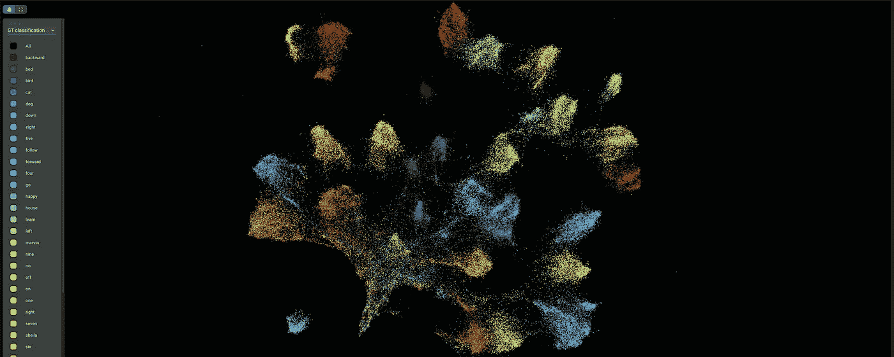
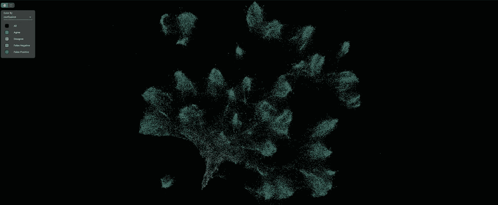
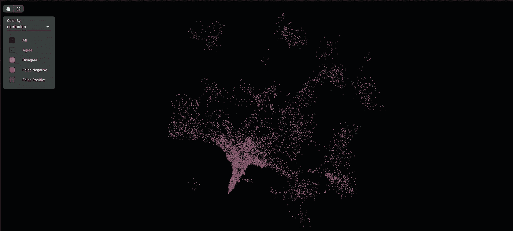

# 利用语音命令数据集对音频进行深度学习

> 原文：<https://towardsdatascience.com/deep-learning-for-audio-with-the-speech-commands-dataset-79f7023de903?source=collection_archive---------20----------------------->

## 在这里，我们在语音命令音频数据集上训练一个非常简单的模型，并分析它的失败案例，看看如何最好地改进它！



在过去的十年中，深度学习已经成为一种流行而有效的技术，用于学习各种不同的数据类型。虽然大多数人都知道深度学习在图像或文本中的应用，但深度学习也可以用于音频数据的各种任务！

在我之前从事自动驾驶汽车的工作中，我花了很多时间研究图像和 3D 点云的深度学习模型。虽然我们有一些很酷的音频处理应用程序，但我只是浅尝辄止，从未认真做过。

然而，在[水族馆](http://aquariumlearning.com/)这里，我们有一些客户正在开发一些非常有趣的音频数据应用程序。我们最近举行了为期 3 天的黑客马拉松，所以我决定尝试为自己做音频深度学习。

在这篇博文中，我们将在语音命令音频数据集上训练一个非常简单的模型。然后，我们将使用 Aquarium 来分析其失败案例，并确定如何最好地改进模型。

如果你想继续下去，我在这个项目中使用的全部代码可以在[这里](https://github.com/pgao/aquarium_hackathon_2021_q2)找到。数据集和模型推论可以在这里访问[。](https://demo.aquariumlearning.com/projects/speech_commands/explore?dataset=dataset_v1&inferences=inferences_dataset_v1_test_1616737691_model_50_v1&mode=cards)

## 选择数据集

我寻找一个数据集，它不是太小而不能做任何有趣的事情，而是足够小，以至于我可以使用我的本地机器在其上训练一个模型，而不需要一个更好的分布式设置。

经过一番搜索，我找到了[语音命令](https://www.tensorflow.org/datasets/catalog/speech_commands)数据集，它由大约 1 秒长的人们说单个单词的音频记录以及包含背景噪音的片段组成。该任务是分类任务，其中模型收听音频片段，并对某个触发词是否被说出进行分类。

更好的是，还有一个[漂亮的 Pytorch 示例](https://pytorch.org/tutorials/intermediate/speech_command_recognition_with_torchaudio.html)，它加载数据集并在其上训练一个模型。对于这个项目，我使用了这段代码，做了一些相对较小的修改。我想从盒子里拿出一些相对的东西，训练它，然后理解它是如何以及为什么失败的。

## 与数据融为一体

首先，我下载了数据集，以了解数据集中的数据类型。在这个阶段，检查原始数据是否损坏/不正确是很重要的，但也要确保标签相当准确。它还让你感觉到这项任务有多困难——如果你作为一个人很难分辨出说的是什么单词，那么对于 ML 模型来说就更难了。

在这个阶段，最好的数据集检查工具是您的文件管理器！我点击了 Nautilus 中的各种文件夹，并聆听了数据的随机样本，以了解它们的“声音”是什么样的。粗略地看一下，每个类都有文件夹，其中包含该类发言人的音频文件。我听了这些音频文件大约 15 分钟，并确认这些音频文件似乎与它们所属的标签文件夹相匹配，因此数据集的基本质量似乎相当好。

专业提示:你可以在 Nautilus 中按住 shift 键单击一系列文件，在 VLC 播放器中打开它们，VLC 播放器将按顺序播放它们，这使得你可以非常快速地收听许多不同的音频剪辑。



信不信由你，鹦鹉螺和 VLC 播放器是 ML 工具链的关键部分。

现在以编程方式加载数据集。好消息是已经有了一个加载数据并根据数据训练模型的例子。坏消息是，这是 Colab 笔记本代码，我不太喜欢笔记本代码。在我从示例中删除了所有这些内容之后，我开始研究如何以编程方式加载数据。

但是首先，一个音频文件实际上包含什么？为了理解这一点，我们必须复习一些物理和音频处理知识。声音基本上是一种振动——压力的变化——以波的形式在空间中传播。为了记录音频，计算机麦克风测量压力随时间变化的幅度，进行一些处理/压缩，并将其写入磁盘。

然而，现实中的声波是模拟信号，而计算机麦克风以数字方式记录和保存声音。这意味着如果一个人将实际的声波绘制成振幅随时间变化的图表，他将得到一个平滑连续的曲线。数字麦克风 [**随时间推移对该波形**](https://en.wikipedia.org/wiki/Sampling_(signal_processing)#Audio_sampling) 进行采样——数字麦克风不是记录并保存连续的模拟波形，而是周期性地测量振幅(该时序被称为**采样率**),此外，振幅也不完全匹配真实振幅——它在某一分辨率下舍入到最近的振幅值，这由其 [**位深度**](https://en.wikipedia.org/wiki/Audio_bit_depth) 决定。记录下来后，计算机可以压缩并保存它随时间测量的量化振幅。



实际的模拟声波，用红色表示，是一条平滑连续的曲线。数字麦克风在不同的时间点对此曲线进行采样(用蓝色表示)并保存这些数据。[来源](https://en.wikipedia.org/wiki/Digital_audio#/media/File:4-bit-linear-PCM.svg)。

使用示例代码加载数据集时，每一行数据都包含:

*   一种音频波形，表示为代表量化样本的一维数字阵列(如上图中的蓝色点)
*   作为附加元数据的采样率(单位为 hz)。
*   剪辑中说出的单词的标签(即模型将被训练来预测的类别)。
*   扬声器 id。
*   以区分来自同一说话者的多个记录。

然后，这些数据被分割成训练集(约 85k 行)、验证集(约 10k 行)和测试集(约 5k 行)。每个音频片段以 16kHz 采样，大多数片段的音频阵列为 16，000 长，这相当于 1 秒长的音频剪辑。然而，一些音频段短于 16，000 长，当神经网络需要固定长度的输入时，这可能是一个问题。

## 训练一个模特，和一些专业建议

现在我们了解了数据，是时候训练一个模型了。

Pytorch 示例代码在向模型提供数据之前做了一些简单的预处理。首先，如果有任何长度小于 1 秒的示例，它会用零填充它们，以确保它们与其他示例的长度相同。这确保了模型在固定大小的输入上训练。

```
def pad_sequence(batch):
    # Make all tensor in a batch the same length by padding with zeros
    batch = [item.t() for item in batch]
    batch = torch.nn.utils.rnn.pad_sequence(
        batch, batch_first=True, padding_value=0.)
    return batch.permute(0, 2, 1)
```

其次，它将音频重新采样到 8kHz，以减小输入的大小。

```
def get_transform(sample_rate):
    new_sample_rate = 8000
    transform = torchaudio.transforms.Resample(
        orig_freq=sample_rate, new_freq=new_sample_rate)
    return transform
```

之后，我们可以定义一个模型架构来训练这些数据。示例代码附带了一个相当简单的网络，它建立在波形的 1D 卷积之上。我要指出的是，这种模型架构与用于图像任务的架构非常相似，这也是深度学习在许多不同领域中被证明有用的部分原因。

我发现了一些在进行深度学习时相当有用的东西，这些东西没有包含在示例代码中，我一般会推荐给大多数开始深度学习项目的人。

*   确保列车/ val /测试装置之间没有泄漏。否则，您的模型将在评估时处于不公平的优势，无法对其泛化性能做出准确的评估。当我用样本代码检查时，我发现训练集不恰当地包含了来自验证集和测试集的数据！这个 bug 可能与我在 Ubuntu 系统上运行这段代码有关，而不是像最初的例子那样在 Colab 笔记本上运行。
*   **在数据进入网络之前，检查/可视化预处理后的数据，并确认这是您所期望的。**根据我的经验，在数据预处理中可能会出现很多错误，这会搞乱您的模型训练。在 Matplotlib 中绘制一些数据点/用 simpleaudio 播放一些音频是检查数据预处理结果的简单方法。
*   **建立 Tensorboard 或类似的工具来监控你的训练进度。**这非常重要，因为它允许您观察您的训练+验证损失曲线，跟踪您的模型是否收敛，并确定它何时开始过拟合或欠拟合。
*   每隔几个时期将模型权重的检查点保存到磁盘。如果你的电脑崩溃了，你可以从一个检查点恢复进度，而不是丢失一天的工作。根据 Tensorboard 日志，您还可以使用它来选择具有最佳验证损失的模型检查点。
*   **通过寻找模型训练过程的加速方法来缩短周期时间。**如果您有可用的 GPU，请为您的预处理设置 GPU 加速，并对向前+向后过程建模。CUDA 安装可能会非常令人沮丧，但当您的模型训练速度提高 10 倍时，这是非常值得的。如果你有多个可用的 GPU(通常在一个强大的云机器中)，尝试实现[数据并行](https://pytorch.org/tutorials/beginner/blitz/data_parallel_tutorial.html)，这样你的模型会更快地烧穿迷你批处理。



目测损耗曲线很重要！

## 接下来呢？

经过 50 个时期的训练后，该模型在训练集上达到约 93%的 F1 分数，在测试集上达到约 85%的 F1 分数。这还不算太糟，但我相信我们可以做得更好！我想尝试做一些事情来提高模型性能:

*   实现一个在 Mel 频谱图上使用 2D 卷积的模型(而不是在原始波形上使用当前模型的 1D 卷积)，因为这往往会在其他音频任务上实现最先进的性能。
*   做一些数据扩充，以获得数据集中更多的变化(添加噪声，改变音频剪辑的定时，等等)。)来增加最终模型的泛化能力。
*   尝试使用具有原始(更高)采样速率的输入音频，以便模型可以对更多信息的输入进行操作。
*   收集更多表现不佳的类的数据，以提高这些类的模型的准确性。

这通常是大多数教程博客文章的结尾。然而，让我们更进一步，实际分析失败案例，以便我们可以明智地处理最能提高模型性能的东西。

## 使用水族箱进行故障案例分析

首先，我想检查标记数据集和来自我的模型的推论之间的差异，以便分析它的一些失败案例。经过短暂的迂回以生成一些可视化的光谱图后，我将数据集上传到水族馆 GCS 桶中，然后使用水族馆客户端库上传我的标签、元数据和推论。

```
###
# add label data
###al_labeled_frame = al.LabeledFrame(frame_id=frame_id)# Add arbitrary metadata, such as the train vs test split
al_labeled_frame.add_user_metadata('speaker_id', speaker_id)al_labeled_frame.add_user_metadata(
    'utterance_number', utterance_number)al_labeled_frame.add_user_metadata(
    'waveform_shape', waveform.shape[1])al_labeled_frame.add_user_metadata('split', dataset_split)# Add a spectrogram image to the frame for visualization
al_labeled_frame.add_image(
    sensor_id='spectrogram', image_url=image_url)# Add the audio file to the frame for audio-lization
al_labeled_frame.add_audio(
    sensor_id='waveform', audio_url=audio_url)# Add the ground truth classification label to the frame
label_id = frame_id + '_gt'
al_labeled_frame.add_label_2d_classification(
    sensor_id='spectrogram',
    label_id=label_id,
    classification=utterance
)

al_dataset.add_frame(al_labeled_frame)###
# add inference data
###al_inf_frame = al.InferencesFrame(frame_id=frame_id)inf_label_id = frame_id + "_inf"al_inf_frame.add_inference_2d_classification(
    sensor_id="spectrogram",
    label_id=inf_label_id,
    classification=pred_class,
    confidence=float(confidence)
)al_inferences.add_frame(al_inf_frame)
```

上传完成后，我进入水族馆用户界面，可以查看我的数据集并播放一些音频片段。



目测和…打耳洞(？)一些例子

我还绘制了类别分布图，并发现与其他类别相比，有些类别在数据集中的代表性相对较低。



有些课的例题是其他课的一半！

Aquarium 还会自动显示数据集中的高损失示例，这些示例可能是标签错误或严重的模型故障。使用这个工具，并通过查看交互式模型度量视图，我发现:

*   一些音频剪辑实际上包含多个单词而不是一个！[在这种情况下](https://demo.aquariumlearning.com/projects/speech_commands/explore/speech_commands.dataset_v1/fbb2f6cc_0_no?inferenceSet=speech_commands.inferences_dataset_v1_test_1616737691_model_50_v1&selectedLabel=fbb2f6cc_0_no_inf)，似乎说话者不小心说错了单词，然后纠正自己，模型正确地将第一个单词分类。
*   有几个听起来很像的词是模型混淆的——[上下车](https://illume.aquariumlearning.com/projects/speech_commands/issues/56ec9428-7b68-4582-85db-81bae8c15196)、[树和三个](https://demo.aquariumlearning.com/projects/speech_commands/issues/30a40bb8-e413-4570-8afb-993dfb710dfb)、[前进和四个](https://demo.aquariumlearning.com/projects/speech_commands/issues/9dbde54b-ed59-4c10-ad81-901d610bf538)。一个人可以区分这些例子中的一些，而其他情况则很难区分。
*   在各种失败案例中，似乎有一些说话者的声音被切断的例子。在许多这样的片段中，在片段结束之前，说话者几乎没有开始说话，这使得几乎不可能区分像“four and forward”这样在开始时听起来相同的单词。



在我检查的有限数据集中，最后一种失败模式似乎发生在多个类中，但我并不清楚这个问题有多大，我也不想花几个小时来听数据集中的所有音频剪辑来判断这一点。然而，在决定下一步尝试什么之前，了解要解决的最大问题是什么是很重要的。

幸运的是，水族馆的一个独特之处在于它能够利用[神经网络嵌入](https://medium.com/aquarium-learning/the-unreasonable-effectiveness-of-neural-network-embeddings-93891acad097)将相似的数据点聚集在一起。该功能允许我们找到相似数据点的聚类以及数据集中的异常值。这在识别模型故障模式时特别有用。

从模型中提取嵌入并不太难，只需在数据点上运行模型，然后从倒数第二层(在最后的类方式 FC 层之前)获取模型的激活。数据点的嵌入向量在这里只是一个浮点的 1D 向量，代表一个学习的特征向量。我在数据集上运行我的模型，提取出嵌入和推论，并将它们保存到磁盘上:

```
# embedding extraction
activation = {}
def get_activation(name):
    def hook(model, input, output):
        activation[name] = output.detach()
    return hook
audio_model.pool4.register_forward_hook(get_activation("pool4"))def predict(tensor):
    # Use the model to predict the label of the waveform
    tensor = tensor.to(device)
    tensor = transform(tensor)
    tensor = audio_model(tensor.unsqueeze(0))
    likely_ind = model.get_likely_index(tensor)
    out_label = data.index_to_label(likely_ind.squeeze(), labels)
    probs = torch.exp(tensor).squeeze()
    confidence = probs[likely_ind]
    embedding = activation["pool4"].flatten() return out_label, confidence.item(), embedding.cpu().tolist()
```

然后我把它们从磁盘上传到水族馆:

```
embeddings = None
with open("embeddings.pickle", "rb") as f:
    embeddings = pickle.load(f)inferences_map = {}
embeddings_map = {}
for i in range(len(inferences)):
    (frame_id, pred_class,
        confidence, dataset_split) = inferences[i]
    inferences_map[frame_id] = inferences[i]
    embeddings_map[frame_id] = embeddings[i]...al_labeled_frame.add_frame_embedding(
    embedding=embeddings_map[frame_id])
al_dataset.add_frame(al_labeled_frame)
```

一旦嵌入被上传和处理，我们就可以了解数据集在嵌入空间中的分布。在这里你可以随意尝试一下[。](https://demo.aquariumlearning.com/projects/speech_commands/explore?dataset=dataset_v1&inferences=inferences_dataset_v1_test_1616737691_model_50_v1&mode=tsne)



然后通过模型推断和标签之间的一致/不一致来给嵌入云着色。我们清楚地看到在数据集的一个部分中有一个巨大的不一致集群，比任何其他错误模式都要大得多！



通过模型和标签之间的一致/不一致给嵌入云着色



只显示模型和标签之间的不一致。

仔细看，所有这些数据点都是音频剪辑，扬声器被切断，让人无法分辨正在说什么。


观察这些例子的波形，你会发现所有这些片段在结尾几乎都被剪掉了。

[该问题影响数据集](https://illume.aquariumlearning.com/projects/speech_commands/issues/3e8caf63-e7d6-470a-b0fc-4230658bde3b)中的数千个示例，并且是最大的单一故障模式。然而，这不一定是模型的问题，而是模型预期的问题——人类没有办法听这些音频剪辑并合理地推断出正在说什么单词，它们只是以它们的方式被标记，因为语音命令的原始数据收集设置涉及指示用户说某个单词，并保存那些标记有说话者被指示说的单词的音频剪辑。

我们可能应该通过创建一个新的“未知”或“切断”类并重新训练模型来解决这个问题。这样，它就不会被那些被标记为合法类别但实际上并没有包含足够信息来准确分类的例子所迷惑。然而，这是我在 hackathon 上花完时间的地方，所以我将把它留给读者做练习。

## 结论

在机器学习项目中，总有一个点，你有一个做得不错但不太好的模型，并且有许多可以尝试的东西可以提高你的性能。[对于这种情况，吴恩达有很好的实用建议](http://cs229.stanford.edu/materials/ML-advice.pdf):与其尝试随机的事情，看看什么能提高性能，不如花些时间了解哪里出了问题，然后修复那些搞砸的事情。

在这里，我们采用了一些非常现成的示例代码，在数据集上训练了一个非常简单的模型，并分析了哪里出错了。因此，我们发现最大的问题与模型本身无关，而是与数据的基本且容易修复的问题有关。**通过花一点时间做误差分析，我们发现了提高模型性能的最高投资回报率的方法，这是我们可以尝试的许多方法中的一种。**

我使用我们公司的产品，水族馆，为这篇文章做了大量的可视化和错误分析。如果你有兴趣亲自尝试一下水族馆，请告诉我们吧！

