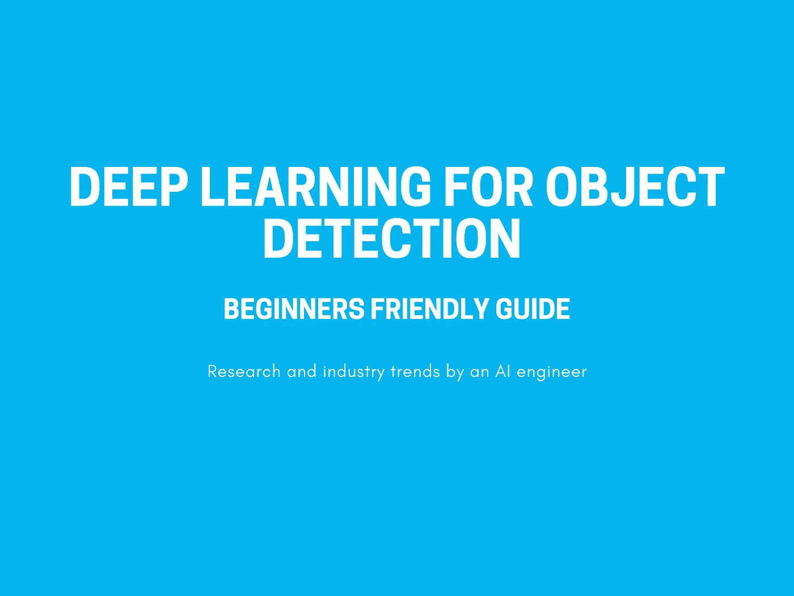
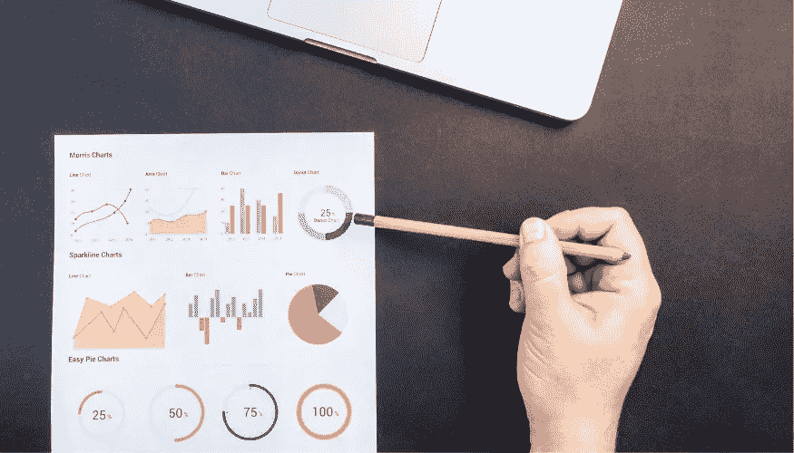
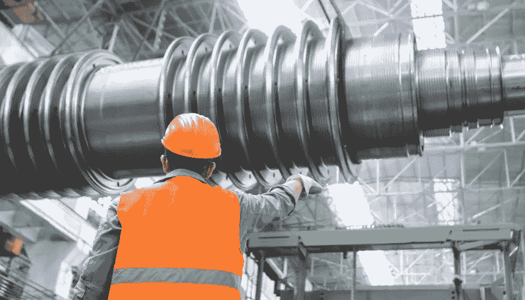
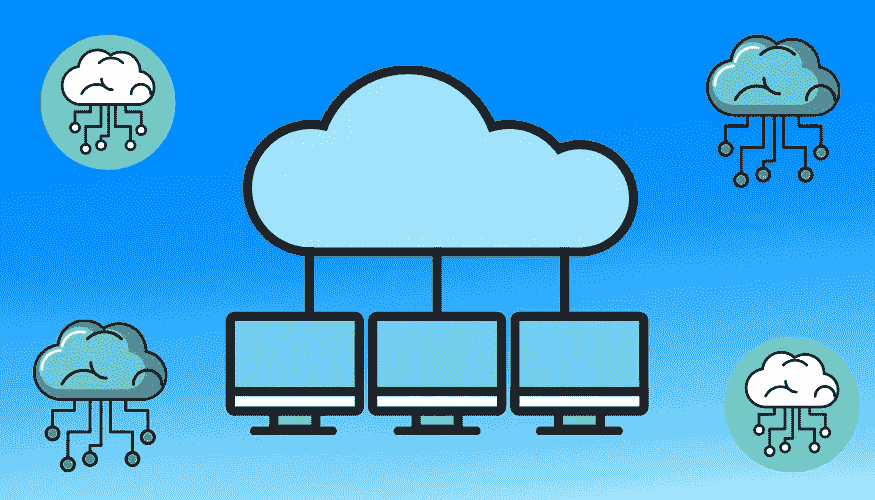
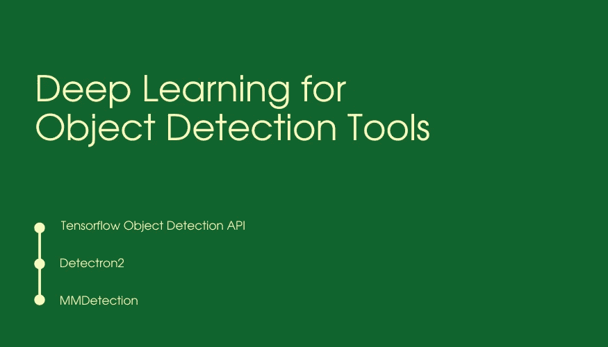

# 物体检测的深度学习:初学者友好指南

> 原文：<https://towardsdatascience.com/deep-learning-for-object-detection-beginners-friendly-guide-ae1180b34042?source=collection_archive---------16----------------------->

## 人工智能工程师的研究和行业趋势

作者制作的图像

# 背景

当我在 2018 年实习时，我开始研究物体检测技术，因为我需要解决一个视觉检查问题。这个问题需要在来自工业相机的图像流中检测许多不同的对象。

为了应对这个挑战，我首先尝试将分类与滑动窗口结合使用！自然，这个系统非常慢，不适合生产。

在这之后，我开始研究执行对象检测的端到端深度学习模型。我偶然发现了 google research 的一篇著名论文，题目是:

> 现代卷积目标探测器的速度/精度权衡

这篇论文是我对使用深度学习的对象检测领域的介绍。

# 物体检测是一个古老的任务，深度学习给它带来了什么？

作者制作的图像

目前，目标检测是计算机视觉领域中一个比较古老的课题。在深度学习成为主流之前，许多研究人员和工程师都在研究这个问题。他们主要使用经典的图像处理技术，他们可能经常使用滑动窗口方法。那么深度学习对物体检测的附加值是什么呢？

事实上，深度学习从根本上改变了我们进行物体检测的方式。随着 YOLO 和 R-CNN 系列的引入，对象检测的性能显著提高。大多数用于图像相关任务的神经网络使用卷积层。这些神经网络被称为 CNN(卷积神经网络)。这些 CNN 实际上自然而有效地执行了一种滑动窗口方法。这是神经网络学习图像表现方式的一部分。

# 目标检测的研究现状

作者制作的图像

在我写这篇文章的时候，谈论最多的对象检测模型是 YOLOR(你只学习一种表示)。设计该模型架构的研究人员正在寻找整合“隐性知识”的方法。这种隐性知识应该代表神经网络中的潜意识。作者希望建立一个架构，模仿我们人类在现实生活中如何解决对象检测任务。这种架构可能是未来工作的一个种子，该工作集成了隐式知识的概念，不仅用于对象检测，还用于各种计算机视觉任务。

还有另一种建筑可以成为未来许多作品的种子，那就是 DETR 建筑。DETR 代表检测变压器。

变压器是一种新型的神经层，它们正在与卷积层竞争大量的计算机视觉任务。

变形金刚已经在 NLP(自然语言处理)任务中显示出巨大的成果，并且他们正在稳步进入计算机视觉任务。

# 工业中物体检测的现状

作者制作的图像

在过去的几年里，我一直是一名机器学习工程师，专注于计算机视觉应用。通过在这个领域工作，也通过对需要机器学习和计算机视觉知识的职位进行几次面试，我实际上注意到了这个行业中物体检测的一些趋势。

如果你在这个行业工作，那么你肯定知道一项任务的最重要的指标可能与研究中使用的指标非常不同，对于同样的任务！

在对象检测任务的情况下，同样的事情适用。据我所知，在工业环境中实现目标检测模型时，有两个指标是最重要的:速度和鲁棒性。并不总是两者都有，但两者中至少有一个总是有的。

基于这些原因，***【v3，v4，V5】******更快——RCNN***在业界得到了广泛的应用。通常，当速度是第一优先考虑的因素时，使用 YOLO，当鲁棒性是第一要求时，使用更快的 RCNN。

我亲自和 ***YOLOv3，SSD*** 和***fast 合作过——RCNN***。

虽然很多在这个行业工作的人直接去了 YOLO——我猜是因为它的好名声——但我不认为这是一个万能的解决方案。

谈到推理速度，YOLO 和 SSD 都显示出了巨大的潜力。但是在某些情况下，他们仍然可能失败，特别是在工业领域。

我记得我曾尝试使用带有 InceptionV2 后端的 ***SSD 来执行一项高难度的物体检测任务。这是一项视觉检查任务，我们需要检测大型发动机(飞机或直升机，我不记得了)内部的机械部件。无论我如何调整我的神经网络的参数，我都不能让损失减少，它只是不停地振荡！***

我以前使用过同样的架构，用同样的主干，来执行一些其他的对象检测任务，效果非常好！所以当我从事这项任务时，这无疑是更具挑战性的，SSD 失败了。因为发动机看起来体积庞大，因为有许多零件连接在一起，而且许多零件看起来非常相似。即使是人眼，也很难发现我们想要检测的特定机械部件！这应该告诉你注释我们的数据集有多困难！

此时，我记得当时认为这只是深度学习的极限。但在完全放弃之前，我决定尝试一种不同的架构，并试图避免 YOLO 和 SSD 等一级检波器。

我选择了 fast-RCNN，因为它是一个两阶段的对象检测模型。你瞧，这个模型工作得非常好！损失函数的收敛比保龄球还要平滑！

所以下次你在做物体检测任务的时候，在你下定决心之前，尝试一些不同的架构！

# 需要云计算来提高对象检测任务的性能

作者制作的图像

在训练深度学习模型的时候，尤其是大型模型的时候，你需要一些非常好的设备。说到训练，GPU 可能是你的深度学习机器最重要的方面。许多公司购买这些设备，但也有许多公司选择云计算服务。

谷歌云平台(GCP)、亚马逊网络服务(AWS)和微软 Azure 是一些广泛使用的云计算服务。

对于物体检测和大型模型，如 fast-RCNN，这些云计算解决方案可能正是您正在寻找的训练模型。但是应该用哪一个呢？

答案真的取决于你公司的选择。对于许多公司来说，他们已经有了云基础设施，在上述云提供商之一，所以他们可能只是想继续使用同一提供商来保持标准化。但是，如果你刚刚开始，并试图选择其中一个作为你的目标探测任务，那么请继续阅读！

有多种方法可以训练你的物体检测模型，稍后我会详细介绍一些开源工具。但是如果你正在使用 Tensorflow (1 或 2)，那么你可能正在使用 *Tensorflow 对象检测 API* 。

如果你是，那么当谈到在云上训练对象检测模型时，Google Cloud 应该是你的选择。你可能会问为什么？

嗯，由于 Tensorflow 是谷歌的产品，对象检测 API 也属于谷歌，谷歌云团队已经使在 GCP 上训练你选择的模型(从对象检测 API)变得极其容易。

具体来说，google 有 2 种产品可以轻松集成到您的管道中，用于训练对象检测模型。这两款产品分别是:AI 平台和 Vertex AI。

通过在你的机器上安装谷歌云帐户和谷歌云 SDK，训练来自 [*模型动物园*](https://github.com/tensorflow/models/blob/master/research/object_detection/g3doc/tf2_detection_zoo.md) 的任何物体检测模型，变得简单明了。

如果你想训练一个不属于模型动物园的模型(比如 YOLO)，那么按照我在另一篇文章*中描述的一系列步骤，在谷歌云上也是可行的。*

# *用于执行对象检测任务的开源深度学习工具*

**

*作者制作的图像*

*为了使用深度学习来执行对象检测，主要有三种广泛使用的工具:*

1.  *Tensorflow 对象检测 API。*
2.  *探测器 2。*
3.  *mm 检测。*

*如果你是 Tensorflow 开发者，那么 ***Tensorflow 对象检测 API*** 最适合你。如果你是 PyTorch 开发者，那么 ***Detectron2*** 和 ***MMDetection*** 更适合你。*

*如果你更关心选择的多样性，那么 MMDetection 是最好的选择，因为它有大量的对象检测深度学习模型。*

*这并不意味着仅仅因为一个架构不是这些工具的一部分，你就不能在其他地方找到它。例如，Tensorflow 对象检测 API 中没有 YOLO 模型，但您可以使用 Tensorflow 从社区中轻松找到一个开源实现。*

# *结论*

*总结一下，下面是这篇文章的要点:*

1.  *物体检测是计算机视觉中一项相对古老的任务，但深度学习已经将物体检测任务的性能大幅提升。*
2.  *当涉及到用于对象检测的深度学习时，研究中推的指标可能不一定与行业中推的指标相同。*
3.  *云计算可以成为深度学习模型训练性能的主要助推器，明智地选择云提供商。*
4.  *使用深度学习进行物体检测的开源工具有几个，主要的三个是:Tensorflow 物体检测 API、Detectron2 和 MMDetection。*

**

*作者制作的图像*

*我是一名机器学习工程师，致力于解决具有挑战性的计算机视觉问题。我想帮助你学习应用于计算机视觉问题的机器学习。以下是方法。*

1.  *通过帮助您了解该领域的最新动态。我几乎每天都在[**【LinkedIn】**](https://www.linkedin.com/in/nour-islam-mokhtari-07b521a5/)和[**Twitter**](https://twitter.com/NourIslamMo)**上分享小型博客帖子。那就跟我去吧！***
2.  ***每周给你一份我的 [**时事通讯**](https://nourislam.ck.page/dc3e8b7e12) 上那些小帖子的摘要。所以订阅吧！***
3.  ***通过在 Medium 上写关于机器学习不同主题的文章。所以跟我来吧！***
4.  ***给你一份免费的机器学习工作清单，帮助你检查你需要学习的所有要点，如果你计划在 ML，特别是在计算机视觉方面的职业生涯。你可以在这里获得核对表 [**。**](https://www.aifee.co/free-resources)***

***5.最后但同样重要的是，通过与你分享我的 [**免费入门 Tensorflow 课程**](https://aifee.teachable.com/p/introduction-to-tensorflow-2-for-computer-vision) ，它有超过 ***4 小时*的视频内容**，你可以在那里问我任何问题。***

***此外，如果您有任何问题或者您只是想聊聊 ML，请随时在 LinkedIn 或 Twitter 上联系我！***