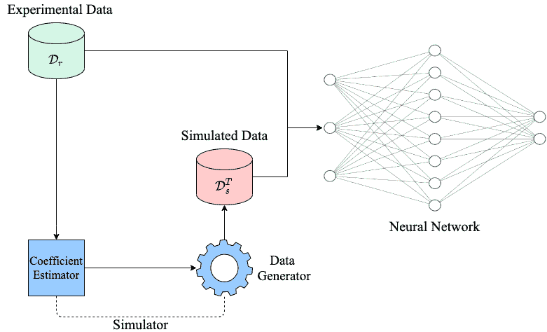
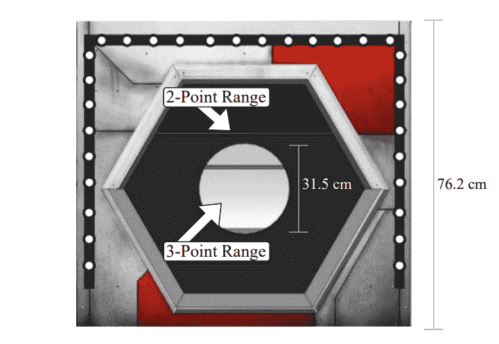
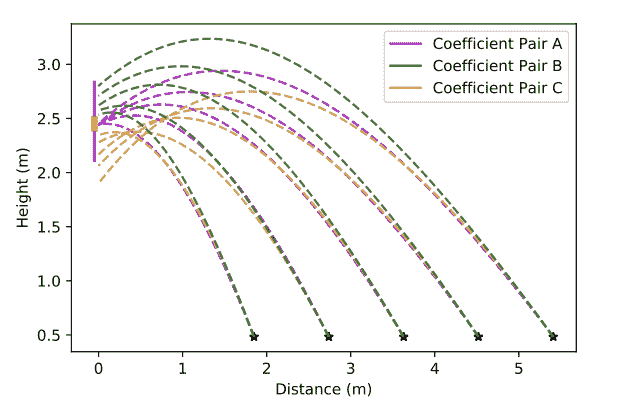
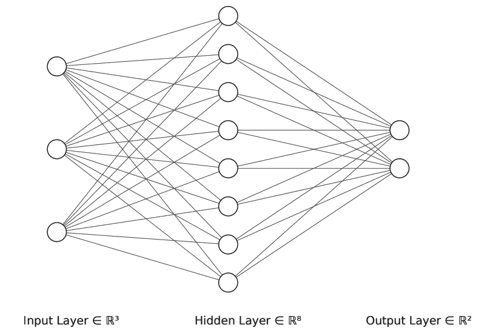
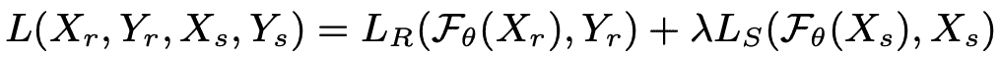
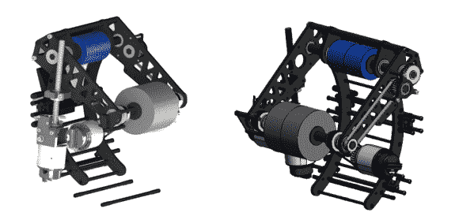
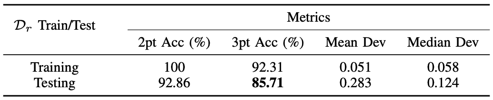
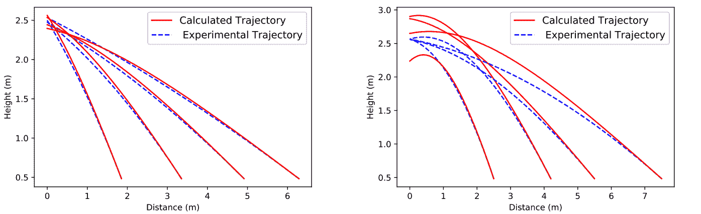
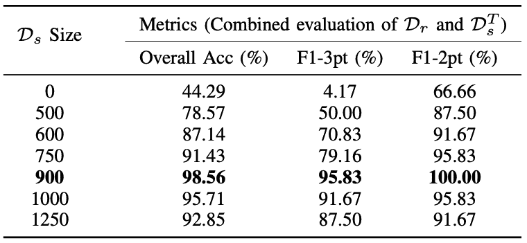

# 用于弹丸弹道建模的深度学习

> 原文：<https://towardsdatascience.com/deep-learning-for-projectile-trajectory-modeling-fb6380e06b8f?source=collection_archive---------27----------------------->

## [思想和理论](https://towardsdatascience.com/tagged/thoughts-and-theory)

## *对我们最近关于为基于深度学习的轨迹建模生成模拟数据的论文的评论*

FCE 神经网络示意图(图片由作者提供)

*本文作者为 Ayaan Haque 和* [*Sajiv Shah*](https://sajivshah.medium.com/)

在这篇文章中，我们将回顾我们最近的工作，题为“通过基于人工智能的机器人弹丸发射建模的算法力系数估计的模拟数据生成”，作者是萨吉夫·沙阿、阿亚安·哈克和刘飞。在本文中，我们提出了 FCE 神经网络，一种新的方法来模拟机器人发射非刚性物体使用神经网络训练的补充模拟数据，从算法力系数估计产生。这项工作已经被 2021 年的 ACIRS 接受。论文在 [ArXiv](https://arxiv.org/abs/2105.12833) 有，项目网址在[这里](https://ayaanzhaque.github.io/FCE-NN/)。我们将首先介绍我们的动机和问题，然后回顾方法，最后提出一些简短的结果和最后的想法。

# **背景**

## 动机

随着机器人开始变得更加先进，它们需要模仿类似人类的行为，因此必须获得类似人类的技能。其中很大一部分涉及到与对象的交互，包括操纵和启动。不幸的是，现实世界的对象建模是困难的。这是因为有一些外部因素和动力学控制着一个物体的运动，而这些因素和动力学在基本物理模型中没有得到解释。物体具有随时间增加的应力松弛量，以及在诸如温度或湿度的多种非恒定条件下变化的硬度。这产生了大量的不确定性，因为某个模型的每个对象将具有不同的条件。

对于物体发射来说，空气动力和机械装置的不精确性结合在一起会产生较差的动力学特性。为了精确地确定升力和阻力系数，必须使用昂贵的工具和传感器进行实验，如风洞。执行这些测试需要原型或小比例模型，这意味着物体的大致形状和材料必须预先确定，这使得设计与未知或形状变化的物体交互的机制变得困难。如果没有来自精确传感器和控制器的高速、准确的反馈，机器人就不能很好地模仿模型。在发射系统中，由于不均匀的质量分布，来自机构的摩擦和来自致动的振动，加上不理想的控制回路，导致目标参数与实际参数之间的差异。非包容性建模和不完善的机械系统的结合产生了实验和理论结果的巨大差异。

## 当前解决方案

为了解决这些问题，来自人工智能各个领域的方法已经被应用于机器人领域。在强化学习(RL)中，机器人通过反复试验来学习新的行为，这消除了对人类操作员的需要。然而，众所周知，RL 在架构上既危险又昂贵，这使得它在通用机器人领域相当不受欢迎。

其他数据驱动的深度学习方法已经被研究用于各种基于物理的建模任务，但是依赖于大型数据池。对于机器人应用程序，收集和生成大型数据集将使预测模型过时，因为以编程方式引用收集的数据将产生比基于该数据生成预测更准确的结果。

实验数据经常与模拟/生成的数据配对，为深度学习模型提供更多数据。然而，强生成模型需要访问大型数据集，以便准确地学习和再现数据的表示。我们建议使用一个简单的基于物理的模拟器，该模拟器考虑了射弹轨迹的已知动态，以生成用于深度学习的数据。为此，我们开发一组方程并设计模拟器，使用迭代算法估计系数，生成数据，然后调整神经网络以创建预测。

# 方法

FCE 神经网络示意图(图片由作者提供)

我们的方法由三部分组成。模拟器，包括系数估计器和数据生成器，以及神经网络。

## **基于物理的模拟器**

我们研究中使用的目标图(图片由作者改编自[此处](https://www.firstinspires.org/resource-library/frc/competition-manual-qa-system)

虽然我们的方法可以应用于各种对象，但我们的工作涉及一个 7 英寸的泡沫球，它是从双飞轮机器人射手发射的。第一届机器人挑战赛给出了我们的目标，如上图所示，我们的目标是从不同的发射区将尽可能多的直径为 7 英寸的泡沫球射入 3 点目标，这些发射区距离目标底部 3 至 30 英尺。靶子的中心大约有 8 英尺高。

已知的作用在球上的力有重力、阻力和升力，其中一些力根据球在轨迹中的位置以不同的大小和方向作用在球上。本文概述了物理方程和模拟器设计:

 [## 球飞行动力学与机器人投球手的设计

### 第 1 部分，共 3 部分:标准，射手动力学和运动学，以及模拟算法

towardsdatascience.com](/design-of-a-double-flywheel-variable-angle-ball-shooter-33221fa64866) 

我们假设访问测量的发射器配置 X_r 和发射结果 Y_r，以及带有发射器配置 X_s 和标签 Y_s 的模拟数据。X_r 和 Y_r 一起用于形成实验数据集 D _ r。X _ s 和 Y_s 一起用于形成模拟数据集 D_s。

我们的目标是训练我们的神经网络来预测基于某一组发射配置 X_r 的结果，其中每个配置都有 3 个特征:到目标的距离(米)，范围为 0-1 的电机速度比，以及发射器与水平面的角度(度)。更常规地，X 是神经网络的输入，在这种情况下是发射器配置，Y 是输入的标签，在这种情况下，它是发射的结果。已知得分目标在距离(d)处，并且得分区域的中心在高度(h_target)处，我们分配结果如下。

发布结果的分配(图片由作者提供)

## **估算力系数**

我们的目标是使用这个轨迹模拟器，通过比较从配置 X_r 生成的轨迹的结果与其结果 Y_r 来估计系数 C_l 和 C_d。为了估计最适合数据集的系数，我们使用多个系数对来模拟 X_r 的每个配置的轨迹。我们评估了 1000 个组合，每个系数在(0.000，5.000)的范围内，步长为 0.005。

对于给定的初始发射角、发射速度和系数对，模拟器能够生成物体轨迹并确定其是否穿过目标。我们可以简单地迭代多个系数对，以确定哪一个对 D_r 的轨迹建模最好。因为 D_r 的结果数据集(Y_r)表示物体可能经过的点的范围，所以大量系数对将从 X_r 模拟单个配置的轨迹。

使用算法模拟器生成轨迹的例子。垂直蓝线代表 2 分区域的得分范围，垂直红线代表 3 分区域的得分范围。黑星表示物体发射时机器人的位置/距离。(图片由作者提供)

我们使用模拟器计算目标与计分目标中心的距离，并将该值标记为偏差。为了选择一个系数对用于数据生成，我们评估了 3 点和 2 点区域的精度以及平均值和中值偏差。我们的算法力系数估计方法可推广到与空气动力相互作用的其他物体。上图显示了不同空气动力系数对物体轨迹的影响，对于给定的配置子集，结果因分配的系数对而异。

# **神经网络训练**

神经网络示意图(图片由作者提供)

一旦我们使用我们的力系数估计器生成额外的数据，我们就将其与我们的实验数据集 Dr 耦合，以训练神经网络来预测射弹是否会击中指定的目标。我们在论文中使用的神经网络如上所示，它是一个有目的的三层骨架网络。对于每个发射器配置，输入层有 3 个节点，隐藏层有 8 个节点，输出层有 2 个节点，每个节点用于 2 维向量，对 2 点或 3 点目标是否被击中进行二元预测。这个网络是一个简单的前馈网络，可以用一个更先进的网络来代替。神经网络的使用允许考虑我们的机制和模型中的不准确性。这些不准确性包括我们的射弹的非刚性属性，不能准确地模拟能量转移，等等。神经网络专门用于解释物理模型的不准确性。隐藏层允许网络模拟非线性系统并考虑非线性。收集的数据来自我们部署人工智能系统的领域。如果数据是从目标域收集的，它将解释物理模型不能解释的差异。

我们的网络根据如下所示的加权损失函数进行训练:

损失函数项(图片由作者提供)

其中，X_r 和 Y_r 是实验特性集和标签，X_s 和 Y_s 是模拟特性集和标签集，F_θ是模型，L_R 是真实损失项，L_S 是模拟损失项，λ是模拟损失的拉格朗日乘数。L_R 和 L_S 都使用传统的交叉熵损失，计算方法相同。λ项在使用实验和模拟数据的方法中很重要。由于 D_s 远大于 D_r，因此必须适当调整损失函数，以优化模型，使其在目标域中有效运行。

# **结果**

我们射手的计算机辅助设计模型(图片由作者提供)

我们使用一个双飞轮发射机构(CAD 如上所示)来测试我们的方法的准确性。

D_r 正好有 100 种配置，平均分布的数据代表我们的 3 种可能的结果。由于机制缺陷，只有 2 个数据实例必须被手动拒绝。对于训练和测试分割，我们使用 20%的数据集作为外部测试集来评估模型性能。该测试集不包含模拟数据。如上所述，模拟数据集具有 900 个均匀平衡的样本。作为额外的评估指标，我们对生成的 X_s 中的 50 个进行了采样，并使用我们机器人上的配置来确定我们场地上的实验结果。我们用它来形成一个额外的测试集。获取模拟输入 Xs 的实验标签不仅允许我们基于估计的系数评估来自模拟器的预测，还允许我们评估神经网络的预测。

## *力系数估算*

显示力系数估计器性能的表格(图片由作者提供)

在上表中，我们显示了模拟器在训练和测试集上的性能，并证明它能够非常准确地预测力系数以匹配训练集，这对神经网络来说是最佳的，但在测试集上表现不佳，这是使用神经网络的动机。如上所述，模拟器旨在复制训练集的数据分布，以便生成与训练集无法区分的新数据，这将最大程度地帮助神经网络性能。因此，因为模拟器在精确生成和模拟训练数据方面非常有效，所以它可以是训练神经网络的适当补充。

可视化轨迹模型(图片由作者提供)

上图显示了实验测量的轨迹和模拟器使用估计的力系数生成的轨迹的比较(左)。我们还显示了与测试集上的实验轨迹相比，使用估计的力系数生成的轨迹的不准确性(右)。这进一步证明了生成器在匹配训练集分布方面是准确的，但是在对测试集建模方面是不准确的。

## *神经网络性能*

神经网络性能(图片由作者提供)

上表显示了神经网络在预测发射器配置是否会产生目标得分方面的性能。结果表明，对于任何数量的模拟数据，网络都比在没有模拟数据的情况下训练的网络具有更强的性能。然而，在 900 个样本之后，性能开始下降，这表明对模拟数据的过度拟合降低了实验测试集上的性能。结果证实了使用模拟数据的重要性，并显示了性能的统计显著提高(p 值≤ 0.05)。此外，神经网络的精度比仅力系数估计高得多。

# **最终想法**

在本文中，我们提出了 FCE 神经网络，一种使用力系数估计和深度神经网络对机器人系统发射的非刚性物体的轨迹进行建模的方法。我们介绍了一个使用实验发射器数据和物理模拟器估算力系数的算法过程。重要的是，我们使用这种算法模拟器来生成额外的数据，以训练数据匮乏的神经网络。我们利用在模拟和实验数据上同时训练的深度神经网络来基于输入配置预测和建模发射器的结果，允许非刚性物体发射的真实世界建模，这可以说明物体飞行的外部因素。

我们设想将这样一个系统部署在具有自动可变发射器的遥控移动机器人上，这样，现场测量的发射器配置就可以输入到模型中，以预测发射的结果。这些配置可以被发送到操作员仪表板，在那里，部署在网络上的网络可以有效地返回关于是否发射发射器的预测。与简单地返回二进制结果相反，它可以进一步用于提供关于调整什么配置以进行拍摄的建议。我们未来的工作将研究新的神经网络结构以及反向工程神经网络，以获得力系数。