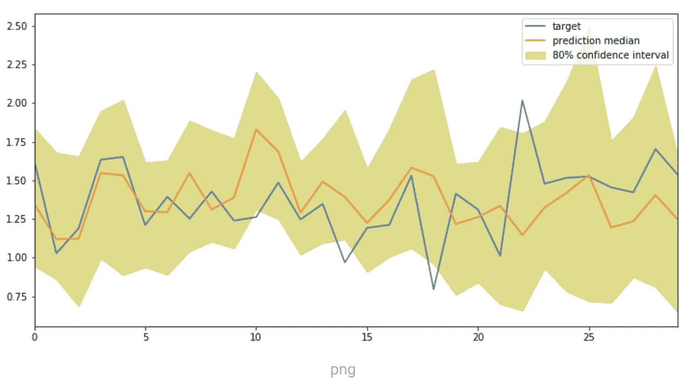
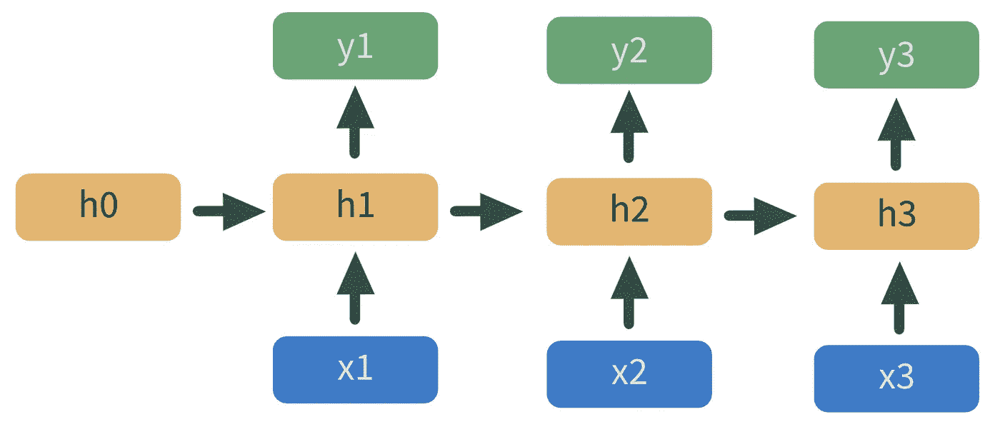
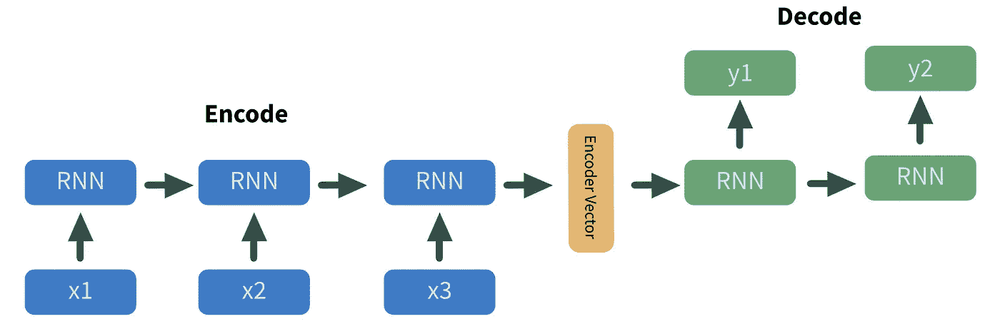
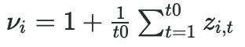
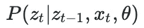

# 如何利用深度学习预测时间序列数据

> 原文：<https://towardsdatascience.com/deep-learning-for-time-series-data-ed410da30798?source=collection_archive---------4----------------------->

## 亚马逊开发的自回归递归神经网络

时间序列(TS)预测是出了名的挑剔。也就是说，直到现在。

图 1:基于这个[教程](https://calvinfeng.gitbook.io/machine-learning-notebook/sagemaker/time_series_forecast)的 DeepAR 训练输出。图片作者。

2019 年，亚马逊的研究团队开发了一种名为 DeepAR 的深度学习方法，相对于最先进的 ts 预测模型，该方法的准确率提高了约 15%。它是健壮的开箱即用的，可以从许多不同的时间序列中学习，所以如果你有许多不稳定的数据，DeepAR 可能是一个有效的解决方案。

从实现的角度来看，DeepAR 在计算上比其他 TS 方法更复杂。它还需要比传统的 TS 预测方法如 ARIMA 或脸书的先知更多的数据。

**也就是说，如果你有大量复杂的数据，并且需要非常准确的预测，DeepAR 无疑是最可靠的解决方案。**

# 技术 TLDR

简而言之，DeepAR 是一个 LSTM RNN，带有一些附加功能来提高复杂数据的准确性。相对于传统的 TS 预测方法，DeepAR 有 4 个主要优势…

1.  **DeepAR 在学习季节性依赖关系方面很有效，只需要很少的调整。**这种开箱即用的性能使该模型成为 TS 预测的良好起点。
2.  DeepAR 可以使用几乎没有训练历史的协变量。通过利用*相似的*观察值和加权重采样技术，该模型可以有效地确定不频繁协变量的行为。
3.  **DeepAR 做概率预测。**这些概率以蒙特卡洛样本的形式，可用于开发分位数预测。
4.  **DeepAR 支持广泛的似然函数。**如果您的因变量呈现非正态或非连续分布，您可以指定相关的似然函数。

该模型受到了很多关注，目前在 PyTorch 中得到支持。教程和代码链接在评论里。

# 但是，到底是怎么回事呢？

好吧，让我们慢一点，讨论一下亚马逊的 DeepAR 模型实际上是如何工作的…

## 传统时间序列预测

让我们从头开始。

如上所述，时间序列预测是出了名的困难，主要有两个原因。首先，大多数时间序列模型需要大量的主题知识。如果你用传统的 TS 模型模拟股票价格，重要的是要知道什么协变量影响价格，这些协变量的影响是否有延迟，价格是否表现出季节性趋势，等等。

工程师通常缺乏创建有效功能所需的主题知识。

第二个原因是 TS 建模是一个相当小众的技能组合。给定时间步长的先前输出是下一个时间步长的输入，因此我们不能使用通常的建模技术或评估标准。

因此，工程师不仅需要对数据有深入的了解，还必须对 TS 建模技术有深刻的理解。

## 传统的递归神经网络

机器学习可以为传统的 TS 预测提供替代方案，这些方案通常更准确且更容易构建。支持顺序数据的最简单的 ML 算法是递归神经网络。

rnn 本质上是一堆堆叠在一起的神经网络。如图 2 所示，h *1* 处模型的输出馈入下一个 *h2* 处的模型。

图 2:递归神经网络的图示。图片作者。

这里，蓝色的 *x* 是预测变量，黄色的 *h* 是隐藏层，绿色的 *y* 是预测值。这个模型架构自动处理我们上面讨论的许多挑战。

但是即使是 rnn 在某些领域也有不足。首先，他们对于什么应该被传递到下一个隐藏层的假设过于简单。RNN 的更高级的组件，如长短期记忆(LSTM)和门循环单元(GRU)层提供了过滤器，用于过滤沿链传递的信息。它们通常比普通的 rnn 提供更好的预测，但遗憾的是，它们也有不足之处。

亚马逊的 DeepAR 模型是 LSTM 的最新版本，解决了它的两个主要缺点:

1.  **由于均匀采样分布，异常值拟合不佳。**DeepAR 的优势之一是它从许多时间序列中聚合信息，从而为单个单位(如用户)开发预测。如果所有单位都有相同的机会被采样，异常值将被平滑，我们的预测值将变得不那么极端(可能也不那么准确)。
2.  **RNN 不能很好地处理时间缩放。**随着时间的推移，时间序列数据通常会表现出整体趋势——想想你在 COVID 期间最喜欢(或最不喜欢)的股票。这些时间趋势使得拟合我们的模型变得更加困难，因为在拟合时必须移除这种趋势，然后将其添加回我们的模型输出。那是许多不必要的工作。

DeepAR 解决了这两个问题。

# DeepAR 是如何工作的？

基于 RNN 架构，DeepAR 使用 LSTM 单元来拟合我们的预测变量和我们感兴趣的变量。以下是如何…

## 序列对序列编码器-解码器

首先，为了使我们的数据更有用，我们利用一个序列来排序编码器-解码器。该方法采用一组 *n 个*输入，用神经网络对这些输入进行编码，然后输出 *m 个*解码值。

有趣的事实——它们是所有语言翻译算法的支柱，比如谷歌翻译。因此，使用下面的图 3，让我们从将英语翻译成西班牙语的角度来思考这个方法。

图 3:序列对序列编码器-解码器的图形表示。图片作者。

这里，蓝色的每个 *x_n* 值是我们模型的输入，即英语单词。它们被依次送入 RNN，后者对它们的信息进行编码，并将其作为编码器矢量(黄色)输出。编码器向量的信息被表示为隐藏状态的权重向量。从那里，我们的编码器向量被送入我们的解码器，这是一个 RNN。最后的输出是西班牙语单词，用绿色标记为 *y_n* 。

很酷，对吧？

## 根据我们的数据进行扩展

其次，我们解决了使基本 LSTMs 不如 DeepAR 的两个问题:均匀采样和时间缩放。

这两者都使用比例因子来处理。比例因子是用户指定的超参数，但推荐值只是给定时间序列的平均值:

图 DeepAR 中使用的默认比例因子的公式——单个时间序列的平均值。图片作者。

为了处理极值的不均匀采样，我们使采样概率与 *v_i* 成比例。因此，如果给定时间序列的平均值较高，则更有可能被采样，反之亦然。

为了处理时间缩放，我们将每个 LSTM 单元的输入除以 *v_i* 。通过在将我们的值输入到每个单元格之前缩小它们，我们的模型可以专注于我们的预测器和结果变量之间的关系，而不是拟合时间趋势。在单元适合我们的数据后，我们将其输出乘以 *v_i* 以将我们的数据返回到其原始比例。

没那么酷，但还是很酷。只剩最后一节了…

## 使用似然函数拟合

第三，也是最后一点，处理完所有错综复杂的数据后，我们通过最大化因变量的条件概率来拟合给定的预测值和模型参数(图 5)。这种估计量称为最大似然估计量(MLE)。

图 5:简化的 DeepAR 似然函数。图片作者。

上面的简化表达式是我们希望最大化的——我们希望找到最大化因变量( *z* )概率的模型参数( *θ* )。我们还以协变量( *x_t* )和前一个节点的输出( *z_t-1* )为条件。

**因此，给定我们的协变量和前一时间步的预测值，我们可以找到在给定参数的情况下最大化观察可能性的参数值。**

现在，可能性还包括数据转换步骤，但是从理解和实现的角度来看，它并不是非常重要。如果你好奇，可以看看评论中链接的论文。

现在你知道了——简而言之就是 DeepAR。在你走之前，这里有一些关于实现这个方法的实用技巧…

# 实施说明

*   作者建议将协变量标准化，即减去平均值并除以标准差。
*   缺失数据对 DeepAR 来说可能是个大问题。作者建议通过从条件预测分布中抽样来输入缺失数据。
*   对于论文中引用的例子，作者创建了对应于时间信息的协变量。一些例子是*年龄*(以天为单位)和*星期几*。
*   使用网格搜索优化参数是调整模型的有效方法。然而，学习速率和编码器/解码器长度是特定于主题的，应该手动调整。
*   为了确保模型不是基于我们在 TS 中因变量的指数拟合的，作者建议在我们的开始阶段之前根据“空”数据训练模型。就用一堆零作为我们的因变量。

*感谢阅读！我将再写 41 篇文章，将“学术”研究引入 DS 行业。查看我关于构建 DeepAR 模型的链接/教程的评论。*